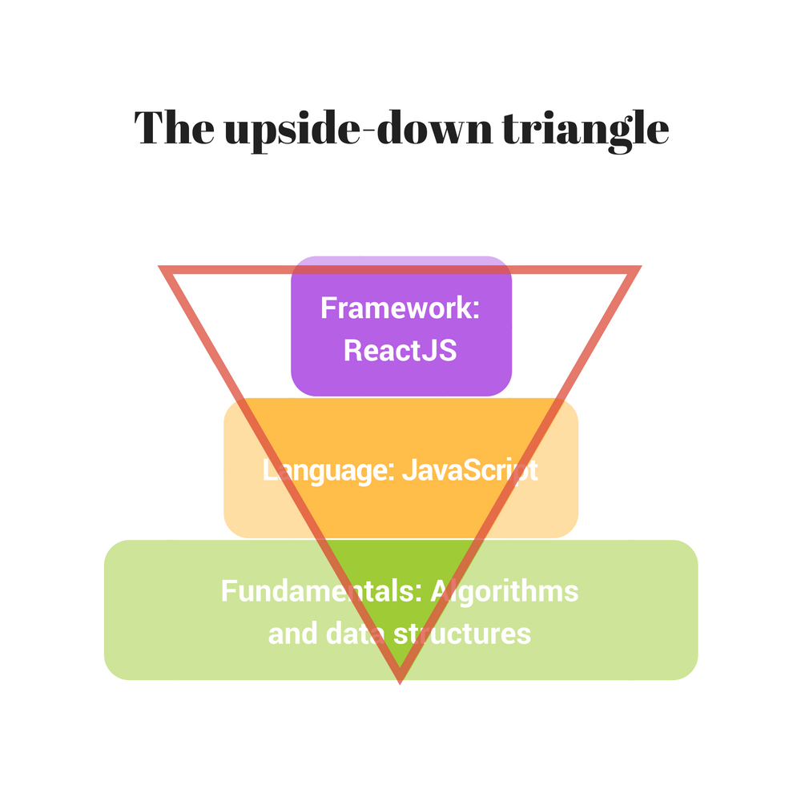

The software development complexity is increasing day by day.  Almost every year a new framework (like AngularJS, ReactJS) is released, a new build tool (like Webpack, Rollup). Even new JavaScript versions (ECMAScript 2015, 2016 and soon 2017) are released every year!

Generally, the same situation exists in other fields of software development.  
For example mobile applications. 2 years ago Apple introduced a new programming language Swift. The iOS operating system releases a new version almost every year with new APIs and features.  

This is great for the software industry. But is a big load for us, software developers.

Unfortunately, human intellectual possibilities are impressive... but limited.  You cannot (and should not) know all the new frameworks and build tools.  

What a software developer can do? The solution is to apply an efficient learning strategy: *put accept on programming fundamentals*.  

The programming fundamentals consist of algorithms, data structures, and programming language knowledge.  

If you want to be a *great software developer*, without doubt, you should constantly master trending technologies (like React, Redux, Angular). And in the meantime put the same amount of effort to learn regularly fundamentals like algorithms, data structures, the principles of writing scaling and clean code.  

The article is my own thoughts on how to deal with the development complexity. Also, you'll find an interesting division of developer's mastery progress. I name these phases *upside-down triangle*, *rectangle* and *triangle*.  

## 1. The concept  

An important part of the programming fundamentals are the algorithms. An algorithm is a step-by-step description of operations that should be performed to obtain a result.  

Algorithms are coded into a computer using a programming language.  A web developer usually codes in JavaScript, an iOS developer in Swift (or Objective-C).

The common categories of algorithms that you should know:  

* Sorting algorithms: [bubble sort](https://en.wikipedia.org/wiki/Bubble_sort), [insertion sort](https://en.wikipedia.org/wiki/Insertion_sort), [quick sort](https://en.wikipedia.org/wiki/Quicksort), etc
* Search algorithms: [binary search](https://en.wikipedia.org/wiki/Binary_search_algorithm), [breadth-first search](https://en.wikipedia.org/wiki/Breadth-first_search), [depth-first search](https://en.wikipedia.org/wiki/Depth-first_search), etc
* Shortest path algorithms: [Bellman–Ford algorithm](https://en.wikipedia.org/wiki/Bellman%E2%80%93Ford_algorithm), [Dijkstra's algorithm](https://en.wikipedia.org/wiki/Dijkstra%27s_algorithm), etc
* Math algorithms: [Fibonacci numbers sequence](https://en.wikipedia.org/wiki/Fibonacci_number), [greatest common divisor](https://en.wikipedia.org/wiki/Euclidean_algorithm), [least common multiple](https://en.wikipedia.org/wiki/Least_common_multiple), etc

The number of existing algorithms is impressive. And many of these algorithms are at the base of software development and networking.  

When it comes to learning algorithms, the first reason I hear is that the developer doesn't need to know exactly how specific algorithm works. You may think that all existing algorithms are already implemented, tested and included in standard libraries.  
Or that you never had a case to use the [Bellman–Ford algorithm](https://en.wikipedia.org/wiki/Bellman%E2%80%93Ford_algorithm) in JavaScript.  

This excuse is the wrong approach if you are determined to be a successful software developer. To build complex and top quality applications you must have algorithms knowledge.  

Indeed algorithms are implemented in standard libraries and developer doesn't need manually to write them. But the lack of expertise doesn't allow the developer to see when a problem is elegantly solved using a specific algorithm.  
Libraries with algorithms exist, but the developer simply cannot see the case when they are useful.  

Learning algorithms in detail is a valuable experience. Studying and mastering them cultivates an **intuition** to solve difficult issues.  

Powerful intuition is what defines a great software developer. Of course alongside with experience and discipline.   

> **Intuition** is a pure gold.

Data structures are an essential aspect too. Learning them teaches how to correctly represent the information in an application.
  
The correctly chosen data structure has huge benefits. It makes the code that manages data simpler to write and maintain. The operations of data manipulation, storage, query are easier to implement.  

The quality code consists of an effective algorithm and a convenient data structure.  

## 2. Beginner: the upside-down triangle

For an easier representation lets divide coding abilities into a simplified scheme:

* **Fundamentals**: everything related to algorithms, data structures, computer science questions, application design principles ([SOLID](https://en.wikipedia.org/wiki/SOLID_(object-oriented_design)), [KISS](https://en.wikipedia.org/wiki/KISS_principle), [DRY](https://en.wikipedia.org/wiki/Don%27t_repeat_yourself), [SoC](https://en.wikipedia.org/wiki/Separation_of_concerns)), scalability
* **Language**: everything related to programming languages (JavaScript, Swift, Java), the syntax, operators, variables, compilers
* **Framework**: everything related to frameworks (AngularJS, ReactJS, Cocoa Touch) and platforms (Browser, NodeJS).

The first level of software development mastery is the beginner, which is represented by an upside-down triangle.   

Every programmer started at this level, including me.  

A beginner developer got really excited by a particular framework, ReactJS for example. He followed some framework tutorials and has a decent level of understanding.  

The JavaScript knowledge of such a developer is a minimum necessary to code in ReactJS. He deals fine with defining variables, functions, ES2015 modules, and ReactJS components.  

However he has problems with deeper concepts of JavaScript like [how `this` keyword works](/gentle-explanation-of-this-in-javascript/), [prototypal inheritance](https://developer.mozilla.org/en/docs/Web/JavaScript/Inheritance_and_the_prototype_chain), [hoisting](/javascript-hoisting-in-details/) and [event loop](http://altitudelabs.com/blog/what-is-the-javascript-event-loop/).  

Lack of language experience influences negatively the way components are coded in JavaScript. Usually, hacks and workarounds are used just to make things work.    

The knowledge of algorithms and data structures is very limited.  
When a part of the application may benefit from a well-known algorithm, the developer doesn't see that and starts inventing the wheel. And the invented wheel is usually low-quality and time waster.  

The most used data structures are arrays and plain JavaScript objects. But nothing more.  

## 3. Proficient: the rectangle

The next level is a proficient developer, represented by a rectangle (I hope to attribute myself to this level!).

The proficient developer has mastered well ReactJS framework and JavaScript language. The number of hacks in his code is minimal.  

The proficient developer can see the situations when certain data structure or algorithm makes the code more productive. But only until a limited level.

For example, an application has a component that searches often in an array with lots of elements. If the array is altered rarely, the developer concludes that it is reasonable to sort the array. And when a search operation is necessary, use the [binary search algorithm](https://en.wikipedia.org/wiki/Binary_search_algorithm), which is very efficient in this situation.  

At rectangle case, the developer is able to create quality applications, but not the most efficient. 

## 4. Expert:  the triangle

The upper level is an expert developer, which mastered all 3 directions: fundamentals, the language, and framework. He is represented by a triangle with a solid base.  

The expert developer is able to see the efficiency of certain algorithms and apply them when necessary. He benefits from choosing correct data structures, making data manipulations simple.  

The challenge is to select from available algorithms the most efficient for a concrete situation. It is a process of balancing to obtain the maximum possible performance.  

Since the programming language is an instrument to speak the algorithmic mind, it doesn't matter in what language developer writes. An expert can use several languages: JavaScript & Ruby, or C++ & Java.  

## 5. Recommendations

Trending frameworks or even languages will be gone sooner or later. They will be replaced with better tools: an inevitable result of evolution. What you can do is put an accent on fundamentals.  

Certainly, the fundamentals are tough to learn. Many algorithms are hard to understand and remember. My suggestion is just to have fun: you may read a complicated algorithm many times. Think of what benefits may bring a specific data structure. Challenge yourself to become better and better.  

Despite the fact that fundamentals are difficult, there is a pleasant bonus: it doesn't change often. Starting the 80's or even 70's weren't created any significant new algorithms or data structures. Learn them once and good, then repeat them from time to time, and you're good to go.  

### The interview process

Big software companies like Google, Apple and Microsoft are serious about algorithms and data structures. An interview at these companies contains many computer science questions, whiteboard coding, balancing trees and so on.  

I've read many posts that criticize such an approach that companies query the wrong skills. They say that the developer doesn't deal with sorting algorithms or balancing trees in "real world" programming.  
You can beat such arguments easily: I never encountered a programmer that mastered algorithms and data structures, and then claimed it was a waste of time. Moreover mostly claims that these are important.  

I personally agree with computer science interview questions. Because the software development industry is moving so fast, the company needs developers that have a solid background.  

On one hand, such a developer can efficiently solve complicated problems. On the other hand, he can easily move forward in new languages and frameworks, adapting to a fast-evolving industry.  

In the end, it's a real pleasure to be a professional. If you're asked: "Please solve this problem [...] using Dijkstra's algorithm". No problem! Take the chalk, solve easily the problem and **impress them how good you are**! 

### Take action

There is no shortcut to becoming a master. What makes you better is **learning** and **practicing**. 

> Constantly learn and practice.  

You can move forward in 3 directions simultaneously. Fundamentals, languages, and frameworks are equally important. A JavaScript developer may start with:

* Fundamentals: [The Algorithm Design Manual](https://www.amazon.com/Algorithm-Design-Manual-Steven-Skiena/dp/1848000693) by Steven S. Skiena
* Language: [You Don’t Know JavaScript series](http://shop.oreilly.com/category/get/kyle-simpson-kit.do) by Kyle Simpson
* Framework: [React: Up & Running](https://www.amazon.com/React-Running-Building-Web-Applications/dp/1491931825/ref=sr_1_1?s=books&ie=UTF8&qid=1474459942&sr=1-1&keywords=reactjs) by Stoyan Stefanov

After solidifying your ground in those directions, take the next level:

* The quality and readability of your code: [Clean code](https://www.amazon.com/Clean-Code-Handbook-Software-Craftsmanship/dp/0132350882)  by Robert C. Martin *(one of my favorite books)*
* The object-oriented design and scalable code: [Design Patterns: Elements of Reusable Object-Oriented Software](https://www.amazon.com/exec/obidos/ASIN/B000SEIBB8/makithecompsi-20) 

*What is your opinion on software development craftsmanship? Speak up your mind in a comment below!*