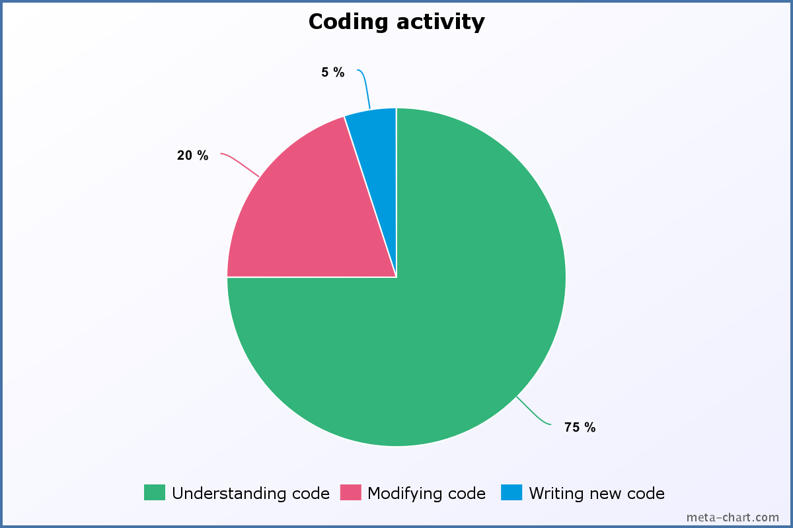

> What a piece of work is a man!  
How noble in reason, how infinite in faculty!

*Hamlet, William Shakespeare*

The code is prose. 

A clear and meaningful prose is easy to read and follow. Everyone enjoys reading such prose.  

The same quality should apply to the source code. The way the developer expresses his thoughts through a programming language is important. Writing code is communication: with your teammates and yourself.  

Clean code practicing is a big topic. So let's start with small steps. 

The current article covers the functions/methods naming good habits. Functions are the moving parts of the application, so having named them precisely increases the readability.  

The scope is to understand what the function does from its name, arguments list and the way it is invoked. If you have to jump into function details to understand what it does, probably the name is not precise or it obscures the intent. Let's see how to pass such situations.

## 1. The importance of readability

The amount of code of a complex application is enormous. Thousands of lines of code, hundreds of methods and classes. The meaningful and easy to interpret code is obligatory in big applications if you don't want to get lost in the jungle.  

Unfortunately, every developer faced the problem of poor code readability. Everyone can remember spending a lot of time understanding the reason behind an obfuscated code.  

When reading someones else's poorly named methods, classes, variables, you spend much more time decrypting the code than writing new functional.  But it shouldn't be that way, and there is no excuse in writing such this way.    



The average developer spends 75% of the time understanding code, 20% of the time modifying existing code and only 5% writing new ([source](https://blog.codinghorror.com/when-understanding-means-rewriting/)). 

A slight additional time of a single developer spent on readability reduces the understanding time for teammates. This practice becomes important when the application size grows since the understanding time increases with complexity.  

*Reading* meaningful code is easy. Nevertheless, *writing* meaningful code is the opposite: you have to learn clean code practices and put constant effort to express yourself clearly.  

## 2. Prefer explanatory names

The name should clearly, without ambiguity indicate what the function does. You don't have to jump around searching for the truth.   

Function names should apply [the lower camel case](https://en.wikipedia.org/wiki/Camel_case) form: `addItem()`, `saveToStore()` or `getItemById()`.  

Every function is an action, so the name should contain at least one verb. For example: 

* `write(to: "filename.txt")` means *write* to file 
* `reloadTableData()` means to *reload* table data
* `isBirthDay()` means checking if today *is* birth day
* `getAddress()` or `setAddress("My Address")` mean *getting* or *setting* an object's `address`.

Let's study the following structure methods:

```swift
import Foundation

struct Pair {
  var first: Int
  var second: Int

  func getAbsoluteDifference() -> Int {
    return abs(first - second)
  }

  mutating func increase(by increaseAmount: Int) {
    first += increaseAmount
    second += increaseAmount
  }
}

var myPair = Pair(first: 2, second: 5)
myPair.getAbsoluteDifference() // => 3
myPair.increase(by: 2)
myPair.first  // => 4
myPair.second // => 7
```
The method name `getAbsoluteDifference()` means to *get the absolute difference* between the pair of numbers. The method name contains a verb `get`.
It would not make much sense to name the method simply `absoluteDifference()`, because such name does not indicate any action. 

The same rule applies to `increase()` method. Its name also contains a verb `increase`, which expresses what action it performs: *increase* the structure numbers *by* an amount.  

I like the Swift inference mechanism that allows to significantly shorter the declarations.   

But in the case of naming, clarity is more important than shortness. It's useless to name the methods in previous example `getAbsDiff()` or `inc()`. In such a case, you have to mentally restore the full function name to realize the meaning.  

Moreover, what could the short `inc()` mean? Increment, increase or include? You have to read carefully the invocation context or even the method body to understand what it does. Avoid such ambiguous abbreviations.  

In the meantime try not to make the name too verbose. Extended names like `getAbsoluteDifferrenceOfTwoNumbers()` or `increaseByAmount()` don't add anything useful to readability.  


My advice is to find a balance between short and verbose in naming, and put accent on clarity:  

> Not too short, not too verbose:  
Just exactly what it does.

I don't see a problem if a function is renamed multiple times to find the best name that describes it. A fresh view over an old function may help to find a better name.

## 3. Use natural language with argument labels

Not sure if someone is happy to read the assembly language. Such language is natural for computer hardware, but quite hard to process by the human brain.  

The textual information is easier to process in a natural language form: good old English. Write your code as a detailed and interesting story. 

Be Shakespeare!  


The machine doesn't care how you feed it with instructions.  

But your colleague developer does care. As it turns out, the code in the form of natural language is easier to understand. Make your code as short, concise and interesting stories. Variables are nouns and functions are verbs.  

Swift provides additional goodies. When calling a function, specify the argument label that indicates more expressively the intent of the argument: `myObject.action(role1: value1, role2: value2, ...)`. 
Naturally such call may sound: *in `myObject` perform an `action` using `value1` that indicates `role1`, `value2` that indicates `role2`*.

Let's follow an example. The Swift array methods provide great meaning about the the operation over the array:  

```swift
var elements = [1, 5, 7]
elements.insert(8, at: 1)
elements // => [1, 8, 5, 7]
elements.remove(at: 2)
elements // => [1, 8, 7]
```
`elements.insert(8, at: 1)` invocation flows naturally when reading it: *in `elements` insert `8` `at` position `1`*.  
The same natural flow applies to `elements.remove(at: 2)`: *in `elements` remove the item `at` position `2`*.  

In both cases notice the readability improvement that the argument label `at` adds: expressing the position when the operation should apply.  

When the argument label is omitted, the ambiguity increases.  
In the case of `elements.insert(8, 1)`, what does `8` and `1` mean? What is the position and what is the element to insert? Hard to guess without diving into method details or reading the documentation.

## 4. Avoid pointless function names

Obviously, the production code should never contain functions named without strict meaning. Or named just for the sake of naming.  

Some examples of pointless function names:

* `foo()`, `bar()`, `baz()`, `buzz()` - without reasonable sense
* `fun()`, `myFun()`, `function()`, `procedure()` - the nonsense obvious 

These have no meaning and should be avoided. You can always find the correct name for any type of function.  

Often such pointless function names are used in samples:

```swift
func foo() -> String {
  return "bar"
}
foo() // => "bar"
```

In my opinion, correct naming practices should propagate even is such simple examples. Pointless function names create bad habits, which are hard to correct later.  

The following alternative form looks better:

```swift
func greet() -> String {
  return "Hello, world"
}
greet() // => "Hello, world"
```

Precautions should be taken with general action names like `do()`, `execute()`, `run()`, `go()` and so on. Such naming may fit only when the context is expressive: `directoryCopyCommand.execute()`.  

## 5. Avoid the same name covering many concepts

The function name indicates a well-determined type of action. It should be a one-to-one relation.  

If the same name represents many equivalent still different actions, it might be covering too many concepts and decreases readability. One-to-many &#x2014; one name that covers many actions should be avoided.  

For example an application has in different classes a method named `get()`. Having the same name, these methods do different things: *fetches* data from server `httpService.get()`, *gets* the wrapped object `wrapper.get()` or *initialize* and *get* a storage instance `Storage.get()`. 

These concepts are different, and should have their own distinguishable names.  Correspondingly `httpService.fetch()`, `wrapper.getWrappedValue()` and `Storage.initialize()` function names are better.  
  
## 6. Avoid the same concept covered by many names

The same concept can be expressed using different words. These are synonyms. For example refresh or reload, delete or remove, etc. 

In the articles of this blog, I use synonyms to make the writing easier to follow. When a word appears too often, the reading flow is not comfortable because of repetition. I search a synonym for repeated word and apply it.  
For instance, I often replace the bothersome word *use* with *apply*.  

When writing code, follow the opposite approach: one concept using only one word, and avoid synonyms. 

For example each of the following function name pairs describe a single concept: `add()` or `append()`, `remove()` or `delete()`, `refreshTable()` or `reloadTable()`, `include()` or `require()`, and so on.   
You have to select one name for a concept and use it consistently across the entire application.  

Let's see the following scenario:

```swift
let homeNumber = PhoneNumber("555-555")
person.phoneNumbers.append(homeNumber)
// ...
let child = Person(firstName: "Anna", lastName: "Smith")
person.children.add(child)
```

At first sight, the code looks good.  
However a more detailed review could wonder why `person.phoneNumbers` uses `append()` method and `person.children` uses `add()`? These methods perform the same action, and there is no reason to name them differently.  
`person.children.add()` method should be refactored to `append()` name.

If you're not sure which word to choose for a specific function, try the following steps:

1. Verify the application for functions with the same behavior. Use the matched function name
2. If the above didn't work, verify the standard libraries for the same behavior functions. You can even find a protocol with required function signatures: go ahead and implement the protocol 
3. In other cases choose the most appropriate and descriptive word from available synonyms.

## 7. Don't say one thing and do another

Most of the time a function is a part of one of the following categories:

* Answers a question or provides information: `payment.isProcessed()`, `names.contains("Alex")`
* Changes the state of the object: `person.setAddress("Earth")`,  `names.append("Victoria")`, `view.reloadSubviews()` 
* Executes a task and returns the result: `name.characters.reversed()`, `names.sorted()`, `numbers.getAverage()`.

The function name also should stick to one of these 3 categories. 

A readability problem appears when the function is named according to one category. But the function implementation does much more than that.    

For example, a function is named as changing the object state and unexpectedly answers the operation result. Let's see the problem:  

```swift
class LimitedCollection {
  let maxNumberOfItems = 4
  var items = [Int]()

  init(items: [Int]) {
    self.items = items    
  }

  func add(_ item: Int) -> Bool {
    if (items.count < maxNumberOfItems) {
      items.append(item)
      return true
    }
    return false
  }
}
let collection = LimitedCollection(items: [1, 2, 3, 4])
if (collection.add(5)) {
  print("Successfully added new item")  
} else {
  print("Cannot add items: collection is full")
}
// => "Cannot add items: collection is full"
```

The name of the method `add()` pretends to add items into the collection, changing the state of the object. And unexpectedly it returns the insertion result.  
`add` word doesn't say anything about the collection fullness state. It might be unexpected to see `add` method in a conditional statement:  
`if (collection.add(5)) { ... }`.  

You might rename the method to something that really says what it does: `addAndGetFullnessState()`.  

Or a better option is to split the function into specialized functions. One verifies the collection fulfillment and another simply adds items to the collection if possible. Let's see the changed version:

```swift
class LimitedCollection {
  let maxNumberOfItems = 4
  var items = [Int]()

  init(items: [Int]) {
    self.items = items    
  }

  func isFull() -> Bool {
    return items.count >= maxNumberOfItems
  }

  func addIfPossible(_ item: Int) {
    if (items.count < maxNumberOfItems) {
      items.append(item)
    }
  }
}
let collection = LimitedCollection(items: [1, 2, 3, 4])
if (collection.isFull()) {
  print("Cannot add items: collection is full")
} else {
  collection.addIfPossible(5)
  print("Successfully added new item")  
}
// => "Cannot add items: collection is full"
```
`collection.isFull()` clearly indicates a verification of the collection fullness.    This method answers a question, as the name `isFull` says.  
`collection.addIfPossible(5)` adds items to collection if possible. This method changes the state of the object, as the name `addIfPossible` says.   

## 8. Conclusion

Applications development is about communication. The quality of the communication directly affects the development productivity.  

Reading meaningful code is easy and enjoyable. However writing quality code requires efforts, practice and constant review.  

As a part of the code readability, function names have an important place. Looking at any code, most of the expressions are actually function/method calls.  

A function name should clearly indicate what the function does. You don't have to scroll around, open the function source code to understand how it works.  
Also, the name should describe only one concept: one-to-one relation.  

In the end, you probably don't want to communicate like [these guys](https://www.youtube.com/watch?v=jjRsY7pJ18M)!  

*What is your opinion about the code readability and function naming? Feel free to write a comment below!*