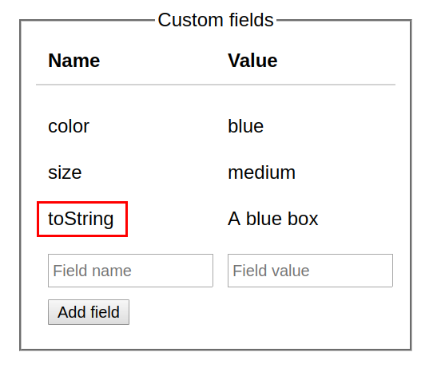

JavaScript plain objects `{ key: 'value' }` are meant to hold structured data.

But one thing I find annoying: the object keys have to be strings (or rarely used symbols). 

What happens if you use numbers as keys? There's no error in such case:
```javascript
const names = {
  1: 'One',
  2: 'Two',
};

Object.keys(names); // => ['1', '2']
```

JavaScript just implicitly converts the object keys to strings. That's tricky behavior because you lose the consistency of the types.

In this post, I will describe how JavaScript [Map](https://developer.mozilla.org/en-US/docs/Web/JavaScript/Reference/Global_Objects/Map) object, available in ES2015, solves many of the plain object's issues, including the conversion of keys to strings.

## 1. The map accepts any key type

As presented above, if the object's key is not a string or symbol, JavaScript implicitly transforms it into a string.

Fortunately, the map has no problem with the key types:

```javascript{6}
const numbersMap = new Map();

numbersMap.set(1, 'one');
numbersMap.set(2, 'two');

[...numbersMap.keys()]; // => [1, 2]
```

`1` and `2` are keys in `numbersMap`. The type of these keys, *number*, remains unchanged. 

You can use any key type in maps: numbers, booleans, and classic strings and symbols.  

```javascript{6}
const booleansMap = new Map();

booleansMap.set(true, "Yep");
booleansMap.set(false, "Nope");

[...booleansMap.keys()]; // => [true, false]
```

`booleansMap` uses booleans as keys without issues. 

Again, boolean keys would not be possible with plain objects.

Let's push the boundaries: can you use an entire object as a key? Turns out, yes!

## 1.1 Object as key

Let's say you need to store some object-related data, without attaching that data on the object itself. 

Doing so using plain objects is not possible. 

The best you can do is use an array of object-value tuples:

```javascript
const foo = { name: 'foo' };
const bar = { name: 'bar' };

const kindOfMap = [
  [foo, 'Foo related data'],
  [bar, 'Bar related data'],
];
```

`kindOfMap` is an array holding pairs of an object and associated value. 

The biggest issue with this approach is the O(n) complexity of accessing the value by key. You would have to loop through the entire array to get the desired value by a key:

```javascript 
function getByKey(kindOfMap, key) {
  for (const [k, v] of kindOfMap) {
    if (key === k) {
      return v;
    }
  }
  return undefined;
}

getByKey(kindOfMap, foo); // => 'Foo related data'
```

You don't need all this headache with [WeakMap](https://developer.mozilla.org/en-US/docs/Web/JavaScript/Reference/Global_Objects/WeakMap) (a specialized version of `Map`): it accepts even objects as keys. 

The main difference between `Map` and `WeakMap`is that the latter allows garbage collection of the objects that are keys, preventing memory leaks.  

Ok, the above code refactored to use `WeakMap` becomes trivial:

```javascript{9}
const foo = { name: 'foo' };
const bar = { name: 'bar' };

const mapOfObjects = new WeakMap();

mapOfObjects.set(foo, 'Foo related data');
mapOfObjects.set(bar, 'Bar related data');

mapOfObjects.get(foo); // => 'Foo related data'
```

`WeakMap`, contrary to `Map`, accepts only objects as keys and has a [reduced set of methods](https://developer.mozilla.org/en-US/docs/Web/JavaScript/Reference/Global_Objects/WeakMap#Methods).

## 2. The map has no restriction over key names

Any object in JavaScript inherits the properties from its prototype object. The same happens to plain JavaScript objects.

If you overwrite the property inherited from the prototype, you can potentially break the code that might rely on these prototype properties:

```javascript{11}
function isPlainObject(value) {
  return value.toString() === '[object Object]';
}

const actor = {
  name: 'Harrison Ford',
  toString: 'Actor: Harrison Ford'
};

// Does not work!
isPlainObject(actor); // TypeError: value.toString is not a function
```

The property `toString` defined on the object `actor` overwrites `toString()` method inherited from the prototype. This breaks `isObject()` because it relies on `toString()` method.  

Check the [list of properties and methods](https://developer.mozilla.org/en-US/docs/Web/JavaScript/Reference/Global_Objects/Object/prototype#Properties) that plain object inherits from the prototype. Avoid defining custom properties with these names.  

For example, imagine a User Interface that manages some custom fields:



It would be convenient to store the state of the custom fields into a plain object:

```javascript{4}
const userCustomFields = {
  'color':    'blue',
  'size':     'medium',
  'toString': 'A blue box'
};
```

But the user might choose a custom field name like `toString` (as in the example), `constructor`, etc. that could potentially break your object. 

Don't take user input to create keys on your plain objects!  

The map doesn't have this problem. You are not limited in the keys names:

```javascript{11}
function isMap(value) {
  return value.toString() === '[object Map]';
}

const actorMap = new Map();

actorMap.set('name', 'Harrison Ford');
actorMap.set('toString', 'Actor: Harrison Ford');

// Works!
isMap(actorMap); // => true
```

Regardless of `actorMap` having a property named `toString`, the method `toString()` works correctly.  

## 3. The map is iterable

In order to iterate over the plain object properties, you have to use additional helper static functions like `Object.keys()` or `Object.entries()` (available in ES2017):

```javascript
const colorsHex = {
  'white': '#FFFFFF',
  'black': '#000000'
};

for (const [color, hex] of Object.entries(colorsHex)) {
  console.log(color, hex);
}
// 'white' '#FFFFFF'
// 'black' '#000000'
```

`Object.entries(colorsHex)` returns an array of key-value pairs extracted from the object.

A map, however, is iterable directly:

```javascript
const colorsHexMap = new Map();

colorsHexMap.set('white', '#FFFFFF');
colorsHexMap.set('black', '#000000');

for (const [color, hex] of colorsHexMap) {
  console.log(color, hex);
}
// 'white' '#FFFFFF'
// 'black' '#000000'
```

`colorsHexMap` is iterable. You can use it anywhere where an iterable is accepted: `for()` loops, spread operator `[...map]`.  

The map provides additional methods that return an iterable: `map.keys()` to iterate over keys and `map.values()` over values.  

## 4. Map's size

Another issue with the plain object is that you easily determine the number of properties that it holds:

```javascript
const exams = {
  'John Smith': '10 points',
  'Jane Doe': '8 points',
};

Object.keys(exams).length; // => 2
```

To determine the size of `exams`, you would have to pass through all the keys to determine the number of them.

The map provides an alternative with the accessor property `size` counting the key-value pairs:

```javascript
const examsMap = new Map([
  ['John Smith', '10 points'],
  ['Jane Doe', '8 points'],
]);
  
examsMap.size; // => 2
```

It's simpler to determine the size of the map: `examsMap.size`.  

## 5. Conclusion

Plain JavaScript objects normally do a good job to hold structured data. But they have some limitations:

1) Only strings or symbols can be used as keys
* Own object properties might collide with property keys inherited from the prototype (e.g. `toString`, `constructor`, etc). 
* Objects cannot be used as keys

All these issues are easily solved by maps. Moreover, they provide benefits like being iterators and easy size look-up.  

Don't consider maps as a replacement of plain objects, but rather a complement.  

*Do you know other benefits of maps over plain objects? Please write a comment below!*
