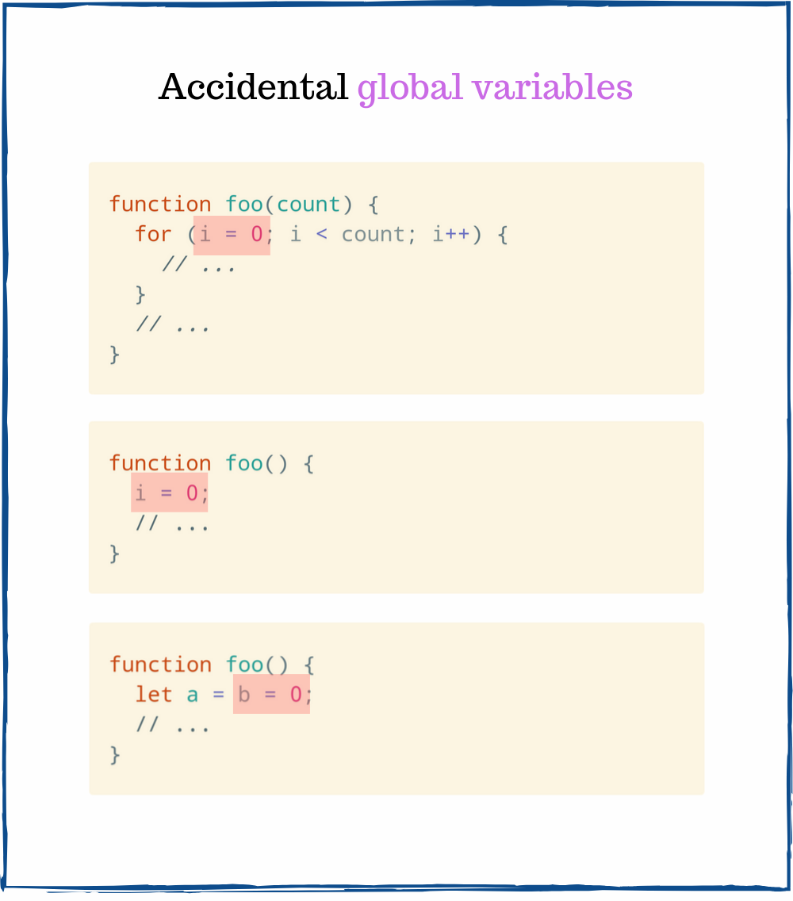
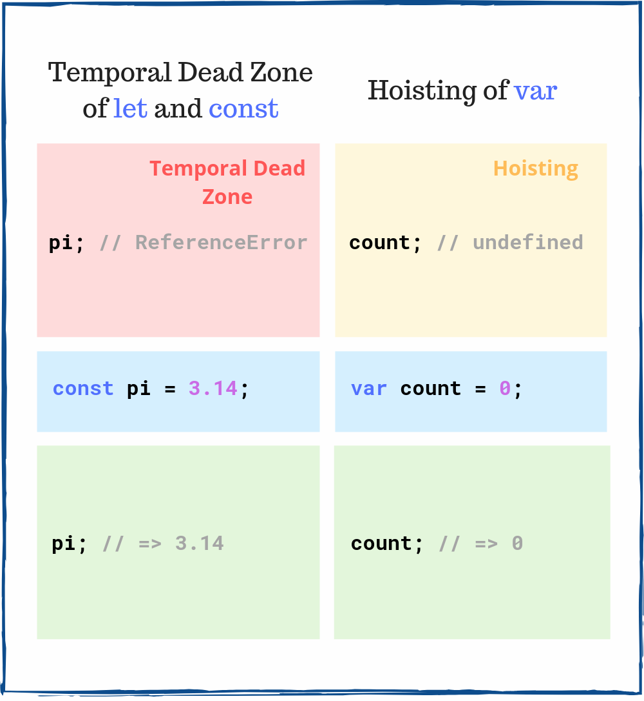

My top stressing things in software development are:

1. The coding interview
2. A toxic manager or teammate

Not JavaScript, `this`, CSS, Internet Explorer, but the 2 above.  

If you're qualifying as Senior Developer whose job involves JavaScript, there's a good chance to be asked tricky questions during the coding interview.

I know it's unfair. Some unknown people put you on the edge to see what you're made of. It's an unpleasant experience.  


What can you do? 

Follow the advice: *"Practice makes perfect"*. Deep, regular learning of JavaScript will improve your coding, and as a positive side effect, interviewing skills.   

In this post, you will find 7 at first sight simple, but tricky JavaScript interview questions.

While at first the questions might seem random, they try to hook into important concepts of JavaScript. So you better practice them before your next interview!

## 1. Accidental global variable

#### Question

To what evaluates `typeof a` and `typeof b` in the following snippet:

```javascript{7-8}
function foo() {
  let a = b = 0;
  a++;
  return a;
}

foo();
typeof a; // => ???
typeof b; // => ???
```

#### Answer

Let's look at the line 2: `let a = b = 0`. This statement declares a local variable `a`. However, it does declare a *global* variable `b`.  

No variable `b` is declared neither in the `foo()` scope or global scope. So JavaScript interprets `b = 0` expression as `window.b = 0`.

In other words, `b` is a global variable created accidentally.  



In a browser, the above code snippet is equivalent to:

```javascript{1-3}
function foo() {
  let a;
  window.b = 0;
  a = window.b;
  a++;
  return a;
}

foo();
typeof a;        // => 'undefined'
typeof window.b; // => 'number'
```

`typeof a` is `'undefined'`. The variable `a` exists within `foo()` scope and not available in the outside scope.  

Because `b` is a global variable with the value `0`, the `typeof b` evaluates to `'number'`.  

## 2. Array length property

#### Question

What is the value of `clothes[0]`:

```javascript{3}
const clothes = ['jacket', 't-shirt'];
clothes.length = 0;

clothes[0]; // => ???
```

#### Answer

`length` property of the array object has a [special behavior](http://www.ecma-international.org/ecma-262/6.0/#sec-properties-of-array-instances-length): 

> Reducing the value of the `length` property has the side-effect of deleting own array elements whose array index is between the old and new length values.

As result when JavaScript executes `clothes.length = 0`, all `clothes` items are deleted.  

`clothes[0]` is `undefined`, because `clothes` array has been emptied.  

## 3. Eagle eye test

#### Question

What is the content of `numbers` array:

```javascript{6}
const length = 4;
const numbers = [];
for (var i = 0; i < length; i++);{
  numbers.push(i + 1);
}

numbers; // => ???
```

#### Answer

Let's take a closer look at the semicolon `;` that appears right before the opening curly brace `{`:


Being easily overlooked, this semicolon creates a *null statement*. The null statement is an empty statement that does nothing. 

`for()` iterates 4 times over the null statement (that does nothing), ignoring the block that actually pushes items to array: `{ numbers.push(i + 1); }`. 

The above code is equivalent to the following:

```javascript
const length = 4;
const numbers = [];
var i;
for (i = 0; i < length; i++) {
  // does nothing
}
{ 
  // a simple block
  numbers.push(i + 1);
}

numbers; // => [5]
```

`for()` increments `i` variable until `4`. Then JavaScript enters one time the block `{ numbers.push(i + 1); }`, pushing `4 + 1` to `numbers` array.  

Thus `numbers` is `[5]`.  

#### My story behind this question

*Long time ago, when I was interviewing for my first job, I was asked this question.*

*During the interview I had 20 coding questions to answer within 1 hour limit. The null statement question was on the list.*

*While solving the question, being in a rush, I hadn't seen the comma `;` right before the curly brace `{`. So I answered incorrectly `[1, 2, 3, 4]`.*

*I was slightly disappointed because of such unfair tricks. I asked the interviewer what is the reason behind tricks like that? The interviewer replied:*

*"Because we need people that have good attention to detail."*

*Fortunately, I didn't end up working for that company.*

I'll leave the conclusion up to you.

## 4. Automatic semicolon insertion

#### Question

What value is returned by `arrayFromValue()`?

```javascript{5}
function arrayFromValue(item) {
  return
    [item];
}

arrayFromValue(10); // => ???
```

#### Answer

It's easy to miss the new line between the `return` keyword and `[item]` expression. 

However, this newline makes the JavaScript automatically insert a semicolon between `return` and `[item]` expression. 

Here's an equivalent code with the semicolon inserted after `return`:

```javascript{1}
function arrayFromValue(item) {
  return;
  [item];
}

arrayFromValue(10); // => undefined
```

`return;` inside the function makes it return `undefined`.

So `arrayFromValue(10)` evaluates to `undefined`.  

Follow [this section](/7-tips-to-handle-undefined-in-javascript/#24-function-return-value) to read more about automatic semicolon insertion.

## 5. The classic question: tricky closure

#### Question

What will output to console the following code:
```javascript{3}
let i;
for (i = 0; i < 3; i++) {
  const log = () => {
    console.log(i);
  }
  setTimeout(log, 100);
}
```

#### Answer

If you haven't heard about this tricky question before, most likely your answer is `0`, `1` and `2`: which is incorrect. When I first tried to solve it, this was my answer too!

There are 2 phases behind executing this snippet.

**Phase 1**  

1. `for()` iterating 3 times. During each iteration a new function `log()` is created, which captures the variable `i`. Then `setTimout()` schedules an execution of `log()`.  
3. When `for()` cycle completes, `i` variable has value `3`.  

`log()` is a closure that captures the variable `i`, which is defined in the outside scope of `for()` cycle. It's important to understand that the closure captures `i` *variable* lexically.  

**Phase 2**

The second phase happens after 100ms:

1. The 3 scheduled `log()` callbacks are called by `setTimeout()`. `log()` reads the *current value* of variable `i`, which is `3`, and logs to console `3`.

That's why the output to the console is `3`, `3` and `3`.  

If you struggle understanding closures, I recommend reading [A Simple Explanation of JavaScript Closures](/simple-explanation-of-javascript-closures/).  

*Do you know how to fix the snippet to log `0`, `1`, and `2`? Please write your solution in a comment below!*

## 6. Floating point math

#### Question

What's the result of the equality check?

```javascript
0.1 + 0.2 === 0.3 // => ???
```

#### Answer

First, let's look at the value of `0.1 + 0.2`:

```javascript
0.1 + 0.2; // => 0.30000000000000004
```

The sum of `0.1` and `0.2` numbers is *not exactly* `0.3`, but slightly above `0.3`.  

Due to how floating point numbers are encoded in binary, operations like addition of floating point numbers are subject to rounding errors.  

Simply put, comparing floats directly is not precise.  

Thus `0.1 + 0.2 === 0.3` is `false`.  

Check [0.30000000000000004.com](https://0.30000000000000004.com/) for more information.

## 7. Hoisting

#### Question

What happens if you access `myVar` and `myConst` before declaration?

```javascript{0-1}
myVar;   // => ???
myConst; // => ???

var myVar = 'value';
const myConst = 3.14;
```

#### Answer

Hoisting and temporal dead zone are 2 important concepts that influence the lifecycle of JavaScript variables. 



Accessing `myVar` before declaration evaluates to `undefined`. A hoisted `var` variable, before its initialization, has an `undefined` value.

However, accessing `myConst` before the declaration line throws a `ReferenceError`. `const` variables are in a temporal dead zone until the declaration line `const myConst = 3.14`.    

Follow the guide [JavaScript Variables Hoisting in Details](/javascript-hoisting-in-details/) to get a good grasp on hoisting.  

## 8. Key takeaways

You can think that some of the questions are useless for interviewing. I have the same feeling, especially regarding the [eagle eye test](#3-eagle-eye-test). Still, they could be asked.

Anyways, many of these questions can truly assess if you are seasoned in JavaScript, like [the tricky closure](#5-the-classic-question-tricky-closure). If you have had difficulties to answer some while reading the post, it's a good indicator of what you must study next!

Ready for a new challenge? Try to answer [7 Interview Questions on "this" keyword](javascript-this-interview-questions).

*Is it fair to ask tricky questions during the interview? Let me know your opinion.*
