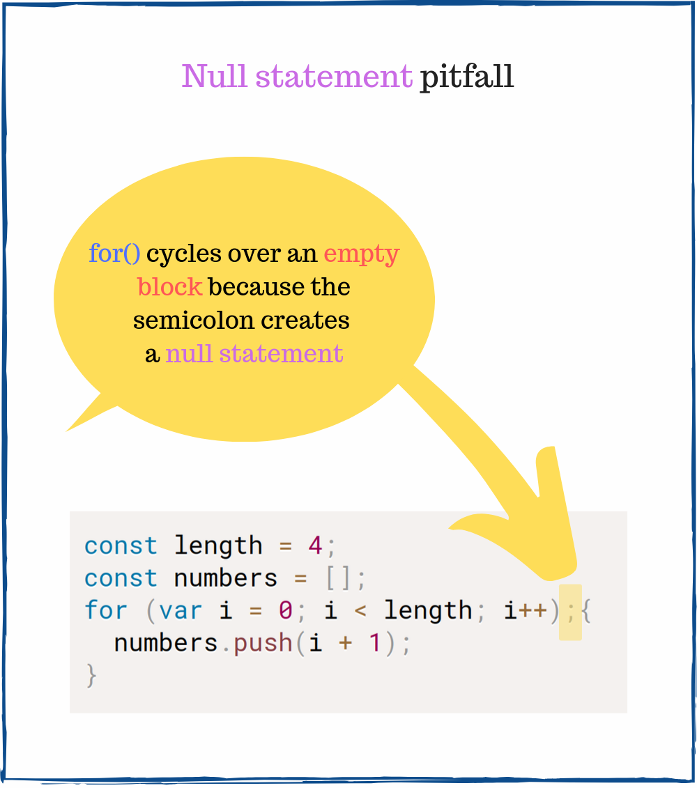

My personal top stressing things in software development are:

1. The coding interview
2. A toxic manager or teammate

If you're qualifying as Senior Developer that involves JavaScript, there's a good chance that you will be asked for tricky questions during the coding interview.

I know it's unfair. Some unkown people are throwing you to the edge of your knowledge to see what you're made of.  


What can you do? *Prepare*. 

In this post, you will find 7 at first sight simple, but in essense tricky JavaScript interview questions.  

## 1. Accidental global variable

#### Question

To what evaluates `typeof a` and `typeof b` in the following snippet:

```javascript{8-9}
function foo() {
  let a = b = 0;
  a++;
  return a;
}

foo();
typeof a; // => ???
typeof b; // => ???
```

#### Answer

Let's take a closer look at the tricky line 2: `let a = b = 0`. This statement indeed declares a local variable `a`. However, it doesn't declare a *local* variable `b`, but rather a *global* variable `b`.  

In a browser, the above code snippet is equivalent to:

```javascript{2-4}
function foo() {
  let a;
  window.b = 0;
  a = window.b;
  a++;
  return a;
}

foo();
typeof a;        // => 'undefined'
typeof window.b; // => 'number'
```

`typeof a` is `'undefined'`. The variable `a` is declated only within `foo()` scope, and is not available in the outside scope.  

`typeof b` evaluates to `'number'`. `b` is a global variable with value `0`.  

## 2. Array length property

#### Question

What is the value of `clothes[0]`:

```javascript{4}
const clothes = ['jacket', 't-shirt'];
clothes.length = 0;

clothes[0]; // => ???
```

#### Answer

`length` property of the array object has a [special behavior](http://www.ecma-international.org/ecma-262/6.0/#sec-properties-of-array-instances-length): 

> Reducing the value of the `length` property has the side-effect of deleting own array elements whose array index is between the old and new length values.

Because of this `length` behavior, when JavaScript executes `clothes.length = 0`, all the items of the array `clothes` are deleted.  

`clothes[0]` is `undefined`, because `clothes` array was emptied.  

## 3. Eagle eye test

#### Question

What is the content of `numbers` array:

```javascript{7}
const length = 4;
const numbers = [];
for (var i = 0; i < length; i++);{
  numbers.push(i + 1);
}

numbers; // => ???
```

#### Answer

Let's take a closer look at the semicolon `;` that appears right before the opening curly brace `{`:



While it might easy to overloow this semicolon, unfortunately it creates a so called *null statement* effect. 

`for()` cycle makes 4 null statements (that do nothing), ignoring the block that actually pushes the numbers `{ numbers.push(i + 1); }`. 

The above code is equivalent to the following code snippet:

```javascript
const length = 4;
const numbers = [];
for (var i = 0; i < length; i++) {
  // does nothing
}
{ 
  // a simple block
  numbers.push(i + 1);
}

numbers; // => [6]
```

`for()` increments `i` variable until `4`. Then JavaScript enters one time the block `{ numbers.push(i + 1); }`, pushing `4 + 1` to `numbers` array.  

Thus `numbers` is `[5]`.  

#### My story behind this question

I was asked this question during an interview.

## 4. Automatic semicolon insertion

#### Question

What value is returned by `arrayFromValue()`?

```javascript{6}
function arrayFromValue(item) {
  return
    [items];
}

arrayFromValue(10); // => ???
```

#### Answer

It's easy to miss the newline between the `return` keyword and `[items]` expression. 

But actually this newline makes the JavaScript automatically insert a semicolon between `return` amd `[items]` expression. That's an equivalent of the above code snippet:

```javascript{2}
function arrayFromValue(item) {
  return;
  [items];
}

arrayFromValue(10); // => undefined
```

`return;` inside the function makes it return `undefined`.

So `arrayFromValue(10)` evaluates to `undefined`.  

Follow [this section](/7-tips-to-handle-undefined-in-javascript/#24-function-return-value) to read more about automatic semicolon insertion.

## 5. The classic question: tricky closure

#### Question

What will output to the console the following script:
```javascript{3}
for (var i = 0; i < 3; i++) {
  setTimeout(function log() {
    console.log(i); // ???
  }, 100);
}
```

#### Answer

If you didn't hear about this tricky question, most likely your answer is `0`, `1` and `2`. When I first encountered this question, it was my answer too!

`log()` function is a closure that captures the variable `i` from the outer scope. It's important to understand that the closure captures *variables* directly, but not variables values.  

Because `log()` captures the variable `i`, after 100ms when `setTimeout()` executes `log()`, `i` is already `3` (`i` is incremented by `for()` cycle).  

That's why the output to the console is `3`, `3` and `3`.  

*Do you know how to make the snippet log `0`, `1`, and `3`? Please write your solution in a comment below!*

## 6. Floats sum

#### Question

What's the result of the equality check?

```javascript
0.1 + 0.2 === 0.3 // => ???
```

#### Answer

If you don't know how floats are represented in memory, you might easily say that `0.1 + 0.2 === 0.3` is `true`.

First, let's take a look what is the value of `0.1 + 0.2`:

```javascript
0.1 + 0.2; // => 0.30000000000000004
```

The sum of `0.1` and `0.2` numbers is *not exactly* `0.3`, but slightly above `0.3`.  


## 7. Hoisting

#### Question

What's the result of using `typeof`?

```javascript{1-2}
typeof myVar;   // => ???
typeof myConst; // => ???

var myVar = 'value';
const myConst = 3.14;
```

#### Answer

Hoisting and temporal dead zone are 2 important concepts that influence the lifecycle of JavaScript variables. 

`typeof myVar` is `undefined` because the `var` variable `myVar` is hoisted up. A hoisted `var` variable has `undefined` value.

However, executing `typeof myConst` before the declaration line throws a `ReferenceError`. In this case `const` variables are in a temporal dead zone until the declaration line `const myConst = 3.14`.    

(Put here the image about hoisting)

Follow the guide [JavaScript Variables Hoisting in Details](/javascript-hoisting-in-details/) to get a good grasp on hoisting.  

## 8. Key takeaways

You might be thinking that some of the questions are useless to ask during the interview. I have the same feeling, especially regarding the [eagle eye test](#3-eagle-eye-test).

Still, some of these questions can assess if you are seasoned in JavaScript, and you know it's common traps. If you failed to answer on some, it is a good indicator on what you must study next!

*What is your favorite tricky JavaScript question?*
