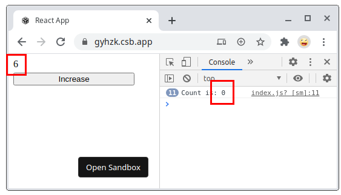

Hooks ease the management of state and side effects inside functional React components. Moreover, repeated logic can be extracted into a custom hook to reuse across the application.  

Hooks heavily rely on JavaScript [closures](/simple-explanation-of-javascript-closures/). That's why hooks are so expressive and simple. But closures are sometimes tricky.  

One issue you can encounter when using hooks is stale closure. And it might be difficult to solve!

Let's start with distilling what the stale closure is. Then you'll see how a stale closure affects React hooks, and how to solve that.  

*If you need a refresh on closures, I recommend reading [A Simple Explanation of JavaScript Closures](/simple-explanation-of-javascript-closures/).*  

## 1. The stale closure

A factory function `createIncrement(incBy)` returns a tuple of `increment` and `log` functions. When called, `increment()` function increases the internal `value` by `incBy`, while `log()` simply logs a message with the information about the current `value`:  

```javascript{22,9-12}
function createIncrement(incBy) {
  let value = 0;

  function increment() {
    value += incBy;
    console.log(value);
  }

  const message = `Current value is ${value}`;
  function log() {
    console.log(message);
  }
  
  return [increment, log];
}

const [increment, log] = createIncrement(1);
increment(); // logs 1
increment(); // logs 2
increment(); // logs 3
// Does not work!
log();       // logs "Current value is 0"
```

Try the [demo](https://jsfiddle.net/dmitri_pavlutin/mhcwxLd3/).  

`[increment, log] = createIncrement(1)` returns a tuple of functions: one function that increments the internal value, another that logs the current value.  

Then the 3 invocations of `increment()` increment `value` up to `3`.  

Finally, the call of `log()` logs the message `"Current value is 0"`. Hmm... this is unexpected because `value` equals `3`.  

*`log()` is a stale closure.* The closure `log()` has captured `message` variable having `"Current value is 0"`.  

Even if `value` variable gets incremented multiple times when calling `increment()`, the `message` variable doesn't update and always keeps an outdated value `"Current value is 0"`.  

> *The stale closure* captures variables that have outdated values.  

Let's see some approaches on how to fix the stale closure.  

## 2. Fixing the stale closure

Fixing the stale `log()` requires closing the closure over the actually changed variable: `value`. 

Let's move the statement `const message = ...;` into `log()` function body:

```javascript{10}
function createIncrement(incBy) {
  let value = 0;

  function increment() {
    value += incBy;
    console.log(value);
  }

  function log() {
    const message = `Current value is ${value}`;
    console.log(message);
  }
  
  return [increment, log];
}

const [increment, log] = createIncrement(1);
increment(); // logs 1
increment(); // logs 2
increment(); // logs 3
// Works!
log();       // logs "Current value is 3"
```

Try the fixed [demo](https://jsfiddle.net/dmitri_pavlutin/27n1cbxr/).

Now, after calling 3 times the `increment()` function, calling `log()` logs the actual `value`: `"Current value is 3"`. 

`log()` is no longer a stale closure.  

## 3. Stale closures of hooks

### 3.1 *useEffect()*

Let's study a common case of stale closure when using `useEffect()` hook.

Inside the component `<WatchCount>` the hook `useEffect()` logs every 2 seconds the value of `count`:  

```jsx
function WatchCount() {
  const [count, setCount] = useState(0);

  useEffect(function() {
    setInterval(function log() {
      console.log(`Count is: ${count}`);
    }, 2000);
  }, []);

  return (
    <div>
      {count}
      <button onClick={() => setCount(count + 1) }>
        Increase
      </button>
    </div>
  );
}
```

[Open the demo](https://codesandbox.io/s/stale-closure-use-effect-broken-2-gyhzk) and click a few times increase button. Then look at the console, and every 2 seconds appears `Count is: 0`, despite the fact that `count`  state variable has actually being increased a few times.  



Why does it happen?

At first render, the state variable `count` is initialized with `0`. 

After the component has mounted, `useEffect()` calls `setInterval(log, 2000)` timer function which schedules calling `log()` function every 2 seconds. Here, the closure `log()` captures `count` variable as `0`.  

Later, even if `count` increases when the *Increase* button is clicked, the `log()` closure called by the timer function every 2 seconds still uses `count` as `0` from initial render. *`log()` becomes a stale closure.*  

The solution is to let know `useEffect()` that the closure `log()` depends on `count` and properly handle the reset of interval when `count` changes:  

```jsx{11}
function WatchCount() {
  const [count, setCount] = useState(0);

  useEffect(function() {
    const id = setInterval(function log() {
      console.log(`Count is: ${count}`);
    }, 2000);
    return function() {
      clearInterval(id);
    }
  }, [count]);

  return (
    <div>
      {count}
      <button onClick={() => setCount(count + 1) }>
        Increase
      </button>
    </div>
  );
}
```

With the dependencies properly set, `useEffect()` updates the closure as soon as `count` changes.  

[Open the fixed demo](https://codesandbox.io/s/stale-closure-use-effect-fixed-2-ybv47) and click a few times increase. The console will log the actual value of `count`.  


Proper management of hooks dependencies is an efficient way to solve the stale closure problem. 

I recommend to enable [eslint-plugin-react-hooks](https://www.npmjs.com/package/eslint-plugin-react-hooks), which detects the forgotten dependencies.  

### 3.2 *useState()*

The component `<DelayedCount>` has 1 button *Increase async* that increments the counter asynchronously with 1 second delay.  

```jsx
function DelayedCount() {
  const [count, setCount] = useState(0);

  function handleClickAsync() {
    setTimeout(function delay() {
      setCount(count + 1);
    }, 1000);
  }

  return (
    <div>
      {count}
      <button onClick={handleClickAsync}>Increase async</button>
    </div>
  );
}
```

Now [open the demo](https://codesandbox.io/s/use-state-broken-0q994). Click quickly 2 times *Increase async* button. The counter gets updated only by `1`, instead of expected `2`.  

On each click `setTimeout(delay, 1000)` schedules the execution of `delay()` after 1 second. `delay()` captures the variable `count` as being `0`.  

Both `delay()` closures (because 2 clicks have been made) update the state to the same value: `setCount(count + 1) = setCount(0 + 1) = setCount(1)`. 

All because the `delay()` closure of the second click has captured the outdated `count` variable as being `0`.  

To fix the problem, let's use a functional way `setCount(count => count + 1)` to update `count` state:

```jsx{6}
function DelayedCount() {
  const [count, setCount] = useState(0);

  function handleClickAsync() {
    setTimeout(function delay() {
      setCount(count => count + 1);
    }, 1000);
  }

  function handleClickSync() {
    setCount(count + 1);
  }

  return (
    <div>
      {count}
      <button onClick={handleClickAsync}>Increase async</button>
      <button onClick={handleClickSync}>Increase sync</button>
    </div>
  );
}
```

Now `setCount(count => count + 1)` updates the count state inside `delay()`.  

[Open the demo](https://codesandbox.io/s/use-state-fixed-zz78r). Click *Increase async* quickly 2 times. The `counter` displays the correct value `2`.  

When a callback function that returns the new state based on the previous one is supplied to the state update function, React makes sure that the latest state value is supplied as an argument to that callback:

```javascript
setCount(alwaysActualStateValue => newStateValue);
```

That's why the stale closure problem that appears during state update is usually solved pretty well by using a functional way to update the state.  

## 4. Conclusion

The stale closure problem occurs when a closure captures outdated variables. 

An efficient way to solve stale closures is to correctly set the dependencies of React hooks. Or, in the case of a stale state, use a functional way to update the state.  

The key takeaway is to try to supply hooks with closures that capture the freshest variables.  

The next step to master React hooks is to be aware of [5 Mistakes to Avoid When Using React Hooks](/react-hooks-mistakes-to-avoid/).  