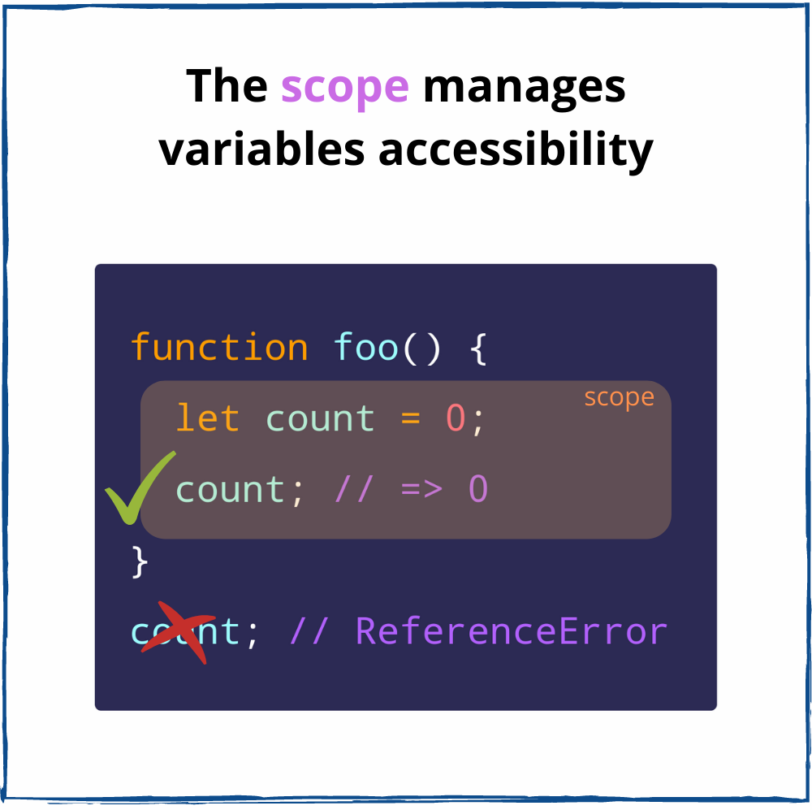
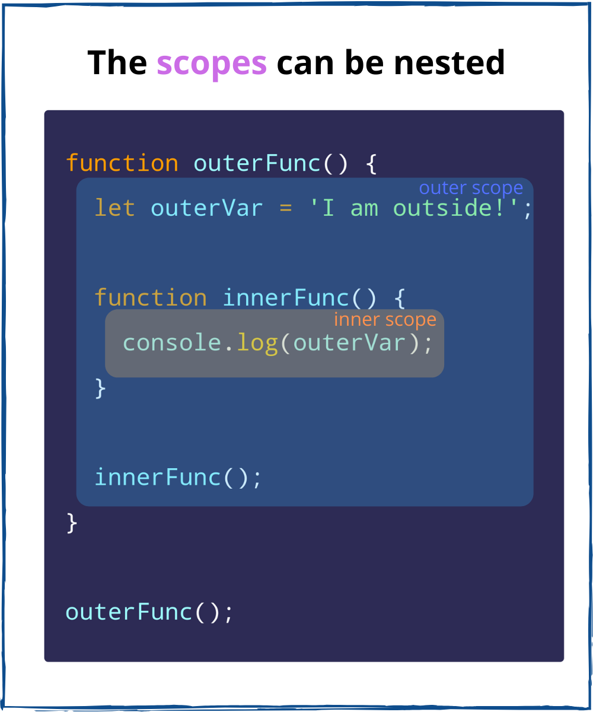

The callbacks, event handlers, higher-order functions can access outer scope variables thanks to closures. Closures are important in functional programming.  

While being used everywhere, closures are difficult to grasp. Closures, like recursion, require an "Aha!" moment.  

If you haven't had your "Aha!" moment, then this post is for you.  

I will start with the terms fundamental to closures: scope and lexical scope. Then, after grasping the basics, you'll need just one step to finally understand closures.  

A nice bonus awaits at the end: the closure concept explained with a real-world example.  

## 1. The scope

Before starting, I suggest you to resist the urge to skip the scope and lexical scope sections. Just remember that these concepts are crucial to closures, and if you get them well, the idea of closure becomes self-evident.  

When you define a variable, you want it accessible within some boundaries. E.g. a `result` variable makes sense to exist within a `calculate()` function, as an internal detail. Outside of the `calculate()`, the `result` variable is useless.  

The accessibility of variables is managed by *scope*. You are free to access the variable defined within its scope. But outside of that scope, the variable is not accessible.  

In JavaScript, a scope is created by a function or code block.  

Let's see how the scope affects the availability of a variable `count`. This variable belongs to a scope created by the function `foo()`:

```javascript{4,8}
function foo() {
  // The function scope
  let count = 0;
  console.log(count); // logs 0
}

foo();
console.log(count); // ReferenceError: count is not defined
```

`count` is freely accessed within the scope of `foo()`.  

However, outside of the `foo()` scope, `count` is not accessible. If you try to access `count` from outside anyways, JavaScript throws `ReferenceError: count is not defined`.  

In JavaScript, the scope says: if you've defined a variable inside of a function or code block, then you can use this variable only within that function or code block. The above example demonstrates this behavior.   



Now, let's see a general formulation:

> *The scope* is a space policy that rules the accessibility of variables.  

The scope *isolates* its variables. That's great because *different scopes can have variables with the same name*.  

You can reuse common variables names (`count`, `index`, `current`, `value`, etc) in different scopes without collisions.  

`foo()` and `bar()` function scopes have their own, but same named, variables `count`:

```javascript{4,10}
function foo() {
  // "foo" function scope
  let count = 0;
  console.log(count); // logs 0
}

function bar() {
  // "bar" function scope
  let count = 1;
  console.log(count); // logs 1
}

foo();
bar();
```

`count` variables from `foo()` and `bar()` function scopes do not collide.  

## 2. Scopes nesting

Let's play a bit more with scopes, and put one scope into another.  

The function `innerFunc()` is nested inside an outer function `outerFunc()`.



How would the 2 function scopes interact with each other? Can I access the variable `outerVar` from within `innerFunc()` scope?  

```javascript{7}
function outerFunc() {
  // the outer scope
  let outerVar = 'I am outside!';

  function innerFunc() {
    // the inner scope
    console.log(outerVar); // => logs "I am outside!"
  }

  innerFunc();
}

outerFunc();
```

`outerVar` variable is accessible inside `innerFunc()` scope. 

Now you know 2 interesting things:

* *Scopes can be nested*
* *The variables of the outer scope are accessible inside the inner scope*

## 3. The lexical scope

How does JavaScript understand that `outerVar` inside `innerFunc()` corresponds to the variable `outerVar` of `outerFunc()`? 

It's because JavaScript implements a scoping mechanism named *lexical scoping* (or static scoping). Lexical scoping means that accessibility of variables is determined by the position of the variables in the source code.  

Here's how the engine understands the previous code snippet (at so called lexing time):

  1. *I can see you define a function `outerFunc()` that has a variable `outerVar`. Good.*  
  * *Inside the `outerFunc()`, I can see you define a function `innerFunc()`.*  
  * *Inside the `innerFunc()`, I can see a variable `outerVar` without declaration. Since I use lexical scoping, I consider the variable `outerVar` inside `innerFunc()` to be the same variable as `outerVar` of `outerFunc()`.*

The distilled idea of the lexical scope:

> *The lexical scope* consists of outer scopes determined statically.   

For example:

```javascript{5,9,12}
const myGlobal = 0;

function func() {
  const myVar = 1;
  console.log(myGlobal); // logs "0"

  function innerOfFunc() {
    const myInnerVar = 2;
    console.log(myVar, myGlobal); // logs "1 0"

    function innerOfInnerOfFunc() {
      console.log(myInnerVar, myVar, myGlobal); // logs "2 1 0"
    }

    innerOfInnerOfFunc();
  }

  innerOfFunc();
}

func();
```

The lexical scope of `innerOfInnerOfFunc()` consits of scopes of `innerOfFunc()`, `func()` and global scope (the outermost scope). Within `innerOfInnerOfFunc()` you can access the lexical scope variables `myInnerVar`, `myVar` and `myGlobal`.  

The lexical scope of `innerFunc()` consists of `func()` and global scope. Within `innerOfFunc()` you can access the lexical scope variables `myVar` and `myGlobal`.  

Finally, the lexical scope of `func()` consists of only the global scope. Within `func()` you can access the lexical scope variable `myGlobal`.  

## 4. The closure

Ok, the lexical scope allows to access the variables statically of the outer scopes. Now, you have to make just one step until the closure!

Let's take a look again at the `outerFunc()` and `innerFunc()` example:  

```javascript{8}
function outerFunc() {
  let outerVar = 'I am outside!';

  function innerFunc() {
    console.log(outerVar); // => logs "I am outside!"
  }

  innerFunc();
}

outerFunc();
```

Inside the `innerFunc()` scope, the variable `outerVar` is accessed from the lexical scope. That's known already.  

But notice that `innerFunc()` invocation happens inside its lexical scope (the scope of `outerFunc()`).  

Let's make a change: `innerFunc()` to be invoked outside of its lexical scope (outside of `outerFunc()`). Would `innerInc()` still be able to access `outerVar`?  

Let's make the adjustments to the code snippet:

```javascript{8,12}
function outerFunc() {
  let outerVar = 'I am outside!';

  function innerFunc() {
    console.log(outerVar); // => logs "I am outside!"
  }

  return innerFunc;
}

const myInnerFunc = outerFunc();
myInnerFunc();
```

Now `innerFunc()` is executed outside of its lexical scope. And what's important: 

*`innerFunc()` still has access to `outerVar` from its lexical scope, even being executed outside of its lexical scope.*

In other words, `innerFunc()` *closes over* (a.k.a. captures, remembers) the variable `outerVar` from its lexical scope.  

In other words, `innerFunc()` is a *closure* because it closes over the variable `outerVar` from its lexical scope.  


You've made the final step to understanding what a closure is:

> *The closure* is a function that accesses its lexical scope even executed outside of its lexical scope.

Simpler, the closure is a function that remembers the variables from the place where it is defined, no matter where it is executed later.  

A rule of thumb to identify a closure: if you see in a function an alien variable (not defined inside the function), most likely that function is a closure. In the previous code snippet, `outerVar` is an alien variable inside the closure `innerFunc()`.  

Let's continue with examples that demonstrate why the closure is useful.  

## 5. Closure examples

### 5.1 Event handler

Let's display how many times a button is clicked:

```javascript
let countClicked = 0;

myButton.addEventListener('click', function handleClick() {
  countClicked++;
  myText.innerText = `You clicked ${countClicked} times`;
});
```

[Open the demo](https://codesandbox.io/s/event-handling-ymvr9) and click the button. The text updates to show the number of clicks.  

When the button is clicked, `handleClick()` is executed somewhere inside of the DOM code. The execution happens far from the place of definition.  

But being a closure, `handleClick()` captures `countClicked` from the lexical scope and updates it when a click happens. Even more, `myText` is captured too.  

### 5.2 Callbacks

Capturing variables from the lexical scope is useful in callbacks.  

A `setTimeout()` callback:
```javascript
const message = 'Hello, World!';

setTimeout(function callback() {
  console.log(message); // logs "Hello, World!"
}, 1000);
```
The `callback()` is a closure because it captures the variable `message`.  

An iterator function for `forEach()`:
```javascript
let countEven = 0;
const items = [1, 5, 100, 10];

items.forEach(function iterator(number) {
  if (number % 2 === 0) {
    countEven++;
  }
});

countEven; // => 2
```

The `iterator` is a closure because it captures `countEven` variable.  

### 5.3 Functional programming

Currying happens when a function returns another function until the arguments are fully supplied. 

For example:

```javascript
function multiply(a) {
  return function executeMultiply(b) {
    return a * b;
  }
}

const double = multiply(2);
double(3); // => 6
double(5); // => 10

const triple = multiply(3);
triple(4); // => 12
```

`multiply` is a curried function that returns another function.  

Currying, an important concept of functional programming, is also possible thanks to closures.  

`executeMultiply(b)` is a closure that captures `a` from its lexical scope. When the closure is invoked, the captured variable `a` and the parameter `b` are used to calculate `a * b`.  

## 6. A real-world example of closure

I know closures might be difficult to grasp. But once you *get it*, it's forever. 

You can model them in your mind the following way. 

Imagine a magical paintbrush with an interesting property. If you paint with it some objects from real life, then the painting becomes a window you can interact with.  


Through this window, you can move the painted objects with your hands.  

Moreover, you can carry the magical painting anywhere, even far from the place where you've painted the objects. From there, through the magical painting as a window, you can still move the objects with your hands.  

The magical painting is a *closure*, while the painted objects are the *lexical scope*.  

Isn't JavaScript magic? &#x263a;

## 7. Conclusion

The scope is what rules the accessibility of variables in JavaScript. There can be a function or a block scope.  

The lexical scope allows a function scope to access statically the variables from the outer scopes.  

Finally, a closure is a function that captures variables from its lexical scope. In simple words, the closure remembers the variables from the place where it is defined, no matter where it is executed.  

The closure is an important concept that every JavaScript developer should know. It is used to capture variables inside event handlers, callbacks. It is widely used in functional programming.  

*Do you still struggle to understand closures? If so, ask me a question in a comment below!*