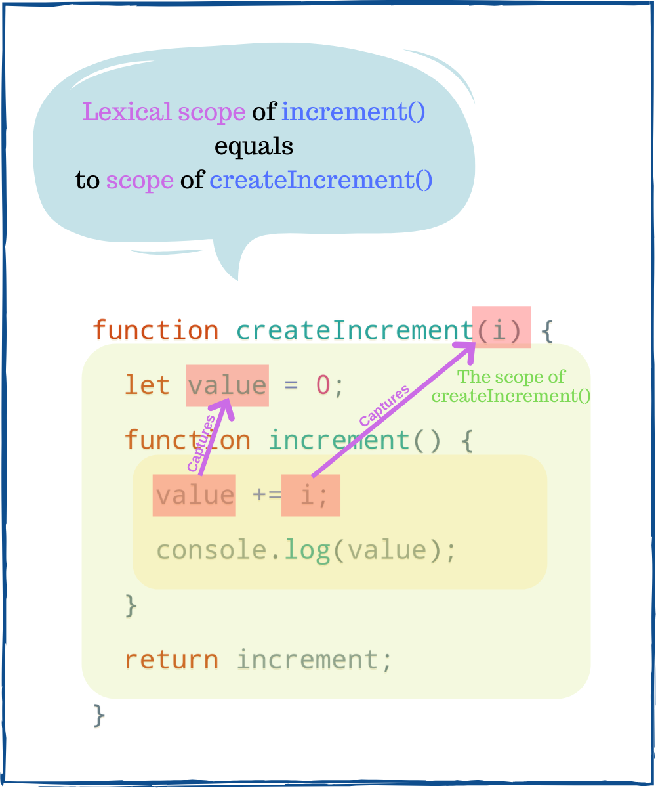

Every JavaScript developer should understand closures. Thanks to closures, the functions as callbacks, event handlers, higher-order functions can access outer scope variables.  

While closures are everywhere, somehow they are difficult to grasp. I had struggled with closures for a while too.  

In this post, I will start with the basic terms fundamental to closures. Then, after grasping the basics, it will be easier to understand the closure itself.  

A nice bonus awaits at the end of the post. You will read real world example that has helped me understand better closures.  

### 1. The JavaScript closure

The following code defines a factory function `createIncrement(i)` that returns an increment function. Later, every time the increment function is called, an internal counter is incremented by `i`:

```javascript
function createIncrement(i) {
  let value = 0;
  function increment() {
    value += i;
    return value;
  }
  return increment;
}

const inc = createIncrement(1);
inc(); // => 1
inc(); // => 2
```

`createIncrement(1)` returns an increment function, which is assigned to `inc` variable. When `inc()` is called, the `value` variable gets incremented by `1`.  

The first call of `inc()` returns `1`, the second call returns `2`, and so on.  

Did you spot the interesting thing? You simply call `inc()`, without arguments, but JavaScript still knows the current `value` and how much to increment `i`. How does it work? 

The answer lays inside `createIncrement()`. There you will find `increment()` function: the closure that does the magic. The closure captures (or closes over, or simply remembers) the variables `value` and `i` from the lexical scope.  

The *lexical scope* is the outer scope *where the closure is defined*. In the example, the lexical scope of `increment()` is the scope of `createIncrement()`, which contains variables `value` and `i`.  



No matter where `inc()` is called, even outside the scope of `createIncrement()`, it has access to `value` and `i`.  

> *The closure* is a function that can remember and modify variables from its lexical scope, regardless of execution scope.  

Continuing the example, `inc()` can be called anywhere else, even inside an async callback:  
```javascript{2,7}
(function() {
  inc(); // => 3
}());

setTimeout(function() {
  // after 1 second
  inc(); // => 4
}, 1000);
```

## 2. Real world example of closure

I know closures might be difficult to grasp. But once you *get it*, it's forever. 

You can model them in your mind the following way. 

Imagine a magical paintbrush with an interesting property. If you paint with it some objects from real life, then the painting becomes a window you can interact with.  


Through this window, you can move the painted objects with your hands.  

Moreover, you can carry the magical painting anywhere, even far from the place where you've painted the objects. From there, through the magical painting as a window, you can still move the objects with your hands.  

The magical painting is a *closure*, while the painted objects are the *lexical scope*.  

Isn't JavaScript magic? &#x263a;

## 3. Conclusion

A closure is a function that captures variables from the place where it is defined (or its lexical scope).  

You can imagine the closure as a magical painting through which you can modify objects.   

The closure is an important concept that every JavaScript developer should know.  

*If you know other meaningful mental models of closures, please share in a [comment](#disqus_thread) below!*