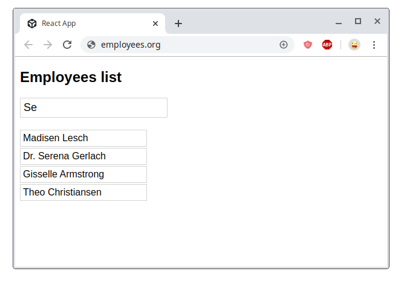

When I write a React component, I want it to be pure and functional. Pure components are the easiest to work with: from composition to unit testing.  

But when you need to perform on [I/O operation](https://en.wikipedia.org/wiki/Input/output), like an HTTP data fetch, things become more difficult because of the async nature of I/O operations.  

You have to initiate the fetch operation, wait for the response, then handle the response, save the response to component's state, and finally render. 

Fortunately, React evolves in a direction to help you with better tools to handle data fetching.  

This post presents 3 ways to fetch data in React: the class-based approach using lifecycle methods, hooks and suspense. 

You will understand the benefits and drawbacks of each approach, so you could decide which works better for you next time you need to handle data fetching.  


## 1. Data fetching using lifecycle methods

An application *Employees.org* fetches the employees of a company.  



On initial render, the first 20 employees are fetched. You can type a query into the input field, and the list gets filtered.  

Let's recall 2 lifecycle methods of the class-based component:

1. `componentDidMount()`: is executed once after mounting
2. `componentDidUpdate(prevProps)`: is executed when props or state change

These 2 methods can be used to perform data fetching.  

The class based component `<EmployeesPage>` implements the fetch logic. This components accepts a prop `query`, and has state `isFetching` and `employees`:

```jsx{10-12,14-18}
import EmployeesList from "./EmployeesList";
import { fetchEmployees } from "./fake-fetch";

class EmployeesPage extends Component {
  constructor(props) {
    super(props);
    this.state = { employees: [], isFetching: true };
  }

  componentDidMount() {
    this.fetch();
  }

  componentDidUpdate(prevProps) {
    if (prevProps.query !== this.props.query) {
      this.fetch();
    }
  }

  async fetch() {
    this.setState({ isFetching: true });
    const employees = await fetchEmployees(this.props.query);
    this.setState({ employees, isFetching: false });
  }

  render() {
    const { isFetching, employees } = this.state;
    if (isFetching) {
      return <div>Fetching employees....</div>;
    }
    return <EmployeesList employees={employees} />;
  }
}
```

[Open the demo](https://codesandbox.io/s/react-fetch-class-urndw) and explore how `<EmployeesPage>` fetches data.  

The class-based `<EmployeesPage>` has a method `fetch()` that handles fetching. When fetching completes, the component state updates with fetched `employees`.  

To start fetching the employees when the component is initially rendered, the `fetch()` method is placed inside `componentDidMount()` lifecycle method.  

When the user enters a query into the input field, the `query` prop is updated. Every time it happens, `fetch()` is executed by `componentDidUpdate()`.   

#### Benefits

*Intuitive*  
Lifecycle method `componentDidMount()` initiates the fetch on first render and `componentDidUpdate()` refetches data when props change.  

#### Drawbacks

*Boilerplate code*  
Class-based component requires "ceremony" code: extending the `Component`, calling `super(props)` inside `constructor()`.  

*`this`*  
Working with `this` keyword is burdensome.

*Code duplication*  
The code inside `componentDidMount()` and `componentDidUpdate()` is mostly duplicated.  

*Hard to reuse*  
Employees fetching logic is complicated to reuse in another component.

## 2. Data fetching using hooks

Let's recall `useEffect(callback, dependencies)` hook. The callback gets called only when dependencies change.  

In the following example `<EmployeesPage>` uses `useEffect()` to fetch employees data:

```jsx{10}
import React, { useState } from 'react';

import EmployeesList from "./EmployeesList";
import { fetchEmployees } from "./fake-fetch";

function EmployeesPage({ query }) {
  const [isFetching, setFetching] = useState(false);
  const [employees, setEmployees] = useState([]);

  useEffect(function fetch() {
    (async function() {
      setFetching(true);
      setEmployees(await fetchEmployees(query));
      setFetching(false);
    })();
  }, [query]);
  
  if (isFetching) {
    return <div>Fetching employees....</div>;
  }
  return <EmployeesList employees={employees} />;
}
```

[Open the demo](https://codesandbox.io/s/react-fetch-hook-vz2vl) and look at how the `useEffect()` fetches data.  

`useEffect(fetch, [query])` executed the `fetch` callback on right after initial render. Also, `fetch` callback gets called right after re-rendering but only if `query` prop changes.  

But there's still room for improvement. Hooks allow you to extract the employees fetching logic from `<EmployeesPage>` component. Let's do that:

```jsx{6,22}
import React, { useState } from 'react';

import EmployeesList from "./EmployeesList";
import { fetchEmployees } from "./fake-fetch";

function useEmployeesFetch(query) {
  const [isFetching, setFetching] = useState(false);
  const [employees, setEmployees] = useState([]);

  useEffect(function fetch {
    (async function() {
      setFetching(true);
      setEmployees(await fetchEmployees(query));
      setFetching(false);
    })();
  }, [query]);

  return [isFetching, employees];
}

function EmployeesPage({ query }) {
  const [employees, isFetching] = useEmployeesFetch(query);
  
  if (isFetching) {
    return <div>Fetching employees....</div>;
  }
  return <EmployeesList employees={employees} />;
}
```

The fetching jungle, bananas and monkeys were extracted to `useEmployeesFetch()`. The component `<EmployeesPage>` is not cluttered with fetching logic, but rather does its direct job: render UI elements.  

What's better, you can reuse `useEmployeesFetch()` in any other component that requires fetching employees.  

#### Benefits

*Simplicity*  
Hooks are free of boilerplate code because they are plain functions.  

*Reusability*  
Fetching logic implemented in hooks is easy to reuse.  

#### Drawbacks

*Entry barrier*  
You have [to make sense of hooks](https://medium.com/@dan_abramov/making-sense-of-react-hooks-fdbde8803889) before using them. Hooks rely on closures, so you have to [know them well](/simple-explanation-of-javascript-closures/) too.   

*Imperative*  
With hooks, you still have to use an imperative approach to perform data fetching.  

## 3. Data fetching using suspense

Suspense provides a declarative approach to asynchronously fetch data in React.  

*Note: Suspense is at an experimental stage, as of November 2019.*

`<Suspense>` wraps a component that performs an async operation:

```jsx
<Suspense fallback={<span>Fetch in progress...</span>}>
  <FetchSomething />
</Suspense>
```

When fetch is in progress, suspense renders `fallback` prop content. Later when fetching is completed, suspense renders `<FetchSomething />` with fetched data.  

Let's see how the employees' application would work with suspense:

```jsx{6-8}
import React, { Suspense } from "react";
import EmployeesList from "./EmployeesList";

function EmployeesPage({ resource }) {
  return (
    <Suspense fallback={<h1>Fetching employees....</h1>}>
      <EmployeesFetch resource={resource} />
    </Suspense>
  );
}

function EmployeesFetch({ resource }) {
  const employees = resource.employees.read();
  return <EmployeesList employees={employees} />;
}
```

`<EmployeesPage>` uses suspense to handle the employees fetch inside component `<EmployeesFetch>`. 

You can notice the win: *React handles the async operation in a declarative and synchronous way*.  

The components are not cluttered with details of *how* data is fetched, rather they are declaratively using the resource to render the content. No lifecycles, no hooks, no `async/await`, no callbacks inside of the components: just rendering a resource.   

[Open the demo](https://codesandbox.io/s/react-fetch-suspense-wltdd) and check how suspense works.  

`resource` prop is provided by `<App>` component. It holds a specially wrapped promise that communicates in background with suspense.  

#### Benefits

*Declarative*  
Suspense lets you declaratively perform async operations in React. 

*Simplicity*  
Simplicity derives from the declarative nature of suspense: declarative code is easier to work with. The components are not cluttered with details of *how* data is fetched.  

*Loose coupling with fetching implementation*  
The components that use suspense don't know how data is fetched: using REST or GraphQL. Suspense is a boundary that protects fetching details to leak into your components.  

*No race conditions*  
If multiple fetching operations were started, suspense uses the latest fetching request.  

#### Drawbacks

*Need of Adapters*  
Suspense requires specialized fetching libraries or adapters that implement the suspense fetching interface.  

## 4. Key takeaways

Fetching data using class-based lifecycle methods had been for a long time the only solution. But this approach has problems with lots of boilerplate code, code duplication, and reusability difficulties.  

`useEffect()` hook provides a better to fetching: there's no more boilerplate code. However, hooks still handle fetching imperatively.  

Suspense's main benefit is that it allows you to fetch data declaratively. Your components are not cluttered with fetching implementation details. Suspense is much closer to the declarative nature of React itself.  

*Which data fetching approach do you prefer?*