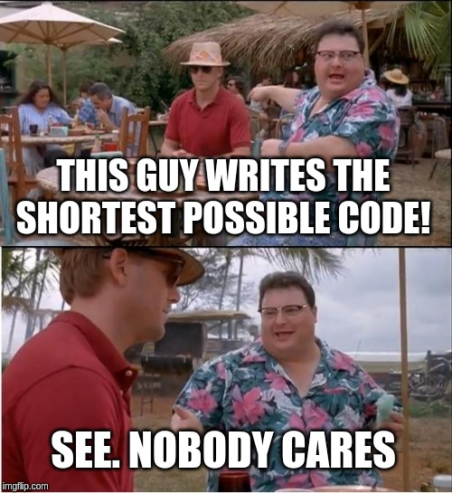
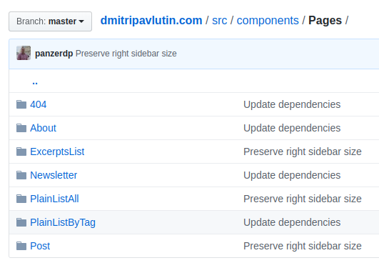

The more I evaluate my experience as a software developer, the more I understand the importance of good communication. 

The code is the source of truth for both running and developing the application. The discipline of writing quality, performant and understandable code is the key to the success of the project. 

In the real world, there's always room for mistakes. The platforms, the programming languages have flaws. The developers regularly make mistakes and write confusing code, jerk-knee solutions. 

A good way to diminish the flaws of unreadable code is to develop a discipline of explicit coding: an approach that favors good naming that leaves no doubt about the intent of the code.  

Let's see how explicit coding discipline can help you.  

## 1. Why explicit matters

Before discussing the coding discipline, I'd like to tell you a story of how communication misunderstanding and dual interpretation can lead to problems. 

In March 2019 I traveled to [Canary Islands](https://en.wikipedia.org/wiki/Canary_Islands): a beautiful Spanish archipelago with never-ending spring. I had arrived at Tenerife Island by flying from Barcelona to Tenerife North Airport. 


While being there, I was reading that at the Tenerife North Airport in 1977 happened the [worst airline disaster ever](https://en.wikipedia.org/wiki/Tenerife_airport_disaster): two Boeing 747 passenger jets collided on the runway. 

Citing Wikipedia, the short conclusion of why the accident had happened:

"The subsequent investigation by Spanish authorities concluded that the primary cause of the accident was the KLM captain's decision to take off in the mistaken belief that a takeoff clearance from air traffic control (ATC) had been issued. Dutch investigators placed a greater emphasis on mutual misunderstanding in radio communications between the KLM crew and ATC."

Non-deterministic communication was one of the reasons for the accident. 

Being at a different scale, still efficient communication through deterministic naming and leaving no room for side interpretation is important in software development too. 

## 2. Explicit naming

The most time-consuming in software development is not writing new code... but understanding what the *actual* code does. 

### 2.1 Variables naming

Variables should clearly indicate the meaning of the content it has. 

For example, if you're summing the number of an array:

```javascript{2}
// Bad
let s = 0;
const items = [1, 2, 3];
for (const item of items) {
  s += item;
}
s; // => 6
```

What does `s` variable stand for? Only after looking at the `s += item` expression you can understand that `s` holds the sum of items. 

An explicit variable name `sum` clearly increases the readability of the code snippet. Without knowing the details, you can understand that `sum` indicates a variable that holds the sum of some numbers. 

```javascript{2}
// Good
let sum = 0;
const items = [1, 2, 3];
for (const item of items) {
  sum += item;
}
sum; // => 6
```

When naming the variable, if you get back to this code in 1 month, can you understand what the variable does for just by looking at the name? 

The following list of examples clearly and explicitly says the intent. Even having the variables extracted from the context of the usage, you understand what they do:

```javascript
// A variable holding the first name. Probably a string.
firstName;

// A variable holding the sum of numbers. Probably a number.
sum;

// A variable holding days. Probably a number.
daysSinceLastModified;

// A variable holding the validation result. Probably a boolean.
isValid;

```

### 2.2 Functions naming

Functions should indicate what the cohesive chunk of code does. Again, exactly like with the variables, the function name should explicitly explain what the function does. 

For example, you'd like to write a function that calculates the number of days of a day until now. A good name could be `daysUntilNow()`:

```javascript
function daysUntilNow(date) {
  const MILLISECONDS_IN_DAY = 86400 * 1000;
  return Math.floor(
    (Date.now() - date.getTime()) / MILLISECONDS_IN_DAY
  );
}

// Assuming today is 2020-01-15
daysUntilNow(new Date('2020-01-13')); // => 2
```

`daysUntilNow()` clearly says that the function calculates the number of days that have passed from a date until now. Moreover, `daysUntilNow` name helps infer that the function returns a number, which is the count of days. 

On the other side, what if this function would have been named `untilNow()`? Such name leaves open many interpretations of what the function does. Does it return the time passed in seconds or days? 

### 2.3 Avoid anonymous functions

An anonymous function is a function that has no name. A function without a name is also a problem for an easy understanding.

Let's use an anonymous function as an event handler: 

```javascript{2}
button.addEventListener('click',
  function() {
    const value = document.getElementById('name').value;
    if (value !== '') {
      itemsList.push(value);
    }
  }
);
```

The anonymous function says nothing about what happens in the event handler. You have to read the whole function to get the idea. 

Let's apply the explicit coding discipline and add a meaningful name to the function:

```javascript{2}
button.addEventListener('click',
  function appendInputValueToList() {
    const value = document.getElementById('name').value;
    if (value !== '') {
      itemsList.push(value);
    }
  }
);
```

`appendInputValueToList()` is a good name for what happens when the button is clicked. Even without reading the body of the function, by reading its name, you can conclude that: *when the button is clicked, an input value is read and appended to the list*. 

Having the functions (and variables, methods, classes, source files) meaningfully and explicitly named helps in debugging. When an error happens, if all the functions explicitly describe what happens in them, the stack trace gives more clues about what had happened and where is the source of error. 

An exception are inline functions (that have just one expression): they can be anonymous. For example: 

```javascript
const items = [1, 2, 3];
items.map(item => item * 2);
```

`item => item * 2` is an inline arrow function that is easy to understand.  

## 3. Avoid tricks in favor of explicit code

When I was a student, I was playing to find the shortest possible code that solves a particular task. It was indeed fun: I was searching the language operators to find the shortest expression to solve the task. It was a playful way of learning. 

While the shortest code and tricks are fun when you're a student, it's not fun when you write that in production. *Nobody cares about shortest code.* What everybody cares is to easily understand what the code does. 



Another problem is the use of implicit side effects of the operators. For example, you'd like to access a property and default if the property doesn't exist.

Let's use the trick that involves `||` operator:

```javascript
function getFontSize(style) {
  return style.fontSize || 0;
}
```

`style.fontSize || 0` evaluates to `0` when `style.fontSize` is a falsy value. This expression uses a side-effect of the `or` operator.

I choose an explicit code that clearly indicates that `fontSize` property might be missing:

```javascript{3}
function getFontSize(style) {
  let fontSize = 0;
  if ('fontSize' in style) {
    fontSize = style.fontSize;
  }
  return fontSize;
}
```

`if ('fontSize' in style)` expresses that `fontSize` property could be missing. Even being verbose, I prefer this code over the previous one. 

If you're lucky, the programming language can provide short expressions without loosing in meaningness. Here's an another alternative to access the `fontSize` property using destructuring assignment:

```javascript{2}
function getFontSize(style) {
  const { fontSize = 0 } = style;
  return fontSize;
}
```

`{ fontSize = 0 } = style` destructuring assignment is short. But at the same time clearly indicates that `fontSize` property might be missing and defaults to `0`. 

## 4. Screaming architecture

The explicit discipline is not limited to naming only. 

The uses-cases of the application should be seen in the source files organization of the application at the highest level.   

For example, my blog implements these use-cases: show a particular post for reading, list posts excerpts with pagination, list all posts on a single page, list posts by a tag. When you look at the main [folder](https://github.com/panzerdp/dmitripavlutin.com/tree/master/src/components/Pages) of the components, the uses-cases are explicitly visible. 



Neither the framework (like GatsbyJS), UI library (React) should dictate me how to structure the application.  

This structuring can be metaphorically named [Screaming architecture](https://blog.cleancoder.com/uncle-bob/2011/09/30/Screaming-Architecture.html).  

## 5. Conclusion

The explicit coding discipline favors clear and explicit expression of intent in the code.  

It suggests writing meaningful names for variables, functions, classes and other constructions. It suggests avoiding tricky solutions in favor of readings and clear intent.

The uses-cases dictate the structure of the application. What the application does should not be implicitly hidden in an organization that the framework is trying to dictate you. Avoid having folders like `/controllers`, `/views` at the highest level of folders organization, in favor of folders containing features and use-cases: `/categories`, `/products`, etc.

Explicit code and structure let you develop the system easier. 