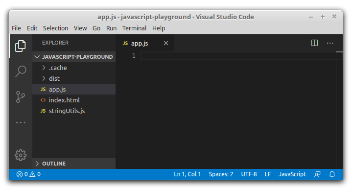

## 1. Named import is not autocomplete friendly

Let's say you wrote a simple JavaScript module:

```javascript
// stringUtils.js
export function equalsIgnoreCase(string1, string2) {
  return string1.toLowerCase() === string2.toLowerCase();
}
```

This is a module `stringUtils` that has a named export `equalsIgnoreCase`. What the function does is compares 2 strings, ignoring the case. 

Everything looks good so far.  

Now, let's try to import `equalsIgnoreCase` function from `stringUtils` module inside of another JavaScript module `app`:

```javascript
// app.js
import { equalsIgnoreCase } from './stringUtils';

equalsIgnoreCase('Hello', 'hello'); // => true
```

 Most likely you would write the code the following way:



Because of the syntax `import { equalsIgnoreCase } from './stringUtils'`, first you have to write the import names `import { }`, then write the module to import. This makes the usage of autocomplete difficult.  

Despite of all other good things about ES2015 modules, the import module syntax makes harder to use of autocomplete.  

## 2. Modules in Python

Now let's try to import named components in Python. Does it have the same problem?  

Here's how would the same function `equalsIgnoreCase` and module `stringUtils` looks in Python:

```python
# stringUtils.py
def equalsIgnoreCase(string1, string2):
  return string1.lower() == string2.lower()
```

In Python, you don't have to explicitely indicate the functions to export.  

Now, let's try to import the funtion `equalsIgnoreCase` from `string` from module inside of another Python module `app`:

```python
# app.py
from stringUtils import equalsIgnoreCase

equalsIgnoreCase('Hello', 'hello') # => true
```

Here's how the process of writing of `app` module and importing of `equalsIgnoreCase` looks like:


Now you can spot the difference. 

In Python, you indicate first the module you're importing from, then you write what to import `from stringUtils`. Then, when you'd like to know what functions are available to import, the autocomplete already knows the module, and gives the necessary suggestions.  

## 3. The solution

The only solution I could find to comfortable enable autocomplete on named imports is to use advanced features of IDEs.

For example, in [Visual Studio Code](https://code.visualstudio.com/), you could install the [JavaScript (ES6) code snippets](https://marketplace.visualstudio.com/items?itemName=xabikos.JavaScriptSnippets) plugin.  

Having the plugin enable, by using the `imd` snippet and hitting `tab` key, the snippet will jump first into the placeholder to indicate the module path, then back to the import placeholder. Here's how it works:


## 4. Conclusion

As seen, the way JavaScript import is `import { equalsIgnoreCase } from './stringUtils'`, it's burden to use autocomplete to list the imported components. All because you have to first indicate the components you'd like to import, only after the module from where you import.  

In Python, as an example, `from stringUtils import equalsIgnoreCase`: you indicate first the module name, then the components you'd like to import from it. This syntax enables easy autocomplete of items to import.  

Anyways, with the use of IDEs possibilities, like the ES6 code snippet plugin, you could mitiguate the problem of imported autocomplete in JavaScript. Still better than nothing.  

*Do you find difficult to use autocomplete on ES modules? If so, what solution do you know?*  