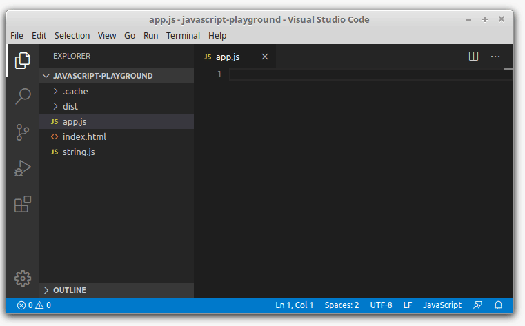

## 1. Burdening autocomplete

Let's say you wrote a simple JavaScript module:

```javascript
// string.js
export function equalsIgnoreCase(string1, string2) {
  return string1.toLowerCase() === string2.toLowerCase();
}
```

This is a module `string` that has a named export `equalsIgnoreCase`. What the function does is compares 2 strings, ignoring the case. 

Everything looks good so far.  

Now, let's try to import `equalsIgnoreCase` function from `string` module inside of another JavaScript module `app`. Most likely you would write the code the following way:



Because of the syntax `import { name } from 'module'`, first you have to write the import names `import { name }`, then write the module to import. This makes the usage of autocomplete difficult.  

Despite of all other good things about ES2015 modules, the import module syntax makes harder to use of autocomplete.  

## 2. Modules in Python language

## 3. Why?