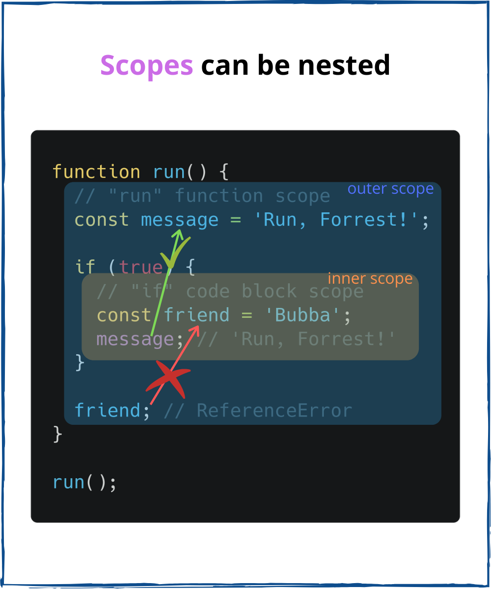

The scope is an important concept that manages the availability of variables. The scope is at the base closures, defines the idea of global and local variables.  

If you'd like to code in JavaScript, understanding the scope of variables is a must.  

In this post, I will explain step by step, in-depth, how the scope works in JavaScript.  

```toc
```

## 1. The scope

Before diving into what the scope is, let's try an experiment that demonstrates how the scope manifests itself.  

Let's say you define a variable `message`:

```javascript
const message = 'Hello';
console.log(message); // 'Hello'
```

Then, you could easily log this variable in the next line after the declaration. No questions here.  

Now, let's move the declaration of `message` inside of an `if` code block:

```javascript
if (true) {
  const message = 'Hello';
}
console.log(message); // ReferenceError: message is not defined
```

This time, when trying to log the variable, JavaScript throws `ReferenceError: message is not defined`.   

Why does it happen? 

The `if` code block creates a *scope* for `message` variable. And `message` variable can be accessed *only* within this scope.  


At a higher level, the accessibility of variables is limited by the scope where they're created. You are free to access the variable defined within its scope. But outside of its scope, the variable is inaccessible.  

Now, let's put down a general definition of scope:

> *The scope* is a policy that manages the accessibility of variables.

## 2. Block scope

A code block in JavaScript defines a scope for variables declared using `let` and `const`:  

```javascript
if (true) {
  // "if" block scope
  const message = 'Hello';
  console.log(message); // 'Hello'
}
console.log(message); // throws ReferenceError
```

The first `console.log(message)` correctly logs the variable because `message` is accessed from the scope where it is defined. 

But the second `console.log(message)` throws a reference error because `message` variable is accessed outside of its scope: the variable doesn't exist here.  

The code block of `if`, `for`, `while` statements also create a scope.  

In the following example `for` loop defines a scope:

```javascript
for (const color of ['green', 'red', 'blue']) {
  // "for" block scope
  const message = 'Hi';
  console.log(color);   // 'green', 'red', 'blue'
  console.log(message); // 'Hi', 'Hi', 'Hi'
}
console.log(color);   // throws ReferenceError
console.log(message); // throws ReferenceError
```

`color` and `message` variables exist within the scope of `while` code block.  

Same way the code block of `while` statement creates a scope for its variables:

```javascript
while (/* condition */) {
  // "while" block scope
  const message = 'Hi';
  console.log(message); // 'Hi'
}
console.log(message); // => throws ReferenceError
```

`message` is defined within `while()` body, consequently `message` is accessible only within `while()` body.  

In JavaScript you can define standalone code blocks. The standalone code blocks also delimit a scope:

```javascript
{
  // block scope
  const message = 'Hello';
  console.log(message); // 'Hello'
}
console.log(message); // throws ReferenceError
```

### 2.1 *var* is not block scoped

As seen in the previous section, the code block creates a scope for variables declared using `const` and `let`. However, that's not the case of variables declared using `var`.

The snippet below declares a variable `count` using a `var` statement:

```javascript
if (true) {
  // "if" block scope
  var count = 0;
  console.log(count); // 0
}
console.log(count); // 0
```

`count` variable, as expected, is accessible within the scope of `if` code block. However, `count` variable is also accessible outside!  

A *code block does not create a scope* for `var` variables, but a *function body does*. Read the previous sentence again, and try to remember it.  

Let's continue on the function scope in the next section.  

## 3. Function scope

A function in JavaScript defines a scope for variables declared using  `var`, `let` and `const`.  

Let's declare a `var` variable within a function body:

```javascript
function run() {
  // "run" function scope
  var message = 'Run, Forrest, Run!';
  console.log(message); // 'Run, Forrest, Run!'
}

run();
console.log(message); // throws ReferenceError
```

`run()` function body creates a scope. The variable `message` is accessible inside of the function scope, but inaccessible outside.   

Same way, a function body creates a scope for `let`, `const` and even function declarations.  

```javascript
function run() {
  // "run" function scope
  const two = 2;
  let count = 0;
  function run2() {}

  console.log(two);   // 2
  console.log(count); // 0
  console.log(run2);  // function
}

run();
console.log(two);   // throws ReferenceError
console.log(count); // throws ReferenceError
console.log(run2);  // throws ReferenceError
```

## 4. Module scope

ES2015 module also creates a scope for variables, functions, classes.  

The module `circle` defines a constant `pi` (for some internal usuage):

```javascript
// "circle" module scope
const pi = 3.14159;

console.log(pi); // 3.14159

// Usage of pi
```

`pi` variable is declared within the scope of `circle` module. Also, the variable `pi` is not exported from the module.

Then the `circle` module is imported:

```javascript
import './circle';

console.log(pi); // throws ReferenceError
```

The variable `pi` is not accessible outside of `circle` module (unless explicitly exported using `export`).  

The module scope makes the module encapsulated. Every private variable (that's not exported) remains an internal detail of the module, and the module scope protects these variables from being accessed outside.  

Looking from another angle, the scope is an encapsulation mechanism for code blocks, functions, and modules.  

## 5. Scopes can be nested

An interesting property of scopes is that they can be nested.  

In the following example the function `run()` creates a scope, and inside an `if` condition code block creates another scope: 

```javascript
function run() {
  // "run" function scope
  const message = 'Run, Forrest, Run!';

  if (true) {
    // "if" code block scope
    const friend = 'Bubba';
    console.log(message); // 'Run, Forrest, Run!'
  }

  console.log(friend); // throws ReferenceError
}

run();
```

`if` code block scope is nested inside the `run()` function scope. Scopes of any type (code block, function, module) can be nested.  

The scope contained within another scope is named *inner scope*. In the example, `if` code block scope is an inner scope of `run()` function scope.  

The scope that wraps another scope is named *outer scope*. In the example, `run()` function scope is an outer scope to `if` code block scope.  



What about the variable's accessibility? Here's one simple rule to remember:

> The *inner scope* can access the variables of its *outer scope*.  

`message` variable, which is a part of the `run()` function scope (outer scope), is accessible inside `if` code block scope (inner scope).  

## 6. Global scope

The global scope is the outermost scope. It is accessible from any inner (aka *local*) scope.  

In a browser environment, the topmost scope of JavaScript file loaded using `<script>` tag is a global scope:

```html
<script src="myScript.js"></script>
```

```javascript
// myScript.js

// "global" scope
let counter = 1;
```

A variable declared inside the global scope is named *global* variable. Global variables are accessible from any scope.  

In the previous code snippet, `counter` is a global variable. This variable can be accessed from any place of the webpage's JavaScript.  

The global scope is a mechanism that lets the host of JavaScript (browser, Node) supply applications with host-specific functions as global variables.  

`window` and `document`, for example, are global variables supplied by the browser. In a Node environment, you can access `process` object as a global variable.  

## 7. Lexical scope

Let's define 2 functions, having the function `innerFunc()` is nested inside `outerFunc()`.  

```javascript{7,14}
function outerFunc() {
  // the outer scope
  let outerVar = 'I am from outside!';

  function innerFunc() {
    // the inner scope
    console.log(outerVar); // 'I am from outside!'
  }

  return innerFunc;
}

const inner = outerFunc();
inner();
```

Look at the last line of the snippet `inner()`: the `innerFunc()` invokation happens outside of `outerFunc()` scope. Still, how does JavaScript understand that `outerVar` inside `innerFunc()` corresponds to the variable `outerVar` of `outerFunc()`?  

The answer is due to lexical scoping.  

JavaScript implements a scoping mechanism named lexical scoping (or static scoping). Lexical scoping means that the accessibility of variables is determined statically by the position of the variables within the nested function scopes: *the inner function scope can access variables from the outer function scope*.  

A formal definition of lexical scope:

> The *lexical scope* consists of outer scopes determined statically.  

In the example, the lexical scope of `innerFunc()` consists of the scope of `outerFunc()`.  

Moreover, the `innerFunc()` is a *closure* because it captures the variable `outerVar` from the lexical scope. 

If you'd like to master the closure concept, I highly recommend reading my post [A Simple Explanation of JavaScript Closures](/simple-explanation-of-javascript-closures/#4-the-closure).  

## 8. Variables isolation

An immediate property of scope arises: the scope isolates the variables. And what's good different scopes can have variables with the same name.  

You can reuse common variables names (`count`, `index`, `current`, `value`, etc) in different scopes without collisions.  

`foo()` and `bar()` function scopes have their own, but same named, variables `count`:

```javascript{4,10}
function foo() {
  // "foo" function scope
  let count = 0;
  console.log(count); // 0
}

function bar() {
  // "bar" function scope
  let count = 1;
  console.log(count); // 1
}

foo();
bar();
```

## 9. Conclusion

The scope is a policy that manages the availability of variables. A variable defined inside a scope is accessible only within that scope, but inaccessible outside.  

In JavaScript, scopes are created by code blocks, functions, modules. 

While `const` and `let` variables are scoped by code blocks, functions or modules, `var` variables are scoped only by functions or modules.  

Scopes can be nested. Inside an inner scope you can access the variables of an outer scope.  

The lexical scope consists of the outer function scopes determined statically. Any function, no matter the place where being executed, can access the variables of its lexical scope (this is the concept of [closure](/simple-explanation-of-javascript-closures/)).  

Hopefully, my post has helped you understand the scope better!

