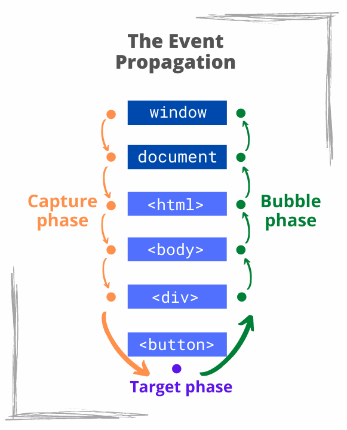

## 1. Why event delegation?

Let's log a message to console when an HTML button is clicked. What you need to do is select the button, and use the `addEventListener()` method to attach the event listener:

```html{5}
<button id="buttonId">Click me</button>

<script>
  document.getElementById('buttonId')
    .addEventListener('click', () => console.log('Clicked!'));
</script>
```

That's a the way to go when you'd like to listen for events on a single element, parcticularly a button.   

What about listening for click events on a large list of buttons? Here's a possible implementation:

```html{10-13}
<div id="buttons">
  <button class="buttonClass">Click me</button>
  <button class="buttonClass">Click me</button>
  <!-- buttons... -->
  <button class="buttonClass">Click me</button>
</div>

<script>
  const buttons = document.getElementsByClassName('.buttonClass');
  for (const button of buttons) {
    button.addEventListener('click', () => console.log('Clicked!'));
  }
</script>
```

The buttons list is iterated and an event listener is attached to each button. That's only a part of difficulties: you'd have to manually remove or attach event listeners each time a button is added or removed.  

Fortunately, the *event delegation* pattern provides a simpler and elegant solution. When using event delegation, just one event listener is needed,
even if you'd like to listen for events on multiple elements.  

To work, the event delegation uses specifics of *event propagation*. To understand how event delegation works, first, I recommend to understand the event propagation.  

## 2. Event propagation

Let's take a closer look at what happens when a button is clicked. Let's consider that the `<button>` in the following HTML structure is clicked:

```html{4}
<html>
  <body>
    <div id="buttons">
      <button class="buttonClass">Click me</button>
    </div>
  </body>
</html>
```

When you click the button, the click event propagates in the following sequence of phases: 

1. *Capture phase* &mdash; Starting from `window`, `document` and the root element, the event dives down through ancestors until the target element
2. *Target phase* &mdash; The event triggers on the element on which the user clicked
3. *Bubble phase* &mdash; Finally, the event bubbles up through ancestors until the root element, `document` and `window`.  

If you click on the `<button>` in the example html, here's how the click event propagates:



To attach to events of a particular phase, you need to indicate specific arguments on the `addEventListener()` method.  

* `element.addEventListener('eventType', handler)` captures the events of *target and bubble phases*  
* `element.addEventListener('eventType', handler, true)` (the 3rd argument being `true`) captures the events of *capture phase*  

In this Codesandbox demo you can see in action how the event propagates.  

How would the event propagation help capturing events of a multiple buttons with just one event? You can probably already see the idea:


## 3. Event delegation

