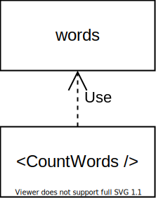

Many components (of libraries like React, Vue, Angular) use functionality of utility libraries.  

Let's consider a React component that displays the number of words in the provided text:

```tsx{1,4}
import words from 'lodash.words';

function CountWords({ text }: { text: string }): JSX.Element {
  const count = words(text).length;
  return (
    <div className="words-count">{count}</div>
  );
}
```

The component `CountWords` uses the library `lodash.words` to count the number of words in the string `text`. 

`CountWords` component has a dependency on `lodash.words` library.  

The good part about components using depenencies is the code reuse: you simply import the necessary library and use it.  

However, your component might need diverse dependency implementations for various environments (client-side, server-side, testing environment). In such a case importing directly a concrete dependency is a bad practice.  

Designing correctly the dependencies is an important skill to architect Front-end applications. The first step to create a good design is to identify the *stable* and *volatile* dependencies, and treat them accordingly.  

## 1. Stable dependencies

Let's recall the example component `CountWords` from the introduction:  

```tsx{1}
import words from 'lodash.words';

function CountWords({ text }: { text: string }): JSX.Element {
  const count = words(text).length;
  return (
    <div className="words-count">{count}</div>
  );
}
```

Clearly `lodash.words` is a dependency of `CountWords` component.  

The component `CountWords` is going to use the same library `lodash.words` no matter the environment: be it on client-side, be it running on the server-side (if you implement Server-Side Rendering), or even when running unit tests of `Count words`.    

At the same time, `lodash.words` is a simple utility function: `const arrayOfWords = words(string)`. The signature of the function won't change much in the future.  

Because the dependent component uses a single dependency implementation, and the dependency won't change in the future &mdash; such dependency is considered *stable*.  



Examples of stable dependencies are the utility libraries like `lodash`, `ramda`.  

Moreover, the JavaScript language itself provides:

* Utility functions, like `Object.keys()`, `Array.from()`
* Methods on primitives and objects, like `string.slice()`, `array.includes()`, `object.toString()`

All the built-in functions that the language provides are also considered stable dependencies. You can use them safely and depend directly upon them.  

However, aside from stable dependencies, there are dependencies that may change under certain circumstances. In such case, such *volatile* dependencies have to be distinguished from stable ones, and designed in a different manner to *avoid your components depend directly upon them*.  

## 2. Volatile dependencies


## 3. Summary