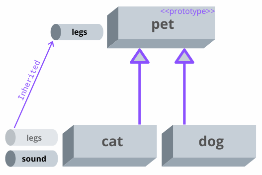
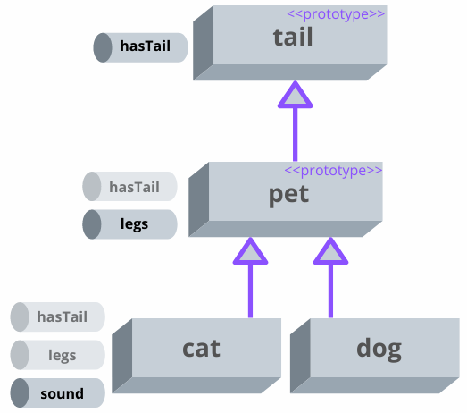

I believe that you don't know JavaScript until you know prototypal inheritance. 

This concept is often asked during JavaScript coding inteviews. So if you're preparing for one, stay tuned.  

In this post, you'll read an accessible explanation of prototypal inheritance in JavaScript.  

## 1. Objects only

JavaScript has only primitives types, `null`, `undefined` and objects. A big world of objects.  

In Java or PHP languages there's a concept of *class*: a template or plan that describes the properties and method of objects. 

But JavaScript doesn't have the concept of class as a template &mdash; there are only objects. 

## 2. Inheritance

A primitive type is atomic, meaning that it can not be further divided into smaller pieces. For example, a boolean `false` is atomic because it divide into smaller pieces.  

An object, however, is a composable structure. An object consists of multiple properties: key and value pairs.  

For example, the following objects `cat` and `dog` contain 2 properties:

```javascript
const cat = { sound: 'Meow!', legs: 4 };
const dog = { sound: 'Bark!', legs: 4 };
```

There's a small issue with these objects: they both contain the same property `{ legs : 4 }`.  

Following "Don't repeat yourself" ([DRY](https://en.wikipedia.org/wiki/Don%27t_repeat_yourself)) principle, let's extract `legs` property into a specialized object `pet`:

```javascript{1}
const pet = { legs: 4 };

const cat = { sound: 'Meow!' };
const dog = { sound: 'Bark!' };
```

That looks better. Now no object has duplicated information.  

But you still want to have `legs` property on `cat` and `dog`. How can you connect `cat` and `dog` with `pet`?  

Inheritance can help you!

## 3. The prototype object

In JavaScript, you can make an object *inherit* the properties from another object. The object from where the properties are inherited is named *prototype*.  

Following the example, you can make `pet` a *prototype* of `cat` and `dog`. Then `cat` and `dog` will *inherit* `legs` property from `pet`.  

[Object.create(prototype, propertiesObject)](https://developer.mozilla.org/en-US/docs/Web/JavaScript/Reference/Global_Objects/Object/create) is an utility function that creates a new object from `propertiesObject` and makes `prototype` as the prototype of the created object.  

Let's use `Object.create()` and make `pet` the prototype object of both `cat` and `dog`:

```javascript
const pet = { legs: 4 };

const cat = Object.create(pet, { sound: 'Meow!' });
const dog = Object.create(pet, { sound: 'Bark!' });

cat.legs; // => 4
dog.legs; // => 4
```

Now you can access `legs` property on both `cat` and `dog` objects. `legs` property inside `cat` and `dog` is now an *inherited property*. 

`sound` property, on the other side, is an *own property* because it's defined directly upon the object.  



> The essence of prototypal inheritance in JavaScript: objects can inherit properties from other objects &mdash; the prototypes.  

### 3.1 Own vs inherited property

If an object has an own property and an inherited property with the same name, then JavaScript *always picks the own property* of the object:  

In the following example `chicken` object has an own property `legs`, as well inherits a property with the same name `legs`:
```javascript
const pet = { legs: 4 };

const chicken = Object.create(pet, { sound: 'Cluck!', legs: 2 });

chicken.legs; // => 2
```

`chicken.legs` evaluates to `2`, meaning that JavaScript picks the own property `legs` over the inherited `legs` from the prototype.  

What's interesting is that if you delete the own property, JavaScript will pick the inherited one!

```javascript
const pet = { legs: 4 };

const chicken = Object.create(pet, { sound: 'Cluck!', legs: 2 });

chicken.legs; // => 2
delete chicken.legs;
chicken.legs; // => 4
```

## 4. The implicit prototype

Every time you create an object, if no prototype is explicitly set, JavaScript assigns an implicit prototype object specific to the type of object you've created.   

Let's look again at the `pet` object:

```javascript
const pet = { legs: 4 };

pet.toString(); // => `[object Object]`
```

`pet` has just one property `legs`, however, you can invoke the method `pet.toString()`. Where did `toString()` come from?  

When you've created the `pet` object, JavaScript has assigned to it an implicit prototype object. From this implicit prototype `pet` inherits `toString()` method:  

```javascript
const pet = { legs: 4 };

const petPrototype = Object.getPrototypeOf(pet);

pet.toString === petPrototype.toString; // => true
```

[Object.getPrototypeOf(object)]() is an utility function that returns the prototype of an object.  

## 5. The prototype chain

Let's go deeper and create an object `tail`, making it also a prototype of `pet`:

```javascript
const tail = { hasTail: true };
const pet = Object.create(tail, { legs: 4 });
const cat = Object.create(pet, { sound: 'Meow!' });
const dog = Object.create(pet, { sound: 'Bark!' });

cat.hasTail; // => true
dog.hasTail; // => true
```

`cat` and `dog` inherit the property `legs` from their direct prototype `pet`, and also, they inherit `hasTail` from the prototype of their prototype. 



A prototype object can also have a prototype. For example `pet` is a prototype object of `cat` and `dog`, and at the same time `pet`'s prototype is `tail`.

Because prototypes can also have prototypes, JavaScript looks for inherited properties in the *chain of prototypes*.  

When accessing a property `myObject.myProp`, JavaScript looks for `myProp` inside the own properties of `myObject`, then in the prototype of the object, then in the prototype's prototype, and so on until it encounters `null` as the prototype.  

## 6. But JavaScript has classes!

You may be confused regarding the statement that JavaScript has only objects. You've probably already used the `class` keyword in JavaScript!

For example, you can write a class `Pet`:

```javascript
class Pet {
  legs: 4;

  constructor(sound) {
    this.sound = sound;
  }
}

const cat = new Pet('Moew');
const dog = new Pet('Bark!');

cat.legs; // => 4
dog.legs; // => 4
```

and create `cat` and `dog` objects when instantiating the class. 

The secret is that `class` syntax in JavaScript is [syntactic sugar](https://en.wikipedia.org/wiki/Syntactic_sugar) on top of prototypal inheritance. 

The above `class`-based code snippet is equivalent to the following:

```javascript
const pet = {
  legs: 4,
  constructor: CreatePet
};

function CreatePet(sound) {
  return Object.create(pet, {
    sound
  });
}

const cat = CreatePet('Moew');
const dog = CreatePet('Bark!');

cat.legs; // => 4
dog.legs; // => 4
```

where `constructor` is a special property that links to the function that constructs the object, which in this case is `CreatePet`.  

What I like about the `class` syntax in JavaScript is that being based on prototypes, when working with `class`-es you can completely forget about prototypes.  

## 7. The benefits of prototypal inheritance

While prototypal inheritance might seem clumsy at first, when you get a good grasp of it you can see how easy and powerful it. *Objects inherit properties from objects* &mdash; what could be simpler?  

Prototypal inheritance can even emulate the "classic" classes.  

Also prototypes are memory efficient. Any newly created object is linked to the same implicit prototype object. 

For example, if your application has created 100 plain JavaScript objects of data &mdash; then all these objects inherit from the *same prototype object*.  

```javascript
const obj1 = { prop: 'Value 1' };
const obj2 = { prop: 'Value 2' };

const proto1 = Object.getPrototypeOf(obj1);
const proto2 = Object.getPrototypeOf(obj2);

proto1 === proto2; // => true
```

## 8. Summary

JavaScript has only primitive types, `null`, `undefined` and objects. 

In JavaScript, contrary to languages like Java or PHP, there's no concept of class that serves as a template to create objects.  

Rather, in JavaScript objects inherit properties from other objects &mdash; the prototypes. That's the prototypal inheritance.  

JavaScript looks for inherited properties not only in the direct prototype of the object, but also in the prototype of the prototype, and so on in the chain of prototypes.  

Finally, JavaScript still provides the classic syntax of `class`-es. However, this syntax is a syntactic sugar on top of prototypes.  

*Have questions about prototypal inheritance? Ask in a comment below!*