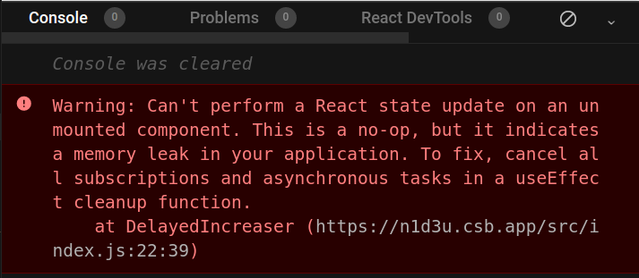

You've read many posts on how to use React hooks. But *knowing how Not to use*, sometimes, is equally important as *knowing how to use*.  

In this post, I will describe the React hooks usage mistakes, and how to fix them.    

```toc
```

## 1. Do Not change hooks invocation order

A few days before writing the post, I was coding a component that fetches game information by id. Here's a simplified version of `FetchGame` component:

```jsx
function FetchGame({ id }) {
  if (!id) {
    return 'Please select a game to fetch';
  }

  const [game, setGame] = useState({ 
    name: '',
    description: '' 
  });

  useEffect(() => {
    const fetchGame = async () => {
      const response = await fetch(`/api/game/${id}`);
      const fetchedGame = await response.json();
      setGame(fetchedGame);
    };
    fetchGame();
  }, [id]);

  return (
    <div>
      <div>Name: {game.name}</div>
      <div>Description: {game.description}</div>
    </div>
  );
}
```

[Try the demo.](https://codesandbox.io/s/hooks-order-warning-rdxpg?file=/pages/index.js)

The component `FetchGame` accepts a prop `id` &mdash; the id of the game to be fetched. `useEffect()` hook fetches the game information ``await fetch(`/game/${id}`)`` and saves it into the state variable `game`.  

Open the [demo](https://codesandbox.io/s/hooks-order-warning-rdxpg?file=/pages/index.js) and load a few games. The component correctly performs the fetch, as well as updates the state with the fetched data. But look at the Problems tab &mdash; Eslint warns about incorrect order of hooks execution:  


The problem is in the early exit:  

```javascript{1-3}
function FetchGame({ id }) {
  if (!id) {
    return 'Please select a game to fetch';
  }
  
   // ...
}
```

If `id` is empty, the component renders `'Please select a game to fetch'` and exits. No hooks are invoked. But if `id` is not empty (e.g. equals `'1'`), then the `useState()` and `useEffect()` hooks are invoked.  

The hooks executed conditionally can lead to unexpected and hard to debug errors. The way React hooks internally work requires components to invoke hooks in the same order between renderings &mdash; always!  

That's exactly what suggests [the first rule of hooks](https://reactjs.org/docs/hooks-rules.html#only-call-hooks-at-the-top-level): *Don’t call Hooks inside loops, conditions, or nested functions*.  

Solving the incorrect order of hooks means moving the `return` statement after invoking the hooks:

```jsx{12-14,17-19}
function FetchGame({ id }) {
  const [game, setGame] = useState({ 
    name: '',
    description: '' 
  });

  useEffect(() => {
    const fetchGame = async () => {
      const response = await fetch(`/api/game/${id}`);
      const fetchedGame = await response.json();
      setGame(fetchedGame);
    };
    if (id) { 
      fetchGame(); 
    }
  }, [id]);

  if (!id) {
    return 'Please select a game to fetch';
  }

  return (
    <div>
      <div>Name: {game.name}</div>
      <div>Description: {game.description}</div>
    </div>
  );
}
```

Now, no matter `id` is empty or not, the `useState()` and `useEffect()` hooks are always invoked in the same order. 

Here's a good practice that helps to avoid conditional rendering of hooks:

>  Execute the hooks at the top of the component body, the conditional rendering logic move to the bottom. 

[eslint-plugin-react-hooks](https://www.npmjs.com/package/eslint-plugin-react-hooks) can also help you enforce the correct hooks execution order.  

## 2. Do Not use stale state

The following component `MyIncreaser` increases the state variable `count` when a button is clicked:

```jsx{8-10}
function MyIncreaser() {
  const [count, setCount] = useState(0);

  const increase = useCallback(() => {
    setCount(count + 1);
  }, [count]);

  const handleClick = () => {
    increase();
    increase();
    increase();
  };

  return (
    <>
      <button onClick={handleClick}>Increase</button>
      <div>Counter: {count}</div>
    </>
  );
}
```

The interesting part is that `handleClick` invokes the state update `3` times.  

Now, before opening the demo, I want to ask you. If you click the button *Increase* once, does the counter increase by `3`?  

Ok. Open the [demo](https://codesandbox.io/s/stale-variable-jo32q?file=/src/index.js) and click *Increase* button once.  

Unfortunately, even if the `increase()` is called 3 times inside the `handleClick()`, `count` increases only by `1`. Hm...

The problem lays in the `setCount(count + 1)` state updater. When the button is clicked, React invokes `setCount(count + 1)` 3 times:

```javascript
const handleClick = () => {
  increase();
  increase();
  increase();
};

// same as:

const handleClick = () => {
  setCount(count + 1);
  // count variable is now stale
  setCount(count + 1);
  setCount(count + 1);
};
```

The first invocation of `setCount(count + 1)` correctly updates the counter as `count + 1 = 0 + 1 = 1`. However, the next 2 calls of `setCount(count + 1)` also set the count to `1` because they use a *stale state*.  

The stale state is solved by using a functional way to update the state. Instead of  `setCount(count + 1)`, let's better use `setCount(count => count + 1)`:  

```jsx{4}
function MyIncreaser() {
  const [count, setCount] = useState(0);

  const increase = useCallback(() => {
    setCount(count => count + 1);
  }, []);

  const handleClick = () {
    increase();
    increase();
    increase();
  };

  return (
    <>
      <button onClick={handleClick}>Increase</button>
      <div>Counter: {count}</div>
    </>
  );
}
```

[Try the demo.](https://codesandbox.io/s/stale-variable-fixed-3j0p8?file=/src/index.js)

By using an updater function `count => count + 1`, React gives you the latest *actual* state value.  

Open the fixed [demo](https://codesandbox.io/s/stale-variable-fixed-3j0p8?file=/src/index.js). Now clicking *Increase* button updates the `count` by `3`, as expected.  

Here's a good rule to avoid stale state variables:

> If you use current state to calculate the next state, always use a functional way to update the state: `setValue(prevValue => prevValue + someResult)`.

## 3. Do Not create stale closures

React hooks heavily rely on the concept of closures. Relying on closures is what makes them so expressive.  

As a quick reminder, the [closure](/simple-explanation-of-javascript-closures/) in JavaScript is the function that captures variables from its lexical scope. No matter where the closure is executed, it always has access to the variables from the place where it is defined.  

When using hooks that accept callbacks as arguments (like `useEffect(callback, deps)`, `useCallback(callback, deps)`) you might create a stale closure &mdash; a closure that has captured outdated state or prop variables.  

Let's see a case of a stale closure created when using `useEffect(callback, deps)` hook.  

Inside the component `<WatchCount>` the hook `useEffect()` logs every 2 seconds the value of `count`:  

```jsx
function WatchCount() {
  const [count, setCount] = useState(0);

  useEffect(function() {
    setInterval(function log() {
      console.log(`Count is: ${count}`);
    }, 2000);
  }, []);

  const handleClick = () => setCount(count => count + 1);

  return (
    <>
      <button onClick={handleClick}>Increase</button>
      <div>Counter: {count}</div>
    </>
  );
}
```

[Try the demo.](https://codesandbox.io/s/stale-closure-tmcpd?file=/src/index.js)

Open the [demo](https://codesandbox.io/s/stale-closure-tmcpd?file=/src/index.js) and click *Increase* button. Then check the console &mdash; every 2 seconds appears `Count is: 0`, no matter the actual value of `count` state variable.  

Why does it happen?

At first render, the closure `log` captures `count` variable as `0`. 

Later, when the button is clicked and `count` increases, `setInterval` still invokes the old `log` closure that has captured `count` as `0` from the initial rendering. `log` is a *stale closure* because it has captured a stale (in other words outdated) state variable `count`.  

The solution is to let know `useEffect()` that the closure `log` depends on `count` and properly reset the timer:  

```jsx{7,8}
function WatchCount() {
  const [count, setCount] = useState(0);

  useEffect(function() {
    const id = setInterval(function log() {
      console.log(`Count is: ${count}`);
    }, 2000);
    return () => clearInterval(id);
  }, [count]);

  const handleClick = () => setCount(count => count + 1);

  return (
    <>
      <button onClick={handleClick}>Increase</button>
      <div>Counter: {count}</div>
    </>
  );
}
```

[Try the demo.](https://codesandbox.io/s/stale-closure-fixed-rrfc2?file=/src/index.js)

With the dependencies properly set, `useEffect()` updates the closure of `setInterval()` as soon as `count` changes.  

Open the fixed [demo](https://codesandbox.io/s/stale-closure-fixed-rrfc2?file=/src/index.js) and click a few times increase. The console will log the actual value of `count`.  

To prevent closures from capturing old values:

> Make sure that any state or prop value used inside of a callback supplied to a hook is indicated as a dependency.   

[eslint-plugin-react-hooks](https://www.npmjs.com/package/eslint-plugin-react-hooks) can help you remember to properly set the hooks dependencies.  

## 4. Do Not use the state for infrastructure data

Once I needed to invoke a side-effect on state update, but without invoking the side-effect on the first render. `useEffect(callback, deps)` always invokes the `callback` after mounting of the component, so I wanted to avoid that.  

Surprisingly for me, I found the following solution:

```jsx
function MyComponent() {
  const [isFirst, setIsFirst] = useState(true);
  const [count, setCount] = useState(0);

  useEffect(() => {
    if (isFirst) {
      setIsFirst(false);
      return;
    }
    console.log('The counter increased!');
  }, [count]);

  return (
    <button onClick={() => setCount(count => count + 1)}>
      Increase
    </button>
  );
}
```

A state variable `isFirst` holds the information whether this is the first render of the component. Holding such information in the state is a problem &mdash; as soon as you update `setIsFirst(false)` another re-render happens &mdash; and for no reason.  

The information on whether this is the first render shouldn't be stored in the state. The infrastructure data, like details about rendering cycle (is first rendering, the number of renderings), timer ids (`setTimeout()`, `setInterval()`), direct references to DOM elements, etc. should be stored and updated using [references](/react-useref-guide/) `useRef()`.   

Let's store the information about the first rendering into a reference `isFirstRef`:

```jsx{1}
function MyComponent() {
  const isFirstRef = useRef(true);
  const [count, setCount] = useState(0);

  useEffect(() => {
    if (isFirstRef.current) {
      isFirstRef.current = false;
      return;
    }
    console.log('The counter increased!');
  }, [count]);

  return (
    <button onClick={() => setCounter(count => count + 1)}>
      Increase
    </button>
  );
}
```

`isFirstRef` is a reference that holds the information whether this is the first rendering of the component. `isFirstRef.current` property is used to access and update the value of the reference.  

What's important: updating a reference `isFirstRef.current = false` doesn't trigger re-rendering.  

## 5. Do Not forget to cleanup side-effects

A lot of side-effects, like making a fetch request or using timers like `setTimeout()`, are asynchronous.  

Do not forget to clean up the side-effect if the component unmounts or it doesn't need anymore the result of the side-effect.  

For example, if you've started a timer, make sure to stop the timer when the component unmounts.  

The following component has a button *Start increasing*. When the button is clicked, a counter increases by 1 each second:  

```jsx
function DelayedIncreaser() {
  const [count, setCount] = useState(0);
  const [increase, setShouldIncrease] = useState(false);

  useEffect(() => {
    if (increase) {
      setInterval(() => {
        setCount(count => count + 1)
      }, 1000);
    }
  }, [increase]);

  return (
    <>
      <button onClick={() => setShouldIncrease(true)}>
        Start increasing
      </button>
      <div>Count: {count}</div>
    </>
  );
}
```

Open the [demo](https://codesandbox.io/s/unmounted-state-update-n1d3u?file=/src/index.js), and click *Start increasing* button. As expected, the count state variable increases each second.  

While having the increase in progress, click the *Unmount Increaser* button to umount the component. React warns in the console about updating the state of an unmounted component.  



Fixing `DelayedIncreaser` is simple: just use a cleanup function from the callback of `useEffect()` to stop the interval timer:

```jsx{8}
function DelayedIncreaser() {
  // ...

  useEffect(() => {
    if (increase) {
      const id = setInterval(() => {
        setCount(count => count + 1)
      }, 1000);
      return () => clearInterval(id);
    }
  }, [increase]);

  // ...
}
```

Open the fixed [demo](https://codesandbox.io/s/unmounted-state-update-fixed-siq8w?file=/src/index.js). Click *Start Increasing* button and check how the count increases. Then hit *Unmount Increaser*: and thanks to `() => clearInterval(id)` cleanup the interval stops. No complaints from React.  

That being said, every time you code a side-effect, question yourself whether it should clean up. Timers, heavy fetch requests (like uploading files), sockets &mdash; almost always have to be clean up.  

## 6. Summary

The best way to start with React hooks is to learn how to use them. 

But you can encounter situations when you can't understand why they behave differently than you expect. Knowing how to use React hooks is not enough: you also should know how Not to use them.  

The first thing Not to do is render the hooks conditionally or change the order of hooks invocation. React expects that, no matter the props or state values, the component always invokes the hooks in the same order.    

To avoid stale state values use a functional way to update the state.  

Don't forget to indicate the dependencies for hooks that accept callbacks as arguments: e.g. `useEffect(callback, deps)`, `useCallback(callback, deps)`. That allows you to solve the stale closures.  

Do not store infrastructure data (like information about component rendering cycle, `setTimeout()` or `setInterval()` ids) into the state. The rule of thumb is to keep such data in references.  

Do not forget to clean up your side-effects, if that's the case.  

One more nasty pitfall you can encounter when using `useEffect()` is the infinite loop. Check out my post on [How to Solve the Infinite Loop of React.useEffect()
](/react-useeffect-infinite-loop/).  

*What other React hooks anti-patterns do you know?*
