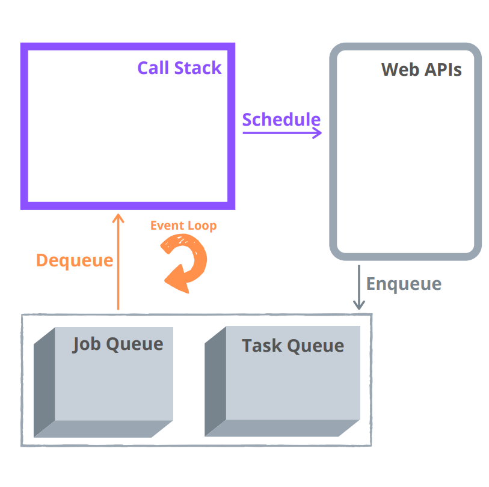
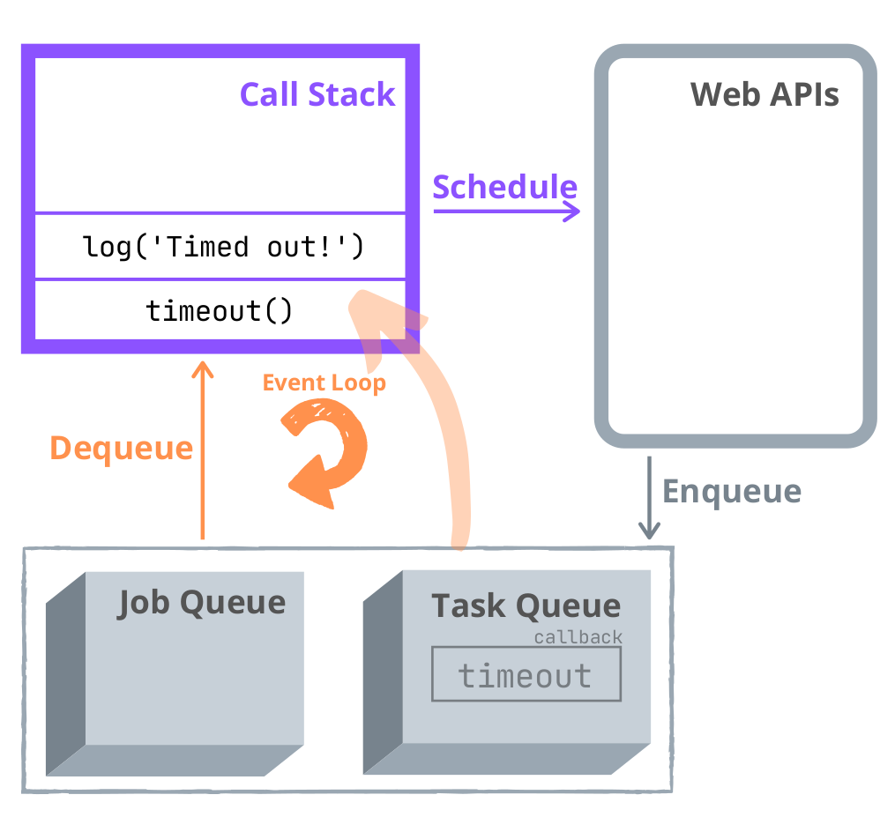

## 1. The experiment

Let's try an experiment. What does execute faster: an immediately resolved promise or a an immediate timeout (aka a timeout of `0` milliseconds)?  

```javascript
Promise.resolve(1).then(function resolve() {
  console.log('Resolved!');
});

setTimeout(function timeout() {
  console.log('Timed out!');
}, 0);

// logs 'Resolved!'
// logs 'Timed out!'
```

`Promise.resolve(1)` is a static function that returns an immediately resolved promise. `setTimeout(callback, 0)` also executes the callback with a delay of `0` milliseconds.  

Open the [demo](https://jsitor.com/wJFrt5VCiU) and check the console. You'll notice that `'Resolved!'` is logged first, then `'Timeout completed!'`. The immediately resolved promise resolves faster than an immediate timeout.  

Can it be related to the fact that the `Promise.resolve(true).then(...)` was called before the `setTimeout(..., 0)`? Fair enough question.  

Let's change slighly the conditions of the experiment and call `setTimeout(..., 0)` first:

```javascript
setTimeout(function timeout() {
  console.log('Timed out!');
}, 0);

Promise.resolve(1).then(function resolve() {
  console.log('Resolved!');
});

// logs 'Resolved!'
// logs 'Timed out!'
```

Open the [demo](https://jsitor.com/kslO11KZW5) and look at the console. Hm... same result!

`setTimeout(..., 0)` is called before `Promise.resolve(true).then(...)`. However, `'Resolved!'` is still logged before `'Timed out!'`.  

The experiment has demonstrated that an immediately resolved promise is processed before an immediate timeout. The big question is... *why does it happen?* 

## 2. Looking at the event loop

What's related with the asynchornous JavaScript can be answered by investigating the event loop behavior. The question asked above can be found in how event loop processes
promises and `setTimeout()`.  

JavaScript is a single-threaded. At any point in time, JavaScript executes only one function.  

Let's recall the main components of how asynchornous JavaScript works.  



*The call stack* is a LIFO (Last In, First Out) structure that stores the execution context created during the code execution. In simple words, the call stack executes the functions.  

*Web APIs* is the place the async operations (fetch requests, timers) with their callbacks are waiting to complete.   

*The task queue* is a queue structure (First In, First Out) that holds the callbacks of async operations that are waiting to be executed. For example, the callbacks of a timed out `setTimeot()` or a click DOM event handler that are ready to be executed are enqueued in the task queue.  

*The job queue* is a queue structure (First In, First Out) that holds the callbacks of async operations that are waiting to be executed. For example, the resolve or reject callbacks of a fullfilled promise are enqueued in the job queue.  

Finally, *the event loop* permanently monitors whether the call stack is empty. If the call stack is empty, the event loop looks into the job queue and then into the task queue to see if there’s any pending callback waiting to be executed.  

To get a good understanding of event loop, I recommend watching this [video](https://www.youtube.com/watch?v=8aGhZQkoFbQ).  

## 3. Job queue vs task queue

Let's look again at the experiment and try to analyze it from an event loop perspective. I'll make a step by step analysis of the code execution:

A) The call stack executes `setTimeout(..., 0)` and *schedules* a timer:

```javascript{1-3}
setTimeout(function timeout() {
  console.log('Timed out!');
}, 0);

Promise.resolve(1).then(function resolve() {
  console.log('Resolved!');
});
```


B) The call stack executes `Promise.resolve(true).then(...)` and *schedules* a promise resolution:

```javascript{5-7}
setTimeout(function timeout() {
  console.log('Timed out!');
}, 0);

Promise.resolve(1).then(function resolve() {
  console.log('Resolved!');
});
```


C) The timer callback is *enqueued* to task queue, the promise callback is *enqueued* to job queue:


D) The event loop dequeues the promise callback from the job queue into the call stack. The call stack executes the promise callback:  

```javascript{6}
setTimeout(function timeout() {
  console.log('Timed out!');
}, 0);

Promise.resolve(1).then(function resolve() {
  console.log('Resolved!');
});
```


E) Finally, the event loop dequeues the timer callback from the task queue into the call stack. Then the call stack executes the timer callback:  

```javascript{2}
setTimeout(function timeout() {
  console.log('Timed out!');
}, 0);

Promise.resolve(1).then(function resolve() {
  console.log('Resolved!');
});
```



The callstack is empty. The script execution has been completed.  

## 4. Summary

The answer to the question why an immediately resolved promise is processed faster than an immediately timed out timer is simple.  

The event loop *priorities* dequeuing jobs from the job queue over the tasks from the task queue.  