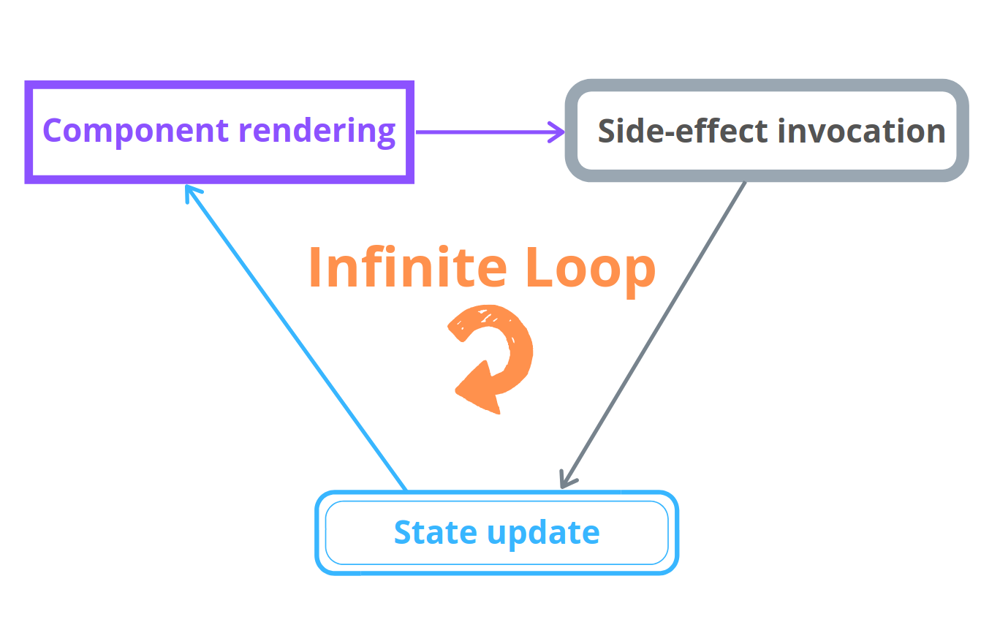

`useEffect()` React hook manages the side-effects. The usual side-effects are the fetching over the network, manipulating DOM directly, starting and ending timers.  

While the `useEffect()` is, alongside with `useState()` (the one that manages state), is one of the most used hooks, it requires 
effort to familiarize and use correctly.  

A pitfall you might experience when working with `useEffect()` is the infinite loop of re-renderings. In this post, I'll describe the common scenarios that generate infinite loops and how to avoid them.  

*If aren't familiar with `useEffect()`, I recommend reading my post [A Simple Explanation of React.useEffect()](/react-useeffect-explanation/) before continuing. Having good fundamental knowledge of a non-trivial subject greatly helps bypass rookie mistakes*.  

## 1. A side-effect updating state

Imagine a simple functional component that contains an input element. What I'd like to do is show on the
screen how much times the input has changed.  

A possible implementation looks as follows:

```jsx{7}
import { useEffect, useState } from 'react';

function CountInputChanges() {
  const [value, setValue] = useState('');
  const [count, setCount] = useState(-1);

  useEffect(() => setCount(count + 1));

  const onChange = ({ target }) => setValue(target.value);

  return (
    <div>
      <input type="text" value={value} onChange={onChange} />
      <div>Number of changes: {count}</div>
    </div>
  )
}
```

`<input type="text" value={value} onChange={onChange} />` is a [controlled component](/controlled-inputs-using-react-hooks/). `value` state variable hold the input value,
and the `onChange` event handler updates the `value` state as the user types into the input.  

I took the decision to update the `count` variable using `useEffect()` hook. Every time the component re-renders due to user typing into the input,
the `useEffect(() => setCount(count + 1))` updates the counter.  

Do you expect any problems with the component? Take a try and open the [demo](https://codesandbox.io/s/infinite-loop-9rb8c?file=/src/App.js). 

The demo shows that `count` state variable increases uncontrollable, even if you haven't typed anything into the input.  

When `useEffect()` is used as such:

```jsx{3}
useEffect(() => setCount(count + 1));
```

it generates an infinite loop of component re-renderings.  

The infinite loop is created because after initial mounting the `useEffect()` invokes the callback `() => setCount(count + 1)`. However, updating the `count` state triggers another re-rendering, which in place triggers another invocation of the `() => setCount(count + 1)`, and so on indefinitely.  

Initial re-rendering triggers side-effect call, the side-effect call triggers a state update, the state update triggers re-rendering, the re-rendering triggers side-effect call, etc.  

