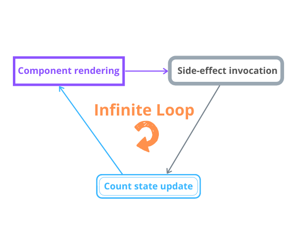
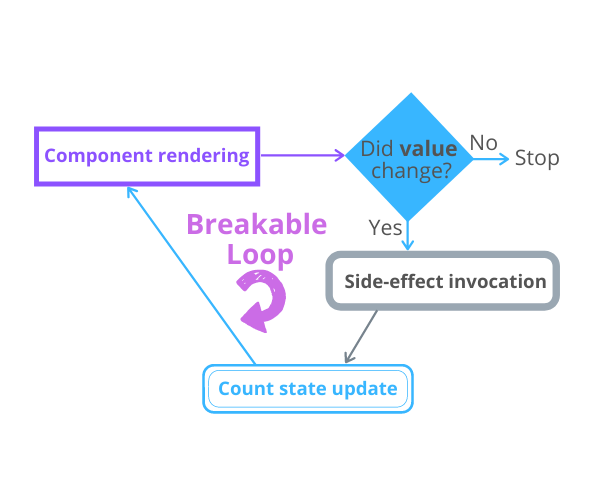
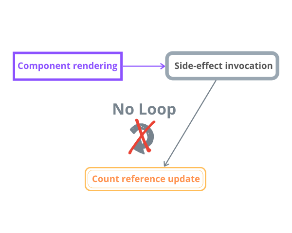

`useEffect()` React hook manages the side-effects. The usual side-effects are the fetching over the network, manipulating DOM directly, starting and ending timers.  

While the `useEffect()` is, alongside with `useState()` (the one that manages state), is one of the most used hooks, it requires 
effort to familiarize and use correctly.  

A pitfall you might experience when working with `useEffect()` is the infinite loop of re-renderings. In this post, I'll describe the common scenarios that generate infinite loops and how to avoid them.  

*If you aren't familiar with `useEffect()`, I recommend reading my post [A Simple Explanation of React.useEffect()](/react-useeffect-explanation/) before continuing. Having good fundamental knowledge of a non-trivial subject helps bypass rookie mistakes*.  

## 1. The infinite loop and side-effect updating state

Imagine a simple functional component that contains an input element. What I'd like to do is show on the
screen how much times the input has changed.  

A possible implementation looks as follows:

```jsx{7}
import { useEffect, useState } from 'react';

function CountInputChanges() {
  const [value, setValue] = useState('');
  const [count, setCount] = useState(-1);

  useEffect(() => setCount(count + 1));

  const onChange = ({ target }) => setValue(target.value);

  return (
    <div>
      <input type="text" value={value} onChange={onChange} />
      <div>Number of changes: {count}</div>
    </div>
  )
}
```

`<input type="text" value={value} onChange={onChange} />` is a [controlled component](/controlled-inputs-using-react-hooks/). `value` state variable hold the input value,
and the `onChange` event handler updates the `value` state as the user types into the input.  

I took the decision to update the `count` variable using `useEffect()` hook. Every time the component re-renders due to user typing into the input,
the `useEffect(() => setCount(count + 1))` updates the counter.  

Do you expect any problems with this component? Take a try and open the [demo](https://codesandbox.io/s/infinite-loop-9rb8c?file=/src/App.js). 

The demo shows that `count` state variable increases uncontrollable, even if you haven't typed anything into the input. That's an infinite loop.

When `useEffect()` is used as such:

```jsx{3}
useEffect(() => setCount(count + 1));
```

it generates an infinite loop of component re-renderings.  

* After initial rendering `useEffect(() => setCount(count + 1))` executes the side-effect callback
* The side-effect callback `() => setCount(count + 1)` updates state
* The state update triggers re-rendering
* After re-rendering `useEffect(() => setCount(count + 1))` executes the side-effect callback
* The side-effect callback `() => setCount(count + 1)` updates state
* The state update triggers re-rendering
* ...and so on indefinitely



### 1.1 Fixing dependencies

The infinite loop is fixed by correct management of the `useEffect(callback, dependencies)` dependencies argument.  

Because you want the `count` to change when `value` changes, you can simply add `value` as a dependency of the side-effect:

```jsx{7}
import { useEffect, useState } from 'react';

function CountInputChanges() {
  const [value, setValue] = useState('');
  const [count, setCount] = useState(-1);

  useEffect(() => setCount(count + 1), [value]);

  const onChange = ({ target }) => setValue(target.value);

  return (
    <div>
      <input type="text" value={value} onChange={onChange} />
      <div>Number of changes: {count}</div>
    </div>
  );
}
```

Adding `[value]` as a dependency of `useEffect(..., [value])`, the `count` state variable is updated only when `[value]` is changed.  



Open the fixed [demo](https://codesandbox.io/s/infinite-loop-fixed-4sgfr?file=/src/App.js). Now, as soon as you type into the input field, the `count` state correctly
display the number of input value changes.  

### 1.2 Using a reference

An alternative to the above solution is to use a reference (created by `useRef()` hook) to store the number of changes of the input. 

The idea is that updating a reference doesn't trigger re-rendering of the component.  

Here's a possible implementation:

```jsx{7}
import { useEffect, useState, useRef } from "react";

function CountInputChanges() {
  const [value, setValue] = useState("");
  const countRef = useRef(0);

  useEffect(() => countRef.current++);

  const onChange = ({ target }) => setValue(target.value);

  return (
    <div>
      <input type="text" value={value} onChange={onChange} />
      <div>Number of changes: {countRef.current}</div>
    </div>
  );
}
```

Thanks to `useEffect(() => countRef.current++)`, after every re-rendering because of `value` change, the `countRef.current` gets incremented.  



Check out the [demo](https://codesandbox.io/s/infinite-loop-fixed-4sgfr?file=/src/App.js). Now, as soon as you type into the input field, the `countRef` reference is updated without triggering a re-rendering &mdash; efficiently solving the infinite loop problem.  

## 2. The infinite loop and new objects references

Even if you setup correctly the `useEffect()` dependencies, still, you have to be careful when using objects as dependencies.  

For example, the following component `CountSecrets` watches the words user types into the input, and as soon as the user types the special word `'secret'`, a counter is increased and showed on the page.  

Here's a possible implementation of the component:

```jsx{8,10}
import { useEffect, useState } from "react";

function CountSecrets() {
  const [secret, setSecret] = useState({ value: "", countSecrets: 0 });

  useEffect(() => {
    if (secret.value === 'secret') {
      setSecret(s => ({...s, countSecrets: s.countSecrets + 1}));
    }
  }, [secret]);

  const onChange = ({ target }) => {
    setSecret(s => ({ ...s, value: target.value }));
  };

  return (
    <div>
      <input type="text" value={secret.value} onChange={onChange} />
      <div>Number of secrets: {secret.countSecrets}</div>
    </div>
  );
}
```

Open the demo and type a few different words, one of which should be `'secret'`. You will notice that as soon as you type the word `'secret'`, the `secret.countSecrets` state variable starts to grow uncontrollable.  

That's an infinite renderings loop problem.  

Let's take a look at how `useEffect()` is configured: the `secret` object is used as a dependency: `useEffect(..., [secret])`. Inside the side-effect callback, as soon as the input value equals `'secret'`, the state updater function is called:

```javascript
setSecret(s => ({...s, countSecrets: s.countSecrets + 1}));
```

which increments the secrets counter `countSecrets`, but also creates *a new object*.  

And because `secret` now is a new object, the `useEffect()` invokes again the side-effect that updates the state and a new `secret` object is created again, and so on.  

### 2.1 Avoid objects as dependencies

## 4. Summary