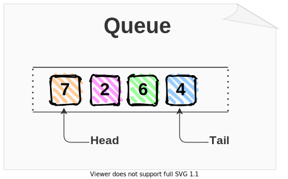
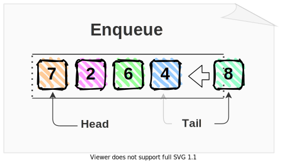
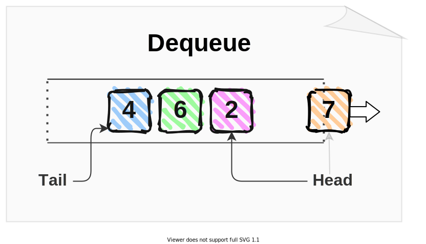
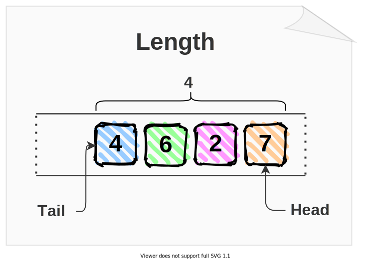

Being a good developer requires knowledge from multiple disciplines.  

The first requirement is to know the programming language of your choice. If you're reading this post, most likely you use JavaScript.  

However, on top of knowing the programming language, you also have to understand how to organize data to easily and effectively manipulate data depending on the task. That's where the data structures come into play.  

In this post, I'm going to describe the queue data structure, what operations it has, as well as present you with a queue implementation in JavaScript.  

## 1. The queue data structure

If you enjoy traveling (like I do), most likely you passed the check-in process at the airport. If there are a lot of travelers willing to check-in, naturally a queue of people is formed at the check-in desk.  


A traveler who just entered the airport and wants to check-in is going to *enqueue* into the queue, and the traveler that has just passed the check-in process at the desk is *dequeued* from the queue.  

This is the real-world example of a queue &mdash; and the queue data structure works the same way.  

The queue is a type of First Input-First Output (FIFO) data structure. The first item enqueued (input) is the first item to dequeue (output). 

Structurally, a queue has 2 pointers. The earliest enqueued item in the queue is situated at the *head*, while the latest enqueued item is situated at the *tail* of the queue.  



## 2. The operations on queues

The queue supports 2 main operations: enqueue and dequeue. Additionally, you might find it useful to have the peek and length operations.  

### 2.1 Enqueue operation

The enqueue operation inserts an item at the tail of the queue. The enqueued item becomes the tail of the queue.  



The enqueue operation in the picture above inserts the item `8` at the tail. `8` becomes the tail of the queue.  

```javascript
queue.enqueue(8);
```

### 2.2 Dequeue operation

The dequeue operation extracts the item at the head of the queue. The next item in the queue becomes the head.  



In the picture above the dequeue operation returns and removes the item `7` from the queue. After dequeue, item `2` becomes the new head.  

```javascript
queue.dequeue(); // => 7
```

### 2.3 Peek operation

The peek operation reads the head of the queue, without altering the queue.  


Item `7` is the head of the queue in the picture above. The peek operation simply returns the head &mdash; the item `7` &mdash; without modifying the queue.  

```javascript
queue.peek(); // => 7
```

### 2.4 Queue length

Length operation counts how many items the queue contains.  



The queue in the picture has 4 items: `4`, `6`, `2`, and `7`.  As result, the queue length is `4`.  

```javascript
queue.length; // => 4
```

### 2.5 Queue operations time complexity

What's important regarding all of the queue operations &mdash; enqueue, dequeue, peek and length &mdash; all these operations must be performed in constant time `O(1)`.   

The constant time `O(1)` means that no matter the size of the queue (it can have 10 or 1 million items): the enqueue, dequeue, peek and length operations must be performed at relatively the same time.  

## 3. Implementing a queue in JavaScript

Let's look at a possible implementation of the queue data structure while maintaining the requirement that all operations must perform in constant time `O(1)`.  

```javascript
class Queue {
  constructor() {
    this.items = {};
    this.headIndex = 0;
    this.tailIndex = 0;
  }

  enqueue(item) {
    this.items[this.tailIndex] = item;
    this.tailIndex++;
  }

  dequeue() {
    const item = this.items[this.headIndex];
    delete this.items[this.headIndex];
    this.headIndex++;
    return item;
  }

  peek() {
    return this.items[this.headIndex];
  }

  get length() {
    return this.tailIndex - this.headIndex;
  }
}

const queue = new Queue();

queue.enqueue(7);
queue.enqueue(2);
queue.enqueue(6);
queue.enqueue(4);

queue.dequeue(); // => 7

queue.peek();    // => 2

queue.length;    // => 3
```

[Try the demo.](https://jsfiddle.net/dmitri_pavlutin/g6pd4hqb/2/)

`const queue = new Queue()` is how you create an instance of a queue. 

Calling `queue.enqueue(7)` method enqueues the item `7` into the queue. 

`queue.dequeue()` dequeues a head item from the queue, while `queue.peek()` just peeks the item at the head. 

Finally, `queue.length` shows how many items are still in the queue.  

Regarding the implementation: inside the `Queue` class the plain object `this.items` keeps the items of the queue by a numerical index. The index of the head item is tracked by `this.headIndex`, and the tail item is tracked by `this.tailIndex`.  

#### *Queue* methods complexity

`queue()`, `dequeue()`, `peek()` and `length()` methods of the `Queue` class use only:

* Property accessors (e.g. `this.items[this.headIndex]`),
* Or perform aritmetical operations (e.g. `this.headIndex++`)

Thus the time complexity of these methods is constant time `O(1)`.  

## 4. Summary

The queue data structure is a type of First Input First Output (FIFO): the earliest enqueued item is the earlies to dequeue.  

The queue has 2 main operations: enqueue and dequeue. Additionally, queues can have helper operations like peek and length.  

All queue operations have to be performed in constant time `O(1)`.  

*Challenge: improve `dequeue()` and `peek()` methods to throw an error if performed on an empty queue. Write your solution in a comment below!*