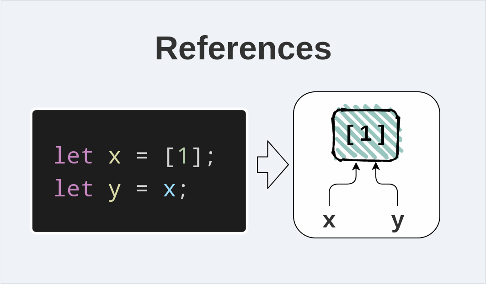

You may have heard that in JavaScript you can pass by value and by reference. Knowing the difference between the two is an important step in working with object in JavaScript.   

Let's find out in this post.  

## 1. Understanding primitive and objects

In JavaScript there 2 main categories of data types: *primitives* and *objects*.  

The primitive category is formed of numbers, booleans, strings, symbols and special values `null` and `undefined`.  

```javascript
// Primitives
const number = 10;

const bool = false;

const str = 'Hello!';

const missingObject = null;

const nothing = undefined;
```

The second important category of types is objects. Particularly the plain JavaScript object, arrays, functions &mdash; are all objects.  

```javascript
// Objects
const plainObject = {
  prop: 'Value'
};

const array = [1, 5, 6];

const functionObject = (n1, n2) => {
  return n1 + n2;
};
```

Hopefully, that short description of the 2 main categories of types in JavaScript.  

## 2. Values

Passing by value means that every time you assign a value to a variable, a copy of that value is created. Every single time. And what's interesting, in JavaScript
the primitives are passed by value.  


Let me show you how pass by value manifests itself.  

Let's say you have 2 variables `a` and `b`:

```javascript
let a = 1;
let b = a;

b = b + 2;

console.log(a); // 1
console.log(b); // 3
```

The first statement `let a = 1` defines a variable `a` initialized with the number `1`.  

The second statement `let b = a` defines another variable `b` and initializes it with the value of `a` variable &mdash; efficiently passing by value. Simpler, a copy of number `1` is assigned to `b`.  

Later, `b = b + 2` increases by `2` the value of `b`. `b` variable becomes `3`, and this change doesn't affect the value of `a` variable which remains `1`.  

## 3. References

The pass by references, however, manifests itself differently.  

When you create an object in JavaScript, you're given a reference to that object. If 2 variables point to the same reference, then reference is reflected in both variables.  



Let's check the following code sample:

```javascript
let x = [1];
let y = x;

y.push(2);

console.log(x); // [1, 2]
console.log(y); // [1, 2]
```

The first statement `let x = [1]` creates an array `[1]`, defines a variable `x`, then assigns to the variable with a reference to the created array.  

Then `let y = x` defines a variable `y`, and assigns to it the references to the array that is stored in `x` variable. This is a pass by reference.  

`y.push(2)` now modifies the array by pushing the item `2` to it. And because `x` and `y` both reference the same array, loggin `x` and `y` shows the same content.  

*Note: for simplicity, I say that variables hold references to objects. However, in JavaScript everthing is a value, so stricter variables hold values thar are references to objects*.

## 4. Comparing values and references

Understanding the difference between values and references is important when you want to compare objects.  

When using the strict comparison operator `===` on values, 2 variables are equal if they have the same value. All of the below comparisons are equal:

```javascript
const one = 1;
const oneCopy = 1;

console.log(one === oneCopy); // true
console.log(one === 1);       // true
console.log(one === one);     // true
```

`one` and `oneCopy` have the same value `1`. The operator `===` evaluates to `true` as longs as both operands are `1`.  

But the comparison operator `===` works differently when comparing references. 2 references are equal only if they reference exactly the same object. 

```javascript
const ar = [1];
const ar2 = ar;
const arCopy = [1];

console.log(ar === arCopy); // false
console.log(ar === [1]);    // false
console.log(ar === ar2);    // true
console.log(ar === ar);     // true
```

Even if `ar` and `arCopy` reference arrays of the same structure, `ar === arCopy` evaluates to `false` because `ar` and `arCopy` reference different arrays.  

The comparison operator returns `true` only when comparing references pointing to the same object: `ar === ar2` or `ar === ar`.  

## 5. Summary

In JavaScript primitive types are values: meaning that each time a value is assigned or used, a copy of that value is created.  

On the other side objects (including plain objects, array, functions, class instances) in JavaScript are references. If you modify the object, then all variables
that reference that object are going to see that change.  

The comparison operator distinghuishes comparing values and references. 2 variables holding references are equal only if they reference exactly the same object, but 2 variables holding values are equal if they simply have 2 same values.  

Often, however, you might want to compare object by their structure rather by reference. Check out the post [How to Compare Objects in JavaScript](/how-to-compare-objects-in-javascript).

