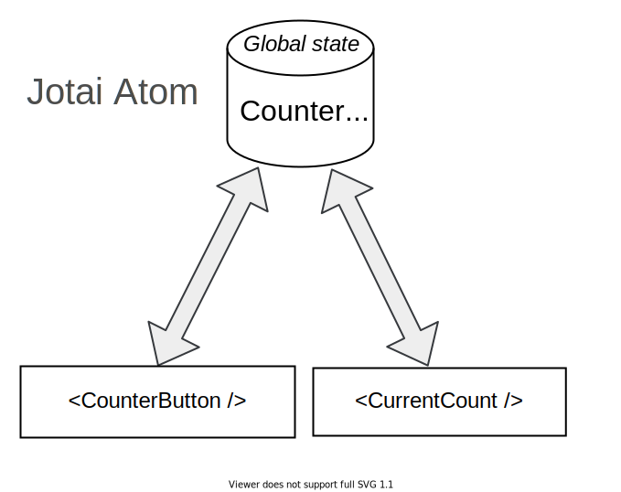
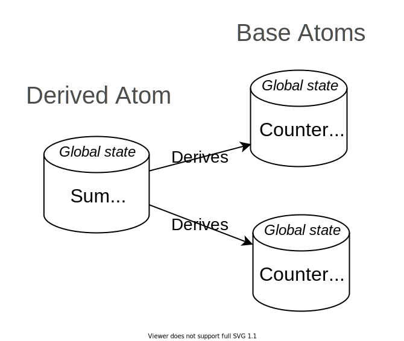

For a long time, Redux had been the leader library of global state management in React. But with the introduction of hooks, I have found that libraries like [react-query](https://react-query.tanstack.com/) or [useSWR()](https://swr.vercel.app/) handle the fetching of data with less boilerplate.  

But the simple UI state like side-menu expand, theme, dark-mode, etc. require separate management &mdash; in which case a simple global state management library like `jotai` (https://github.com/pmndrs/jotai) becomes handy.  

In this post, you will learn how to use `Jotai`.  

```toc
```

## 1. Search query: a global state variable

An application has a header and main content components. The header component has an input field where the user can introduce a search query. The main component should display the search query introduced in the input field.  

Here's the initial sketch of the application:

```jsx
import { useState } from 'react';

function App() {
  return (
    <div>
      <Header />
      <Main />
    </div>
  );
}

function Header() {
  const [search, setSearch] = useState('');
  const handleChange = event => setSearch(event.target.value);
  return (
    <header>
      <input type="text" value={search} onChange={handleChange} />
    </header>
  );
}

function Main() {
  // How to access the search?
  return <main>Search query: ???</main>;
}
```

[Try the demo.](https://codesandbox.io/s/search-query-no-global-state-ppr2c?file=/src/App.js)

`<App>` is composed of 2 components: `<Header>` and `<Main>`.  

`<Header>` is a component that contains an input field where the user introduces a search query.  

`<Main>` is the component that should render the query entered into the input field. How would you access the value here?  

The search query is a global state variable. And `Jotai` library can help you here using a construction named *atom*.  

## 2. Jotai atoms

A piece of state in `Jotai` is represented by an *atom*. An atom accepts an initial value, be it a primitive type like a number, string, or more complex structures like arrays and objects.  

```javascript
import { atom } from 'jotai';

const counterAtom = atom(0);
```

`counterAtom` is the atom that holds the counter state.

But the atom alone doesn't help much. To read and update the atom's state `Jotai` provides a special hook `useAtom()`:

```jsx{3,6}
import { atom, useAtom } from 'jotai';

export const counterAtom = atom(0);

export function CounterButton() {
  const [count, setCount] = useAtom(counterAtom);

  const handleClick = () => {
    setCount(number => number + 1); // Increment number
  };

  return (
    <div>
      {count}
      <button onClick={handleClick}>Increment</button>
    </div>
  );
}
```

[Try the demo.](https://codesandbox.io/s/jotai-atom-2ueh3?file=/src/App.js)

`const [count, setCount] = useAtom(counterAtom)` returns a tuple where the first item is the value of the state, and the second is a state updater function.  

`count` contains the atom's value, while `setCount()` can be used to update the atom's value. 

The selling point of atoms is that you can access the same atom from multiple components. If a component updates the atom, then all the components that read this atom are updated. This is the global state management!  

For example, let's read `counterAtom` value in an another component `<CurrentCount>`:

```jsx{5}
import { useAtom } from 'jotai';
import { counterAtom } from './Button';

function CurrentCount() {
  const [count] = useAtom(counterAtom);

  return <div>Current count: {count}</div>;
}
```

[Try the demo.](https://codesandbox.io/s/jotai-atom-shared-iq6td?file=/src/App.js)

When the value of `counterAtom` changes (due to counter increment), then both components `<CounterButton>` and `<CurrentCount>` are going to re-render.  



What's great about `useAtom(atom)` hook keeps the same API as the built-in `useState()` hook &mdash; which also returns a tuple of state value and an updater function.  

### 2.1 Search query atom

Now let's return to the problem of section 1: how to share the search query from the `<Header>` component in `<Main>` component.  

You might already see the solution: let's create an atom `searchAtom` and share it between `<Header>` and `<Main>` components:  

```jsx{13,16,26}
import { useState } from 'react';
import { atom, useAtom } from 'jotai';

function App() {
  return (
    <div>
      <Header />
      <Main />
    </div>
  );
}

const searchAtom = atom('');

function Header() {
  const [search, setSearch] = useAtom(searchAtom);
  const handleChange = event => setSearch(event.target.value);
  return (
    <header>
      <input type="text" value={search} onChange={handleChange} />
    </header>
  );
}

function Main() {
  const [search] = useAtom(searchAtom);
  return <main>Search query: "{search}"</main>;
}
```

[Try the demo.](https://codesandbox.io/s/search-query-global-state-rp1lr?file=/src/App.js)

`const searchAtom = atom('')` creates the atom that's going to hold the search query global state variable.  

Inside of the `<Header>` component `const [search, setSearch] = useAtom(searchAtom)` returns the current search value, as well as the updater function.  

As soon as the user types into the input field, `handleChange()` event handler updates the atom value: `setSearch(event.target.value)`.  

`<Main>` component can also access the `searchAtom` value: `const [search] = useAtom(searchAtom)`. And when the atom's value changes due to the user typing into the input, `<Main>` component is updated to receive the new value.  

In conclusion, atoms are global state pieces that can be accessed and modified by any component.  

## 3. Jotai derived atoms

If you find yourself calculating data from an atom's value, then you may find useful the *derived atoms* feature of `Jotai`.  

You can create a derived atom when supplying a callback function to `atom(get => get(myAtom))`: in which case `Jotai` invokes the callback with a getter function `get` from where you can extract the value of the base atom `get(myAtom)`.  

```javascript{4}
import { atom } from 'jotai';

const numberAtom = atom(2);
const isEvenAtom = atom(get => get(baseAtom) % 2 === 0); 
```

In the example above `numberAtom` holds a number. `isEvenAtom` is a derived atom that determines whether the number stored in `numberAtom` is even.  


Of course, as soon as the base atom changes, the derived atom changes too.  

For example, let's create `isNameEmptyAtom` derived atom that determines the string stored in `nameAtom` is empty:

```jsx{4,8}
import { atom, useAtom } from 'jotai';

const nameAtom = atom('Batman');
const isNameEmptyAtom = atom(get => get(nameAtom).length === 0);

function HeroName() {
  const [name, setName] = useAtom(nameAtom);
  const [isNameEmpty] = useAtom(isNameEmptyAtom);

  const handleChange = event => setName(event.target.value);

  return (
    <div>
      <input type="text" value={name} onChange={handleChange} />
      <div>Is name empty: {isNameEmpty ? 'Yes' : 'No'}</div>
    </div>
  );
}
```

[Try the demo.](https://codesandbox.io/s/derived-atoms-eqs7w?file=/src/App.js)

What's even better is that you can create a derived atom from multiple base atoms!

```javascript
import { atom } from 'jotai';

const counterAtom1 = atom(0);
const counterAtom2 = atom(0);

const sumAtom = atom((get) => get(counterAtom1) + get(counterAtom2));
```

`sumAtom` is derived from 2 base atoms: `counterAtom1` and `counterAtom2`.  



## 4. Conclusion

I like `Jotai` for its minimalistic but flexible way to manage a simple global state.  

To create a global state variable you need 2 steps:  

A) Define the atom for your global state variable: 

```javascript
const myAtom = atom(<initialValue>);
```

B) Then access the atom's value and updater function inside of the component using the special hook `useAtom(<atom>)`:

```jsx
function MyComponent() {
  const [value, setValue] = useAtom(myAtom);
  // ...
}
```

I found that `Jotai` fits well to manage simple global variables, as a complement to asynchronous state management libraries like `react-query` and `useSWR()`.    

The post has described the basic functionality of `Jotai`. Visit the repository https://github.com/pmndrs/jotai to read about all the features.  

*Would you use `Jotai` to manage simple global state variables? What features, in your opinion, this library is still missing?*