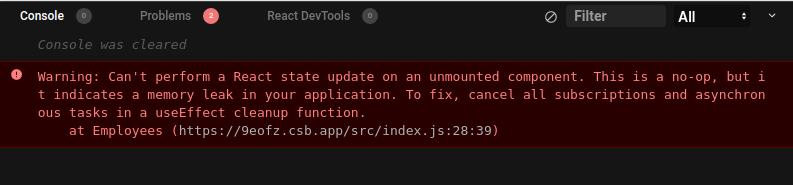

The common asynchronous side effects are: performing fetch requests to load data from a remote server, handle timers like `setTimeout()`, debounce or throttle functions, etc.    

Handling the side effects in React is a medium-complexity task. However, from time to time you might find some difficulties that are at the intersection of component lifecycle and the side effect lifecycle.  

One such difficulty is when a side-effect, which completes after a component unmounts, tries to update the state with the result of the side-effect. That often leads to a known warning by React:

```
Warning: Can't perform a React state update on an unmounted component.
```

In this post, I'll show you when the above warning appears and how to correctly clean up side effects in React.  

## 1. State update after unmounting

Let's reproduce the state update after unmounting the problem in a simple example.  

An application shows information about a local restaurant. The first page displays the list of employees (waiters, kitchen staff), and the second page shows textual information.  

```jsx
import { useState, useEffect } from 'react';

function Employees() {
  const [list, setList] = useState(null);

  useEffect(() => {
    (async () => {
      try {
        const response = await fetch('/employees/list');
        setList(await response.json());
      } catch (e) {
        // Some fetch error
      }
    })();
  }, []);

  return (
    <div>
      {list === null ? 'Fetching employees...' : ''}
      {list?.map(name => <div>{name}</div>)}
    </div>
  );
}

function About() {
  return (
    <div>
      <p>Our restaurant is located ....</p>
    </div>
  );
}
```

The `<App>` component wires toghether `<Employees>` and `<About>` components:

```jsx
import { useState } from 'react';

function App() {
  const [page, setPage] = useState('employees');

  const showEmployeesPage = () => setPage('employees');
  const showAboutPage = () => setPage('about');

  return (
    <div className="App">
      <h2>My restaurant</h2>
      <a href="#" onClick={showEmployeesPage}>Employees Page</a>
      <a href="#" onClick={showAboutPage}>About Page</a>
      {page === 'employees' ? <Employees /> : <About />}
    </div>
  );
}
```

[Try the demo.](https://codesandbox.io/s/side-effect-cleanup-broken-9eofz?file=/src/index.js)

Open the [demo](https://codesandbox.io/s/side-effect-cleanup-broken-9eofz?file=/src/index.js) application. You will see that right away the list of employees is being fetched. The request takes about 3 seconds.  

Now refresh the web page, and before the employees' fetching completes, click the `About Page` link. Then open the console, and notice that React has thrown a warning:



The reason for this warning is `<Employees>` component has already been unmounted (recall that you've clicked "About Page" link and `<About />` component has been rendered). But still, the side effect of fetching employees list completes, and React is asked to update the state of an unmounted component.  

```jsx{8-9}
function Employees() {
  const [list, setList] = useState(null);

  useEffect(() => {
    (async () => {
      try {
        const response = await fetch('/employees/list');
        // Updating the state of an unmounted component
        setList(await response.json());
      } catch (e) {
        // Some fetch error
      }
    })();
  }, []);
  
  // ...
}
```

What would be the solution to this issue? As the warning suggests, you need to cancel any active asynchronous tasks if the component unmounts. Let's see how to do that in the next section.    

### 2. Cleanup the fetch request

In the case of using `useEffect()` hook, you need to return from the effect callback a special [cleanup function](/react-useeffect-explanation/#6-the-side-effect-cleanup) that's going to be executed right after the component is unmounted.  

```javascript{4-6}
function MyComponent() {
  useEffect(() => {
    // Side-effect logic...
    return () => {
      // Side-effect cleanup
    };
  }, []);

  // ...
}
```

Also, in order to [cancel](/javascript-fetch-async-await/#4-canceling-a-fetch-request) an active fetch request, then you need to use an `AbortController` instance.  

Now let's use the 2 above ideas and fix the `<Employees>` component to correctly handle the cleanup of the fetch async effect:

```jsx{7,11,19}
import { useState, useEffect } from 'react';

function Employees() {
  const [list, setList] = useState(null);

  useEffect(() => {
    let controller = new AbortController();
    (async () => {
      try {
        const response = await fetch('/employees/list', {
          signal: controller.signal
        });
        setList(await response.json());
        controller = null;
      } catch (e) { 
        // Handle fetch error
      }
    })();
    return () => controller?.abort();
  }, []);

  return (
    <div>
      {list === null ? 'Fetching employees...' : ''}
      {list?.map(name => <div>{name}</div>)}
    </div>
  );
}
```

[Try the demo.](https://codesandbox.io/s/side-effect-cleanup-fixed-qc20u?file=/src/index.js)

`let controller = new AbortController()` creates an instance of the abort controller. Then `await fetch(..., { signal: controller.signal })` connects the controller with the fetch request.  

Finally, the `useEffect()` callback returns a cleanup function `() => controller?.abort()` that aborts the request in case if the component umounts.  

Open the [demo](https://codesandbox.io/s/side-effect-cleanup-fixed-qc20u?file=/src/index.js) and click right away the `About Page`, before the employees fetch request completes. Now if you check the console, there aren't going to be any warnings: because the fetch request is aborted when `<Employess>` component unmounts.  

## 3. Common side-effects that need cleanup

There are some common side-effects that you invoke inside of React components that are recommended to cleanup. Let's see them.  

### 3.1 Fetch requests

As already mentioned, it is recommended to abort the fetch request in case if the component unmounts.  

```jsx{7,11,19}
import { useState, useEffect } from 'react';

function MyComponent() {
  const [value, setValue] = useState();

  useEffect(() => {
    let controller = new AbortController();
    (async () => {
      try {
        const response = await fetch('/api', {
          signal: controller.signal
        });
        setValue(await response.json());
        controller = null;
      } catch (e) { 
        // Handle fetch error
      }
    })();
    return () => controller?.abort();
  }, []);

  // ...
}
```

You can find more [here](/javascript-fetch-async-await/#4-canceling-a-fetch-request) about properly cancelling fetch requests.  

### 3.2 Timer functions

In case if you're using `setTimeout()` or `setInterval()` timer functions, it's almost always a good idea to clear them on unmount using the special `clearTimeout()` function.  

```jsx{11}
import { useState, useEffect } from 'react';

function MyComponent() {
  const [value, setValue] = useState();

  useEffect(() => {
    let timerId = setTimeout(() => {
      setValue('State value');
      timerId = null;
    }, 3000);
    return () => clearTimeout(timerId);
  }, []);

  // ...
}
```

### 3.3 Debounce and throttle

When debouncing or throttling event handlers in React, you may also want to make sure to clear any scheduled call of the debounced or throttled functions.  

Usually the debounce and throttling implementions (like `lodash.debounce` and `lodash.throttle`) provide a special method `cancel()` that you can call to stop the scheduled execution:

```jsx{14}
import { useState, useEffect } from 'react';
import throttle from 'lodash.throttle'

function MyComponent () {
  useEffect(() => {
    const handleResize = throttle(() => {
      // Handle window resize...
    }, 300);

    window.addEventListener('resize', handleResize);

    return () => {
      window.removeEventListener('resize', handleResize);
      handleResize.cancel();
    };
  }, []);

  // ...
}
```

### 3.4 Web sockets

Another candidate to obligatory cleanup on component unmount are the [web sockets](https://developer.mozilla.org/en-US/docs/Web/API/WebSockets_API).  

```jsx{11}
import { useState } from 'react';

function MyComponent() {
  const [value, setValue] = useState();

  useEffect(() => {
    const socket = new WebSocket("wss://www.example.com/ws");
    socket.onmessage = (event) => {
      setValue(JSON.parse(event.data));
    };
    return () => socket.close();
  }, []);

  // ...
}
```

## 4. Conclusion

A good way to handle the async effects is to properly clean them when the component unmounts. 

Depending on the type of the side-effect (fetch request, timeout, etc) usually, you should just return a cleanup function from the `useEffect()` callback that is going to clean the side-effect.  

```javascript{4-6}
function MyComponent() {
  useEffect(() => {
    // Side-effect logic...
    return () => {
      // Side-effect cleanup...
    };
  }, []);

  // ...
}
```

*What other async effects that need cleanup do you know? Write a comment below!*