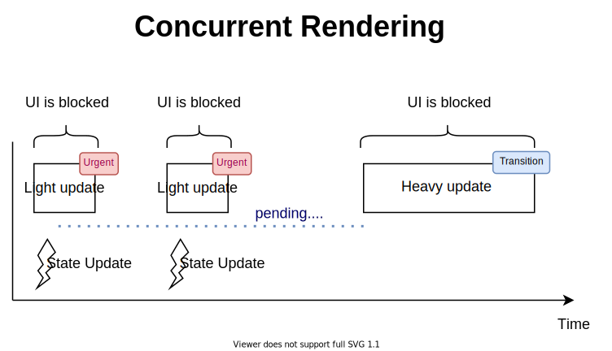

There are UI updates that should be performed as quickly as possible (typing into an input field, selecting a value from dropdown), while others have less priority (filtering a list).  

Until now, React hasn't provided a built-in tool to prioritize UI updates.  

Fortunately, starting React 18 (which is in alpha as June 2021) you can enable the concurrent mode, which allows you to make
UI updates more precise by manually indicating tasks that are heavy and less priority.  

In this post, you'll learn when to use the new `useTransition()` hook to make the UI more responsive when performing heavy updates.  

## 1. *useTransition()* hook

By default, all updates in React are considered urgent. React doesn't distinguish if certain UI updates must be performed right away or postponed. That could create a problem when quick updates are slowed down by heavy updates.    


However, starting React 18 and the new concurrent features, you can tell React to mark some updates as non-urgent &mdash; as transitions. That's especially useful with heavy UI updates, like filtering a big list.  



`useTransition()` is a hook that lets you access concurrent mode features inside of the React component.  

Invoking `const [isPending, startTransition] = useTransitionHook()` returns an array of 2 items:

* `isPending`: indicates that the transition is pending
* `startTransition(callback)`: allows you to mark what updates inside `callback` to be considered as transitions.  

```jsx{4,8-11}
import { useTransition } from 'react';

function MyComponent() {
  const [isPending, startTransition] = useTransition();
  // ...

  const someEventHandler = (event) => {
    startTransition(() => {
      // Mark updates as transitions, or non-urgent
      setValue(event.target.value);
    });
  }

  return <HeavyComponent value={value} />;
}
```

In order to use `useTransition()` hook, make sure to [enable the concurrent mode](https://github.com/reactwg/react-18/discussions/5).  

## 2. Heavy UI updates as urgent

Let's consider an example when all updates are considered urgent, and how does it affect the user experience.      

You have a list of employee names, as well as an input field where the user introduces a query. The component should highlight in the employee names the query matchings.  

Here's a possible implementation:

```jsx
import { useState } from 'react';

export function FilterList({ names }) {
  const [query, setQuery] = useState('');

  const changeHandler = ({ target: { value } }) => setQuery(value);

  return (
    <div>
      <input onChange={changeHandler} value={query} type="text" />
      {names.map((name, i) => (
        <ListItem key={i} name={name} highlight={query} />
      ))}
    </div>
  );
}

function ListItem({ name, highlight }) {
  const index = name.toLowerCase().indexOf(highlight.toLowerCase());
  if (index === -1) {
    return <div>{name}</div>;
  }
  return (
    <div>
      {name.slice(0, index)}
      <span className="highlight">
        {name.slice(index, index + highlight.length)}
      </span>
      {name.slice(index + highlight.length)}
    </div>
  );
}
```

[Try the demo.](https://codesandbox.io/s/heavy-update-as-urgent-ejwbg?file=/src/FilterList.js)

`<FilterList names={names} />` accepts a big array of names. Inside of the component, `query` is the state variable that contains the query string. The input field is a [controlled
component](/controlled-inputs-using-react-hooks/) that updates `query` state variable when the user types.  

Open the [demo]((https://codesandbox.io/s/heavy-update-as-urgent-ejwbg?file=/src/FilterList.js)) and quickly type a query into the input field. You would notice typing lags and the UI feels unresponsive for noticeable periods.  

Why does it happen, and how to solve it?

Updating the input field value when the user types is an urgent task that must perform fast. However, updating the list by highlighting the matches is a heavy but non-urgent task.  

*The heavy non-urgent task slows down the light urgent task.*

`useTransition()` hook can help you separate urgent from non-urgent UI updates.  

## 3. Heavy UI updates as transitions

As already mentioned, you can use `useTransition()` hook to let know React which UI updates are urgent (like updating the input field value), and which are non-urgent transitions (like updating the names list to highlight the query).  

Let's make the necessary adjustments to `<FilterList>` component.  

First, let's invoke the `[isPending, startTransition] = useTransition()` hook to get access to `startTransition()` function. Secondly, let's create a duplicate state that'll hold the query state value.  

```jsx{5,7,11}
import { useState, useTransition } from 'react';

export function FilterList({ names }) {
  const [query, setQuery] = useState('');
  const [highlight, setHighlight] = useState('');

  const [isPending, startTransition] = useTransition();

  const changeHandler = ({ target: { value } }) => {
    setQuery(value);
    startTransition(() => setHighlight(value));
  };

  return (
    <div>
      <input onChange={changeHandler} value={query} type="text" />
      {names.map((name, i) => (
        <ListItem key={i} name={name} highlight={highlight} />
      ))}
    </div>
  );
}
```

[Try the demo.](https://codesandbox.io/s/heavy-update-as-non-urgent-ifobc?file=/src/FilterList.js)

Open the [demo](https://codesandbox.io/s/heavy-update-as-non-urgent-ifobc?file=/src/FilterList.js) using transitions feature. If you type quickly a query into the input field, you would notice a delay in highlighting the query inside the list. 

React has separated the rendering of the urgent task (updating the input field when the user types) from the non-urgent task (highlighting the query inside the list).  

## 4. Conclusion

The concurrent mode in React lets you separate urgent from non-urgent tasks, making the UI updates more precise and user-friendly.  

After [enabling](https://github.com/reactwg/react-18/discussions/5) the new React 18 concurrent mode, you can use the `useTransition()` hook to access `startTransition(callback)` function. 

`startTransition(callback)` let's you mark certain heavy updates as transitions:

```javascript
const [isPending, startTransition] = useTransition();

startTransition(() => {
  // Mark updates as transitions
  setStateValue(newValue);
});
```

*Side challenge: is it possible to use `useDeferredValue()` hook to get rid of the duplicate state `highlight` in `<FilterList>`? If so, write your solution in a comment below!*