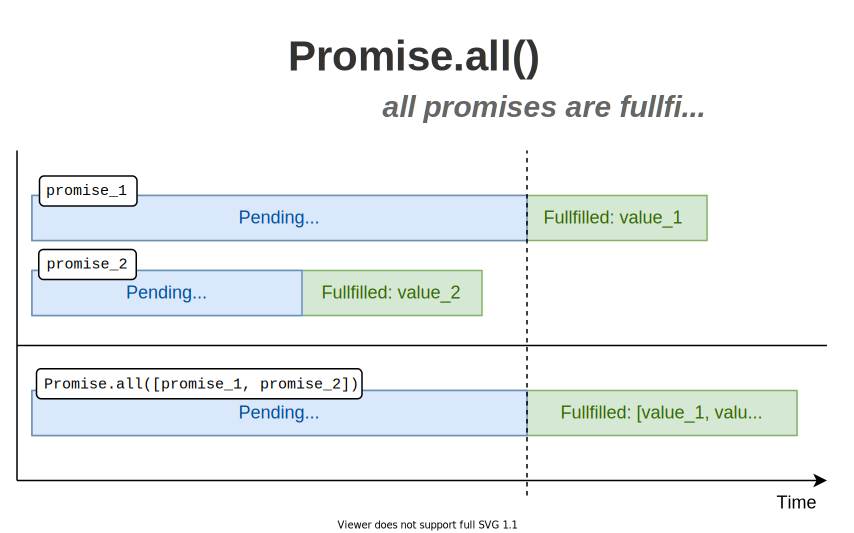

In simple words, a promise is a placeholder for a value that's going to be available some time later. More techically, a promise is an object which allows you to access the result of an asynchornous operation. 

Sometimes, however, you'd like to perform in parallel and agreggate the result of multiple promises. For example, you'd like to fetch simultaniously the list of categories and products.   

JavaScript provides a helper funcion `Promise.all(promisesArrayOrIterable)` that allows you to starts multiple promises at once, in parallel, and then get the result in a single agreggate array.   

Before starting, here's a quick reminder of the 3 states of a promise during its lifecycle:

* Just created promise is in the *pending* state  
* If the operation behind the promise completes successfully, the promise enters in the *fullfilled* state, and you can access the value   
* Otherwise, if an error ocurred, the promise gets into *rejected* state.  

## 1. Promise.all()

`Promise.all()` is a built-in helper function that accepts an array of promises (or generally an iterable). The function returns a promise:  

```javascript
const allPromise = Promise.all(promisesArrayOrIterable);
```

The interesting part is in the way the promise returned by `Promise.all()` gets fullfilled or rejected.  

<u>If all promises get fullfilled</u>, then `allPromise` fullfills with an array of the fullfilled values of individual promises.



<u>But if at least one promise rejects</u>, then `allPromise` rejects right away (without waiting other promises to complete) with the same reason as the rejected promise rejects.  


Let's see in a couple of examples how you can use `Promise.all()` to perform multiple async operation at once. As mentioned above, `Promise.all()` has mainly 2 outcomes: resolving with an array of all promises, or reject with the first rejected promise.  

## 2. Example: all promises fullfilled

For example, a remote API allows you to fetch products and categories of products.  

## 3. Example: one promise rejects

## 4. Conclusion