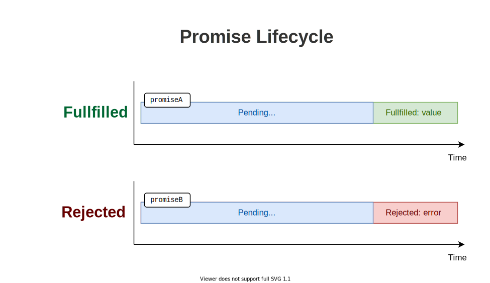

I had had difficulties in understanding promises when I had been learning them back in a few years. 

The problem was that most of the tutorials were solely describing the promise object, its methods, etc. I don't care too much about promises, I care about
them as long as they make coding easier!  

What follows is the post that I had wanted to read to understand promises myself. The post shows how promises make your life easier when coding asynchronous logic.  

## 1. Why promises

JavaScript works well with imperative and synchronous code.  

<div id="sync-code"></div>

```javascript
function getList() {
  return ['Joker', 'Batman'];
}

function findPerson(who) {
  const list = getList();

  const found = list.some(person => person === who);

  console.log(found);
}

findPerson('Joker'); // logs true
```

The snippet above is synchronous and blocking code. When JavaScript enters into `findPerson()` function, it doesn't get out of there
until the function is executed.   

Getting the list of persons `const list = getList()` is a synchronous operation too.  

Until now, everything seems easy and straighforward.  

But what would happen if accessing the list of persons `getList()` is an operation that requires, for example, 1 second. Unfortunately, now the things become more complicated.  

```javascript{3,8}
function getList() {
  setTimeout(() => {
    ['Joker', 'Batman'] // How to return the list?
  }, 1000);
}

function findPerson(who) {
  const list = /* How to access the list? */;

  const found = list.some(person => person === who);

  console.log(found);
}

findPerson('Joker'); // logs true
```

How to return the list of persons from `getList()` with a delay of 1 second? Same way, how would `findPerson(who)` access the list of persons that's returned with a delay?  

### 1.1 The callbacks approach

One classic approach would be to introduce callbacks:

```javascript
function getList(callback) {
  setTimeout(() => callback(['Joker', 'Batman']), 1000);
}

function findPerson(who) {
  getList(list => {
    const found = list.some(person => person === who);

    console.log(found);
  });
}

findPerson('Joker'); // logs true
```

The callbacks approach works. But what is the price? 

`getList(callback)` become more complex because they need one more argument: the callback.  

Callbacks approach code is hard to follow because the computations flow is hidden in between callbacks. Compare this code with the [synchronous code snippet](#sync-code): which is clearly easier to understand.  

While callbacks have their good place in JavaScript, still, let's find a better solution.  

### 1.2 An object encapsulating the operation result

I like the synchornous code because it is easy to understand. You see line by line how the code is executed.  

How to code asynchronous operations, while still preserving the readability of synchronous code? 

What about returning from `getList()` the *kind-of list of persons*?  

This *kind-of list of persons* is then *kind-of checked if contains `who`*, and then *a kind-of boolean value* is returned. And what's great is that these *kind-of* results can be returned, assigned to variables just like regular objects.  

This *kind-of result* object that encapsulates (aka holds, manages, contains) the result of an asynchronous operation is a *promise of a result* object. 

There isn't anything special about the promise object: it is still the result, just wrapped in a promise because you can't have the result right now, but sometime later.  

*The main idea of promises is to allow returning data wrapped in a promise ("kind-of data") from an asynchornous function exactly like from a synchronous one, because the synchornous code is easy to understand.*

## 2. What is a promise

> *A promise* is an object that encapsulates the result of an asynchronous operation.

Each promise has a state, which can be one of the following values:

* *Pending*
* *Fullfilled* with a <u>value</u>
* *Rejected* for a <u>reason</u>

When the promise has just been created, it is in the *pending* state. The promise maintains the *pending* state as long as the asynchronous operation behind the promise is in progress.  

Then, depending on the asynchronous operation completion, the promise state changes to either *fullfilled* (when the async operation completed successfully) or *rejected* (when then async operation failed).  



In JavaScript, you can create a promise object using a special constructor `Promise`:  

```javascript
const promise = new Promise((resolve, reject) => {
  // Async operation logic here....
  if (asyncOperationSuccess) {
    resolve(value); // async operation successful
  } else {
    reject(error);  // async operation error
  }
});
```

`Promise` constructor accepts a special function that should encapsulate the logic of the asynchronous operation. 

In the special function, after the completion of the operation, you have to call either:

1) If the async operation completed sucessfully, call `resolve(value)` (that would change the state of the promise to *fullfilled*)
2) Otherwise, in case of an error, call `reject(error)` (that would change the state of the promise to *rejected*)

Let's make a pause from promises dry theory and get back to the persons example.  

Like I mentioned before, I want the function `getList()` to return a *kind-of persons* which should encapsulate accessing the list of persons with a delay of 1 second.  

It can be easily implemented using a promise:

```javascript
function getList() {
  return new Promise(resolve => {
    setTimeout(() => resolve(['Joker', 'Batman']), 1000);
  });
}
```

`getList()` creates and returns a promise. Inside of the promise, after passing 1 second, calling `resolve(['Joker', 'Batman'])` effectively makes the promise *fulfill* with the list of persons.  

### 2.1 Extracting the promise fullfill value

Now you can ask me a reasonable question: how can I access the value from a promise?  

The promise object allows extracting the fullfill value using a special method: `promise.then(successCallback)`.  

Here's for example how you can get access to the value of the promise returned by `getList()`:

```javascript{10-12}
function getList() {
  return new Promise(resolve => {
    setTimeout(() => resolve(['Joker', 'Batman']), 1000);
  });
}

const promise = getList();

promise
  .then(value => {
    console.log(value); // logs ['Joker', 'Batman']
  });
```

### 2.2 Extracting the promise rejection error

Same way, if the operation completed with an error and the promise rejects, you can access the rejection error using a special method `promise.catch(errorCallback)`.  

For example, let's imagine that accessing the list of persons ends in an error:

```javascript{10-12}
function getList() {
  return new Promise((resolve, reject) => {
    setTimeout(() => reject(new Error('Nobody here!')), 1000);
  });
}

const promise = getList();

promise
  .catch(error => {
    console.log(error); // logs Error
  });
```

## 3. Chain of promises

The result of an asynchornous operation is used in another asynchornous operation.  

For example, let's imagine that in the the persons searching example the person to search is also a result of an asynchronous operation.  

Here's how it would work when using promises:

```javascript
function getList() {
  return new Promise(resolve => {
    setTimeout(() => resolve(['Joker', 'Batman']), 1000);
  });
}

function findPerson(who) {
  getList()
    .then(list => {
      return list.some(person => person === who);
    })
    .then(found => {
      console.log(found);
    });
}

findPerson('Joker'); // logs true
```

## 4. *async/await*

While looking at the previous code sample that use promises, you might wonder &mdash; *Hey, using promises still requires callbacks and relatively lots of boilerplate code like `.then()`, `.catch()`.*  

Your observation would be reasonable.  

Fortunately, JavaScript made a step forward in improving even better the asynchornous code by providing the `async/await` syntax: which is a really useful syntactic sugar on top of promises.  

When possible, I highly recommend working with `async/await` syntax rather than dealing with raw promises.  

Let's write down the asynchornous access of the list of persons using the promises:

```javascript
function getList() {
  return new Promise(resolve => {
    setTimeout(() => resolve(['Joker', 'Batman']), 1000);
  });
}

function findPerson(who, callback) {
  getList()
    .then(list => {
      const found = list.some(person => person === who);

      console.log(found);
    });
}

findPerson('Joker'); // logs true
```

Let's reduce this code by applying the `async/await` syntax, which is relatively easy:

* If you want a function to become asynchronous and handle promises, then mark it as `async`
* Inside of the `async` function body, whether you want to wait for a promise to resolve, use `await promiseExpression` syntax.  

Now let's apply these rules to the previous code snippet:

```javascript{7,8}
function getList() {
  return new Promise(resolve => {
    setTimeout(() => resolve(['Joker', 'Batman'], 1000);
  });
}

async function findPerson(who) {
  const list = await getList();

  const found = list.some(person => person === who);

  console.log(found);
}

findPerson('Joker'); // logs true
```

Now if you look at the `async` `findPerson()` function, you would notice how similar it is to the synchornous version of that function from the beginning of the post!

## 5. Conclusion

The promise is a placeholder holding the result of an asynchornous operation. If the operation completes successfully, then the promise *fulfills* with the operation value, but if the operation fails: the promise *rejects* with the reason of the failing.  