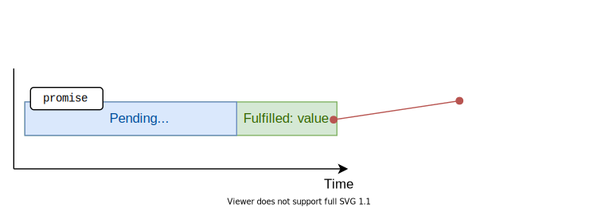
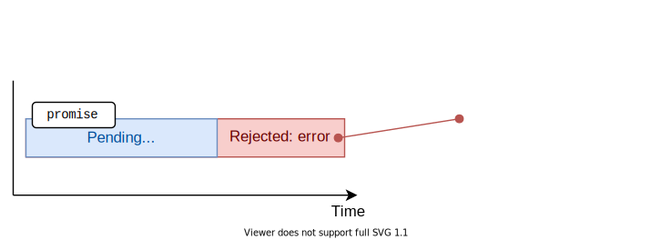

I had had difficulties in understanding promises when I had been learning them back in a few years. 

The problem was that most of the tutorials were solely describing the promise object, its methods, etc. But I don't care much about promises, I care about
them as long as they make coding easier!  

What follows is the post that I had wanted to read to understand promises myself. The post describes why promises make coding asynchronous logic easier, then explains how to use promises properly, including with the `async/await` syntax.  

```toc
```

## 1. Why promises

JavaScript works well with imperative and synchronous code.  

Let's consider a function `findPerson(who)` that determines whether a person name is contained in a list of persons:

<div id="sync-code"></div>

```javascript
function getList() {
  return ['Joker', 'Batman'];
}

function findPerson(who) {
  const list = getList();

  const found = list.some(person => person === who);

  console.log(found); // logs true
}

findPerson('Joker');
```

[Try the demo.](https://codesandbox.io/s/ancient-dawn-j6jbq?file=/src/index.js)

The snippet above is synchronous and blocking. When JavaScript enters into `findPerson()` function, it doesn't get out of there until the function is executed.   

Getting the list of persons `const list = getList()` is a synchronous operation too.  

Synchronous code is straightforward. But you don't always have the luck to access data instantly: some data, like fetching data over the network, could take a while to be available.  

For example, let's say that accessing the list of persons from `getList()` is an operation that requires, for example, 1 second.  

```javascript{3,8}
function getList() {
  setTimeout(() => {
    ['Joker', 'Batman'] // How to return the list?
  }, 1000);
}

function findPerson(who) {
  const list = /* How to access the list? */;

  const found = list.some(person => person === who);
  console.log(found);
}

findPerson('Joker'); // logs true
```

How to return the list of persons from `getList()` with a delay of 1 second? Same way, how would `findPerson(who)` access the delayed list?  

Unfortunately, now things have become more complicated. Let's see a few solutions how to code the delayed list.  

### 1.1 The callbacks approach

One classic approach would be to introduce callbacks:

```javascript
function getList(callback) {
  setTimeout(() => callback(['Joker', 'Batman']), 1000);
}

function findPerson(who) {
  getList(list => {
    const found = list.some(person => person === who);
    console.log(found); // logs true
  });
}

findPerson('Joker');
```

[Try the demo.](https://codesandbox.io/s/elated-jones-mflcv?file=/src/index.js)

`getList(callback)` becomes more complex because it needs one more argument: the callback function. 

Also, inside `findPerson(who)` you have to supply a callback `getList(list => { ... })` to access the list properly.  

The code using callbacks is more difficult to follow because the flow of the computation is hidden in between callbacks. If you'd need to manage many asynchronous operations using callbacks, you could quickly end with the [callback hell](http://callbackhell.com/) problem.  

While callbacks have their good place in JavaScript, still, let's find a better solution.  

### 1.2 Encapsulating asynchronicity

Synchronous code is easy to understand. You see line by line how the code is executed.  

How to code asynchronous operations, while still preserving the readability of synchronous code?  

What about returning from `getList()` a *kind-of list of persons*?  

This *kind-of list of persons* is then *kind-of checked if contains `who`*, and then the boolean value is logged to console. What's great is that these *kind-of* results can be returned, assigned to variables just like regular objects.  

This *kind-of result* object that encapsulates (aka holds, manages, contains) the result of an asynchronous operation is a *promise* object.  

> Promises, wrapping the asynchronous operation result, can be returned synchronously from a function, assigned to variables, or used as arguments. That's the idea of promises: encapsulate the asynchronicity and allow function handling asynchronous operations to still look synchronous.  

## 2. What is a promise

> *A promise* is an object that encapsulates the result of an asynchronous operation.

Each promise has state, which can have one of the following values:

* *Pending*
* *Fullfilled* with a <u>value</u>
* *Rejected* for a <u>reason</u>

The just created promise is in a *pending* state. The promise maintains the *pending* state as long as the asynchronous operation behind is in progress.  

Then, depending on how the asynchronous operation completes, the promise state changes to either:

A) *fulfilled* (when the async operation completed successfully)


 
B) or *rejected* (when then async operation failed).  


In JavaScript, you can create a promise object using a special constructor `Promise`:  

```javascript
const promise = new Promise((resolve, reject) => {
  // Async operation logic here....
  if (asyncOperationSuccess) {
    resolve(value); // async operation successful
  } else {
    reject(error);  // async operation error
  }
});
```

`Promise` constructor accepts a special function that should contain the logic of the asynchronous operation.  

In the special function, after the completion of the operation:

1) If the async operation completes successfully, call `resolve(value)` &mdash; which changes the state of the promise to *fulfilled* with `value`
2) Otherwise, in case of an error, call `reject(error)` &mdash; changing the state of the promise to *rejected* with the `error` reason.  

Let's make a pause from dry theory and get back to the persons' example.  

Like I mentioned before, I want the function `getList()` to return a *kind-of persons* &mdash; a promise of list of persons:

```javascript
function getList() {
  return new Promise(resolve => {
    setTimeout(() => resolve(['Joker', 'Batman']), 1000);
  });
}
```

`getList()` creates and returns a promise. Inside of the promise, after passing 1 second, calling `resolve(['Joker', 'Batman'])` effectively makes the promise *fulfill* with the list of persons.  

*While in examples that follow I'm creating promises by hand, usually you won't do this in production. Most of the asynchronous functions of popular libraries (like [axios](https://github.com/axios/axios)) or web APIs (like [fetch()](/javascript-fetch-async-await/)) return already constructed promises.*  

### 2.1 Extracting the promise fulfill value

You can access the fulfill value of a promise (in simple words, the result of a successfully completed async operation) using a special method: 

```javascript
promise
  .then(value => {
    // use value...
  });
```



Here's how to access the value of the promise returned by `getList()`:

```javascript{10-12}
function getList() {
  return new Promise(resolve => {
    setTimeout(() => resolve(['Joker', 'Batman']), 1000);
  });
}

const promise = getList();

promise
  .then(value => {
    console.log(value); // logs ['Joker', 'Batman']
  });
```

[Try the demo.](https://codesandbox.io/s/elastic-monad-rnf9v?file=/src/index.js)

Having the knowledge of how to extract a fulfilled value from a promise, let's transform `findPerson(who)` to extract the list from the promise returned by `getList()`:

```javascript {11-14}
function getList() {
  return new Promise(resolve => {
    setTimeout(() => resolve(['Joker', 'Batman']), 1000);
  });
}

function findPerson(who) {
  const listPromise = getList();

  listPromise
    .then(list => {
      const found = list.some(person => person === who);  
      console.log(found); // logs true
    });
}

findPerson('Joker');
```

[Try the demo.](https://codesandbox.io/s/focused-euler-87tlx?file=/src/index.js)

Look closer at `const listPromise = getList()` statement: you get the promise using a synchronous statement, even if behind it runs an asynchronous operation.   

That's the first big benefit of promises (the second big benefit is [chaining](#3-chain-of-promises)): you can manipulate encapsulated async operation results in a sync way, without over-complicating the functions like the callbacks approach would do.  

### 2.2 Extracting the promise rejection error

The promise rejects with an error if the operation completes unsuccessfully. You can access the rejection error using a special method:

```javascript
promise
  .catch(error => {
    // check error...
  })
```


For example, let's imagine that accessing the list of persons ends in an error (note the use of `reject(error)` function):

```javascript{10-12}
function getList() {
  return new Promise((resolve, reject) => {
    setTimeout(() => reject(new Error('Nobody here!')), 1000);
  });
}

const promise = getList();

promise
  .catch(error => {
    console.log(error); // logs Error('Nobody here!')
  });
```

[Try the demo.](https://codesandbox.io/s/broken-frog-l244c?file=/src/index.js)

This time `promise` is rejected with `new Error('Nobody here!')`. You can access that error in the callback supplied to `promise.catch(errorCallback)`.  

### 2.3 Extracting value and error

You can also extract the fulfill value and the reject reason at once. You can do so in 2 ways:

A) Supply 2 callbacks to `promise.then(successCallback, errorCallback)` method. The first callback `successCallback` is called when the promise is fulfilled, while the second `errorCallback` when rejected:

```javascript
promise
  .then(value => {
    // use value...
  }, error => {
    // check error...
  });
```

B) or you can use what is called chain of promises (described [below](#3-chain-of-promises)) and chain `promise.then(successCallback).catch(errorCallback)`:

```javascript
promise
  .then(value => {
    // use value...
  })
  .catch(error => {
    // check error...
  });
```

Let's look closer at approach B) since it's used more often.  

When using `promise.then(successCallback).catch(errorCallback)` chain, if `promise` resolves successfully then only `successCallback` is called:

```javascript{11}
function getList() {
  return new Promise(resolve => {
    setTimeout(() => resolve(['Joker', 'Batman']), 1000);
  });
}

const promise = getList();

promise
  .then(value => {
    console.log(value); // logs ['Joker', 'Batman']
  })
  .catch(error) => {
    console.log(error); // Skipped...
  };
```

[Try the demo.](https://codesandbox.io/s/boring-volhard-hsoc3?file=/src/index.js)

However, in case if `promise` rejects, then only `errorCallback` is called:

```javascript{14}
function getList() {
  return new Promise((resolve, reject) => {
    setTimeout(() => reject(new Error('Nobody here!')), 1000);
  });
}

const promise = getList();

promise
  .then(value => {
    console.log(value); // Skipped...
  })
  .catch(error => {
    console.log(error); // logs Error('Nobody here!')
  });
```

[Try the demo.](https://codesandbox.io/s/keen-bartik-o857t?file=/src/index.js)

## 3. Chain of promises

As seen above, a promise encapsulates the result of an asynchronous operation. You can use anyhow you want a promise: return from a function, use as an argument, assign to variables. That's the first benefit.  

The second big benefit is that promises can create chains to handle multiple dependent asynchronous operations.  

The technical side of chaining consists of the fact that `promise.then(successCallback)`, and even `promise.catch(errorCallback)` methods by themselves return a promise, to which you can attach `.then()` or `.catch()` methods, and so on.  

For example, let's create an async function that doubles a number with a delay of 1 second:

```javascript
function delayDouble(number) {
  return new Promise((resolve, reject) => {
    setTimeout(() => resolve(2 * number), 1000);
  });
}
```

Then, let's double 3 times the number `5`:

```javascript
delayDouble(5)
  .then(value1 => {
    console.log(value1); // logs 10
    return delayDouble(value1);
  })
  .then(value2 => {
    console.log(value2); // logs 20
    return delayDouble(value2);
  })
  .then(value3 => {
    console.log(value3); // logs 40
  });
```

[Try the demo.](https://codesandbox.io/s/eager-sky-fyk0r?file=/src/index.js)

Each double operation requires 1 second. The chain performs 3 double operations, and the result of each operation is used by the next operation.  


In a chain of promises, if any promise in the chain rejects, then the resolving flow jumps to the first `.catch()`, bypassing all `.then()` in between:

```javascript
delayDouble(5)
  .then(value1 => {
    console.log(value1); // logs 10
    return new Promise((_, reject) => reject(new Error('Oops!')));
  })
  .then(value2 => {
    console.log(value2); // Skipped...
    return delayDouble(value2);
  })
  .then(value3 => {
    console.log(value3); // Skipped...
  })
  .catch(error => {
    console.log(error); // logs Error('Oops!')
  });
```

[Try the demo.](https://codesandbox.io/s/interesting-gates-dbjj1?file=/src/index.js)

## 4. *async/await*

While looking at the previous code samples that use promises, you might wonder:

*Using promises still requires callbacks and relatively lots of boilerplate code like `.then()`, `.catch()`.*  

Your observation would be reasonable.  

Fortunately, JavaScript has made a step forward in improving, even more, the asynchronous code by providing the `async/await` syntax &mdash; a really useful syntactic sugar on top of promises.  

When possible, I highly recommend working with `async/await` syntax rather than dealing with raw promises.  

Applying the `async/await` syntax on top of promises is relatively easy:

* Mark the functions that use promises with the `async` keyword
* Inside of the `async` function body, whenever you want to wait for a promise to resolve, use `await promiseExpression` syntax
* An `async` function always returns a promise, which enables calling `async` functions inside `async` functions.  

### 4.1 *await*-ing promise value

If the promise is fulfilled `await promise` statement evaluates to the fulfill value: 

```javascript
async function myFunction() {
  // ...
  const value = await promise;
}
```


When JavaScript encounters `await promise`, where `promise` is pending, it's going to pause the function execution until `promise` gets either fulfilled or rejected.  

Now let's use `async/await` syntax to access the delayed list:

```javascript{7,8}
function getList() {
  return new Promise(resolve => {
    setTimeout(() => resolve(['Joker', 'Batman'], 1000);
  });
}

async function findPerson(who) {
  const list = await getList();

  const found = list.some(person => person === who);
  console.log(found); // logs true
}

findPerson('Joker');
```

[Try the demo.](https://codesandbox.io/s/prod-fire-3cfo3?file=/src/index.js)

`async findPerson(who)` pauses its execution for 1 second at the `await getList()` statement, until the promise `getList()` is fulfilled.  

After the promise being fulfilled, the expression `async findPerson(who)` evaluates to the actual list of persons.  

Looking at the `async findPerson(who)` function you would notice how similar it is to the [synchornous version](#sync-code) of that function from the beginning of the post! That's the goal of promises and `async/await` syntax.  

### 4.2 *catch*-ing promise error

If the promise rejects while being awaited, you can easily catch the error by wrapping `await promise` into a `try/catch` clause:

```javascript
async function myFunction() {
  // ...
  try {
    const value = await promise;
  } catch (error) {
    // check error
    error;
  }
}
```



For example, let's reject the promise that should return the list of persons:

```javascript{14}
function getList() {
  return new Promise((resolve, reject) => {
    setTimeout(() => reject(new Error('Nobody here!')), 1000);
  });
}

async function findPerson(who) {
  try {
    const list = await getList();

    const found = list.some(person => person === who);
    console.log(found); 
  } catch (error) {
    console.log(error); // logs Error('Nobody here!')
  }
}

findPerson('Joker');
```

[Try the demo.](https://codesandbox.io/s/romantic-buck-csiso?file=/src/index.js)

This time the promise `await getList()` rejects. Right away the execution jumps into `catch(error)`: where `error` indicates the rejection reason &mdash; `new Error('Nobody here!')`.  

### 4.3 *await*-ing chain

You can use as many `await` statements as you need inside of an `async` function. For example, let's transform the example from chain of promises section to `async/await` syntax:

```javascript
function delayDouble(number) {
  return new Promise((resolve, reject) => {
    setTimeout(() => resolve(2 * number), 1000);
  });
}

async function run() {
  const value1 = await delayDouble(5);
  console.log(value1); // logs 10
  
  const value2 = await delayDouble(value1);
  console.log(value2); // logs 20

  const value3 = await delayDouble(value2);
  console.log(value3); // logs 40
}

run();
```

[Try the demo.](https://codesandbox.io/s/vigilant-currying-nliu0?file=/src/index.js)

Clearly, `async/await` greatly simplifies handling multiple dependent async operations.  

## 5. Conclusion

The promise is a placeholder holding the result of an asynchronous operation. If the operation completes successfully, then the promise *fulfills* with the operation value, but if the operation fails: the promise *rejects* with the reason of the failure.  

Promises can also create chains, which are useful in handling multiple dependent async operations.  

If you'd like to read more about promises and `async/await` from a practical side, I recommend checking [How to Use Fetch with async/await](/javascript-fetch-async-await/).  

*Challenge: do you know the one important difference between `promise.then(fn1, fn2)` and `promise.then(fn1).catch(fn2)`? Please share your opinion in a comment below!*