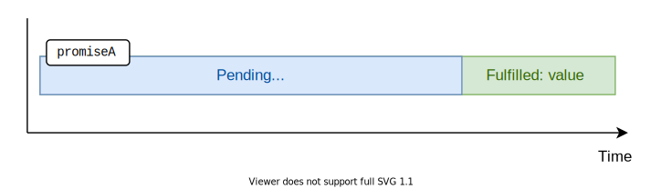

I had had difficulties in understanding promises when I had been learning them back in a few years. 

The problem was that most of the tutorials were solely describing the promise object, its methods, etc. But I don't care much about promises, I care about
them as long as they make coding easier!  

What follows is the post that I had wanted to read to understand promises myself. The post describes why promises make coding asynchronous logic easier, then explains how to use promises.  

```toc
```

## 1. Why promises

JavaScript works well with imperative and synchronous code.  

Let's consider a function `findPerson(who)` that determines whether a person name is contained in a list of persons:

<div id="sync-code"></div>

```javascript
function getList() {
  return ['Joker', 'Batman'];
}

function findPerson(who) {
  const list = getList();

  const found = list.some(person => person === who);

  console.log(found);
}

findPerson('Joker'); // logs true
```

[Try the demo.](https://codesandbox.io/s/ancient-dawn-j6jbq?file=/src/index.js)

The snippet above is synchronous and blocking code. When JavaScript enters into `findPerson()` function to execute, it doesn't get out of there
until the function is executed.   

Getting the list of persons `const list = getList()` is a synchronous operation too.  

Synchronous code is straightforward to understand. But you don't always have the luck to access data instantly: some data, like fetching data over the network, could take a while to be available.  

For example, what would happen if accessing the list of persons `getList()` is an operation that requires, for example, 1 second.

```javascript{3,8}
function getList() {
  setTimeout(() => {
    ['Joker', 'Batman'] // How to return the list?
  }, 1000);
}

function findPerson(who) {
  const list = /* How to access the list? */;

  const found = list.some(person => person === who);
  console.log(found);
}

findPerson('Joker'); // logs true
```

How to return the list of persons from `getList()` with a delay of 1 second? Same way, how would `findPerson(who)` access the list of persons that's returned with a delay?  

Unfortunately, now things have become more complicated. Let's see a few approaches on how to code that.  

### 1.1 The callbacks approach

One classic approach would be to introduce callbacks:

```javascript
function getList(callback) {
  setTimeout(() => callback(['Joker', 'Batman']), 1000);
}

function findPerson(who) {
  getList(list => {
    const found = list.some(person => person === who);
    console.log(found);
  });
}

findPerson('Joker'); // logs true
```

[Try the demo.](https://codesandbox.io/s/elated-jones-mflcv?file=/src/index.js)

`getList(callback)` becomes more complex because it needs one more argument: the callback.  

Code using callbacks approach is difficult to follow because the flow of the computation is hidden in between callbacks. If you'd need to manage even more asynchronous operations using callbacks, you could easily end with the [callback hell](http://callbackhell.com/) problem.  

While callbacks have their good place in JavaScript, still, let's find a better solution.  

### 1.2 An object encapsulating the operation result

I like the synchronous code because it is easy to understand. You see line by line how the code is executed.  

How to code asynchronous operations, while still preserving the readability of synchronous code? 

What about returning from `getList()` a *kind-of list of persons*?  

This *kind-of list of persons* is then *kind-of checked if contains `who`*, and then *a kind-of boolean value* is logged to console. And what's great is that these *kind-of* results can be returned, assigned to variables just like regular objects.  

This *kind-of result* object that encapsulates (aka holds, manages, contains) the result of an asynchronous operation is a *promise of a result*. 

There isn't anything special about the promise object: it is still the result, just encapsulated in a promise because you can't have the result right now, but sometime later.  

*The main idea of promises is to allow returning data wrapped in a promise ("kind-of data") from an asynchronous function exactly like from synchronous one because the synchronous code is easy to understand.*

## 2. What is a promise

> *A promise* is an object that encapsulates the result of an asynchronous operation.

Each promise has a state, which can be one of the following values:

* *Pending*
* *Fullfilled* with a <u>value</u>
* *Rejected* for a <u>reason</u>

The just created promise is in a *pending* state. The promise maintains the *pending* state as long as the asynchronous operation behind the promise is in progress.  

Then, depending on the asynchronous operation completion result, the promise state changes to either:

A) *fulfilled* (when the async operation completed successfully)


 
B) or *rejected* (when then async operation failed).  


In JavaScript, you can create a promise object using a special constructor `Promise`:  

```javascript
const promise = new Promise((resolve, reject) => {
  // Async operation logic here....
  if (asyncOperationSuccess) {
    resolve(value); // async operation successful
  } else {
    reject(error);  // async operation error
  }
});
```

`Promise` constructor accepts a special function that should encapsulate the logic of the asynchronous operation. 

In the special function, after the completion of the operation, you have to call either:

1) If the async operation completed successfully, call `resolve(value)` (that would change the state of the promise to *fulfilled*)
2) Otherwise, in case of an error, call `reject(error)` (that would change the state of the promise to *rejected*)

Let's make a pause from dry theory and get back to the persons' example.  

Like I mentioned before, I want the function `getList()` to return a *kind-of persons* which should encapsulate accessing the list of persons with a delay of 1 second.  

It can be easily implemented using a promise:

```javascript
function getList() {
  return new Promise(resolve => {
    setTimeout(() => resolve(['Joker', 'Batman']), 1000);
  });
}
```

`getList()` creates and returns a promise. Inside of the promise, after passing 1 second, calling `resolve(['Joker', 'Batman'])` effectively makes the promise *fulfill* with the list of persons.  

*While in examples that follow I'm creating promises by hand, usually you won't do this in production. Most of the asynchronous functions of popular libraries (like [axios](https://github.com/axios/axios)) or web APIs (like [fetch()](/javascript-fetch-async-await/)) return already constructed promises.*  

### 2.1 Extracting the promise fulfill value

Now you can ask me a reasonable question: how can I access the value from a promise?  

The promise object allows extracting the fulfill value (aka the result of a successfully completed async operation) using a special method: 

```javascript
promise
  .then(value => {
    // use value...
  });
```

Here's how to access the value of the promise returned by `getList()`:

```javascript{10-12}
function getList() {
  return new Promise(resolve => {
    setTimeout(() => resolve(['Joker', 'Batman']), 1000);
  });
}

const promise = getList();

promise
  .then(value => {
    console.log(value); // logs ['Joker', 'Batman']
  });
```

[Try the demo.](https://codesandbox.io/s/elastic-monad-rnf9v?file=/src/index.js)

Having the knowledge of how to extract a fulfilled value from a promise, let's transform `findPerson(who)` to extract the list from the promise returned by `getList()`:

```javascript{9-12}
function getList() {
  return new Promise(resolve => {
    setTimeout(() => resolve(['Joker', 'Batman']), 1000);
  });
}

function findPerson(who) {
  getList()
    .then(list => {
      const found = list.some(person => person === who);  
      console.log(found);
    });
}

findPerson('Joker'); // logs true
```

[Try the demo.](https://codesandbox.io/s/focused-euler-87tlx?file=/src/index.js)

### 2.2 Extracting the promise rejection error

If the operation fails then the promise rejects with an error. You can access the rejection error using a special method:

```javascript
promise
  .catch(error => {
    // check error...
  })
```

For example, let's imagine that accessing the list of persons ends in an error:

```javascript{10-12}
function getList() {
  return new Promise((resolve, reject) => {
    setTimeout(() => reject(new Error('Nobody here!')), 1000);
  });
}

const promise = getList();

promise
  .catch(error => {
    console.log(error); // logs Error('Nobody here!')
  });
```

[Try the demo.](https://codesandbox.io/s/broken-frog-l244c?file=/src/index.js)

### 2.3 Extracting value and error

You can also extract at once the fulfill value or the reject reason at once. 

To do so you can either:

A) Supply 2 callback argument to `promise.then(successCallback, errorCallback)` method:

```javascript
promise
  .then(value => {
    // use value...
  }, error => {
    // check error...
  });
```

B) or you can use what is called chain of promises (described below) and chain `promise.then(successCallback).catch(errorCallback)`

```javascript
promise
  .then(value => {
    // use value...
  })
  .catch(error => {
    // check error...
  });
```

Let's look closer at the approach B) since it's used more often.  

When using `promise.then(successCallback).catch(errorCallback)` chain, if `promise` resolves successfully then only `successCallback` is called:

```javascript{11}
function getList() {
  return new Promise(resolve => {
    setTimeout(() => resolve(['Joker', 'Batman']), 1000);
  });
}

const promise = getList();

promise
  .then(value => {
    console.log(value); // logs ['Joker', 'Batman']
  })
  .catch(error) => {
    console.log(error); // Skipped...
  };
```

[Try the demo.](https://codesandbox.io/s/boring-volhard-hsoc3?file=/src/index.js)

However, in case if `promise` rejects, then only `errorCallback` is called:

```javascript{14}
function getList() {
  return new Promise((resolve, reject) => {
    setTimeout(() => reject(new Error('Nobody here!')), 1000);
  });
}

const promise = getList();

promise
  .then(value => {
    console.log(value); // Skipped...
  })
  .catch(error => {
    console.log(error); // logs Error('Nobody here!')
  });
```

[Try the demo.](https://codesandbox.io/s/keen-bartik-o857t?file=/src/index.js)

## 3. Chain of promises

As seen above, a promise encapsulates the result of an asynchronous operation. You can use anyhow you want a promise: return from a function, use as an argument, assign to variables. 

But that's only half of the benefits that a promise can provide.  

What's also important is that promises can create chains to handle multiple dependent asynchronous operations.  

The technical side of chaining consists of the fact that `promise.then()`, and even `promise.catch()` methods by themselves return a promise.  

For example, let's create an async function that doubles a number with a delay of 1 second:

```javascript
function delayDouble(number) {
  return new Promise((resolve, reject) => {
    setTimeout(() => resolve(2 * number), 1000);
  });
}
```

Then, let's double 3 times the number `5`:

```javascript
delayDouble(5)
  .then(number => {
    console.log(number); // logs 10
    return delayDouble(number);
  })
  .then(number => {
    console.log(number); // logs 20
    return delayDouble(number);
  })
  .then(result => {
    console.log(result); // logs 40
  });
```

[Try the demo.](https://codesandbox.io/s/eager-sky-fyk0r?file=/src/index.js)

In a chain of promises, if any promise in the chain rejects, then the resolving flow jumps until the first `.catch()`:

```javascript
delayDouble(5)
  .then(number => {
    console.log(number); // logs 10
    return new Promise((_, reject) => reject(new Error('Oops!')));
  })
  .then(number => {
    console.log(number); // Skipped...
    return delayDouble(number);
  })
  .then(result => {
    console.log(result); // Skipped...
  })
  .catch(error => {
    console.log(error); // logs Error('Oops!')
  });
```

[Try the demo.](https://codesandbox.io/s/interesting-gates-dbjj1?file=/src/index.js)

## 4. *async/await*

While looking at the previous code sample that uses promises, you might wonder &mdash; *Hey, using promises still requires callbacks and relatively lots of boilerplate code like `.then()`, `.catch()`.*  

Your observation would be reasonable.  

Fortunately, JavaScript made a step forward in improving even better the asynchronous code by providing the `async/await` syntax: which is a really useful syntactic sugar on top of promises.  

When possible, I highly recommend working with `async/await` syntax rather than dealing with raw promises.  

Let's write down the asynchornous access of the list of persons using the promises:

```javascript
function getList() {
  return new Promise(resolve => {
    setTimeout(() => resolve(['Joker', 'Batman']), 1000);
  });
}

function findPerson(who) {
  getList()
    .then(list => {
      const found = list.some(person => person === who);
      console.log(found);
    });
}

findPerson('Joker'); // logs true
```

Let's reduce this code by applying the `async/await` syntax, which is relatively easy:

* If you want a function to become asynchronous and handle promises, then mark it as `async`
* Inside of the `async` function body, whether you want to wait for a promise to resolve, use `await promiseExpression` syntax
* An `async` function always returns a promise, which enables calling `async` functions inside `async` functions.  

Now let's apply these rules to the previous code snippet:

```javascript{7,8}
function getList() {
  return new Promise(resolve => {
    setTimeout(() => resolve(['Joker', 'Batman'], 1000);
  });
}

async function findPerson(who) {
  const list = await getList();

  const found = list.some(person => person === who);
  console.log(found);
}

findPerson('Joker'); // logs true
```

[Try the demo.](https://codesandbox.io/s/prod-fire-3cfo3?file=/src/index.js)

What's interesting is that `async findPerson(who)` now pauses its execution at the `await getList()` statement. The pause continues until the promise returned by `getList()` is either fulfilled or rejected.  

Now if you look at the `async findPerson(who)` function, you would notice how similar it is to the [synchornous version](#sync-code) of that function from the beginning of the post! That's the goal of promises and `async/await` syntax.  

## 5. Conclusion

The promise is a placeholder holding the result of an asynchronous operation. If the operation completes successfully, then the promise *fulfills* with the operation value, but if the operation fails: the promise *rejects* with the reason of the failure.  

If you'd like to read more about using promises, `async/await` from a practical side, I recommend checking [How to Use Fetch with async/await](/javascript-fetch-async-await/).  

*Challenge: do you know the one important difference between `promise.then(fn1, fn2)` and `promise.then(fn1).catch(fn2)`? Please share your opinion in a comment below!*