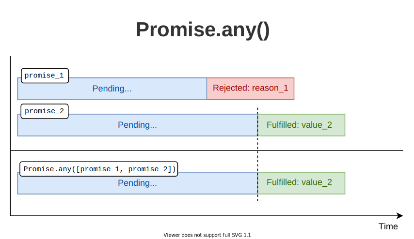

`Promise.any(promises)` is a helper function that runs promises in parallel and resolves to the value of the first successfully resolved promise from `promises` list.  

Let's see how `Promise.any()` works.  

*Before I go on, let me recommend something to you.* 

*If you want to significantly improve your JavaScript knowledge, take the  amazingly useful ["Modern JavaScript From The Beginning 2.0"](https://www.traversymedia.com/a/2147528886/FqXWyazh) by Brad Traversy. Use the coupon code "DMITRI" and get up to 20% discount!*

### 1. *Promise.any()*

`Promise.any()` is useful to perform independent async operations in a parallel and race manner, to get the value of any first fulfilled promise.  

The function accepts an array (or generally an iterable) of promises as an argument:

```javascript
const anyPromise = Promise.any(promises);
```

When *any* first promise from the input `promises` is fulfilled, right away the `anyPromise` resolves to the value of that promise. 


You can extract the value of the first promise using a `then`-able syntax:

```javascript
anyPromise.then(firstValue => {
 firstValue; // The value of the first fulfilled promise
});
```

or using an `async/await` syntax:  

```javascript
const firstValue = await anyPromise;

firstValue; // The value of the first fulfilled promise
```

The promise returned by `Promise.any()` *fulfills with any first fulfilled promise*. Even if some promises get rejected, these rejections are ignored.  



However, if *all promises in the input array are rejected* or *if the input array is empty*, then `Promise.any()` rejects with an [aggregate error](https://developer.mozilla.org/en-US/docs/Web/JavaScript/Reference/Global_Objects/AggregateError) containing all the rejection reasons of the input promises.  


## 2. Fruits and vegetables

Before diving into `Promise.any()`, let's define 2 simple helper functions.  

First, `resolveTimeout(value, delay)` &mdash; returns a promise that fulfills with `value` after passing `delay` time:

```javascript
function resolveTimeout(value, delay) {
  return new Promise(
    resolve => setTimeout(() => resolve(value), delay)
  );
}
```

Second, `rejectTimeout(reason, delay)` &mdash; returns a promise that rejects with `reason` after passing `delay` time:

```javascript 
function rejectTimeout(reason, delay) {
  return new Promise(
    (r, reject) => setTimeout(() => reject(reason), delay)
  );
}
```

Let's use these helper functions to experiment on `Promise.any()`.  

### 2.1 All promises fulfilled

Let's try to access the first resolved list from the local grocery store:

```javascript{1,2}
const promise = Promise.any([
  resolveTimeout(['potatoes', 'tomatoes'], 1000),
  resolveTimeout(['oranges', 'apples'], 2000)
]);

// wait...
const list = await promise;

// after 1 second
console.log(list); // logs ['potatoes', 'tomatoes']
```

[Try the demo.](https://codesandbox.io/s/first-fulfilled-w89h7?file=/src/index.js)

`Promise.any([...])` returns a `promise` that resolves in 1 second to the list of vegetables `['potatoes', 'tomatoes']`. All because vegetables promise has fulfilled first.  

The second promise, with the list of fruits, resolves in 2 seconds, but its value is ignored.  

### 2.2 One promise rejected

Imagine there are no more vegetables at the grocery. In such a case, let's reject the vegetables' promise.  

How would `Promise.any()` would work in such a case?  

```javascript{1}
const promise = Promise.any([
  rejectTimeout(new Error("Out of vegetables!"), 1000),
  resolveTimeout(["oranges", "apples"], 2000)
]);

// wait...
const list = await promise;

// after 2 seconds
console.log(list); // logs ['oranges', 'apples']
```

[Try the demo.](https://codesandbox.io/s/one-rejected-dkxrw?file=/src/index.js)

This case is a little trickier.  

First, the vegetables promise gets rejected after 1 second. However, `Promise.any()` does skip this rejection and still waits to see the status of fruits' promise.  

Finally, after one more second, the fruits promise resolves to a list of fruits `['oranges', 'apples']`. Right away the promise returned by `Promise.any([...])` also resolves to this value.  

### 2.3 All promises rejected

What if the grocery is out of both vegetables and fruits? In such a case both promises reject:

```javascript{1-2}
const promise = Promise.any([
  rejectTimeout(new Error('Out of vegetables!'), 1000),
  rejectTimeout(new Error('Out of fruits!'), 2000)
]);

try {
  // wait...
  const list = await promise;
} catch (aggregateError) {
  console.log(aggregateError); // logs AggregateError
  console.log(aggregateError.errors); 
  // logs [Error('Out of vegetables!'), Error('Out of fruits!')]
}
```

[Try the demo.](https://codesandbox.io/s/all-rejected-fbwgu?file=/src/index.js:283-297)

All input promises are rejected. Thus the promise returned by `Promise.any([...])` also gets rejected with a special kind of error &mdash; [AggregateError](https://developer.mozilla.org/en-US/docs/Web/JavaScript/Reference/Global_Objects/AggregateError) &mdash; that contains the rejection reasons of input promises. 

The aggregate error provides a special property `errors`: which is an array containing the errors of the input promises that had been rejected.  

## 3. Conclusion

`Promise.any()` is useful to perform independent async operations in parallel in a race manner, to get the value of any first successfully resolved promise.  

If all input promises of `Promise.any()` are rejected, then the promise returned by the helper function also rejects with an aggregate error, which contains the rejection reasons of the input promises inside a special property: `aggregateError.errors`.  

Note that `Promise.any([])` rejects also if the input array is empty.  

*Challenge: what's the main difference between `Promise.any()` and `Promise.race()`?*
