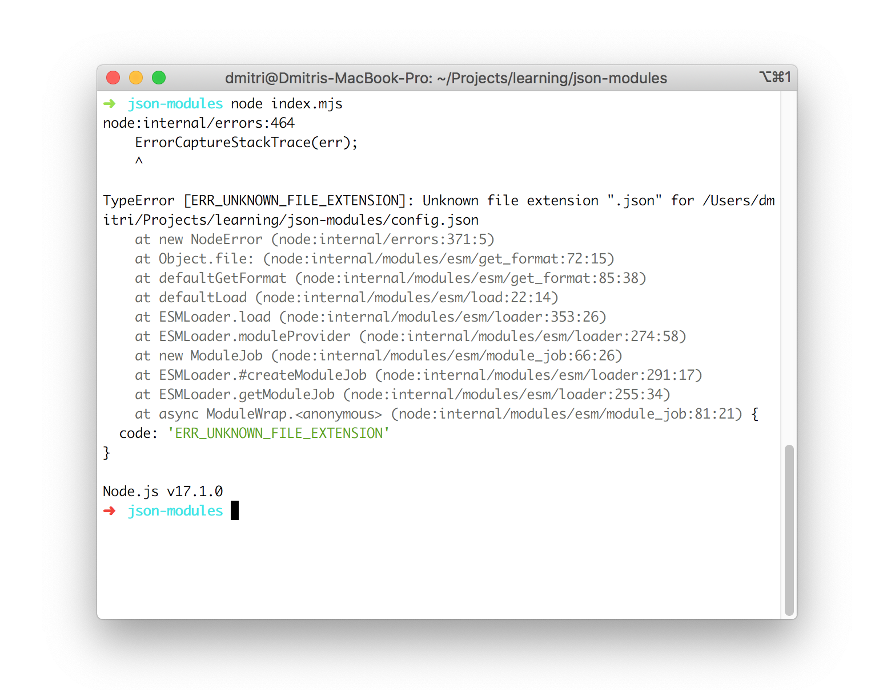

The ECMAScript modules system (`import` and `export` keywords) allows importing inside of an ES module only an another ES module. In other words, you can only import JavaScript code inside of an importing module.  

What if you'd like to import data from a JSON file? For example, it's convinient to keep application's configuration values in a JSON file.  

Importing JSON is supported by commonjs modules format.  

Fortunately, a new proposal at stage 3 named [JSON modules](https://github.com/tc39/proposal-json-modules) proposes a way to import JSON into an ES module directly. Let's see how JSON modules work.

## 1. Importing config.json

Let's say that you have a simple JSON file named `config.json` that contains useful config values of an application: the name and the current version:

```json
{
  "name": "My Application",
  "version": "v1.2"
}
```

How to import `config.json` into an ES module?  

For example, let's create a simple HTTP application that renders the app name and version.  

If you'd try to import `config.json` directly, the engine would throw an error:

```javascript{1}
import http from 'http';
import config from './config.json';

http
  .createServer((req, res) => {
    res.write(`App name: ${config.name}`);
    res.write(`App version: ${config.version}`);
    res.end();
  })
  .listen(8080);
```

When trying to run the application, Node.js throws an error `TypeError [ERR_UNKNOWN_FILE_EXTENSION]: Unknown file extension ".json"`.  



## 2. JSON modules proposal

The essence of the [JSON modules proposal](https://github.com/tc39/proposal-json-modules) is to allow importing JSON data inside of an ES module.  

To make JavaScript aware about the specific format you're trying to import you need to use a so called import assertion.  

```javascript
import jsonContent from "./file.json" assert { type: "json" };
```

where `assert { type: "json" }` is an import assertion indicating the module should be parsed and imported as JSON.  

Note that engines can allow to skip the assertion part `assert { type: "json" }` if it can determine by the file extension what data type you're importing.  

The import assertion in this particular cases indicates a JSON type. However, there's a more general proposal [import assertions](https://github.com/tc39/proposal-import-assertions/) (currently at stage 3) that allows importing even other data formats, like CSS modules.  

## 3. Enabling JSON modules

Now, applying these updates to the simple application:

```javascript{1}
import http from 'http';
import config from './config.json' assert { type: "json" };

http
  .createServer((req, res) => {
    res.write(`App name: ${config.name}`);
    res.write(`App version: ${config.version}`);
    res.end();
  })
  .listen(8080);
```

Now the web application can import the `config.json` file, and access its value `config.name` and `config.version`.  


JSON modules work in Node.js version `>=17.1`, also by using `--experimental-json-modules` flag to enable [Experimental JSON modules](https://nodejs.org/api/esm.html#esm_experimental_json_modules):

```bash
node --experimental-json-modules index.mjs
```

In a browser environment, the JSON modules are available starting Chrome 91.  

## 4. Conclusion

By default, an ES module can import only JavaScript code.  

Thanks to JSON modules proposal you can import JSON content directly into an ES module. This is done by using an import assertion right after the import statement:  

```javascript
import jsonContent from "./file.json" assert { type: "json" };
```