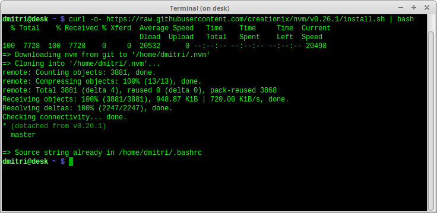
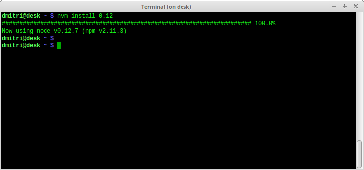
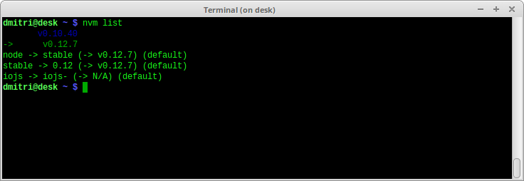

## The problem
Being an active **node** and **npm** package manager user, I found the platform amazing, but installing it can be a pain.  

Linux (checked in Ubuntu and Mint) offers legacy node version from 0.10.x branch by default. Sometimes this is not useful, especially when you want to use the latest node releases.  

The first solution is to install node and npm manually, but this method becomes inconvenient in long term usage. You have download it by hand every time a new version appears and if something goes wrong, then you have to delete it manually too.


## The nvm: node version manager
After a quick search of the problem, I landed on the [nvm](https://github.com/creationix/nvm" target="_blank) (Node Version Manager) project. The readme.md is pretty descriptive, allowing to quickly install the manager and make use of it.
It's not an AI capable of conquering humanity, but the list of commands is simple and self-explanatory.  

**Nvm** offers the following:

* **Quick nvm installation**, with only one wget or curl command
* **Any node version** can be installed in one command also
* **Different node versions** can be setup and quickly **switched**
* Doesn't need God mode (**no sudo**)

The manager has a small list of cons:

* It does not support fish
* Nvm is not available by default in Windows, *one more reason why I don't need Windows :)*

Generally nvm and node versions installation is very simple. No surprises, no blue screens.

## A bit of practice
Now it's keyboard time. Let's install the nvm script and node:

**1. Download the nvm**  
Execute the following command in your terminal:
```bash
curl -o- https://raw.githubusercontent.com/creationix/nvm/v0.26.1/install.sh | bash
```



or if you're not a fan of curl:
```bash
wget -qO- https://raw.githubusercontent.com/creationix/nvm/v0.26.1/install.sh | bash
```


This will install the script into `~/.nvm` folder.
To be sure that the nvm command is available, execute:
```bash
source ~/.profile 
```
Now you're ready to rock.

**2. Install node**  
Now having a version available for all your projects is easy.
Jump to your home directory:
```bash
cd ~
```
Type the node installation command:
```bash
nvm install 0.12
```



That's all. Everything will be downloaded and configured by nvm.
To make sure it all works smoothly, check the installed node version:
```bash
node --version
```


**3. Need to install another node version?** (skip if you need only one version)  
Sometimes is necessary to install different node versions, with the possibility to quickly switch between them. This can be done easily too.  
Using an `.nvmrc` file you can specify what kind of node version you want to install. 
Type this command to create a new `.nvmrc` file, indicating to install node from the 0.10 branch:
```bash
echo "0.10" > .nvmrc
```
Now properly install the alternative version:
```bash
nvm install
```


The script will check the existence of the `.nvmrc` file in your current directory and install the specified node version.
That's all. Now you have installed the 0.10 version, without removing the 0.12. But the active one is still 0.12.
To check the existing versions:
```bash
nvm list
```



And finally to activate the 0.10 version type:

```bash
nvm use 0.10
```


**4. Setting the node version for new terminal sessions**  
Some of the changes made by nvm to node version applies only to current terminal session. If you would like to keep the configuration for new sessions, you have the following options:
a) Create a `.nvmrc` file containing the node version in the home or any other root directories;
b) Use the command 
```bash
nvm alias default 0.12
```

If you encounter some problems with nvm, try to check the [problems section](https://github.com/creationix/nvm#problems" target="_blank) 
That's all folks! Enjoy.