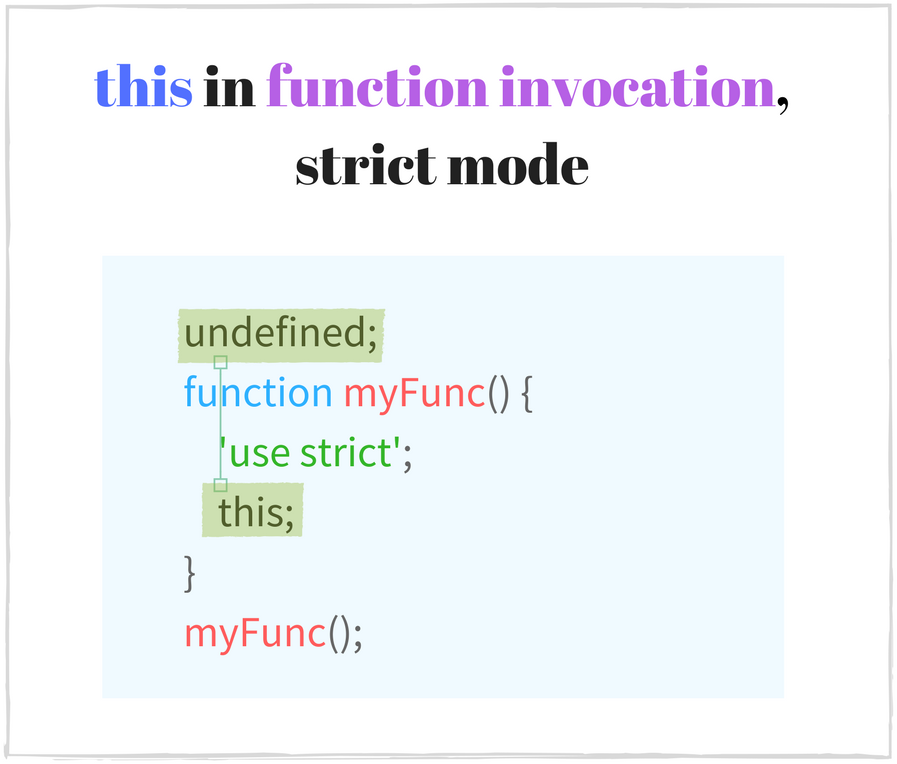
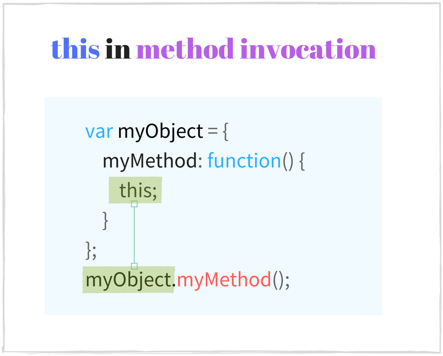

## 1. The mystery of this
A lot of time `this` keyword was a mystery for me and many starting JavaScript developers. It is a powerful feature, but requires efforts to be understood.

From a background like *Java*, *PHP* or other *standard* language, [`this`](https://en.wikipedia.org/wiki/This_(computer_programming)) is seen as an instance of the current object in the class method: no more and no less. Mostly, it cannot be used outside the method and such simple approach does not create confusion.  

In JavaScript the situation is different: `this` is the current execution context of a function. The language has 4 function invocation types: 

 * function invocation: `alert('Hello World!')`
 * method invocation: `console.log('Hello World!')`
 * constructor invocation: `new RegExp('\\d')`
 * indirect invocation: `alert.call(undefined, 'Hello World!')`

Each invocation type defines the context in its own way, so `this` behaves slight different than developer expects.  


Moreover [strict mode](https://developer.mozilla.org/en/docs/Web/JavaScript/Reference/Strict_mode) also affects the execution context. 

*The key to understanding `this`* keyword is having a clear view over *function invocation* and how it impacts the context.  
This article is focused on the invocation explanation, how the function call influences `this` and demonstrates the common pitfalls of identifying the context.

Before starting, let's familiarize with a couple of terms:

* **Invocation** of a function is executing the code that makes the body of a function, or simply calling the function. For example `parseInt` function **invocation** is `parseInt('15')`.  
* **Context** of an invocation is the value of `this` within function body. For example the invocation of `map.set('key', 'value')` has the context `map`.
* **Scope** of a function is the set of variables, objects, functions accessible within a function body.

Table of contents:

1. [The mystery of this](#1-the-mystery-of-this)  
2. [Function invocation](#2-function-invocation)  
    2.1. [this in function invocation](#21-this-in-function-invocation)  
    2.2. [this in function invocation, strict mode](#22-this-in-function-invocation-strict-mode)   
    2.3. [Pitfall: this in an inner function](#23-pitfall-this-in-an-inner-function)  
3. [Method invocation](#3-method-invocation)  
  3.1. [this in method invocation](#31-this-in-method-invocation)  
  3.2. [Pitfall: separating method from its object](#32-pitfall-separating-method-from-its-object)  
4. [Constructor invocation](#4-constructor-invocation)  
  4.1. [this in constructor invocation](#41-this-in-constructor-invocation)  
  4.2. [Pitfall: forgetting about new](#42-pitfall-forgetting-about-new)  
5. [Indirect invocation](#5-indirect-invocation)  
  5.1. [this in indirect invocation](#51-this-in-indirect-invocation)  
6. [Bound function](#6-bound-function)  
  6.1. [this in bound function](#61-this-in-bound-function)  
  6.2. [Tight context binding](#62-tight-context-binding)  
7. [Arrow function](#7-arrow-function)  
  7.1. [this in arrow function](#71-this-in-arrow-function)  
  7.2. [Pitfall: defining method with arrow function](#72-pitfall-defining-method-with-arrow-function)  
8. [Conclusion](#8-conclusion)

## 2. Function invocation

**Function invocation** is performed when an expression that evaluates to a function object is followed by an open parenthesis `(`, a comma separated list of arguments expressions and a close parenthesis `)`. For example `parseInt('18')`.  

*Function invocation* expression cannot be a [property accessor](https://developer.mozilla.org/en/docs/Web/JavaScript/Reference/Operators/Property_accessors) `obj.myFunc()`, which creates a *method invocation*.  For example `[1,5].join(',')` is **not** a function invocation, but a method call. This distinction is important to remember.  

A simple example of function invocation:

```javascript
function hello(name) {
  return 'Hello ' + name + '!';
}
// Function invocation
var message = hello('World');
console.log(message); // => 'Hello World!'
```
`hello('World')` is the function invocation: `hello` expression evaluates to a function object, followed by a pair of parenthesis with `'World'` argument.  

A more advanced example is the [IIFE](https://en.wikipedia.org/wiki/Immediately-invoked_function_expression) (immediately-invoked function expression):

```javascript
var message = (function(name) {
   return 'Hello ' + name + '!';
})('World');
console.log(message) // => 'Hello World!'
```

IIFE is a function invocation too: first pair of parenthesis `(function(name) {...})` is an expression that evaluates to a function object, followed by a pair of parenthesis with `'World'` argument: `('World')`.

### 2.1. this in function invocation

> `this` is  the **global object** in a function invocation 

The global object is determined by the execution environment. In a browser, it is the [`window`](https://developer.mozilla.org/en-US/docs/Web/API/Window) object.


In a function invocation the execution context is the global object.  

Let's check the context in the following function:

```javascript
function sum(a, b) {
   console.log(this === window); // => true
   this.myNumber = 20; // add 'myNumber' property to global object
   return a + b;
}
// sum() is invoked as a function
// this in sum() is a global object (window)
sum(15, 16);     // => 31
window.myNumber; // => 20
```
At the time `sum(15, 16)` is called, JavaScript automatically sets `this` as the global object, which in a browser is `window`.

When `this` is used outside any function scope (the top most scope: global execution context), it also refers to the global object:

```javascript
console.log(this === window); // => true
this.myString = 'Hello World!';
console.log(window.myString); // => 'Hello World!'
```
<div class="try-it-container">
  <a target="_blank" href="http://jsbin.com/lukeda/1/edit?html,console">Try in JS Bin</a>
  <div class="clear"></div>
</div>
```html language-html
<!-- In an html file -->
<script type="text/javascript">
   console.log(this === window); // => true
</script>
```

### 2.2. this in function invocation, strict mode

> `this` is **`undefined`** in a function invocation in strict mode

The strict mode was introduced in [ECMAScript 5.1](http://www.ecma-international.org/ecma-262/5.1/#sec-10.1.1), which is a restricted variant of JavaScript. It provides better security and stronger error checking.  

To enable the strict mode, place the directive `'use strict'` at the top of a function body.   

Once enable, the strict mode mode affects the execution context, making `this` to be `undefined` in a regular function invocation. The execution context is **not** the global object anymore, contrary to above case [2.1](#21-this-in-function-invocation).



An example of a function executed in strict mode:

```javascript
function multiply(a, b) {
  'use strict'; // enable the strict mode
  console.log(this === undefined); // => true
  return a * b;
}
// multiply() function invocation with strict mode enabled
// this in multiply() is undefined
multiply(2, 5); // => 10
```
When `multiply(2, 5)` is invoked as a function, `this` is `undefined`.

The strict mode is active not only in the current scope, but also in the inner scopes (for all functions declared inside):

```javascript
function execute() {
   'use strict'; // activate the strict mode    
   function concat(str1, str2) {
     // the strict mode is enabled too
     console.log(this === undefined); // => true
     return str1 + str2;
   }
   // concat() is invoked as a function in strict mode
   // this in concat() is undefined
   concat('Hello', ' World!'); // => "Hello World!"
}
execute();
```
`'use strict'` is inserted at the top of `execute` body, which enables the strict mode within its scope. Because `concat` is declared within the `execute` scope, it inherits the strict mode. And the  invocation `concat('Hello', ' World!')` makes `this` to be `undefined`.   

A single JavaScript file may contain both strict and non-strict modes. So it is possible to have different context behavior in a single script for the same invocation type:  

```javascript
function nonStrictSum(a, b) {
  // non-strict mode
  console.log(this === window); // => true
  return a + b;
}
function strictSum(a, b) {
  'use strict';
  // strict mode is enabled
  console.log(this === undefined); // => true
  return a + b;
}
// nonStrictSum() is invoked as a function in non-strict mode
// this in nonStrictSum() is the window object
nonStrictSum(5, 6); // => 11
// strictSum() is invoked as a function in strict mode
// this in strictSum() is undefined
strictSum(8, 12); // => 20
```

### 2.3. Pitfall: this in an inner function

⚠️ A common trap with the function invocation is thinking that `this` is the same in an inner function as in the outer function.  
👍 Correctly the context of the inner function depends only on invocation, but not on the outer function's context. 

To have the expected `this`, modify the inner function's context with indirect invocation (using [`.call()`](https://developer.mozilla.org/en-US/docs/Web/JavaScript/Reference/Global_Objects/Function/call) or [`.apply()`](https://developer.mozilla.org/en-US/docs/Web/JavaScript/Reference/Global_Objects/Function/apply), see [5.](#5indirectinvocation)) or create a bound function (using [`.bind()`](https://developer.mozilla.org/en/docs/Web/JavaScript/Reference/Global_objects/Function/bind), see [6.](#6boundfunction)).

The following example is calculating a sum of two numbers:

```javascript
var numbers = {
   numberA: 5,
   numberB: 10,
   sum: function() {
     console.log(this === numbers); // => true
     function calculate() {
       // this is window or undefined in strict mode
       console.log(this === numbers); // => false
       return this.numberA + this.numberB;
     }
     return calculate();
   }
};
numbers.sum(); // => NaN or throws TypeError in strict mode
```
⚠️ `numbers.sum()` is a method invocation on an object (see [3.](#3methodinvocation)), so the context in `sum` is `numbers` object. `calculate` function is defined inside `sum`, so you might expect to have `this` as `numbers` object in `calculate()` too.   

Nevertheless `calculate()` is a function invocation (but **not** method invocation) and it has `this` as the global object `window` (case [2.1.](#21thisinfunctioninvocation)) or `undefined` in strict mode (case [2.2.](#22thisinfunctioninvocationstrictmode)). Even if the outer function `sum` has the context as `numbers` object, it doesn't have influence here.  

The invocation result of `numbers.sum()` is `NaN` or an error is thrown `TypeError: Cannot read property 'numberA' of undefined` in strict mode. Definitely not the expected result ` 5 + 10 = 15`, all because `calculate` is not invoked correctly.

👍 To solve the problem, `calculate` function should be executed with the same context as the `sum` method, in order to access `numberA` and `numberB` properties. 

One solution is to change manually the context of `calculate` to desired one, by calling `calculate.call(this)` (an indirect invocation of a function, see section [5.](#5indirectinvocation)):

```javascript
var numbers = {
   numberA: 5,
   numberB: 10,
   sum: function() {
     console.log(this === numbers); // => true
     function calculate() {
       console.log(this === numbers); // => true
       return this.numberA + this.numberB;
     }
     // use .call() method to modify the context
     return calculate.call(this);
   }
};
numbers.sum(); // => 15
```
`calculate.call(this)` executes `calculate` function as usual, but additionally modifies the context to a value specified as the first parameter.  
Now ` this.numberA + this.numberB` is equivalent to `numbers.numberA + numbers.numberB`. The function returns the expected result `5 + 10 = 15`.  

## 3. Method invocation

A **method** is a function stored in a property of an object. For example:

```javascript
var myObject = {
  // helloFunction is a method
  helloFunction: function() {
    return 'Hello World!';
  }
};
var message = myObject.helloFunction();
```
`helloFunction` is a method of `myObject`. To get the method, use a property accessor: `myObject.helloFunction`.  

**Method invocation** is performed when an expression in a form of [property accessor](https://developer.mozilla.org/en/docs/Web/JavaScript/Reference/Operators/Property_accessors) that evaluates to a function object is followed by an open parenthesis `(`, a comma separated list of arguments expressions and a close parenthesis `)`.  
 
Recalling the previous example, `myObject.helloFunction()` is a method invocation of `helloFunction` on the object `myObject`. Also method calls are: `[1, 2].join(',')` or `/\s/.test('beautiful world')`.

It is important to distinguish **function invocation** (see section [2.](#2functioninvocation)) from **method invocation**, because they are different types. The main difference is that method invocation requires a property accessor form to call the function (`obj.myFunc()` or `obj['myFunc']()`), while function invocation does not (`myFunc()`).

```javascript
['Hello', 'World'].join(', '); // method invocation
({ ten: function() { return 10; } }).ten(); // method invocation
var obj = {};
obj.myFunction = function() {
  return new Date().toString();
};
obj.myFunction(); // method invocation

var otherFunction = obj.myFunction;
otherFunction();     // function invocation
parseFloat('16.60'); // function invocation
isNaN(0);            // function invocation
```

Understanding the distinction between function invocation and method invocation helps identifying correctly the context.

### 3.1. this in method invocation

> `this` is the **object that owns the method** in a method invocation

When invoking a method on an object, `this` becomes the object itself.  



Let's create an object with a method that increments a number:

```javascript
var calc = {
  num: 0,
  increment: function() {
    console.log(this === calc); // => true
    this.num += 1;
    return this.num;
  }
};
// method invocation. this is calc
calc.increment(); // => 1
calc.increment(); // => 2
```
Calling `calc.increment()` makes the context of `increment` function to be `calc` object. So using `this.num` to increment the number property is working well.  

Let's follow another case. A JavaScript object inherits a method from its `prototype`. When the inherited method is invoked on the object, the context of the invocation is still the object itself:

```javascript
var myDog = Object.create({
  sayName: function() {
     console.log(this === myDog); // => true
     return this.name;
  }
});
myDog.name = 'Milo';
// method invocation. this is myDog
myDog.sayName(); // => 'Milo'
```
[`Object.create()`](https://developer.mozilla.org/en-US/docs/Web/JavaScript/Reference/Global_Objects/Object/create) creates a new object `myDog` and sets the prototype. `myDog` object inherits `sayName` method.  
When `myDog.sayName()` is executed, `myDog` is the context of invocation.

In ECMAScript 6 [`class`](https://developer.mozilla.org/en/docs/Web/JavaScript/Reference/Classes) syntax, the method invocation context is also the instance itself:

```javascript
class Planet {
  constructor(name) {
    this.name = name;    
  }
  getName() {
    console.log(this === earth); // => true
    return this.name;
  }
}
var earth = new Planet('Earth');
// method invocation. the context is earth
earth.getName(); // => 'Earth'
```

### 3.2. Pitfall: separating method from its object

⚠️ A method from an object can be extracted into a separated variable `var alone = myObj.myMethod`. When the method is called alone, detached from the original object `alone()`, you might think that `this` is the object on which the method was defined.  

👍 Correctly if the method is called without an object, then a function invocation happens: where `this` is the global object `window` or `undefined` in strict mode (see [2.1](#21thisinfunctioninvocation) and [2.2](#22thisinfunctioninvocationstrictmode)).  

Creating a bound function `var alone = myObj.myMethod.bind(myObj)` (using [`.bind()`](https://developer.mozilla.org/en/docs/Web/JavaScript/Reference/Global_objects/Function/bind), see [6.](#6boundfunction)) fixes the context, making it the object that owns the method.

The following example creates `Animal` constructor and makes an instance of it - `myCat`. Then `setTimout()` after 1 second logs `myCat` object information:

```javascript
function Animal(type, legs) {
  this.type = type;
  this.legs = legs;  
  this.logInfo = function() {
    console.log(this === myCat); // => false
    console.log('The ' + this.type + ' has ' + this.legs + ' legs');
  }
}
var myCat = new Animal('Cat', 4);
// logs "The undefined has undefined legs"
// or throws a TypeError in strict mode
setTimeout(myCat.logInfo, 1000);
```
⚠️ You might think that `setTimout` will call the `myCat.logInfo()`, which should log the information about `myCat` object.  

Unfortunately the method is separated from its object when passed as a parameter: `setTimout(myCat.logInfo)`. The following cases are equivalent:

```javascript
setTimout(myCat.logInfo);
// is equivalent to:
var extractedLogInfo = myCat.logInfo;
setTimout(extractedLogInfo);
```

When the separated `logInfo` is invoked as a function, `this` is global object or `undefined` in strict mode (but **not** `myCat` object). So the object information   does not log correctly.

👍 A function can be bound with an object using [`.bind()`](https://developer.mozilla.org/en/docs/Web/JavaScript/Reference/Global_objects/Function/bind) method (see [6.](#6boundfunction)). If the separated method is bound with `myCat` object, the context problem is solved:

```javascript
function Animal(type, legs) {
  this.type = type;
  this.legs = legs;  
  this.logInfo = function() {
    console.log(this === myCat); // => true
    console.log('The ' + this.type + ' has ' + this.legs + ' legs');
  };
}
var myCat = new Animal('Cat', 4);
// logs "The Cat has 4 legs"
setTimeout(myCat.logInfo.bind(myCat), 1000);
```
`myCat.logInfo.bind(myCat)` returns a new function that executes exactly like `logInfo`, but has `this` as `myCat`, even in a function invocation. 

## 4. Constructor invocation

**Constructor invocation** is performed when [`new`](https://developer.mozilla.org/en/docs/Web/JavaScript/Reference/Operators/new)  keyword is followed by an expression that evaluates to a function object, an open parenthesis `(`, a comma separated list of arguments expressions and a close parenthesis `)`. For example: `new RegExp('\\d')`.

This example declares a function `Country`, then invokes it as a constructor:

```javascript
function Country(name, traveled) {
   this.name = name ? name : 'United Kingdom';
   this.traveled = Boolean(traveled); // transform to a boolean
}
Country.prototype.travel = function() {
  this.traveled = true;
};
// Constructor invocation
var france = new Country('France', false);
// Constructor invocation
var unitedKingdom = new Country;

france.travel(); // Travel to France
```
`new Country('France', false)` is a constructor invocation of the `Country` function.  The result of execution is a new object, which `name`  property is `'France'`.  
If the constructor is called without arguments, then the parenthesis pair can be omitted: `new Country`.

Starting ECMAScript 2015, JavaScript allows to define constructors using [`class`](https://developer.mozilla.org/en/docs/Web/JavaScript/Reference/Classes) syntax:

```javascript
class City {
  constructor(name, traveled) {
    this.name = name;
    this.traveled = false;
  }
  travel() {
    this.traveled = true;
  }
}
// Constructor invocation
var paris = new City('Paris', false);
paris.travel();
```
`new City('Paris')` is a constructor invocation. The object initialization is handled by a special method in the class: [`constructor`](https://developer.mozilla.org/en-US/docs/Web/JavaScript/Reference/Classes/constructor), which has `this` as the newly created object.

A constructor call creates an empty new object, which inherits properties from constructor's prototype. The role of constructor function is to initialize the object.
As you might know already, the context in this type of call is the created instance. This is next chapter subject.

When a property accessor `myObject.myFunction` is preceded by `new` keyword, JavaScript will execute a **constructor invocation**, but **not** a **method invocation**.  
For example `new myObject.myFunction()`: first the function is extracted using a property accessor `extractedFunction = myObject.myFunction`, then invoked as a constructor to create a new object: `new extractedFunction()`.

### 4.1. this in constructor invocation

> `this` is the **newly created object** in a constructor invocation

The context of a constructor invocation is the newly created object. It is used to initialize the object with data that comes from constructor function arguments, setup initial value for properties, attach event handlers, etc.


Let's check the context in the following example:

```javascript
function Foo () {
  console.log(this instanceof Foo); // => true
  this.property = 'Default Value';
}
// Constructor invocation
var fooInstance = new Foo();
fooInstance.property; // => 'Default Value'
```
`new Foo()` is making a constructor call where the context is `fooInstance`. Inside `Foo` the object is initialized: `this.property` is assigned with a default value.

The same scenario happens when using [`class`](https://developer.mozilla.org/en-US/docs/Web/JavaScript/Reference/Classes) syntax (available in ES2015), only the initialization happens in the `constructor` method:

```javascript
class Bar {
  constructor() {
    console.log(this instanceof Bar); // => true
    this.property = 'Default Value';
  }
}
// Constructor invocation
var barInstance = new Bar();
barInstance.property; // => 'Default Value'
```
At the time when `new Bar()` is executed, JavaScript creates an empty object and makes it the context of the `constructor` method. Now you can add properties to object using `this` keyword: `this.property = 'Default Value'`.

### 4.2. Pitfall: forgetting about new

Some JavaScript functions create instances not only when invoked as constructors, but also when invoked as functions. For example `RegExp`:

```javascript
var reg1 = new RegExp('\\w+');
var reg2 = RegExp('\\w+');

reg1 instanceof RegExp;      // => true
reg2 instanceof RegExp;      // => true
reg1.source === reg2.source; // => true
```
When executing `new RegExp('\\w+')` and `RegExp('\\w+')` JavaScript creates equivalent regular expression objects.

⚠️ Using a function invocation to create objects is a potential problem (excluding [factory pattern](http://javascript.info/tutorial/factory-constructor-pattern)), because some constructors may omit the logic to initialize the object when `new` keyword is missing.  

The following example illustrates the problem:

```javascript
function Vehicle(type, wheelsCount) {
  this.type = type;
  this.wheelsCount = wheelsCount;
  return this;
}
// Function invocation
var car = Vehicle('Car', 4);
car.type;       // => 'Car'
car.wheelsCount // => 4
car === window  // => true
```
`Vehicle` is a function that sets `type` and `wheelsCount` properties on the context object.  
When executing `Vehicle('Car', 4)` an object `car` is returned, which has the correct properties: `car.type` is `'Car'` and `car.wheelsCount` is `4`. You might think it works well for creating and initializing new objects.  

However `this` is `window` object in a function invocation (see [2.1.](#21thisinfunctioninvocation)), as result `Vehicle('Car', 4)` is setting properties on the `window` object - faulty scenario. A new object is not created.

👍 Make sure to use `new` operator in cases when a constructor call is expected:

```javascript
function Vehicle(type, wheelsCount) {
  if (!(this instanceof Vehicle)) {
    throw Error('Error: Incorrect invocation');
  }
  this.type = type;
  this.wheelsCount = wheelsCount;
  return this;
}
// Constructor invocation
var car = new Vehicle('Car', 4);
car.type               // => 'Car'
car.wheelsCount        // => 4
car instanceof Vehicle // => true

// Function invocation. Generates an error.
var brokenCar = Vehicle('Broken Car', 3);
```
`new Vehicle('Car', 4)`  works well: a new object is created and initialized, because `new`  keyword is present in the constructor invocation.  

A verification is added in the constructor function: `this instanceof Vehicle`, to make sure that execution context is a correct object type. If `this` is not a `Vehicle`, then an error is generated. Whenever `Vehicle('Broken Car', 3)` is executed (without `new`) an exception is thrown: `Error: Incorrect invocation`. 

## 5. Indirect invocation

**Indirect invocation** is performed when a function is called using `myFun.call()` or `myFun.apply()` methods.

Functions in JavaScript are first-class objects, which means that a function is an object. The type of this object is [`Function`](https://developer.mozilla.org/en-US/docs/Web/JavaScript/Reference/Global_Objects/Function).
From the [list of methods](https://developer.mozilla.org/en-US/docs/Web/JavaScript/Reference/Global_Objects/Function#Methods) that a function object has, [`.call()`](https://developer.mozilla.org/en-US/docs/Web/JavaScript/Reference/Global_Objects/Function/call) and [`.apply()`](https://developer.mozilla.org/en-US/docs/Web/JavaScript/Reference/Global_Objects/Function/apply) are used to invoke the function with a configurable context: 

* The method `.call(thisArg[, arg1[, arg2[, ...]]])` accepts the first argument `thisArg` as the context of the invocation and a list of arguments `arg1, arg2, ...` that are passed as arguments to the called function.

* The method `.apply(thisArg, [arg1, arg2, ...])` accepts the first argument `thisArg` as the context of the invocation and an [array-like object](http://www.2ality.com/2013/05/quirk-array-like-objects.html) of values `[arg1, arg2, ...]` that are passed as arguments to the called function.

The following example demonstrates the indirect invocation:

```javascript
function increment(number) {
  return ++number;  
}
increment.call(undefined, 10);    // => 11
increment.apply(undefined, [10]); // => 11
```
`increment.call()` and `increment.apply()` both invoke the increment function with `10` argument.

The main difference between the two is that `.call()` accepts a list of arguments, for example `myFun.call(thisValue, 'val1', 'val2')`. But `.apply()` accepts a list of values in an array-like object, e.g. `myFunc.apply(thisValue, ['val1', 'val2'])`.

### 5.1. this in indirect invocation

> `this` is the **first argument** of `.call()` or `.apply()` in an indirect invocation

It's obvious that `this` in indirect invocation is the value passed as first argument to `.call()` or `.apply()`. 


The following example shows the indirect invocation context:

```javascript
var rabbit = { name: 'White Rabbit' };
function concatName(string) {
  console.log(this === rabbit); // => true
  return string + this.name;
}
// Indirect invocations
concatName.call(rabbit, 'Hello ');  // => 'Hello White Rabbit'
concatName.apply(rabbit, ['Bye ']); // => 'Bye White Rabbit'
```

The indirect invocation is useful when a function should be executed with a specific context. For example to solve the context problems with function invocation, where `this` is always `window` or `undefined` in strict mode (see [2.3.](#23pitfallthisinaninnerfunction)). It can be used to simulate a method call on an object (see the previous code sample).

Another practical example is creating hierarchies of classes in ES5 to call the parent constructor:

```javascript
function Runner(name) {
  console.log(this instanceof Rabbit); // => true
  this.name = name;  
}
function Rabbit(name, countLegs) {
  console.log(this instanceof Rabbit); // => true
  // Indirect invocation. Call parent constructor.
  Runner.call(this, name);
  this.countLegs = countLegs;
}
var myRabbit = new Rabbit('White Rabbit', 4);
myRabbit; // { name: 'White Rabbit', countLegs: 4 }
``` 
`Runner.call(this, name)` inside `Rabbit` makes an indirect call of the parent function to initialize the object.

## 6. Bound function

**A bound function** is a function connected with an object. Usually it is created from the original function using [`.bind()`](https://developer.mozilla.org/en/docs/Web/JavaScript/Reference/Global_objects/Function/bind) method. The original and bound functions share the same code and scope, but different contexts on execution.

The method `.bind(thisArg[, arg1[, arg2[, ...]]])` accepts the first argument `thisArg` as the context of the bound function on invocation and an optional list of arguments `arg1, arg2, ...` that are passed as arguments to the called function. It returns a new function bound with `thisArg`.

The following code creates a bound function and later invokes it:

```javascript
function multiply(number) {
  'use strict';
  return this * number;
}
// create a bound function with context
var double = multiply.bind(2);
// invoke the bound function
double(3);  // => 6
double(10); // => 20
```
`multiply.bind(2)` returns a new function object `double`, which is bound with number `2`. `multiply` and `double` have the same code and scope.

Contrary to `.apply()` and `.call()` methods (see [5.](#5indirectinvocation)), which invokes the function right away, the `.bind()` method only returns a new function that it supposed to be invoked later with a pre-configured `this`.

### 6.1. this in bound function

>  `this` is the **first argument** of `.bind()` when invoking a bound function

The role of `.bind()` is to create a new function, which invocation will have the context as the first argument passed to `.bind()`. It is a powerful technique that  allows to create functions with a predefined `this` value.


Let's see how to configure `this` of a bound function:

```javascript
var numbers = {
  array: [3, 5, 10],
  getNumbers: function() {
    return this.array;    
  }
};
// Create a bound function
var boundGetNumbers = numbers.getNumbers.bind(numbers);
boundGetNumbers(); // => [3, 5, 10]
// Extract method from object
var simpleGetNumbers = numbers.getNumbers;
simpleGetNumbers(); // => undefined or throws an error in strict mode
```
`numbers.getNumbers.bind(numbers)` returns a function `boundGetNumbers` that is bound with `numbers` object. Then `boundGetNumbers()` is invoked with `this` as `numbers` and returns the correct array object.  

The function `numbers.getNumbers` can be extracted into a variable `simpleGetNumbers` without binding. On later function invocation `simpleGetNumbers()` has `this` as `window` or `undefined` in strict mode, but not `numbers` object (see [3.2. Pitfall](#32pitfallseparatingmethodfromitsobject)). In this case `simpleGetNumbers()` will not return correctly the array.

### 6.2. Tight context binding

`.bind()` makes a **permanent context link** and will always keep it. A bound function cannot change its linked context when using `.call()` or `.apply()` with a different context, or even a rebound doesn't have any effect.   

Only the constructor invocation of a bound function can change that, however this is not a recommended approach (for constructor invocation use *normal*, not bound functions).  

The following example creates a bound function, then tries to change its already pre-defined context:

```javascript
function getThis() {
  'use strict';
  return this;
}
var one = getThis.bind(1);
// Bound function invocation
one(); // => 1
// Use bound function with .apply() and .call()
one.call(2);  // => 1
one.apply(2); // => 1
// Bind again
one.bind(2)(); // => 1
// Call the bound function as a constructor
new one(); // => Object
```
Only `new one()` changes the context of the bound function, other types of invocation always have `this` equal to `1`.
### 7. Arrow function

**Arrow function** is designed to declare the function in a shorter form and [lexically](https://en.wikipedia.org/wiki/Scope_(computer_science)#Lexical_scoping) bind the context.   

It can used the following way:

```javascript
var hello = (name) => {
  return 'Hello ' + name;
};
hello('World'); // => 'Hello World'
// Keep only even numbers
[1, 2, 5, 6].filter(item => item % 2 === 0); // => [2, 6]
```
Arrow functions bring a lighter syntax, excluding the verbose keyword `function`. You could even omit the `return`, when the function has only 1 statement.

An arrow function is [anonymous](https://developer.mozilla.org/en-US/docs/Web/JavaScript/Reference/Global_Objects/Function/name), which means that `name` property is an empty string `''`. This way it doesn't have a lexical function name (which would be useful for recursion, detaching event handlers).  

Also it doesn't provide the [`arguments`](https://developer.mozilla.org/en-US/docs/Web/JavaScript/Reference/Functions/arguments) object, opposed to a regular function. However this is fixed using ES2015 [rest parameters](https://developer.mozilla.org/en/docs/Web/JavaScript/Reference/Functions/rest_parameters):

```javascript
var sumArguments = (...args) => {
   console.log(typeof arguments); // => 'undefined'
   return args.reduce((result, item) => result + item);
};
sumArguments.name      // => ''
sumArguments(5, 5, 6); // => 16
```

### 7.1. this in arrow function

> `this` is the **enclosing context** where the arrow function is defined

The arrow function doesn't create its own execution context, but takes `this` from the outer function where it is defined.


The following example shows the context transparency property:

```javascript
class Point {
  constructor(x, y) {
    this.x = x;
    this.y = y;
  }
  log() {
    console.log(this === myPoint); // => true
    setTimeout(()=> {
      console.log(this === myPoint);      // => true
      console.log(this.x + ':' + this.y); // => '95:165'
    }, 1000);
  }
}
var myPoint = new Point(95, 165);
myPoint.log();
```
`setTimeout` is calling the arrow function with the same context (`myPoint` object) as the `log()` method. As seen, the arrow function "inherits" the context from the function where it is defined.   

If trying to use a regular function in this example, it would create its own context (`window` or `undefined` in strict mode). So to make the same code work correctly with a function expression it's necessary to manually bind the context: `setTimeout(function() {...}.bind(this))`. This is verbose, and using an arrow function is a cleaner and shorter solution.

If the arrow function is defined in the top most scope (outside any function), the context is always the global object (`window` in a browser):

```javascript
var getContext = () => {
   console.log(this === window); // => true
   return this;
};
console.log(getContext() === window); // => true
```

An arrow function is bound with the lexical context **once and forever**. `this`  cannot be modified even if using the context modification methods:

```javascript
var numbers = [1, 2];
(function() {  
  var get = () => {
    console.log(this === numbers); // => true
    return this;
  };
  console.log(this === numbers); // => true
  get(); // => [1, 2]
  // Use arrow function with .apply() and .call()
  get.call([0]);  // => [1, 2]
  get.apply([0]); // => [1, 2]
  // Bind
  get.bind([0])(); // => [1, 2]
}).call(numbers);
```
A function expression is called indirectly using `.call(numbers)`, which makes `this` of the invocation as `numbers`. The `get` arrow function has `this` as `numbers` too, because it takes the context lexically.  

No matter how `get` is called, the arrow function always keeps the initial context `numbers`. Indirect call with other context `get.call([0])` or `. get.apply([0])`, rebinding `get.bind([0])()` have no effect.

Arrow function cannot be used as a constructor. If invoking it as a constructor `new get()`, JavaScript throws an error: `TypeError: get is not a constructor`.

### 7.2. Pitfall: defining method with arrow function

⚠️ You might want to use arrow functions to declare methods on an object. Fair enough: their declaration is quite short comparing to a [function expression](https://developer.mozilla.org/en/docs/web/JavaScript/Reference/Operators/function): `(param) => {...}` instead of `function(param) {..}`.  

This example defines a method `format()` on a class `Period` using an arrow function:

```javascript
function Period (hours, minutes) {  
  this.hours = hours;
  this.minutes = minutes;
}
Period.prototype.format = () => {
  console.log(this === window); // => true
  return this.hours + ' hours and ' + this.minutes + ' minutes';
};
var walkPeriod = new Period(2, 30);  
walkPeriod.format(); // => 'undefined hours and undefined minutes'
```
Since `format` is an arrow function and is defined in the global context (top most scope), it has `this` as `window` object.  
Even if `format` is executed as a method on an object `walkPeriod.format()`, `window` is kept as the context of invocation. It happens because arrow function has a static context that doesn't change on different invocation types.
`this` is `window`, so `this.hours` and `this.minutes` are `undefined`. The method returns the string: `'undefined hours and undefined minutes'`, which is not the expected result.

👍 The function expression solves the problem, because a regular function does change its context depending on invocation:

```javascript
function Period (hours, minutes) {  
  this.hours = hours;
  this.minutes = minutes;
}
Period.prototype.format = function() {
  console.log(this === walkPeriod); // => true
  return this.hours + ' hours and ' + this.minutes + ' minutes';
};
var walkPeriod = new Period(2, 30);  
walkPeriod.format(); // => '2 hours and 30 minutes'
```
`walkPeriod.format()` is a method invocation on an object (see [3.1.](#31thisinmethodinvocation)) with the context `walkPeriod` object. `this.hours` evaluates to `2` and `this.minutes` to `30`, so the method returns the correct result: `'2 hours and 30 minutes'`.

## 8. Conclusion

Because the function invocation has the biggest impart on `this`, from now on **do not** ask yourself:

> Where is `this` taken from?

but **do** ask yourself: 

> How is the `function invoked`?

For an arrow function ask yourself:

> What is `this` where the arrow function is `defined`?

This mindset is correct when dealing with `this` and will save you from headache.  

*If you have an interesting example of context pitfall or just experience difficulties with a case, write a comment bellow and let's discuss!*

Don't lose your context ;)