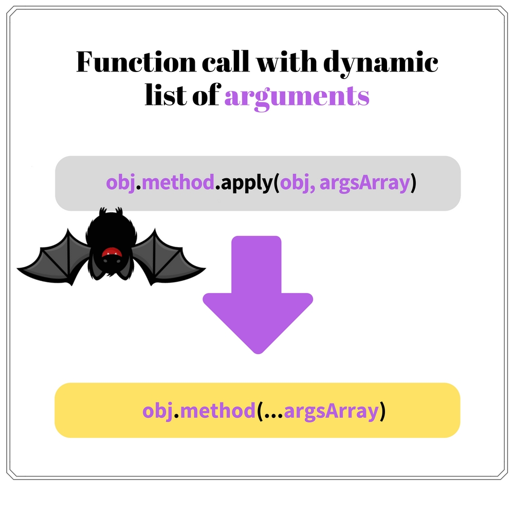

Many developers were frustrated about JavaScript, especially before ECMAScript 2015 standard. And they had the right too: the language is known for its weakness and initial design drawbacks.  

How did it happen?  

At the beginning of the web era, no one did know how exactly the web will look in 10 - 15 years. And especially that a [small Java's brother](https://web.archive.org/web/20080213171613/http://wp.netscape.com/newsref/pr/newsrelease67.html) JavaScript will become the dominant language in this area, especially on the client side.  
It is complicated to predict the divergent evolution of the Internet technology.  

It's like fixing a giant rocket on the full speed, moving to Earth's orbit.  


When things started to clear up, it wasn't so simple to head into the right direction.  
A lot of codebase was written already: the rocket was launched. The backward compatibility and the growing list of hacks slow down the web development. Because really it should be extensible, scalable, easy and fun.  

What a developer can do? Knockout JavaScript hacks!  
Now it's the right time, especially that ECMAScript 2015 and beyond standards are sufficient to start coding the correct way.  

So, let's continue with another series of improvements!  

## 1. String literal as template

> Embedding variables into a string literal? Don't forget to pair + and '.

Embedding variables into a string literal was always a tedious task.  

It's ok for one variable `'str 1 ' + var1`. It becomes harder when the construction grows `'str 1 ' + var1 + ' str 2' + (var2 + var3) + ' str 3'`. You have to spend time pairing `+` and `'` characters, and the whole expression is difficult to understand.    

Let's look at the neighbor. In Python you can format strings easily, because the string literal and variables are separated:   

```python
animal = 'monkey'
countFruits = 4
fruit = 'bananas'
'A %s has %d %s' % (animal, countFruits, fruit)
# => 'A monkey has 4 bananas'
```

Compare the Python style with JavaScript's ES5 style, where variables and literals are mixed. This mix creates a construction that is complicated to follow:  

```javascript
var animal = 'monkey';
var countFruits = 4;
var fruit = 'bananas';
'A ' + animal + ' has ' + countFruits + ' ' + fruit;
// => 'A monkey has 4 bananas'
```
Obviously the amount of concatenation operators `+` and single quotes `'` does not make the entire string readable.  

ECMAScript 2015 presents a new type of string literal called [template literal](http://www.ecma-international.org/ecma-262/6.0/#sec-template-literal-lexical-components).  Fortunately it allows to embed JavaScript expressions into place holders `${expression}` and create strings as easy as a pie.  


Let's see how nicely literals are looking now:  

```javascript
var animal = 'monkey';
var countFruits = 4;
var fruit = 'bananas';
`A ${animal} has ${countFruits} ${fruit}`
// => 'A monkey has 4 bananas'
```
No more redundant concatenation operators and single quotes. The template literal makes the string easy to follow.  

Additionally template literals allow to write strings in multiple lines:

```javascript
var templateLiteral = `Line 1
Line 2
Line 3`;
```

And compose so called tagged template literals, by placing a function `encodeUrlParams` before the template string:  

```javascript
function encodeUrlParams(literals, ...substitutions) {
  var str = '';
  // run the loop only for the substitution count
  for (var i = 0; i < substitutions.length; i++) {
    str += literals[i];
    str += encodeURIComponent(substitutions[i]);
  }
  // add the last literal
  str += literals[literals.length - 1];
  return str;
}
var redirectUrl = 'http://site2.com';
encodeUrlParams `http://example.com?redirect=${redirectUrl}`;
// => 'http://example.com?redirect=http%3A%2F%2Fsite2.com'
```
`encodeUrlParams()` is a function that encodes the strings to be used safely as URL parameters. 
Inside the function `literals` parameter is an array that contains the literals parts. `substitutions` contains the evaluation result of the expressions, which in our case are the params to be encoded.    

Template literals availability:

<table>
<tr>
  <td>
    <i>Standard</i>
  </td>
  <td>
    <a href="http://www.ecma-international.org/ecma-262/6.0/#sec-template-literal-lexical-components">ECMAScript 2015</a>
  </td>
</tr>
<tr>
  <td>
    <i>Browsers/runtime support</i>
  </td>
  <td>
    Chrome 41+, Firefox 34+, Safari 9+, Edge 13+, Node 4+
  </td>
</tr>
<tr>
  <td>
    <i>Babel transform</i>
  </td>
  <td>
    <a href="https://babeljs.io/docs/plugins/transform-es2015-template-literals/">ES2015 template literals transform</a>
  </td>
</tr>
</table>

## 2. Verify substring existence in a string

> `string.indexOf(substring) !== -1`? Could be better!

In ES5, searching for a substring in a string does not provide a straightforward solution. The most appropriate way is to use `string.indexOf(substring, [fromIndex])` method. Then compare the returned index with the hardcoded value `-1`, which indicates that the substring is not found:  

```javascript
var str = 'Hello World';
str.indexOf('Hello') !== -1; // => true
str.indexOf('Hi') !== -1;    // => false
```

`str.indexOf('Hello')` returns `0`: the index of `'Hello'` substring. `0 !== -1` comparison evaluates to `true`.  
For a missing substring `'Hi'`, the code `str.indexOf('Hi')` returns `-1`. So `-1 !== -1` comparison evaluates to `false`.  

Even the hack explanations are clumsy: something is not because something is not.  

Finally ECMAScript 2015 provides [a correct method](http://www.ecma-international.org/ecma-262/6.0/#sec-string.prototype.includes) to verify a substring existence: `string.includes(substring, [fromIndex])`. The method returns a boolean that indicates if `substring` is a substring of `string`, optionally starting from an index `fromIndex`.  


The above example is now transformed to a clear solution:

```javascript
var str = 'Hello World';
str.includes('Hello'); // => true
str.includes('Hi');    // => false
```
`str.includes('Hello')` evaluates to `true`, because `'Hello'` is an existing substring.  
And for a non-existing substring `'Hi'` the code `str.includes('Hi')` returns `false`.  

No more alternatives. Refactor your project by changing from `string.indexOf(substring) !== -1` to `string.includes(substring)` and be happy as a clam.  

`.includes()` string method availability:

<table>
<tr>
  <td>
    <i>Standard</i>
  </td>
  <td>
    <a href="http://www.ecma-international.org/ecma-262/6.0/#sec-string.prototype.includes">ECMAScript 2015</a>
  </td>
</tr>
<tr>
  <td>
    <i>Browsers/runtime support</i>
  </td>
  <td>
    Chrome 41+, Firefox 40+, Safari 9+, Edge 13+, Node 4+
  </td>
</tr>
<tr>
  <td>
    <i>Polyfill</i>
  </td>
  <td>
    <a href="https://developer.mozilla.org/en-US/docs/Web/JavaScript/Reference/Global_Objects/String/includes#Polyfill">String.prototype.includes() polyfill</a>
  </td>
</tr>
</table>

## 3. Function call with dynamic list of arguments

> `array.push.call(array, elements)`? We can do better.

Many JavaScript functions and methods accept a dynamic number of arguments. For example `console.log(text1, text2, ...)`, array methods `.push()`, `.concat()`, etc.

They work nicely when you enumerate manually the arguments:

```javascript
var numbers = [1, 2, 3];
numbers.push(4, 5);
numbers // => [1, 2, 3, 4, 5]
```
In the expression `numbers.push(4, 5)` two arguments are indicated: `4` and `5`. These elements are pushed into `numbers` array.

Often an array holds the arguments. This case is not so simple. The option is to apply an indirect call using `.apply()` method of the function object. Let's take a try:  

```javascript
var numbers = [1, 2, 3];
var toPush = [4, 5];
numbers.push.apply(numbers, toPush);
numbers // => [1, 2, 3, 4, 5]
```
The indirect call to push some elements from an array looks clumsy: `numbers.push.apply(numbers, toPush)`.  
Calling an additional method `.apply()` is the first problem. Short code is always better than lengthy one.  
The second problem is a redundant indication of the context `.apply(numbers, ...)`. The whole indirect call expression in the end contains 2 times `numbers` object: `numbers.push.apply(numbers, toPush)`.  

To me the indirect call expression looks like a big lazy frog.  

The [spread operator](/how-three-dots-changed-javascript/) `...` makes the function invocation from an array of arguments  wonderful.  
Simply put three dots `...` before the array when calling a function and its elements spread into invocation arguments. `myFunction(...argsArray)` is equivalent to `myFunction(argsArray[0], argsArray[1], ..., argsArray[n])`.



The above example can be improved significantly:  

```javascript
var numbers = [1, 2, 3];
var toPush = [4, 5];
numbers.push(...toPush);
numbers // => [1, 2, 3, 4, 5]
```
When `numbers.push(...toPush)` is executed, the spread operator `...` spreads `toPush` array elements into arguments. Simple and beautiful as a sunrise.  

A nice bonus: three dots `...` accepts not only arrays, but any [iterable objects](https://developer.mozilla.org/en/docs/Web/JavaScript/Reference/Iteration_protocols) (strings, [maps](https://developer.mozilla.org/en/docs/Web/JavaScript/Reference/Global_Objects/Map), [sets](https://developer.mozilla.org/en/docs/Web/JavaScript/Reference/Global_Objects/Set), etc). Also you can use the operator to setup the arguments for a constructor call `new Date(...[2017, 8, 1])`, which is not possible with indirect calls `.apply()`.  

Spread operator availability:

<table>
<tr>
  <td>
    <i>Standard</i>
  </td>
  <td>
    <a href="http://www.ecma-international.org/ecma-262/6.0/#sec-argument-lists">ECMAScript 2015</a>
  </td>
</tr>
<tr>
  <td>
    <i>Browsers/runtime support</i>
  </td>
  <td>
    Chrome 46+, Firefox 27+, Safari 10+, Edge 13+, Node 6+
  </td>
</tr>
<tr>
  <td>
    <i>Babel transform</i>
  </td>
  <td>
    <a href="http://babeljs.io/docs/plugins/transform-es2015-spread/">ES2015 spread transform</a>
  </td>
</tr>
</table>

## 4. Class hierarchy

>  I feel a bit nervous when I write `.prototype`.

Today's trending says to [favor composition over inheritance](https://en.wikipedia.org/wiki/Composition_over_inheritance). I would add: to favor only when necessary!  

As an example, you can find the class inheritance useful when [extending React components](https://toddmotto.com/react-create-class-versus-component/).  

ES5 standard does not permit obviously to create a class hierarchy. It happens because JavaScript has a prototypal-based inheritance, and the class inheritance is emulated on top of it.  

Let's define a superclass and extend it in a subclass:  

```javascript
function Figure(notation) {
  this.notation = notation;
}
Figure.prototype.getNotation = function() {
  return 'Figure notation: ' + this.notation;
}

function Square(notation, sideLength) {
  Figure.call(this, notation);
  this.sideLength = sideLength;  
}
Square.prototype = Object.create(Figure.prototype);
Square.prototype.constructor = Square;
Square.prototype.getArea = function() {
  return Math.pow(this.sideLength, 2);
};

var mySquare = new Square('ABCD', 4);
mySquare.getNotation(); // => 'Figure notation: ABCD'
mySquare.getArea();     // => 16
```
`Figure` is a superclass. `Square` is a subclass of it, which inherits `notiation` property and `getNotiation()` method.  
`Square` class defines its own `sideLength` property and `getArea()` method.  
As seen in the example, to mimic the class inheritance a lot of additional glue code is added: 

* In the `Square` constructor `Figure.call(this, notation)` makes a parent constructor call
* `Square.prototype = Object.create(Figure.prototype)` creates a new prototype object for `Square` constructor. `Square` instances inherit methods from `Figure.prototype`
* `Square.prototype.constructor = Square` fixes the prototype to have the correct constructor property

If you get payed depending on how much lines of code you provide in 8 hours, this option may work. But normally this is too verbose.  

ECMAScript 2015 [`class`](https://developer.mozilla.org/en/docs/Web/JavaScript/Reference/Classes) makes the class inheritance usage much easier, providing a syntactic sugar over JavaScript's prototypal inheritance. Nice!


Let's improve the above geometrical class hierarchy using ES2015 `class` syntax:

```javascript
class Figure {
  constructor(notation) {
    this.notation = notation;
  }
  getNotation() {
    return 'Figure notation: ' + this.notation;
  }
}

class Square extends Figure {
  constructor(notation, sideLength) {
    super(notation);
    this.sideLength = sideLength;    
  }
  getArea() {
    return Math.pow(this.sideLength, 2);
  }
}

var mySquare = new Square('ABCD', 4);
mySquare.getNotation(); // => 'Figure notation: ABCD'
mySquare.getArea();     // => 16
```

Indeed `class` syntax makes the code more convenient:  

* Use `class <ClassName>`  to defined a class and `class <Class> extends <SuperClassName>` to define a subclass that extends a super class
* A special method `constructor() {...}` is used as constructor to initialize the newly created instance with properties 
* In the constructor function `super()` calls the parent class constructor. Just be sure to execute `super()` before using `this`

If you're using React's `React.createClass({...})`, it is the [right time to migrate](http://www.newmediacampaigns.com/blog/refactoring-react-components-to-es6-classes) to ES2015 classes `React.Component`.

`class` syntax availability:

<table>
<tr>
  <td>
    <i>Standard</i>
  </td>
  <td>
    <a href="http://www.ecma-international.org/ecma-262/6.0/#sec-class-definitions">ECMAScript 2015</a>
  </td>
</tr>
<tr>
  <td>
    <i>Browsers/runtime support</i>
  </td>
  <td>
    Chrome 49+, Firefox 45+, Safari 10+, Edge 13+, Node 6+
  </td>
</tr>
<tr>
  <td>
    <i>Babel transform</i>
  </td>
  <td>
    <a href="http://babeljs.io/docs/plugins/transform-es2015-classes/">ES2015 classes transform</a>
  </td>
</tr>
</table>

## 5. Transform array-like object to array

> Array-like objects... What could be more hacky?

I consider array-like objects a weird constructor. In the end, why not simply create arrays? Probably [this](http://stackoverflow.com/questions/3242485/why-isnt-a-functions-arguments-object-an-array-in-javascript) is the answer for `arguments` object. And because many DOM methods return an `HTMLCollection`, which is a live array-like object that cannot be mutated (live means it's auto-updated when DOM changes).  

Nevertheless exist situations when the array-like object needs to be transformed into a regular array, to take advantage of the array methods like `.forEach()`, `.map()`, etc. 

Let's see how to transform an array-like object to an array using ES5 possibilities:  

```javascript
function argsToArray() {
  return Array.prototype.slice.call(arguments);
}
argsToArray(5, 6, 8) // => [5, 6, 8]
```
`argsToArray()` returns an array that contains the arguments passed to function on invocation. To transform the array-like object `arguments` into a real array, an indirect call to `.slice()` method is applied: `Array.prototype.slice.call(arguments)`.  

`Array.from(arrayLike, [mapFunction])` function transform `arrayLike` parameter into an array and returns it. 


Let's see `Array.from()` in action:  

```javascript
function argsToArray() {
  return Array.from(arguments);
}
argsToArray(5, 6, 8) // => [5, 6, 8]
```
`Array.from(arguments)` transforms `arguments` array-like object into an array. This approach is shorter than the one presented above with an indirect call to `.slice()` array method.  

If you don't want to deal at all with `arguments` object (and I recommend you to do that), define a rest parameter:

```javascript
function argsToArray(...args) {
  return args;
}
argsToArray(5, 6, 8) // => [5, 6, 8]
```

`Array.from()` availability:

<table>
<tr>
  <td>
    <i>Standard</i>
  </td>
  <td>
    <a href="http://www.ecma-international.org/ecma-262/6.0/#sec-array.from">ECMAScript 2015</a>
  </td>
</tr>
<tr>
  <td>
    <i>Browsers/runtime support</i>
  </td>
  <td>
    Chrome 45+, Firefox 32+, Safari 10+, Edge 14+, Node 4+
  </td>
</tr>
<tr>
  <td>
    <i>Polyfill</i>
  </td>
  <td>
    <a href="https://developer.mozilla.org/en-US/docs/Web/JavaScript/Reference/Global_Objects/Array/from#Polyfill">Array.from() polyfill</a>
  </td>
</tr>
</table>

## 6. Don't stop me now

The article covered another list of hacks that should be migrated when possible. Thanks to ECMAScript 2015/2016 the migration adds big benefits.  

Surely `string.indexOf(substring) !== -1` should disappear from now on in favor of the correct `string.includes(substring)`.  

The template literal improves the code readability when variables should embed into  a string. You could also insert newlines into template literals, which is a nice bonus.  

To reduce the redundant code that mimics class inheritance over JavaScript's prototypal inheritance, it is recommended to use `class` syntax. It is light and short.  
However think twice before creating hierarchies of classes in JavaScript. [Composition](https://rjzaworski.com/2013/03/composition-in-javascript) has a lot of flexibility, and consider it first as an option before diving into class inheritance mechanism.  

*Such a beautiful day to make your JavaScript code shine!*