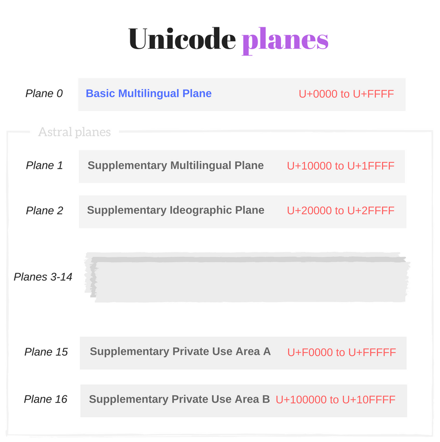
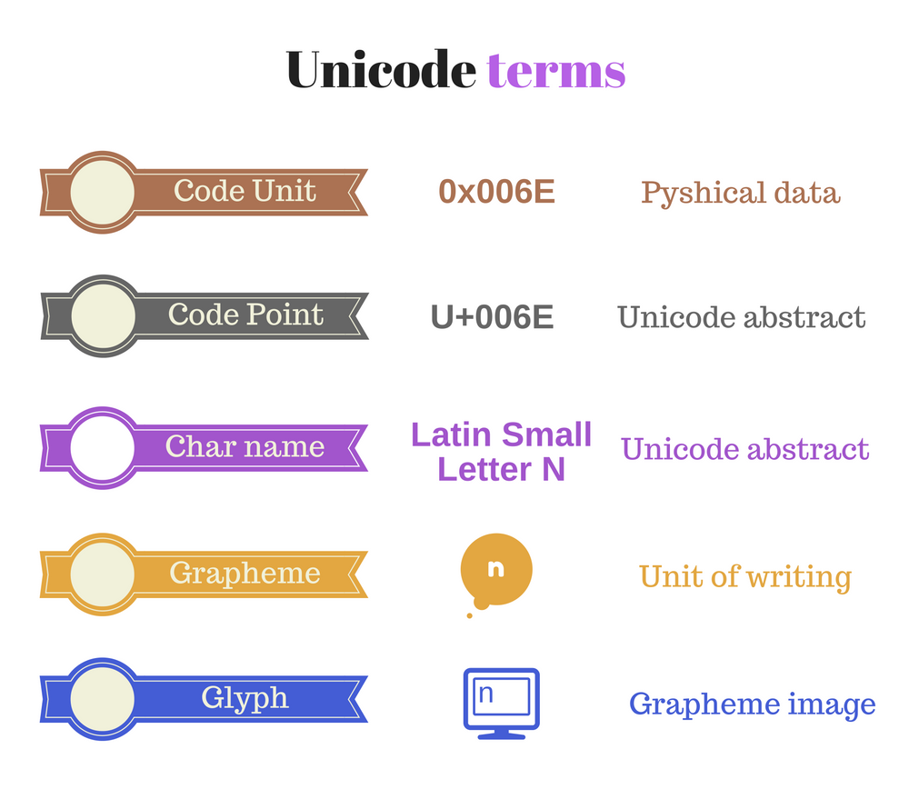

This story starts with a confession: I was afraid of Unicode for a long time. 
When a programming task required Unicode knowledge, I was searching for a hackable solution for the problem, without detailed sense what I was doing.  

My avoiding continued until I faced a problem that required detailed Unicode knowledge. There was no way to apply situational solutions.  

After applying some efforts, reading a bunch of articles - surprisingly it wasn't  hard to understand it. Well, some articles required reading at least 3 times.  

As it turns out, Unicode is an universal and elegant standard. It may be tough because of a bunch of abstract terms hard to stick to.  

If you have gaps in understanding Unicode, now is the right time to face it! It's not that hard. Make yourself a tasteful tea or coffee ☕. And let's dive into the wonderful world of abstraction, characters, astrals and surrogates.   

The post explains the basic concepts of Unicode. This creates the necessary ground.  
Then it clarifies how JavaScript works with Unicode and what traps you may encounter.  
You'll learn also how to apply new ECMAScript 2015 features to solve a part of the difficulties.  

Ready? Let's rock!

Table of contents:  

1. [The idea behind Unicode](#1-the-idea-behind-unicode)
2. [Basic Unicode terms](#2-basic-unicode-terms)  
  2.1 [Characters and code points](#21-characters-and-code-points)  
  2.2 [Unicode planes](#22-unicode-planes)  
  2.3 [Code units](#23-code-units)  
  2.4 [Surrogate pairs](#24-surrogate-pairs)  
  2.5 [Combining marks](#25-combining-marks)  
3. [Unicode in JavaScript](#3-unicode-in-javascript)  
  3.1 [Escape sequences](#31-escape-sequences)  
  3.2 [String comparison](#32-string-comparison)  
  3.3 [String length](#33-string-length)  
  3.4 [Character positioning](#34-character-positioning)  
  3.5 [Regular expression match](#35-regular-expression-match)  
4. [Final words](#4-final-words)

## 1. The idea behind Unicode

Let's start with an elementary question. How are you able to read and understand the current article? Simply: because you know the meaning of letters and words as group of letters.  

Why are you able to understand the meaning of letters? Simply: because you (reader) and me (writer) have an agreement over the association between the graphical symbol (what is seen on the screen) and English language letter (the meaning).  

Almost the same happens with computers. One difference is that computers don't understand the meaning of letters: these are sequences of bits.  

Imagine a scenario when a computer of *User1* sends a message `'hello'` to computer of *User2*.  

The computer doesn't know the meaning of letters. So the computer of *User1* transforms  `'hello'` message into a sequence of numbers `0x68 0x65 0x6C 0x6C 0x6F`, where each letter uniquely corresponds to a number: `h` is `0x68`, `e` is `0x65`, etc. 
Then sends these numbers to *User2*'s computer.  

When the computer of *User2* receives the sequence of numbers `0x68 0x65 0x6C 0x6C 0x6F`, it uses the same letter to number correspondence and restores the message. Then it displays the correct message: `'hello'`.  

The agreement between the two computers about the correspondence between letters and numbers is what **Unicode** standardizes.  

In terms of Unicode, `h` is an abstract character named *LATIN SMALL LETTER H*. This character has the corresponding number `0x68`, which is a code point in notation `U+0068`.  These terms are described in the chapter below.  

The role of Unicode is to provide a list of abstract characters (character set) and assign to each character an unique identifier code point (coded character set).  

## 2. Basic Unicode terms

The [`www.unicode.org`](http://unicode.org) websites mentions:

> **Unicode** provides a unique number for every character,  
no matter what the platform,  
no matter what the program,  
no matter what the language.  

Unicode is an universal character set that defines the list of characters from majority of the writing systems, and associates for every character an unique number (code point).  


Unicode includes characters from most of today languages, punctuation marks, diacritics, mathematical symbols, technical symbols, arrows, emoji and more.  

The first Unicode version 1.0 was published in October 1991 and had 7,161 characters. Latest version 9.0 (published in June 2016) provides codes for 128,172 characters.  

The universal and embracing approach of Unicode solves a major problem that existed before, when vendors implemented a lot of characters sets and encodings that were difficult to handle.  

It was complicated to create an application that supports all character sets and encodings. 

If you have an opinion that Unicode is hard, programming without it would be even more difficult. 

I still remember picking randomly charsets and encodings to read the content of files. Pure lottery!

## 2.1 Characters and code points

> **Abstract character** (or character) is a unit of information used for the organization, control or representation of textual data.  

Unicode deals with characters as abstract terms. Every abstract character has an associated name, e.g. *LATIN SMALL LETTER A*. The rendered form (glyph) of this character is `a`.  

> **Code point** is a number assigned to a single character.

The code point is presented in the format `U+<hex>`, where `U+` is a prefix that means Unicode and `<hex>` is a number in hexadecimal. For example `U+0041` and `U+2603` are code points.  

Code points are numbers in range from `U+0000` to `U+10FFFF`. 

Remember that code point is a simple number. And that's how you should think about it. 
Code point is kind of index of an element in array.  

The magic happens because Unicode associates a code point with a character. For example `U+0041` corresponds to character named *LATIN CAPITAL LETTER A* (rendered as `A`), or `U+2603` corresponds to character named *SNOWMAN* (rendered as `☃`).  

Notice that not all code points have associated characters. `1,114,112` code points are available (the range `U+0000` to `U+10FFFF`), but only `128,237` have assigned characters.  

## 2.2 Unicode planes

> **Plane** is a range of 65,536 (or 10000<sub>16</sub>) contiguous Unicode code points from `U+n0000` up to `U+nFFFF`, where `n` can take values from 0<sub>16</sub> to 10<sub>16</sub>. 

Planes split Unicode code points into 17 equal groups: 

* *Plane 0* contains code points from `U+0000` to `U+FFFF`, 
* *Plane 1* contains code points from <code>U+**1**0000</code> to <code>U+**1**FFFF</code> 
* ...
* *Plane 16* contains code points from <code>U+**10**0000</code> to <code>U+**10**FFFF</code>.



#### Basic Multilingual Plane

*Plane 0* is a special one, named **Basic Multilingual Plane** or shortly **BPM**. It contains characters from most of the modern languages ([Basic Latin](https://en.wikipedia.org/wiki/Basic_Latin_(Unicode_block)), [Cyrillic](https://en.wikipedia.org/wiki/Cyrillic_(Unicode_block)), [Greek](https://en.wikipedia.org/wiki/Greek_and_Coptic), etc) and a big number of [symbols](https://en.wikipedia.org/wiki/Unicode_symbols).  

As mentioned above, the code points from Basic Multilingual Plane are in range from `U+0000` to `U+FFFF` and can have up to 4 hexadecimal digits.  

Basically developer deals with characters from BPM. It contains most of the necessary characters. 

Some characters from BPM:

* `e` is `U+0065` named *LATIN SMALL LETTER E*
* `|` is `U+007C` named *VERTICAL BAR*
* `■` is `U+25A0` named *BLACK SQUARE*
* `☂` is `U+2602` named *UMBRELLA*

#### Astral planes

The 16 planes beyond the BPM (*Plane 1*, *Plane 2*, ..., *Plane 16*) are named **astral planes** or **supplementary planes**.  

The code points that are part of the astral planes are named **astral code points**. These code points are in range from `U+10000` to `U+10FFFF`. 

An astral code point can have 5 or 6 digits in hexadecimal: `U+ddddd` or `U+dddddd`.  

Let's see some characters from astral planes:  

* `𝄞` is `U+1D11E` named *MUSICAL SYMBOL G CLEF*
* `𝐁` is `U+1D401` named *MATHEMATICAL BOLD CAPITAL B*
* `🀵` is `U+1F035` named *DOMINO TITLE HORIZONTAL-00-04*
* `😀` is `U+1F600` named *GRINNING FACE*

### 2.3 Code units

Computer at memory level of course doesn't use code points or abstract characters. 
It needs a physical way to represent Unicode code points: the code units.  

> **Code unit** is a bit sequence used to encode each character within a given encoding form.  

The [character encoding](https://en.wikipedia.org/wiki/Character_encoding) is what makes the transformation from abstract code points into physical bits: code units.  
In other words, the character encoding translates the Unicode code points to unique code unit sequences.

Popular encodings are [UTF-8](https://en.wikipedia.org/wiki/UTF-8), [UTF-16](https://en.wikipedia.org/wiki/UTF-16) and [UTF-32](https://en.wikipedia.org/wiki/UTF-32).  

Most **JavaScript engines use UTF-16** encoding. This affects the way JavaScript works with Unicode. From now on let's concentrate on UTF-16.  

UTF-16 (the long name: 16-bit Unicode Transformation Format) is a [variable-length](https://en.wikipedia.org/wiki/Variable-width_encoding) encoding:

* Code points from BPM are encoded using a single code unit of 16-bit
* Code points from astral planes are encoded using two code units of 16-bit each.  

Let's follow some examples.  

Suppose you want to save to hard drive *LATIN SMALL LETTER A* character `a`. Unicode tells you that *LATIN SMALL LETTER A* abstract character maps to `U+0061` code point.  

Now let's ask UTF-16 encoding how `U+0061` should be transformed. The encoding specification says that for BPM code point take its hexadecimal number <code>U+<b>0061</b></code> and store it into **one code unit** of 16-bit: `0x0061`.  

As you can see, code points from BPM fit into a single 16-bit code unit. It works easy as pie for BPM. 

### 2.4 Surrogate pairs

Now let's study a complex case. Suppose you want to save an astral code point (from astral planes): *GRINNING FACE* character `😀`. This character maps to `U+1F600` code point.  

Because astral code points require 21 bits to save the information, UTF-16 says that you need **two code units** of 16-bit. The code point `U+1F600` is split into so called surrogate pair: `0xD83D` (high-surrogate code unit) and `0xDE00` (low-surrogate code unit).

>  **Surrogate pair** is a representation for a single abstract character that consists of a sequence of code units of two 16-bit code units, where the first value of the pair is a **high-surrogate code unit** and the second value is a **low-surrogate code unit**.  

An astral code point requires two code units: a surrogate pair. As you saw in the previous example, to encode `U+1F600` (`😀`) in UTF-16 a surrogate pair is used: `0xD83D 0xDE00`.  

```javascript
console.log('\uD83D\uDE00'); // => '😀'
```

High-surrogate code unit takes values from range `0xD800` to `0xDBFF`. Low-surrogate code unit takes values from range `0xDC00` to `0xDFFF`.  

The algorithm of converting a surrogate pair into astral code point and vice-versa is the following:

```javascript
function getSurrogatePair(astralCodePoint) {
  let highSurrogate = 
     Math.floor((astralCodePoint - 0x10000) / 0x400) + 0xD800;
  let lowSurrogate = (astralCodePoint - 0x10000) % 0x400 + 0xDC00;
  return [highSurrogate, lowSurrogate];
}
getSurrogatePair(0x1F600); // => [0xDC00, 0xDFFF]

function getAstralCodePoint(highSurrogate, lowSurrogate) {
  return (highSurrogate - 0xD800) * 0x400 
      + lowSurrogate - 0xDC00 + 0x10000;
}
getAstralCodePoint(0xD83D, 0xDE00); // => 0x1F600
```

Surrogate pairs are not comfortable. You have to handle them as special cases when dealing with strings in JavaScript, as described below in the article. 

However UTF-16 is memory efficient. 99% of the processed characters are from BPM, which requires one code unit.

### 2.5 Combining marks

> A **grapheme**, or **symbol**, is a minimally distinctive unit of writing in the context of a particular writing system. 

Grapheme is how user thinks about a character. A concrete image of a grapheme displayed on screen is named **glyph**.

In most of the cases, a single Unicode character represents a single grapheme. For instance `U+0066` *LATIN SMALL LETTER F* is an English writing `f`.

There are cases when a grapheme contains a sequence of characters.  

For example `å` is an atomic grapheme in Danish writing system. It is displayed using `U+0061` *LATIN SMALL LETTER A* (rendered as `a`) combined with a special character `U+030A` [*COMBINING RING ABOVE*](https://en.wikipedia.org/wiki/Ring_(diacritic)) (rendered as ◌̊).  

`U+030A` modifies the precedent character and is named **combining mark**.  

```javascript
console.log('\u0061\u030A'); // => 'å'
console.log('\u0061');       // => 'a'
```

> **Combining mark** is a character that applies to the precedent base character to create a grapheme. 

Combining marks include such characters as accents, diacritics, Hebrew points, Arabic vowel signs and Indic matras.  

Combining marks normally are not used in isolation, i.e. without the base character. You should avoid displaying them isolated.  

As well as the surrogate pairs, combining marks are tough to handle in JavaScript.  

A combining character sequence (base character + combining mark) is distinguished by user as a single symbol (e.g. `'\u0061\u030A'` is `'å'`). But developer must determine that actually 2 code points `U+0061` and `U+030A` are used to construct `å`.  



## 3. Unicode in JavaScript

ES2015 specification [mentions](http://www.ecma-international.org/ecma-262/6.0/#sec-source-text) that source code text is expressed using Unicode (version 5.1 and above). The source text is a sequence of code points from `U+0000` to `U+10FFFF`. The way source code is stored or interchanged is not relevant to ECMAScript specification, but usually is encoded in UTF-8 (the preferred encoding for the web).  

I recommend to keep the source code text with characters from [Basic Latin Unicode block](https://en.wikipedia.org/wiki/Basic_Latin_(Unicode_block)) (or ASCII). Characters outside ASCII  should be escaped. This will ensure less problems when comes to encoding.  

Internally, at the language level, ECMAScript 2015 provides an explicit [definition](http://www.ecma-international.org/ecma-262/6.0/#sec-ecmascript-language-types-string-type) what strings are in JavaScript: 

*The String type is the set of all ordered sequences of zero or more 16-bit unsigned integer values ("elements") up to a maximum length of 2<sup>53</sup>-1 elements. The String type is generally used to represent textual data in a running ECMAScript program, in which case each element in the String is treated as a **UTF-16 code unit** value.*   

Every element of a string is interpreted by the engine as a code unit. The way a string is rendered does not provide a deterministic way to decide what code units (that represent code points) it contains. See the following example:   

```javascript
console.log('cafe\u0301'); // => 'café'
console.log('café');       // => 'café'
```
`'cafe\u0301'` and `'café'` literals have a slight different code units, but both are rendered the same symbols sequence `café`.  

> **The length of a String** is the number of elements (i.e., 16-bit values) within it. [...] Where ECMAScript operations interpret String values, each element is interpreted as a single UTF-16 code unit.

As you know from surrogate pairs and combining marks above chapters, some symbols need 2 or more code units to be represented. So you should take precautions when counting the number of character or accessing characters by index:  

```javascript
let smile = '\uD83D\uDE00';
console.log(smile);        // => '😀'
console.log(smile.length); // => 2

let letter = 'e\u0301';
console.log(letter);        // => 'é'
console.log(letter.length); // => 2
```
`smile` string contains 2 code units: `\uD83D` (high-surrogate) and `\uDE00` (low-surrogate). Since the string is a sequence of code units, `smile.length` evaluates to `2`. Even if rendered `smile` has only one symbol `'😀'`.  
The same scenario happens with `letter` string. The combining mark `U+0301` applies to previous character and the rendered result is one symbol `'é'`. However `letter` contains `2` code units, thus `letter.length` is `2`.  

My advice: **always think of string in JavaScript as a sequence of code units**. The way string is rendered cannot say clearly what code units it contains. 

Astral symbols and combining character sequences require 2 or more code units to be encoded. But are treated as a single grapheme.  
If string has surrogate pairs or combining marks, developer may be confused when evaluating string length or accessing a character by index without keeping this idea in mind.  

Most of the JavaScript string methods are not Unicode-aware. If your string contains compound Unicode characters, take precaution when calling `myString.slice()`, `myString.substring()`, etc.

### 3.1 Escape sequences

Escape sequences in a JavaScript string are used to express code units based on code point numbers. JavaScript has 3 escape types, one which was introduced in ECMAScript 2015.  

Let's see them in more details.

#### Hexadecimal escape sequence

The shortest form is named **hexadecimal escape sequence**: `\x<hex>`, where `\x` is a prefix followed by a hexadecimal number `<hex>` with fixed length of 2 digits.  
For example `'\x30'` (symbol `'0'`) or `'\x5B'` (symbol `'['`).  

The hexadecimal escape sequence in a string literal or regular expression looks this way:  

```javascript
var str = '\x4A\x61vaScript';
console.log(str);                    // => 'JavaScript'
var reg = /\x4A\x61va.*/;
console.log(reg.test('JavaScript')); // => true
```

An hexadecimal escape sequence can escape code points in a limited range: from `U+00` to `U+FF`, because only 2 digits are allowed.  But hexadecimal escape is nice because it's short.  

#### Unicode escape sequence

If you want to escape code points from the entire BPM, then use an **unicode escape sequence**. The escape format is `\u<hex>`, where `\u` is a prefix followed by a hexadecimal number `<hex>` with fixed length of 4 digits. 
For example `'\u0051'` (symbol `'Q'`) or `'\u222B'` (integral symbol `'∫'`).

Let's use the unicode escape sequences:

```javascript
var str = 'I\u0020learn \u0055nicode';
console.log(str);                 // => 'I learn Unicode'
var reg = /\u0055ni.*/;
console.log(reg.test('Unicode')); // => true
```

An unicode escape sequence can escape code points in a limited range: from `U+0000` to `U+FFFF` (all BPM code points), because only 4 digits are allowed. Most of the time this is enough to represent the commonly used symbols.  

To indicate an astral symbol in JavaScript literal, use two joined unicode escape sequences (a high surrogate and low surrogate), which creates a surrogate pair:  

```javascript
var str = 'My face \uD83D\uDE00';
console.log(str); // => 'My face 😀'
```

#### Code point escape sequence

ECMAScript 2015 provides escape sequences that represent code points from the entire Unicode space: `U+0000` to `U+10FFFF`, i.e. BPM and astral planes.    

The new format is called **code point escape sequence**: `\u{<hex>}`, where `<hex>` is a hexadecimal number with variable length of 1 to 6 digits.  
For example `'\u{7A}'` (symbol `'z'`) or `'\u{1F639}'` (funny cat symbol `😹`).  

Let's see how you can use it in literals:

```javascript
var str = 'Funny cat \u{1F639}';
console.log(str);                      // => 'Funny cat 😹'
var reg = /\u{1F639}/u;
console.log(reg.test('Funny cat 😹')); // => true
```
Notice that the regular expression `/\u{1F639}/u` has a special flag `u`, which enables additional Unicode features (see more about that in [3.5 Regular expression match](#35regularexpressionmatch)).  

I like that code point escape gets rid of surrogate pair to represent an astral symbol. Let's escape `U+1F607` *SMILING FACE WITH HALO* code point:  

```javascript
var niceEmoticon = '\u{1F607}';
console.log(niceEmoticon);   // => '😇'
var spNiceEmoticon = '\uD83D\uDE07'
console.log(spNiceEmoticon); // => '😇'
console.log(niceEmoticon === spNiceEmoticon); // => true
```
The string literal assigned to variable `niceEmoticon` has a code point escape `'\u{1F607}'` that represents an astral code point `U+1F607`. 
Nevertheless under the hood code point escape creates a surrogate pair (2 code units). As you can see `spNiceEmoticon`, which was created using a surrogate pair of unicode escapes `'\uD83D\uDE07'`, equals to `niceEmoticon`.  


When a regular expression is created using `RegExp` constructor, in the string literal you must replace each `\` with `\\` to indicate unicode escapes. 
The following regular expression objects are equivalent:

```javascript
var reg1 = /\x4A \u0020 \u{1F639}/;
var reg2 = new RegExp('\\x4A \\u0020 \\u{1F639}');
console.log(reg1.source === reg2.source); // => true
```

### 3.2 String comparison

Strings in JavaScript are sequences of code units. Reasonable you could expect that string comparison involves the evaluation of code units for a match.  

This approach is fast and effective. It works nicely with "simple" strings:

```javascript
var firstStr = 'hello';
var secondStr = '\u0068ell\u006F';
console.log(firstStr === secondStr); // => true
```
`firstStr` and `secondStr` strings have the same sequence of code units. Reasonable they are equal.

Suppose you want to compare two strings that rendered look the same, but contain different code unit sequences. 
Then you may have an unexpected result, because strings that visually look the same are not equal in a comparison:  

```javascript
var str1 = 'ça va bien';
var str2 = 'c\u0327a va bien';
console.log(str1);          // => 'ça va bien'
console.log(str2);          // => 'ça va bien'
console.log(str1 === str2); // => false
```
`str1` and `str2` when rendered look the same, but have different code units.  
It happens because `ç` grapheme can be constructed in two ways: 

* Using `U+00E7` *LATIN SMALL LETTER C WITH CEDILLA*
* Or using a combining character sequence: `U+0063` *LATIN SMALL LETTER C* plus the combining mark `U+0327` *COMBINING CEDILLA*.  

How to handle such situations and compare correctly the strings? The answer is string normalization.  

#### Normalization

> **Normalization** is a string conversion to a canonical representation, to ensure that canonical-equivalent (and/or compatibility-equivalent) strings have unique representations.  

In other words, when a string has a complex structure with combining character sequences or other compound constructs, you can *normalize* it to a canonical form. Normalized strings are painless to compare or perform string operations like text search, etc.  

[Unicode Standard Annex #15](http://unicode.org/reports/tr15/) has interesting details about the normalization process.

In JavaScript to normalize a string invoke `myString.normalize([normForm])` method, available in ES2015.  `normForm` is an optional parameter (defaults to `'NFC'`) and can take one of the following normalization forms:  

* `'NFC'` as Normalization Form Canonical Composition
* `'NFD'` as Normalization Form Canonical Decomposition
* `'NFKC'` as Normalization Form Compatibility Composition
* `'NFKD'` as Normalization Form Compatibility Decomposition

Let's improve the previous example by applying a string normalization, which will allow to correctly compare the strings:

```javascript
var str1 = 'ça va bien';
var str2 = 'c\u0327a va bien';
console.log(str1 === str2.normalize()); // => true
console.log(str1 === str2);             // => false
```

`'ç'` and `'c\u0327'` are canonically equivalent.  
When `str2.normalize()` is invoked, a canonical version of `str2` is returned (`'c\u0327'` is replaced with `'ç'`). So the comparison `str1 === str2.normalize()` returns `true` as expected.  
`str1` is not affected by the normalization, since it's already in a canonical form.  

Seems reasonable to normalize both compared strings, to obtain canonical representations on both operands.  

### 3.3 String length

The common way to determine the string length is of course accessing the `myString.length` property. This property indicates the number of code units that a string has.  

The evaluation of string length that contains code points from BPM works usually as expected:

```javascript
var color = 'Green';
console.log(color.length); // => 5
```
Each code unit in `color` corresponds to a single grapheme. The expected length of the string is `5`.

#### Length and surrogate pairs

The situation becomes tricky when a string contains surrogate pairs, to represent astral code points. Since each surrogate pair contains 2 code units (a high-surrogate and a low-surrogate), length property is greater than expected.  

Take a look at the example:

```javascript
var str = 'cat\u{1F639}';
console.log(str);        // => 'cat😹'
console.log(str.length); // => 5
```
When `str` string is rendered, it contains 4 symbols `cat😹`. 
However `smile.length` evaluates to `5`, because `U+1F639` is an astral code point encoded with 2 code units (a surrogate pair).  

Unfortunately a native and performant way to fix the problem is not available at the moment.  

At least ECMAScript 2015 introduced algorithms that are aware about astral symbols. The astral symbol is counted as a single character, even being encoded with 2 code units.  

Unicode-aware is the string iterator [`String.prototype[@@iterator]()`](https://developer.mozilla.org/en-US/docs/Web/JavaScript/Reference/Global_Objects/String/@@iterator). You can combine the string with spread operator `[...str]` or `Array.from(str)` function (both consume the string iterator). Then count the number of symbols in the returned array.  
Notice that this solution may cost you slight performance issues when used extensively.  

Let's improve the above example with a spread operator:

```javascript
var str = 'cat\u{1F639}';
console.log(str);             // => 'cat😹'
console.log([...str]);        // => ['c', 'a', 't', '😹']
console.log([...str].length); // => 4
```
`[...str]` creates an array of 4 symbols. The surrogate pair that encodes `U+1F639` *CAT FACE WITH TEARS OF JOY* 😹 is kept intact, because the string iterator is Unicode-aware.  

#### Length and combining marks

What about the combining character sequences? Because each combining mark is a code unit, you can encounter the same difficulties.  

The problem is solved when normalizing the string. If you're lucky, the combining character sequence is normalized to a single character. Let's try:  

```javascript
var drink = 'cafe\u0301';
console.log(drink);                    // => 'café'
console.log(drink.length);             // => 5
console.log(drink.normalize())         // => 'café'
console.log(drink.normalize().length); // => 4
```

`drink` string contains 5 code units (thus `drink.length` is `5`), even if rendered it displays 4 symbols.   
When normalizing `drink`, luckily the combining character sequence `'e\u0301'` has a canonical form `'é'`. So `drink.normalize().length` contains the expected `4` symbols.  

Unfortunately normalization is not an universal solution. Long combining character sequences not always have canonical equivalents in one symbol. Let's see such case:  

```javascript
var drink = 'cafe\u0327\u0301';
console.log(drink);                    // => 'cafȩ́'
console.log(drink.length);             // => 6
console.log(drink.normalize());        // => 'cafȩ́'
console.log(drink.normalize().length); // => 5
```

`drink` has 6 code units and `drink.length` evaluates to `6`. However `drink` has 4 symbols.  
The normalization `drink.normalize()` transforms the combining sequence `'e\u0327\u0301'` into a canonical form of two characters `'ȩ\u0301'` (by removing only one combining mark). Sadly `drink.normalize().length` evaluates to `5` and still does not indicate the correct number of symbols.  

### 3.4 Character positioning

Because the string is a sequence of code units, accessing the character in a string by index has difficulties also.   

When a string contains only BPM characters (excluding high-surrogate from `U+D800` to `U+DBFF` and low-surrogate from `U+DC00` to `U+DFFF`), the character positioning works correctly.  

```javascript
var str = 'hello';
console.log(str[0]); // => 'h'
console.log(str[4]); // => 'o'
```
Each symbol is encoded with a single code unit, so accessing by index a string character is correct.  

#### Character positioning and surrogate pairs

The situation changes when the string contains astral symbols. 

An astral symbol is encoded using 2 code units (a surrogate pair). So accessing string characters by index may return a separated high-surrogate or low-surrogate, which are invalid symbols.  

The following example accesses characters from an astral symbol:

```javascript
var omega = '\u{1D6C0} is omega';
console.log(omega);        // => '𝛀 is omega'
console.log(omega[0]);     // => '' (unprintable symbol)
console.log(omega[1]);     // => '' (unprintable symbol)
```

Because `U+1D6C0` *MATHEMATICAL BOLD CAPITAL OMEGA* is an astral character, it is encoded using a surrogate pair of 2 code units. 
`omega[0]` accesses the high-surrogate code unit and `omega[1]` the low-surrogate, breaking apart the surrogate pair.  

Exist 2 possibilities to access astral symbols correctly in a string:

* Use the Unicode-aware  string iterator and generate an array of symbols `[...str][index]`
* Get code point number using `number = myString.codePointAt(index)`, then transform the number to a symbol using `String.fromCodePoint(number)` (recommended option).  

Let's apply both options:

```javascript
var omega = '\u{1D6C0} is omega';
console.log(omega);                        // => '𝛀 is omega'
// Option 1
console.log([...omega][0]);                // => '𝛀'
// Option 2
var number = omega.codePointAt(0);
console.log(number.toString(16));          // => '1d6c0'
console.log(String.fromCodePoint(number)); // => '𝛀'
```
`[...omega]` returns an array of symbols that `omega` string contains. Surrogate pairs are evaluated correctly, so accessing the first character works as expected. `[...smile][0]` is `'𝛀'`.  
`omega.codePointAt(0)` method call is Unicode-aware, so it returns the astral code point number `0x1D6C0` of the first character in `omega` string. The function `String.fromCodePoint(number)` returns the symbol based on the code point number: `'𝛀'`.

#### Character positioning and combining marks

Character positioning in strings with combining marks has the same problem as string length describe above.  

Accessing characters by index in a string is accessing code units. However the combining mark sequence should be accessed as a whole, without splitting into separated code units.  

The following example demonstrates the problem:

```javascript
var drink = 'cafe\u0301';  
console.log(drink);        // => 'café'
console.log(drink.length); // => 5
console.log(drink[3]);     // => 'e'
console.log(drink[4]);     // => ◌́
```
`drink[3]` accesses only the base character `e`, without the combining mark `U+0301` *COMBINING ACUTE ACCENT* (rendered as ◌́ ).  
`drink[4]` accesses the isolated combining mark ◌́ .  

In such case apply a string normalization. The combining character sequence `U+0065` *LATIN SMALL LETTER E* + `U+0301` *COMBINING ACUTE ACCENT* has a canonical equivalent `U+00E9` *LATIN SMALL LETTER E WITH ACUTE* `é`. 
Let's improve the previous code sample:

```javascript
var drink = 'cafe\u0301';
console.log(drink.normalize());        // => 'café'  
console.log(drink.normalize().length); // => 4  
console.log(drink.normalize()[3]);     // => 'é'
```

Notice that not all combining character sequences have canonical equivalents as a single symbol. So the normalization solution is not universal.  
Fortunately it should work in most of the cases for European / North America's languages.  

### 3.5 Regular expression match

Regular expressions, as well as strings, work in terms of code units. Similar to previous described scenarios, this creates difficulties when processing surrogate pairs and combining character sequences using regular expressions.   

BPM characters match as expected, because a single code unit represents a symbol:  

```javascript
var greetings = 'Hi!';
var regex = /.{3}/;
console.log(regex.test(greetings)); // => true
```
`greetings` has 3 symbols encoded with 3 code units. Regular expression `/.{3}/`, which expects 3 code units, matches `greetings`.  

When matching astral symbols (which are encoded with a surrogate pair of 2 code units), you may encounter difficulties:

```javascript
var smile = '😀';
var regex = /^.$/;
console.log(regex.test(smile)); // => false
```

`smile` contains the astral symbol `U+1F600` *GRINNING FACE*. `U+1F600` is encoded using a surrogate pair `0xD83D 0xDE00`.  
However the regular expression `/^.$/` expects one code unit, so the match fails: `regexp.test(smile)` is `false`.  

It's even worse when defining character classes with astral symbols. JavaScript  throws an error:  

```javascript
var regex = /[😀-😎]/;
// => SyntaxError: Invalid regular expression: /[😀-😎]/: 
// Range out of order in character class
```

The astral code points are encoded to surrogate pairs. So JavaScript represents the regular expression using code units `/[\uD83D\uDE00-\uD83D\uDE0E]/`. Each code unit is considered a separated element in pattern, so the regular expression ignores the concept of surrogate pair.  
The `\uDE00-\uD83D` part of character class is not a valid, because `\uDE00` is greater than `\uD83D`. As result an error is generated.  

#### Regular expression *u* flag

Fortunately ECMAScript 2015 introduced an useful `u` flag, making the regular expression Unicode-aware. This flag enables the correct processing of astral symbols.  

You can use unicode escape sequences in regular expressions `/u{1F600}/u`. This escape is shorter than indicating the high-surrogate and low-surrogate pair `/\uD83D\uDE00/`.  

Let's apply `u` flag and see how `.` operator (including quantifiers `?`, `+`, `*` and `{3}`, `{3,}`, `{2,3}`) matches the astral symbol:  

```javascript
var smile = '😀';
var regex = /^.$/u;
console.log(regex.test(smile)); // => true
```
`/^.$/u` regular expression, which is Unicode-aware because of the `u` flag, now matches `😀` astral symbol.  

The `u` flag enables the correct processing of astral symbols in character classes too:  

```javascript
var smile = '😀';
var regex = /[😀-😎]/u;
var regexEscape = /[\u{1F600}-\u{1F60E}]/u;
var regexSpEscape = /[\uD83D\uDE00-\uD83D\uDE0E]/u;
console.log(regex.test(smile));         // => true
console.log(regexEscape.test(smile));   // => true
console.log(regexSpEscape.test(smile)); // => true
```
`[😀-😎]` is now evaluated as a range of astral symbols. `/[😀-😎]/u` matches `'😀'`.  

#### Regular expression and combining marks

Unfortunately with `u` flag or without it regular expression treats the combining marks as separate code units.  
If you need to match a combining character sequence, you have to match the base character and the combining mark separately.  

Take a look at the following example:

```javascript
var drink = 'cafe\u0301';
var regex1 = /^.{4}$/;
var regex2 = /^.{5}$/;
console.log(drink);              // => 'café'  
console.log(regex1.test(drink)); // => false
console.log(regex2.test(drink)); // => true
```
The string rendered has 4 symbols `café`.  
Nevertheless the regular expression matches `'cafe\u0301'` as a sequence of 5 elements `/^.{5}$/`.  

## 4. Final words

Probably the most important concept about Unicode in JavaScript is **to treat strings as sequences of code units**, as they really are.  

The confusion appears when developer thinks that strings are composed of graphemes (or symbols), ignoring the code unit sequence concept.  
It creates misunderstanding when processing strings that contain surrogate pairs or combining character sequences:

* Getting the string length
* Character positioning
* Regular expression matching

Notice that most of the string methods in JavaScript are not completely Unicode-aware: like `myString.indexOf()`, `myString.slice()`, etc. 

ECMAScript 2015 introduced nice features like code point escape sequences `\u{1F600}` in strings and regular expressions.  
The new regular expression flag `u` enables Unicode-aware string matching. It makes simpler to match astral symbols.  

String iterator `String.prototype[@@iterator]()` is Unicode-aware. You can use the spread operator `[...str]` or `Array.from(str)` to create an array of symbols, and calculate the string length or access characters by index without breaking the surrogate pair. Notice that these operations have some performance impact.  

If you need a better way to process Unicode characters, you can use [punycode](https://github.com/bestiejs/punycode.js/) library or [generate](https://github.com/mathiasbynens/regenerate) specialized regular expressions.  

I hope the article helped you master the Unicode!

*Do you know other interesting Unicode nuances in JavaScript? Feel free to write a comment bellow!*