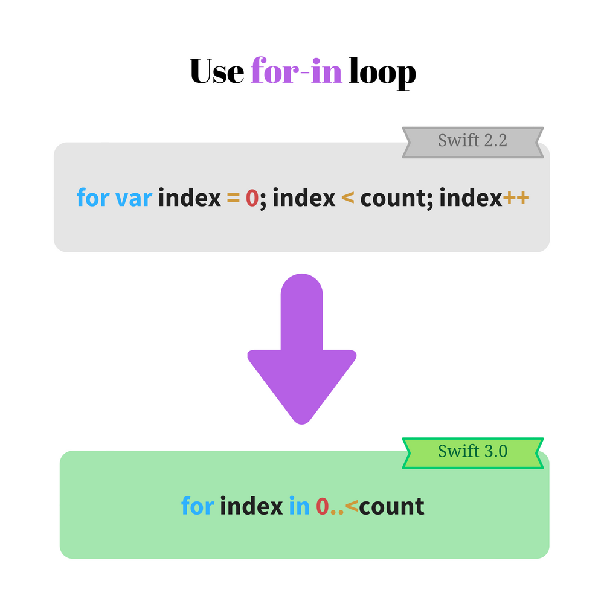
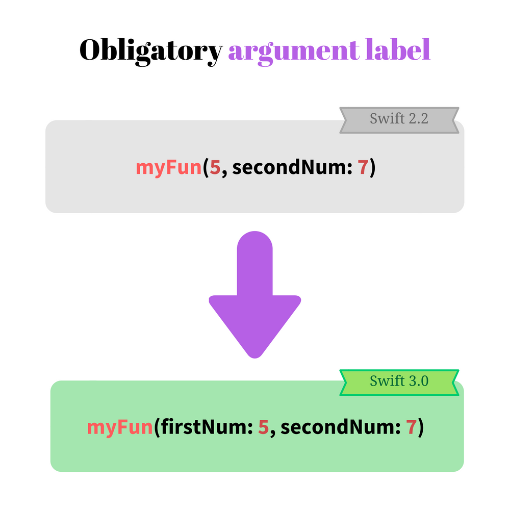

Not long ago the *3.0* version of Swift language was released. The new version is available in Xcode 8, or you can [download](https://swift.org/download/) the compiler directly from [swift.org](http://swift.org).

The new version has a lot of improvements in terms of code readability, function invocation consistency, better naming conventions and the removal of some C-style elements.  

In terms of readability, the `NS` prefix is [dropped for Foundation types](https://github.com/apple/swift-evolution/blob/master/proposals/0086-drop-foundation-ns.md#drop-ns-prefix). For instance, `NSBundle.mainBundle()` now becomes `Bundle.mainBundle()`.  

The C-style unary operators `++` and `--` are not available anymore in 3.0 version:

```swift
// Only in Swift 2.3 and earlier
var number = 10
number++
++number
number--
--number
```
The equivalents that must be used are `number += 1` or `number -= 1`.

Another interesting decision is the removal of C-style `for-loop`. I remember such style of writing loops from the school (in C language):  

```swift
// Only in Swift 2.3 and earlier
let steps = 5
for var step = 0; step < steps; step++ {
  print(step)
}
// 0 1 2 3 4
```
The main reason is the existence of better equivalents like `for-in` and `stride()`. 
`for-loop` is hard to understand on the fly and probably less-swifty. As it turns out, `for-loop` is not used much in existing Swift codebase.  

The article describes typical `for-loop` usage scenarios. And explains how easily to migrate to `for-in`, `stride()` or simple `while() {}`.

## 1. How to migrate `for-loop` to `for-in`

The typical scenario of `for-loop` application is to iterate over an interval of numbers. These numbers can be indexes of an array, and so on.
 
For example, let's iterate over the items of an array:

```swift
// Only in Swift 2.3 and earlier
let birds = ["pigeon", "sparrow", "titmouse"]
for var index = 0; index < birds.count; index++ {
  print(birds[index])
}
// "pigeon" "sparrow" "titmouse"
```
It's visible that `let index = 0; index < birds.count; index++` part of the loop is verbose. Many elements are redundant and the entire expression can be flatten.   
Instead of manual incrementation, the whole operation can be automated with a more expressive syntax.   



`for-in` loop is shorter and more expressive. Let's migrate the above code:  

```swift
let birds = ['pigeon', 'sparrow', 'titmouse']
for index in 0..<birds.count {
  print(birds[index])
}
// 'pigeon', 'sparrow', 'titmouse'
```
Much better now. `index in 0..<birds.count` is easier to read and understand.  
The part `0..<birds.count` defines an half-open interval of type [Range](http://swiftdoc.org/v3.0/type/Range/). `for-in` loop iterates over `0`, `1` and `2` range values (upper limit `3` is not included).    

And that's not all! You can even skip the index and access directly the array elements:  

```swift
let birds = ["pigeon", "sparrow", "titmouse"]
for bird in birds {
  print(bird)
}
// "pigeon" "sparrow" "titmouse"
```

As seen, for standard array or collection iteration `for-in` is a better alternative to `for-loop`. At least in this case, the decision to remove `for-loop` in Swift 3.0 is justified.  

## 2. How to migrate `for-loop` to `stride`

You may reasonable ask that `for-loop` is verbose, but still flexible. It is useful for more complex iterations.  

Let's try a scenario. Having an array of elements, you want to print elements with odd indexes. A `for-loop` case may look this way:  

```swift
// Only in Swift 2.3 and earlier
let colors = ["blue", "green", "red", "white", "black"]
for var index = 0; index < colors.count; index += 2 {
  print(colors[index])
}
// => "blue" "red" "black"
```
Because the index is increased by `2` according to `index += 2`, only the elements on odd indexes are displayed: `"blue"`, `"red"` and `"black"`.  

You may try to use the `for-in` and define a range. But an additional verification for index oddity is necessary:  

```swift
let colors = ["blue", "green", "red", "white", "black"]
for index in 0..<colors.count {
  if (index % 2 == 0) {
    print(colors[index])
  }
}
// => "blue" "red" "black"
```
Indeed `if (index % 2 == 0) { ... }` conditional doesn't look well here.  

For such situations fits good Swift's `stride(from: value, to: value, by: value)` function (see [docs](http://swiftdoc.org/v3.0/func/stride/)). Defining the start, end (upper limit not included) and step values, the function returns the corresponding sequence of numbers.  

Let's apply the stride in our scenario:  

```swift
let colors = ["blue", "green", "red", "white", "black"]
for index in stride(from: 0, to: colors.count, by: 2) {
  print(colors[index])
}
// => "blue" "red" "black"
```
`stride(from: 0, to: colors.count, by: 2)` returns numbers starting `0` until `5` (upper limit `5` not included), in a step by `2`. This is a good alternative to `for-loop`.  

If the upper limit must be included, there is a second form of the function:   
`stride(from: value, through: value, by: value)`. The second parameter label is `through`, which indicates that the upper limit is included.  

## 3. Other cases stick to `while`

C-style `for-loop` has a nice property that every component: the initialization, break verification and increment are fully configurable:

```swift
for <initialization>; <verification>; <increment> {
  // loop body
}
```

Moreover you can omit any of these components, if you can break the loop in `for-loop` body block.  

For example let's print the elements of an array of numbers and stop when `0` element is encountered. It possible to use the C-style `for-loop`:

```swift 
// Only in Swift 2.3 and earlier
let numbers = [1, 6, 2, 0, 7], nCount = numbers.count
for var index = 0; index < nCount && numbers[index] != 0; index++ {
  print(numbers[index])
}
// => 1 6 2
```
The verification part `index < nCount && numbers[index] != 0` checks also if `0` appears in the array. If it happens, the loop breaks.  
So only numbers until `0` are displayed: `1`, `6` and `2`.

`for var index in 0..<nCount` is one migration option. You just have to use a condition `if numbers[index] == 0` and break the loop when `0` appears:

```swift
let numbers = [1, 6, 2, 0, 7], nCount = numbers.count
for index in 0..<nCount {
  if (numbers[index] == 0) {
    break
  }
  print(numbers[index])
}
// => 1 6 2  
```

When `break` appears, it slightly decreases the reading flow. But I like the easy to read code flow! 

`while(<condition>) {...}` loop might be a better alternative. Let's see how the previous example is changed:

```swift
let numbers = [1, 6, 2, 0, 7], nCount = numbers.count
var index = 0
while (index < nCount && numbers[index] != 0) {
  print(numbers[index])
  index += 1
}
// => 1 6 2
```
If you have a case that do not stick into an inline `for-in` or `stride()`, I recommend to use a simple `while() {}`. 

## 4. Consistent argument label behavior

In Swift 2.3 and earlier you can omit the first argument label on function invocation:

```swift
// Only in Swift 2.3 and earlier
func sum(firstItem: Int, secondItem: Int) -> Int {
  return firstItem + secondItem
}
sum(5, secondItem: 2) // => 7
```
For me often the omission creates confusion. You have to omit the first argument label, but the rest of arguments are kept with labels. It's kind of unnatural rule.  



Fortunately starting version 3.0, the labels are obligatory for all arguments.  
Let's migrate the previous example:  

```swift
func sum(firstItem: Int, secondItem: Int) -> Int {
  return firstItem + secondItem
}
sum(firstItem: 5, secondItem: 2) // => 7
```
`myFun(firstParam: 1, secondParam: 2)` looks better. You strictly know the parameters meaning. Easy, consistent and clear approach.  

If for some reason you need to omit the first label on function invocation in Swift 3.0, use `_` as an argument label for that parameter:  

```swift
func sum(_ firstItem: Int, secondItem: Int) -> Int {
  return firstItem + secondItem
}
sum(5, secondItem: 2) // => 7
```

However I do not recommend this approach in the long run. It breaks the consistency of functions/methods invocation in the Swift code.  

[Swift naming guidelines](https://swift.org/documentation/api-design-guidelines/#naming) has many useful advice on naming.

## 5. Conclusion

Swift 3.0 has a nice list of changes. Many of them are breaking changes, so you have to put some efforts to migrate the Swift 2.3 or older code. 

The Swift makers apply considerable efforts to make the language comfortable as much as possible.  
Sometimes the process creates breaking changes. Fortunately it's a small price compared to increased code readability and consistency across the language syntax.  

C-style elements like `for-loop`, unary increment and decrement operators are removed. For these constructs  Swift offers better alternatives.  
For instance C-style `for-loop` is easily replaced by `for-in`. You may apply `stride()` function for a more configurable iteration.  

My favorite improvement is that Swift 3.0 introduced consistency and clarity in function parameter labels. Simple and easy to remember rule: always indicate argument labels.  

I suggest you to visit also the [official ](https://swift.org/migration-guide/)Swift 3.0 migration guide.

*Do you like the modifications in Swift 3.0? Express yourself in a comment below!*