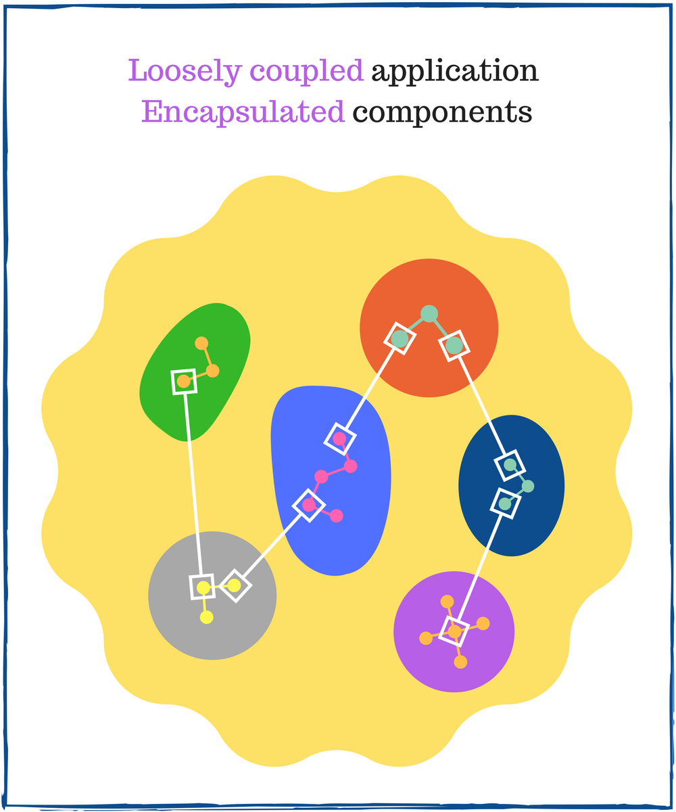

I like how React embraces component-based architecture. You can compose complex user interfaces from smaller pieces, take advantage of components reusability and abstracted DOM manipulations.  

Component-based development is productive: a complex system is built from specialized and easy to manage pieces. Yet only well designed components ensure composition and reusability benefits.  

Despite the application complexity, hurry to meet the deadlines and unexpectedly changing requirements, you must constantly walk on *the thin line of architectural correctness*. Make your components decoupled, focused on a single task, well tested.  


Unfortunately, it's tempting to follow the wrong path: write big components with many responsibilities, tightly couple components, forget about unit tests. These increase [technical debt](https://www.nczonline.net/blog/2012/02/22/understanding-technical-debt/), making progressively hard to modify existing or create new functionality.  

When writing a React application, I regularly ask myself:  

* How *to correctly structure the component*? 
* At what point a big component should *split into smaller components*?
* How to design *a communication between components that prevents tight coupling*?
 
Luckily, reliable components have common characteristics. Let's study these 7 useful criterias, and detail into case studies.  

Table of contents:  

1. ["Single responsibility"](#1-single-responsibility)  
  1.1 [The pitfall of multiple responsibilities](#11-the-pitfall-of-multiple-responsibilities)  
  1.2 [Case study: make component have one responsibility](#12-case-study-make-component-have-one-responsibility)  
  1.3 [Case study: HOC favors single responsibility principle](#13-case-study-hoc-favors-single-responsibility-principle)  
2. ["Encapsulated"](#2-encapsulated)  
  2.1 [Information hiding](#21-information-hiding)  
  2.2 [Communication](#22-communication)  
  2.3 [Case study: encapsulation restoration](#23-case-study-encapsulation-restoration)  
3. ["Composable"](#3-composable)  
  3.1 [Composition benefits](#31-composition-benefits)  
4. ["Reusable"](#4-reusable)  
  4.1 [Reuse across application](#41-reuse-across-application)  
  4.2 [Reuse of 3rd party libraries](#42-reuse-of-3rd-party-libraries)  
5. ["Pure" or "Almost-pure"](#5-pure-or-almost-pure)  
  5.1 [Case study: purification from global variables](#51-case-study-purification-from-global-variables)  
  5.2 [Case study: purification from network requests](#52-case-study-purification-from-network-requests)  
  5.3 [Transform almost-pure into pure](#53-transform-almost-pure-into-pure)  
6. ["Testable" and "Tested"](#6-testable-and-tested)  
  6.1 [Case study: testable means well designed](#61-case-study-testable-means-well-designed)  
7. ["Meaningful"](#7-meaningful)  
  7.1 [Component naming](#71-component-naming)  
  7.2 [Case study: write self-explanatory code](#72-case-study-write-self-explanatory-code)  
  7.3 [Expressiveness stairs](#73-expressiveness-stairs)  
8. [Do continuous improvement](#8-do-continuous-improvement)  
9. [Reliability is important](#9-reliability-is-important)  
10. [Conclusion](#10-conclusion)  

## 1. "Single responsibility"

> A component has a **single responsibility** when it has one reason to change.  

An fundamental rule to consider when writing React components is the [single responsibility principle](https://en.wikipedia.org/wiki/Single_responsibility_principle).  

Single responsibility principle (abbreviated SRP) requires a component to have *one reason to change*.  

A component has *one reason to change* when it implements one responsibility, or simpler when it does one thing.  

A responsibility is either to *render a list of items*, or *to show a date picker*, or *to make an HTTP request*, or *to draw a chart*, or *to lazy load an image*, etc. Your component should pick only one responsibility and implement it. When you modify the way component implements its responsibility (e.g. a change to limit the number of items for *render a list of items* responsibility) - it has one reason to change.  

Why is it important to have only *one reason to change*? Because component's modification becomes isolated and under control.  

Having one responsibility restricts the component size and makes it focused on one thing. A component focused on one thing is convenient to code, and later modify, reuse and test.  

Let's follow a few examples.  

<u>Example 1</u> A component fetches remote data, correspondingly it has *one reason to change when fetch logic changes*.  
A reason to change happens when:

* The server URL is modified
* The response format is modified 
* You want to use a different HTTP requests library  
* Or any modification related to fetch logic *only*.  

<u>Example 2</u> A table component maps an array of data to a list of row components, as result having *one reason to change when mapping logic changes*.  
A reason to change occurs when:  

* You have a task to limit the number of rendered row components (e.g. display up to 25 rows)  
* You're asked to show a message "The list is empty" when there are no items to display  
* Or any modification related to mapping of array to row components *only*.  

*Does your component have many responsibilities?* If the answer is *yes*, split the component into chunks by each individual responsibility.  

An alternative reasoning about the single responsibility principle says to create the component around a clearly distinguishable [axis of change](https://stackoverflow.com/questions/2952662/srp-axis-of-change). An axis of change attracts modifications of the same meaning.  
In the previous 2 examples, the axis of change were fetch logic and mapping logic.  

If you find SRP a bit obscured, check out [this article](https://8thlight.com/blog/uncle-bob/2014/05/08/SingleReponsibilityPrinciple.html).  

Units written at early project stage *will change often* until reaching the release stage. These *change often* components are required to be *easily modifiable in isolation*: a goal of the SRP.  

### 1.1 The pitfall of multiple responsibilities  

A common oversight happens when a component has multiple responsibilities. At first glance, this practice seems harmless and requires less work: 

* *You start coding right away*: no need to recognize the responsibilities and plan the structure accordingly    
* *One big component does it all*: no need to create components for each responsibility    
* *No split - no overhead*: no need to create props and callbacks for communication between split components.  

Such naive structuring is easy to code at the beginning. Difficulties will appear on later modifications, as the application grows and becomes more complex.  

A component that implements simultaneously multiple responsibilities has *many reasons to change*. Now emerges the main problem: changing the component for one reason *unintentionally* influences how other responsibilities are implemented by the same component.  


Such design is fragile. Unintentional side effects of are *hard to predict and control*.  

For example, `<ChartAndForm>` implements simultaneously 2 responsibilities to draw a chart, and handle a form that provides data for that chart. `<ChartAndForm>` has *2 reasons to change*: draw the chart and handle the form.  

When you change a form field (e.g. transform an `<input>` into a `<select>`), you can unintentionally break how chart is rendered. Moreover the chart implementation is non reusable, because it's coupled with the form details.  

Solving multiple responsibilities issue requires to split `<ChartAndForm>` in 2 components: `<Chart>` and `<Form>`. Each chunk has one responsibility: to draw the chart or correspondingly handle the form. The communication between the chunks is done through props.  

The worst case of multiple responsibilities problem is so called God component anti-pattern (an analogy of [God object](https://en.wikipedia.org/wiki/God_object)). A God component tends to know and do everything within the application. You might see it named `<Application>`, `<Manager>`, `<BigContainer>` or `<Page>`, having more than 500 lines of code.    

Dissolve God components by having them conform to SRP with the [help of composition](#31-composition-benefits).  

### 1.2 Case study: make component have one responsibility  

Imagine a component that makes an HTTP request to a specialized server to get the current weather. When data is successfully fetched, the same component uses the response to display the weather:   

```jsx
import axios from 'axios';
// Problem: A component with multiple responsibilities 
class Weather extends Component {
   constructor(props) {
     super(props);
     this.state = { temperature: 'N/A', windSpeed: 'N/A' };
   }
 
   render() {
     const { temperature, windSpeed } = this.state;
     return (
       <div className="weather">
         <div>Temperature: {temperature}°C</div>
         <div>Wind: {windSpeed}km/h</div>
       </div>
     );
   }
   
   componentDidMount() {
     axios.get('http://weather.com/api').then(function(response) {
       const { current } = response.data; 
       this.setState({
         temperature: current.temperature,
         windSpeed: current.windSpeed
       })
     });
   }
}
```

When dealing with alike situations, ask yourself: *do I have to split the component into smaller pieces*? The question is best answered by determining how component might change according to its responsibilities.  

The weather component has *2 reasons to change*:

1. Fetch logic in `componentDidMount()`: server URL or response format can be modified
* Weather visualization in `render()`: the way component displays the weather can change several times  

The solution is to divide `<Weather>` in 2 components: each having one responsibility. Let's name the chunks `<WeatherFetch>` and `<WeatherInfo>`.

First component `<WeatherFetch>` is responsible for fetching the weather, extracting response data and saving it to state. It has *one fetch logic reason to change*:  

```jsx
import axios from 'axios';
// Solution: Make the component responsible only for fetching
class WeatherFetch extends Component {
   constructor(props) {
     super(props);
     this.state = { temperature: 'N/A', windSpeed: 'N/A' };
   }
 
   render() {
     const { temperature, windSpeed } = this.state;
     return (
       <WeatherInfo temperature={temperature} windSpeed={windSpeed} />
     );
   }
   
   componentDidMount() {
     axios.get('http://weather.com/api').then(function(response) {
       const { current } = response.data; 
       this.setState({
         temperature: current.temperature,
         windSpeed: current.windSpeed
       });
     });
   }
}
```

What benefits brings such structuring?  

For instance, you would like to use `async/await` syntax instead of promises to get the response from server. This is a reason to change related to fetch logic:    

```jsx
// Reason to change: use async/await syntax
class WeatherFetch extends Component {
   // ..... //
   async componentDidMount() {
     const response = await axios.get('http://weather.com/api');
     const { current } = response.data; 
     this.setState({
       temperature: current.temperature,
       windSpeed: current.windSpeed
     });
   }
}
```
Because `<WeatherFetch>` has one fetch logic reason to change, any modification of this component happens in isolation. Using `async/await` does not affect directly the way weather is displayed.  

Then `<WeatherFetch>` renders `<WeatherInfo>`. The latter is responsible only for displaying the weather, having *one visual reason to change*:

```jsx
// Solution: Make the component responsible for displaying the weather
function WeatherInfo({ temperature, windSpeed }) {
   return (
     <div className="weather">
       <div>Temperature: {temperature}°C</div>
       <div>Wind: {windSpeed} km/h</div>
     </div>
   );
}
```

Let's change `<WeatherInfo>` that instead of `"Wind: 0 km/h"` display `"Wind: calm"`. That's a reason to change related to visual display of weather:  

```jsx
// Reason to change: handle calm wind  
function WeatherInfo({ temperature, windSpeed }) {
   const windInfo = windSpeed === 0 ? 'calm' : `${windSpeed} km/h`;
   return (
     <div className="weather">
       <div>Temperature: {temperature}°C</div>
       <div>Wind: {windInfo}</div>
     </div>
   );
}
```
Again, this modification of `<WeatherInfo>` happens in isolation and does not affect  `<WeatherFetch>` component.  

`<WeatherFetch>` and `<WeatherInfo>` have their own one responsibility. A change of one component has small effect on the other one. That's the power of single responsibility principle: modification in isolation that affects lightly and predictability other components of the system.  

### 1.3 Case study: HOC favors single responsibility principle  

Applying composition with chunking components by responsibilities doesn't always help to conform to single responsibility principle. You can benefit from another efficient practice called Higher order components (abbreviated HOC):  

> **Higher order component** is a function that takes one component and returns a new component.  

A common usage of HOC is to provide the wrapped component with additional props or modify existing prop values. This technique is called *props proxy*:    

```jsx
function withNewFunctionality(WrappedComponent) {
  return class NewFunctionality extends Component {
    render() {
      const newProp = 'Value';
      const propsProxy = {
         ...this.props,
         // Alter existing prop:
         ownProp: this.props.ownProp + ' was modified',
         // Add new prop:
         newProp
      };
      return <WrappedComponent {...propsProxy} />;
    }
  }
}
const MyNewComponent = withNewFunctionality(MyComponent);
```

You can also hook into render mechanism by altering elements that wrapped component renders. This HOC technique is named *render highjacking*:

```jsx
function withModifiedChildren(WrappedComponent) {
  return class ModifiedChildren extends WrappedComponent {
    render() {
      const rootElement = super.render();
      const newChildren = [
        ...rootElement.props.children, 
        // Insert a new child:
        <div>New child</div>
      ];
      return cloneElement(
        rootElement, 
        rootElement.props, 
        newChildren
      );
    }
  }
}
const MyNewComponent = withModifiedChildren(MyComponent);
```

If you want to deep dive into HOCs practice, I recommend to read ["React Higher Order Components in depth"](https://medium.com/@franleplant/react-higher-order-components-in-depth-cf9032ee6c3e).  

Let's follow an example how props proxy HOC technique helps separating responsibilities.  

The component `<PersistentForm>` consists of an input field and a button *Save to storage*. Input field value is read/saved to local storage. After changing the input value, hitting *Save to storage* writes it to storage.  

Let's look at the demo:

<iframe width="100%" height='265' scrolling='no' title='Persistent form' src='//codepen.io/dmitri_pavlutin/embed/NaGgVw/?height=265&theme-id=0&default-tab=result&embed-version=2' frameborder='no' allowtransparency='true' allowfullscreen='true' style='width: 100%;'>See the Pen <a href='https://codepen.io/dmitri_pavlutin/pen/NaGgVw/'>Persistent form</a> by Dmitri Pavlutin (<a href='https://codepen.io/dmitri_pavlutin'>@dmitri_pavlutin</a>) on <a href='https://codepen.io'>CodePen</a>.
</iframe>

On input field change component's state gets updated inside `handleChange(event)` method. On button click the value is saved to local storage in `handleClick()`:  

```jsx
class PersistentForm extends Component {  
  constructor(props) {
    super(props);
    this.state = { inputValue: localStorage.getItem('inputValue') };
    this.handleChange = this.handleChange.bind(this);
    this.handleClick = this.handleClick.bind(this);
  }

  render() {
    const { inputValue } = this.state;
    return (
      <div className="persistent-form">
        <input type="text" value={inputValue} 
          onChange={this.handleChange}/> 
        <button onClick={this.handleClick}>Save to storage</button>
      </div>
    );
  }

  handleChange(event) {
    this.setState({
      inputValue: event.target.value
    });
  }

  handleClick() {
    localStorage.setItem('inputValue', this.state.inputValue);
  }
}
```

Unfortunately `<PersistentForm>` has 2 responsibilities: manage form fields and saving the input value to store.  

Let's refactor `<PersistentForm>` to have one responsibility: render form fields and attach event handlers. It shouldn't know how to use storage directly:  

```jsx
class PersistentForm extends Component {  
  constructor(props) {
    super(props);
    this.state = { inputValue: props.initialValue };
    this.handleChange = this.handleChange.bind(this);
    this.handleClick = this.handleClick.bind(this);
  }

  render() {
    const { inputValue } = this.state;
    return (
      <div className="persistent-form">
        <input type="text" value={inputValue} 
          onChange={this.handleChange}/> 
        <button onClick={this.handleClick}>Save to storage</button>
      </div>
    );
  }

  handleChange(event) {
    this.setState({
      inputValue: event.target.value
    });
  }

  handleClick() {
    this.props.saveValue(this.state.inputValue);
  }
}
```
The component receives the stored input value from a prop `initialValue`, and saves the input value using a prop function `saveValue(newValue)`. These props are provided by `withPersistence()` HOC using props proxy technique.  

Now `<PersistentForm>` conforms to SRP. Its only reason to change is the form field modifications.  

The responsibility of querying and saving to local storage goes to `withPersistence()` HOC: 

```jsx
function withPersistence(storageKey, storage) {
  return function(WrappedComponent) {
    return class PersistentComponent extends Component {
      constructor(props) {
        super(props);
        this.state = { initialValue: storage.getItem(storageKey) };
      }

      render() {
         return (
           <WrappedComponent
             initialValue={this.state.initialValue}
             saveValue={this.saveValue}
             {...this.props}
           />
         );
      }

      saveValue(value) {
        storage.setItem(storageKey, value);
      }
    }
  }
}
```

`withPersistence()` is a HOC which responsibility is persistence. It doesn't know any details about form fields. It has one focused job: provide the wrapped component with `initialValue` string and `saveValue()` function.  

Wiring up together `<PersistentForm>` and `withPersistence()` creates a new component `<LocalStoragePersistentForm>`. It is connected with the local storage and ready to be used within the application:  

```jsx
const LocalStoragePersistentForm 
  = withPersistence('key', localStorage)(PersistentForm);

const instance = <LocalStoragePersistentForm />;
```

As long as `<PersistentForm>` uses correctly `initialValue` and `saveValue()` props, any modification of this component cannot break the logic of saving to storage that `withPersistence()` holds.  

And vice versa: as long as `withPersistence()` provides the correct `initialValue` and `saveValue()`, any modification of the HOC cannot break the way `<PersistentForm>` handles the form fields.  

Again emerges the efficiency of SRP: allowing you to make modifications in isolation that less affect other parts of the system.  

Moreover the code reusability increases. You can connect any other form `<MyOtherForm>` to local storage:  

```jsx
const LocalStorageMyOtherForm
  = withPersistence('key', localStorage)(MyOtherForm);

const instance = <LocalStorageMyOtherForm />;
```

You can easily change the type of storage to `sessionStorage` (which gets cleared when the page session ends):  

```jsx
const SessionStoragePersistentForm 
  = withPersistence('key', sessionStorage)(PersistentForm);

const instance = <SessionStoragePersistentForm />;
```

The isolation of modification and reusability benefits are not possible with the initial version of `<PersistentForm>`, which incorrectly had multiple responsibilities.  

In situations when composition is ineffective, props proxy and render highjacking HOC techniques are useful in making component have one responsibility.  

## 2. "Encapsulated"

> An **encapsulated** component provides props to control its behavior while not exposing its internal structure.  

[Coupling](https://en.wikipedia.org/wiki/Coupling_(computer_programming)) is a system characteristic that determines the degree of dependency between components. 

Based on the degree of components dependence, 2 coupling types are distinguishable:     

* *Loose coupling* happens when the application components have little or no knowledge about other components.
* *Tight coupling* happens when the application components know a lot of details about each other.   

Loose coupling is the goal when designing application's structure and the relationship between components.  



Loose coupling leads to the following benefits:  

* Allow making changes in one area of the application *without affecting others*
* Any component can be *replaced with an alternative* implementation
* Enables components *reusability* across the application, thus favoring [Don't repeat yourself](https://en.wikipedia.org/wiki/Don%27t_repeat_yourself) principle
* Independent components are *easier to test*, increasing the application code coverage  

Contrary, a tightly coupled system looses the benefits described above. The main drawback is the difficulty to modify a component that is highly dependent on other components. Even a single modification might lead to a cascade of  dependency *echo* modifications.  


**Encapsulation**, or **Information Hiding**, is a fundamental principle of how to design components, and is the key to loose coupling.  

### 2.1 Information hiding

A well encapsulated component *hides its internal structure* and provides a set of *props to control its behavior*.  

Hiding internal structure is essential. Other components are not allowed to know or rely on the component's internal structure or implementation details.  

A React component can be functional or class based, define instance methods, setup refs, have state or use lifecycle methods. These implementation details are encapsulated within the component itself, and other components shouldn't know anything about these details.  

Units that precisely hide their internal structure are less dependent on each other. Lowering the dependency degree brings the benefits of loose coupling.  

### 2.2 Communication

Details hiding is a restriction that isolates the component. Nevertheless, you need a way to make components communicate. So welcome the props.  

Props are meant to be plain, raw data that are component's input.  

A prop is recommended to be a *primitive type* (e.g. string, number, boolean):  

```jsx
<Message text="Hello world!" modal={false} />;
```

When necessary use a complex data structure like *objects or arrays*:  

```jsx
<MoviesList items={['Batman Begins', 'Blade Runner']} />
```

Prop as a *function* handles events and async behavior:
```jsx
<input type="text" onChange={handleChange} />
```

A prop can be even a *component constructor*. A component can take care of other component's instantiation:  

```jsx
function If({ component: Component, condition }) {
  return condition ? <Component /> : null;
}
<If condition={false} component={LazyComponent} />  
```

To avoid breaking encapsulation, watch out the details passed through props. A parent component that sets child props should not expose any details about its internal structure. For example, it's a bad decision to transmit using props the whole component instance or refs.  

Accessing global variables is another problem that negatively affects encapsulation.  

### 2.3 Case study: encapsulation restoration  

Component's instance and state object are implementation details encapsulated inside the component. Thus a certain way to break the encapsulation is to pass the parent instance for state management to a child component.  

Let's study such a situation.   

A simple application shows a number and 2 buttons. First button increases and second button decreases the number:  

<iframe width="100%" height='265' scrolling='no' title='Increase or decrease the number' src='//codepen.io/dmitri_pavlutin/embed/BdWRpq/?height=265&theme-id=0&default-tab=result&embed-version=2' frameborder='no' allowtransparency='true' allowfullscreen='true' style='width: 100%;'>See the Pen <a href='https://codepen.io/dmitri_pavlutin/pen/BdWRpq/'>Increase or decrease the number</a> by Dmitri Pavlutin (<a href='https://codepen.io/dmitri_pavlutin'>@dmitri_pavlutin</a>) on <a href='https://codepen.io'>CodePen</a>.
</iframe>

The application consists of two components: `<App>` and `<Controls>`.

`<App>` holds the state object that contains the modifiable number as a property, and renders this number:

```jsx
// Problem: Broken encapsulation
class App extends Component {
  constructor(props) {
    super(props);
    this.state = { number: 0 };
  }
  
  render() {
    return (
      <div className="app"> 
        <span className="number">{this.state.number}</span>
        <Controls parent={this} />
      </div>
    );
  }
}
```

`<Controls>` renders the buttons and attaches click event handlers to them. When user clicks a button, parent component state is updated (`updateNumber()` method) by increasing `+1` or decreasing `-1` the displayed number:  

```jsx
// Problem: Using internal structure of parent component
class Controls extends Component {
  render() {
    return (
      <div className="controls">
        <button onClick={() => this.updateNumber(+1)}>
          Increase
        </button> 
        <button onClick={() => this.updateNumber(-1)}>
          Decrease
        </button>
      </div>
    );
  }
  
  updateNumber(toAdd) {
    this.props.parent.setState(prevState => ({
      number: prevState.number + toAdd       
    }));
  }
}
```

What is wrong with the current implementation? The demo at the beginning of the chapter shows sort of working application.  

The first problem is `<App>`'s *broken encapsulation*, since its internal structure spreads across the application. `<App>` incorrectly permits `<Controls>` to update its state directly.  

Consequently, the second problem is that `<Controls>` knows too many details about its parent `<App>`. It has access to parent instance, knows that parent is a stateful component, knows the state object structure (`number` property) and knows how to update the state.  

The broken encapsulation couples `<App>` and `<Controls>` components.  

A troublesome outcome is that `<Controls>` would be complicated to test (see [6.1 Case study](#61-case-study-testable-means-well-designed)) and reuse. A slight modification to structure of `<App>` leads to cascade of modifications to `<Controls>` (and to alike coupled components in case of a bigger application).  

The solution is to design a convenient communication interface that respects *loose coupling* and *strong encapsulation*. Let's improve the structure and props of both components in order to restore the encapsulation.  

Only the component itself should know its state structure. The state management of `<App>` should move from `<Controls>` (`updateNumber()` method)  in the right place: `<App>` component.  

Later, `<App>` is modified to provide `<Controls>` with props `onIncrease` and `onDecrease`. These are simple callbacks that update `<App>` state:    

```jsx
// Solution: Restore encapsulation
class App extends Component {  
  constructor(props) {
    super(props);
    this.state = { number: 0 };
  }

  render() {
    return (
      <div className="app"> 
        <span className="number">{this.state.number}</span>
        <Controls 
          onIncrease={() => this.updateNumber(+1)}
          onDecrease={() => this.updateNumber(-1)} 
        />
      </div>
    );
  }

  updateNumber(toAdd) {
    this.setState(prevState => ({
      number: prevState.number + toAdd       
    }));
  }
}
```

Now `<Controls>` receives callbacks for increasing and decreasing the number. Notice the decoupling and encapsulation restoration moment: `<Controls>` has no longer the need to access parent instance and modify `<App>` state directly.  

Moreover `<Controls>` is transformed into a functional component:  

```jsx
// Solution: Use callbacks to update parent state
function Controls({ onIncrease, onDecrease }) {
  return (
    <div className="controls">
      <button onClick={onIncrease}>Increase</button> 
      <button onClick={onDecrease}>Decrease</button>
    </div>
  );
}
```

`<App>` encapsulation is now restored. The component manages its state by itself, as it should be.  

Furthermore `<Controls>` no longer depends on `<App>` implementation details. `onIncrease` and `onDecrease` prop functions are called when corresponding button is clicked, and `<Controls>` does not know (and *should not know*) what happens inside those functions.  

`<Controls>` reusability and testability  significantly increased.  

The reuse of `<Controls>` is convenient because it requires only callbacks, without any other dependencies. Testing is also handy: just verify whether callbacks are executed on buttons click (see [6.1 Case study](#61-case-study-testable-means-well-designed)).  

## 3. "Composable"

> A **composable** component is created from the composition of smaller specialized  components.  

Composition is a way to combine components to create a bigger (composed) component. [Composition is the heart of React](https://medium.com/@dan_abramov/youre-missing-the-point-of-react-a20e34a51e1a).  

Fortunately, composition is easy to understand. Take a set of small pieces, combine them, and create a bigger thing.  


Let's look at a common frontend application composition pattern. The application is composed of a header at the top, footer at the bottom, sidebar on the left and payload content in the middle:  

<iframe width="100%" height='400' scrolling='no' title='The composition of a modern Frontend application' src='//codepen.io/dmitri_pavlutin/embed/EvQJZx/?height=265&theme-id=0&default-tab=result&embed-version=2' frameborder='no' allowtransparency='true' allowfullscreen='true' style='width: 100%;'>See the Pen <a href='https://codepen.io/dmitri_pavlutin/pen/EvQJZx/'>The composition of a modern Frontend application</a> by Dmitri Pavlutin (<a href='https://codepen.io/dmitri_pavlutin'>@dmitri_pavlutin</a>) on <a href='https://codepen.io'>CodePen</a>.
</iframe>

The application skeleton demonstrates how well composition builds the application. Such organization is expressive and open for understanding.  

React composes components expressively and naturally. The library uses a [declarative paradigm](https://en.wikipedia.org/wiki/Declarative_programming) that doesn't suppress the expressiveness of composition. The following components render the described application: 

```jsx
const app = (
  <Application>
    <Header />
    <Sidebar>
      <Menu />
    </Sidebar>
    <Content>
      <Article />
    </Content>
    <Footer />
  </Application>
);
```

`<Application>` is composed of `<Header>`, `<Sidebar>`, `<Content>` and `<Footer>`.  
`<Sidebar>` has one component `<Menu>`, as well as `<Content>` has one `<Article>`.  

How does composition relate with single responsibility and encapsulation? Let's see:  

> **Single responsibility principle** describes how to split requirements into components, **encapsulation** describes how to organize these components, and **composition** describes how to glue the whole system back.  

### 3.1 Composition benefits  

#### Single responsibility  
An important aspect of composition is the ability *to compose complex components from smaller specialized components*. This [divide and conquer](https://en.wikipedia.org/wiki/Divide_and_rule) approach helps an authority component  conform to single responsibility principle.  

Recall the previous code snippet. `<Application>` has the responsibility to render the header, footer, sidebar and main regions.  

Makes sense to divide this responsibility into four sub-responsibilities, each of which is implemented by specialized components `<Header>`, `<Sidebar>`, `<Content>` and `<Footer>`. Later composition glues back `<Application>` from these specialized components.  

Now comes up the benefit. Composition makes `<Application>` conform to single responsibility principle, by allowing its children to implement the sub-responsibilities.  

#### Reusability
Components using composition can reuse common logic. This is the benefit of *reusability*.  

For instance, components `<Composed1>` and `<Composed2>` share common code:   
```jsx
const instance1 = (
  <Composed1>
    /* Specific to Composed1 code... */
    /* Common code... */
  </Composed1>
);
const instance2 = (
  <Composed2>
    /* Common code... */
    /* Specific to Composed2 code... */
  </Composed2>
);
```
Since code duplication is a bad practice, how to make components reuse common code?  

Firstly, encapsulate common code in a new component `<Common>`. Secondly, `<Composed1>` and `<Composed2>` should use composition to include `<Common>`, fixing code duplication:  

```jsx
const instance1 = (
  <Composed1>
    <Piece1 />
    <Common />
  </Composed1>
);
const instance2 = (
  <Composed2>
    <Common />
    <Piece2 />
  </Composed2>
);
```  

Reusable components favor [Don't repeat yourself](https://en.wikipedia.org/wiki/Don%27t_repeat_yourself) (DRY) principle. This beneficial practice saves efforts and time.  

#### Flexibility  

In React a composable component can control its children, usually through `children` prop. This leads to another benefit of *flexibility*.  

For example, a component should render a message depending on user's device. Use composition's flexibility to implement this requirement:  

```jsx
function ByDevice({ children: { mobile, other } }) {
  return Utils.isMobile() ? mobile : other;
}

<ByDevice>{{
  mobile: <div>Mobile detected!</div>,
  other:  <div>Not a mobile device</div>
}}</ByDevice>
```
`<ByDevice>` composed component renders the message `"Mobile detected!"` for a mobile, and `"Not a mobile device"` for other devices.   

#### Efficiency
User interfaces are composable hierarchical structures. Thus composition of components is an *efficient* way to construct user interfaces. 

## 4. "Reusable"

> A **reusable** component is written once but used multiple times.  

Imagine a fantasy world where software development is mostly reinventing the wheel.  

When coding, you can't use any existing libraries or utilities. Even across the application you can't use code that you already wrote.  

In such environment, would it be possible to write an application in a reasonable amount of time? Definitely not.  

Welcome reusability. Make things work, not reinvent how they work.  

### 4.1 Reuse across application  

According to *Don't repeat yourself* (DRY) principle, every piece of knowledge must have a single, unambiguous, authoritative representation within a system. The principle advises to avoid repetition.  

Code repetition increases complexity and maintenance efforts without adding significant value. An update of the logic forces you to modify all its clones within the application.  

Repetition problem is solved with reusable components. Write once and use many times: efficient and time saving strategy.  

However you don't get reusability property for free. A component is *reusable* when it conforms to *single responsibility principle* and has correct *encapsulation*.  

Conforming to single responsibility is essential: 

> **Reuse** of a component actually means the reuse of its **responsibility implementation**.  

Components that have only one responsibility are the easiest to reuse.  

But when a component incorrectly has multiple responsibilities, its reusage adds a heavy overhead. You want to reuse only one responsibility implementation, but also you get the unneeded implementation of out of place responsibilities.  

You want a banana, and you get a banana, plus all the jungle with it.  

Correct encapsulation creates a component that doesn't stuck with dependencies. Hidden internal structure and focused props enable the component to fit nicely in multiple places where it's about to be reused.  

### 4.2 Reuse of 3rd party libraries  

A regular working day. You've just read the task to add a new feature to the application. Before firing up the text editor, hold on for a few minutes...

There's a big chance that the problem you start working on is already solved. Due to React's popularity and great open source community, it worth searching for an existing solution. 

Check out [brillout/awesome-react-components](https://github.com/brillout/awesome-react-components) repository, which has a compiled list of reusable components.   

Good libraries positively affect architectural decisions and advocate best practices. In my experience, the top influencers are `react-router` and `redux`.  

[react-router](https://github.com/ReactTraining/react-router/) uses declarative routing to structure a Single Page Application.  
Associate a URL path with your component using `<Route>`. Then router will render the component for you when user visits the matched URL.  

[redux](http://redux.js.org/) and [react-redux](https://github.com/reactjs/react-redux) HOC introduce unidirectional and predictable application state management. It extracts async and impure code (like HTTP requests) out of components, favoring single responsibility principle and creating [pure or almost-pure components](#5-pure-or-almost-pure).   

To be sure that a 3rd party library is worth using, here's my checklist:  

* *Documentation*: verify whether the library has meaningful readme.md file and detailed documentation  
* *Tested*: a sign of trustworthy library is high code coverage   
* *Maintenance*: see how often the library author creates new features, fixes bugs  and generally maintains the library.  

## 5. "Pure" or "Almost-pure"

> A **pure** component always renders same elements for same prop values.  
An **almost-pure** component always renders same elements for same prop values, and can produce a side effect.  

In functional programming terms, a *pure* function always returns the same output  for given the same input. Let's see a simple pure function:

```javascript
function sum(a, b) {
  return a + b;
}
sum(5, 10); // => 15
```
For given two numbers, `sum()` function always returns the same sum.  

A function becomes *impure* when it returns different output for same input. It can happen because the function relies on global state. For example:  

```javascript
let said = false;

function sayOnce(message) {
  if (said) {
    return null;
  }
  said = true;
  return message;
}

sayOnce('Hello World!'); // => 'Hello World!'
sayOnce('Hello World!'); // => null
```
`sayOnce('Hello World!')` on first call returns `'Hello World!'`.  

Even when using same argument `'Hello World!'`, on later invocations `sayOnce()` returns `null`.  That's the sign of an impure function that relies on a global state: `said` variable.  

`sayOnce()` body has a statement `said = true` that modifies the global state. This produces a *side effect*, which is another sign of impure function.  

Consequently, pure functions have no side effects and don't rely on global state. Their single source of truth are parameters. Thus pure functions are predictable and determined, are reusable and straightforward to test.  

React components should benefit from pure property. Given the same prop values, a pure component (not to be confused with [React.PureComponent](https://facebook.github.io/react/docs/react-api.html#react.purecomponent)) always renders the same elements. Let's take a look:  

```jsx
function Message({ text }) {
  return <div className="message">{text}</div>;
}

<Message text="Hello World!" /> 
// => <div class="message">Hello World</div>
```
You are guaranteed that `<Message>` for the same `text` prop value renders the same elements.  

It's not always possible to make a component pure. Sometimes you have to ask the environment for information, like in the following case:  

```jsx
class InputField extends Component {
  constructor(props) {
    super(props);
    this.state = { value: '' };
    this.handleChange = this.handleChange.bind(this);
  }

  handleChange({ target: { value } }) {
    this.setState({ value });
  }

  render() {
    return (
      <div>
         <input 
           type="text" 
           value={this.state.value} 
           onChange={this.handleChange} 
         />
         You typed: {this.state.value}
      </div>
    );
  }
}
```
`<InputField>` stateful component doesn't accept any props, however renders different output depending on what user types into the input. `<InputField>` has to be impure, because it accesses the environment through input field.  

Impure code is a necessary evil. Most of the applications require global state, network requests, local storage and alike. What you can do is *isolate impure code from pure*, a.k.a. apply purification on your components.  


Isolated impure code explicitly shows it has side effects, or rely on global state. Being in isolation, impure code has less unpredictability effect on the rest of the system.  

Let's detail into purification examples.  

### 5.1 Case study: purification from global variables

I don't like global variables. They break encapsulation, create unpredictable behavior and make testing difficult.  

Global variables can be used as mutable or immutable (read-only) objects.  

Mutating global variables create uncontrolled behavior of components. Data is injected and modified at will, confusing [reconciliation](https://facebook.github.io/react/docs/reconciliation.html) process. This is a mistake. 

If you need a mutable global state, the solution is a predictable application state management. Consider using [Redux](http://redux.js.org/).  

An immutable (or read-only) usage of globals is often application's configuration object. This object contains the site name, logged-in user name or any other configuration information.  

The following statement defines a configuration object that holds the site name:  

```jsx
export const globalConfig = {
  siteName: 'Animals in Zoo'
};
```

Next, `<Header>` component renders the header of an application, including the display of site name `"Animals in Zoo"`:  

```jsx
import { globalConfig } from './config';

export default function Header({ children }) {
  const heading = 
    globalConfig.siteName ? <h1>{globalConfig.siteName}</h1> : null;
  return (
     <div>
       {heading}
       {children}
     </div>
  );
}
```

`<Header>` component uses `globalConfig.siteName` to render site name inside a heading tag `<h1>`. When site name is not defined (i.e. `null`), the heading is not displayed.  

The first to notice is that `<Header>` is impure. Given same value of `children`, the component returns different results because of `globalConfig.siteName` variations:  

```jsx
// globalConfig.siteName is 'Animals in Zoo'
<Header>Some content</Header>
// Renders:
<div>
  <h1>Animals in Zoo</h1>
  Some content
</div>
```

or:

```jsx
// globalConfig.siteName is `null`
<Header>Some content</Header>
// Renders:
<div>
  Some content
</div>
```

The second problem is testing difficulties. To test how component handles `null` site name, you have to modify the global variable `globalConfig.siteName = null` manually:  

```jsx
import assert from 'assert';
import { shallow } from 'enzyme';
import { globalConfig } from './config';
import Header from './Header';

describe('<Header />', function() {
  it('should render the heading', function() {
    const wrapper = shallow(
      <Header>Some content</Header>
    );
    assert(wrapper.contains(<h1>Animals in Zoo</h1>));
  });

  it('should not render the heading', function() {
    // Modification of global variable:
    globalConfig.siteName = null;
    const wrapper = shallow(
      <Header>Some content</Header>
    );
    assert(appWithHeading.find('h1').length === 0);
  });
});
```

The modification of global variable `globalConfig.siteName = null` for sake of testing is hacky and uncomfortable. It happens because `<Heading>` has a tight dependency on globals.  

To solve such impurities, rather than injecting globals into component's scope, make the global variable an input of the component.  

Let's modify `<Header>` to accept one more prop `siteName`. Then wrap the component with [defaultProps()](https://github.com/acdlite/recompose/blob/master/docs/API.md#defaultprops) higher order component (HOC) from [recompose](https://github.com/acdlite/recompose) library. `defaultProps()` ensures fulfilling the missing props with default values:  

```jsx
import { defaultProps } from 'recompose';
import { globalConfig } from './config';

export function Header({ children, siteName }) {
  const heading = siteName ? <h1>{siteName}</h1> : null;
  return (
     <div className="header">
       {heading}
       {children}
     </div>
  );
}

export default defaultProps({
  siteName: globalConfig.siteName
})(Header);
```
`<Header>` becomes a pure functional component, and does not depend directly on `globalConfig` variable. The pure version is a named export: `export function Header() {...}`, which is useful for testing.  

At the same time, the wrapped component with `defaultProps({...})` sets `globalConfig.siteName` when `siteName` prop is missing. That's the place where impure code is separated and isolated.  

Let's test the pure version of `<Header>` (remember to use a named import):  
```jsx
import assert from 'assert';
import { shallow } from 'enzyme';
import { Header } from './Header'; // Import the pure Header

describe('<Header />', function() {
  it('should render the heading', function() {
    const wrapper = shallow(
      <Header siteName="Animals in Zoo">Some content</Header>
    );
    assert(wrapper.contains(<h1>Animals in Zoo</h1>));
  });

  it('should not render the heading', function() {
    const wrapper = shallow(
      <Header siteName={null}>Some content</Header>
    );
    assert(appWithHeading.find('h1').length === 0);
  });
});
```
This is great. Unit testing of pure `<Header>` is straightforward. The test does  one thing: verify whether the component renders the expected elements for a given input. No need to import, access or modify global variables, no side effects magic.  

Well designed components are easy to test (statement detailed in [chapter 6](#6-testable-and-tested)), which is visible in case of pure components.  

### 5.2 Case study: purification from network requests

Recall `<WeatherFetch>` component from [1.2 Case study](#12-case-study-make-component-have-one-responsibility). On mount it makes a network request to get the information about the weather:  

```jsx
class WeatherFetch extends Component {  
   constructor(props) {
     super(props);
     this.state = { temperature: 'N/A', windSpeed: 'N/A' };
   }

   render() {
     const { temperature, windSpeed } = this.state;
     return (
       <WeatherInfo temperature={temperature} windSpeed={windSpeed} />
     );
   }

   componentDidMount() {
     axios.get('http://weather.com/api').then(function(response) {
       const { current } = response.data; 
       this.setState({
         temperature: current.temperature,
         windSpeed: current.windSpeed
       })
     });
   }
}
```
`<WeatherFetch>` is impure because for same input it produces different output. What component renders depends on the server response.  

Unfortunately, HTTP request side effect cannot be eliminated. Fetching data from server is `<WeatherFetch>`'s direct responsibility.  

However you can make `<WeatherFetch>` render the same output for same prop values. Then isolate the side effect to a prop function call `fetch()`. Such a component type is named *almost-pure*.  

Let's transform `<WeatherFetch>` from an impure to an almost-pure component. Redux works great by extracting side effects implementation details out of the component.  In this sense, some setup of Redux constructions is required. 

`fetch()` action creator starts the server call:

```javascript
export function fetch() {
  return {
    type: 'FETCH'
  };
}
```

A [saga](https://redux-saga.js.org/) intercepts `"FETCH"` action , and makes the actual call to server. When the request is done, `"FETCH_SUCCESS"` action is dispatched:  

```jsx
import { call, put, takeEvery } from 'redux-saga/effects';

export default function* () {
  yield takeEvery('FETCH', function* () {
    const response = yield call(axios.get, 'http://weather.com/api');
    const { temperature, windSpeed } = response.data.current;
    yield put({
      type: 'FETCH_SUCCESS',
      temperature,
      windSpeed
    });
  });
}
```

The reducer is responsible for updating the application state:  

```jsx
const initialState = { temperature: 'N/A', windSpeed: 'N/A' };

export default function(state = initialState, action) {
  switch (action.type) {
    case 'FETCH_SUCCESS': 
      return {
        ...state,
        temperature: action.temperature,
        windSpeed: action.windSpeed
      };
    default:
      return state;
  }
}
```

(Redux store and sagas initialization are omitted for simplicity.)  

Even thought using Redux requires additional constructions like actions, reducers and sagas, it helps making `<FetchWeather>` almost-pure.  

Let's modify `<WeatherFetch>` to work with Redux:

```jsx
import { connect } from 'react-redux';
import { fetch } from './action';

export class WeatherFetch extends Component {
   render() {
     const { temperature, windSpeed } = this.props;
     return (
       <WeatherInfo temperature={temperature} windSpeed={windSpeed} />
     );
   }

   componentDidMount() {
     this.props.fetch();
   }
}

function mapStateToProps(state) {
  return {
    temperature: state.temperate,
    windSpeed: state.windSpeed
  };
}
export default connect(mapStateToProps, { fetch });
```

`connect(mapStateToProps, { fetch })` HOC wraps `<WeatherFetch>`. 

When the component mounts, `this.props.fetch()` action creator is called, triggering a server request. When the request finishes, Redux updates the application state, making `<WeatherFetch>` receive `temperature` and `windSpeed` from props.  

`this.props.fetch()` is the isolated and compressed impure code that generates the side effect. Thanks to Redux, the component is not cluttered with the details about using `axios` library, server URL or resolving promises. Moreover, the new version of `<WeatherFetch>` always renders same elements for same prop values. The component becomes *almost-pure*.  

Contrary to the impure version, testing of the almost-pure `<WeatherFetch>` is easier:  

```jsx
import assert from 'assert';
import { shallow, mount } from 'enzyme';
import { spy } from 'sinon';
// Import the almost-pure version WeatherFetch
import { WeatherFetch } from './WeatherFetch';
import WeatherInfo from './WeatherInfo';

describe('<WeatherFetch />', function() {
  it('should render the weather info', function() {
    function noop() {}
    const wrapper = shallow(
      <WeatherFetch temperature="30" windSpeed="10" fetch={noop} />
    );
    assert(wrapper.contains(
      <WeatherInfo temperature="30" windSpeed="10" />
    ));
  });

  it('should fetch weather when mounted', function() {
    const fetchSpy = spy();
    const wrapper = mount(
     <WeatherFetch temperature="30" windSpeed="10" fetch={fetchSpy}/>
    );
    assert(fetchSpy.calledOnce);
  });
});
```
You have to check that for given prop values `<WeatherFetch>` renders the expected `<WeatherInfo>`, and on mount `fetch()` gets called. Easy and straightforward.  

### 5.3 Transform almost-pure into pure  

Practically at this step you would end isolating impurities. Almost-pure component has a good level of predictability and is easy to test.  

But... let's see how deep the rabbit hole goes. The almost-pure version of `<WeatherFetch>` can be transformed into an ideally pure component.  

Let's extract the call of `fetch()` into [lifecycle()](https://github.com/acdlite/recompose/blob/master/docs/API.md#lifecycle) HOC from `recompose` library:  

```jsx
import { connect } from 'react-redux';  
import { compose, lifecycle } from 'recompose';
import { fetch } from './action';

export function WeatherFetch({ temperature, windSpeed }) {  
   return (
     <WeatherInfo temperature={temperature} windSpeed={windSpeed} />
   );
}

function mapStateToProps(state) {  
  return {
    temperature: state.temperate,
    windSpeed: state.windSpeed
  };
}

export default compose(
  connect(mapStateToProps, { fetch }),
  lifecycle({
    componentDidMount() {
      this.props.fetch();
    }
  })
)(WeatherFetch);
```

`lifecycle()` HOC accepts an object with lifecycle methods. `componentDidMount()` is handled by HOC, which calls `this.props.fetch()`. This way the side effect is extracted from `<WeatherFetch>`.  

Now `<WeatherFetch>` is a *pure* component. It doesn't have side effects, and always renders same output for same `temperature` and `windSpeed` prop values.  

While the pure version of `<WeatherFetch>` is great in terms of predictability and simplicity, it adds an overhead by requiring HOCs like `compose()` and `lifecycle()`. Usually transforming an *impure* component to an *almost-pure* is a decent trade-off. 

## 6. "Testable" and "Tested"  

> A **tested** component is verified whether it renders the expected output for a given input.  
> A **testable** component is easy to test.  

How to be sure that a component works as expected? You can say: "I manually verify how it works."  

If you plan to manually verify *every* component modification, sooner or later you're going to skip this tedious task. Sooner or later small defects are going to make through.  

That's why is important to automate the verification of components: do unit testing. Unit tests make sure that your components are working correctly every time you make a modification. 

Unit testing is *not only about early bugs detection*. Another important aspect is the ability to verify how well components are built architecturally.  

The following statement I find especially important:  

> A component that is **untestable** or **hard to test** is most likely **badly designed**.  

A component is hard to test because it has a lot of props, dependencies, requires mockups and access to global variables: that's the sign of a bad design.  

When the component has *weak architectural design*, it becomes *untestable*. When the component is untestable, you simply skip writing unit tests: as result it remains *untested*.  


In conclusion, the reason why many applications are untested is incorrectly designed components. Even if *you want* to test such an application, *you can't*.  

### 6.1 Case study: testable means well designed  

Let's test 2 versions of `<Controls>` from the [encapsulation chapter](#21-information-hiding).  

The following code tests `<Controls>` version that highly depends on the parent's component structure:  

```jsx
import assert from 'assert';
import { shallow } from 'enzyme';

class Controls extends Component {
  render() {
    return (
      <div className="controls">
        <button onClick={() => this.updateNumber(+1)}>
          Increase
        </button> 
        <button onClick={() => this.updateNumber(-1)}>
          Decrease
        </button>
      </div>
    );
  }
  updateNumber(toAdd) {
    this.props.parent.setState(prevState => ({
      number: prevState.number + toAdd       
    }));
  }
}

class Temp extends Component {
  constructor(props) {
    super(props);
    this.state = { number: 0 };
  }
  render() {
    return null;
  }
}

describe('<Controls />', function() {
  it('should update parent state', function() {
    const parent = shallow(<Temp/>);
    const wrapper = shallow(<Controls parent={parent} />);

    assert(parent.state('number') === 0);

    wrapper.find('button').at(0).simulate('click');
    assert(parent.state('number') === 1);

    wrapper.find('button').at(1).simulate('click');
    assert(parent.state('number') === 0); 
  });
});
```
`<Controls>` is complicated to test, since it relies on parent's component implementation details. 

The test scenario requires an additional component `<Temp>`, which emulates the parent. It permits to verify whether `<Controls>` modifies correctly parent's state.  

When `<Controls>` is independent of parent details, testing is easier. Let's test the version with correct encapsulation:  

```jsx
import assert from 'assert';
import { shallow } from 'enzyme';
import { spy } from 'sinon';

function Controls({ onIncrease, onDecrease }) {
  return (
    <div className="controls">
      <button onClick={onIncrease}>Increase</button> 
      <button onClick={onDecrease}>Decrease</button>
    </div>
  );
}

describe('<Controls />', function() {
  it('should execute callback on buttons click', function() {
    const increase = sinon.spy();
    const descrease = sinon.spy();
    const wrapper = shallow(
      <Controls onIncrease={increase} onDecrease={descrease} />
    );

    wrapper.find('button').at(0).simulate('click');
    assert(increase.calledOnce);
    wrapper.find('button').at(1).simulate('click');
    assert(descrease.calledOnce);
  });
});
```

Strong encapsulation leads to easy and straightforward testing. And contrary a component with incorrect encapsulation is difficult to test.  

Testability is a practical criteria to identify how well your components are structured.  

## 7. "Meaningful"

> A **meaningful** component is easy to understand what it does.  

It's hard underestimate the importance of readable code. How many times did you stuck with obscured code? You see the characters, but don't see the meaning.  

Developer spends most of the time reading and understanding code, than actually writing it. Coding activity is 75% of time understanding code, 20% of time modifying existing code and only 5% writing new ([source](https://blog.codinghorror.com/when-understanding-means-rewriting/)).  

A slight additional time spent on readability reduces the understanding time for teammates and yourself in the future. The naming practice becomes important when the application grows, because understanding efforts increase with volume of code.  

*Reading* meaningful code is easy. Nevertheless *writing* meaningfully requires  clean code practices and constant effort to express yourself clearly.  

### 7.1 Component naming

#### Pascal case  
Component name is a concatenation of one or more words (mostly nouns) in [pascal case](https://en.wikipedia.org/wiki/PascalCase). For instance `<DatePicker>`, `<GridItem>`, `<Application>`, `<Header>`.  

#### Specialization  
The more specialized a component is, the more words its name might contain.  

A component named `<HeaderMenu>` suggests a menu in the header. A name `<SidebarMenuItem>` indicates a menu item located in sidebar.  

A component is easy to understand when the name meaningfully implies the intent. To make this happen, often you have to use verbose names. That's fine: more verbose is better than less clear.  

Suppose you navigate some project files and identify 2 components: `<Authors>` and `<AuthorsList>`. Based on names only, can you conclude the difference between them? Most likely not.  

To get the details, you have to open `<Authors>` source file and explore the code. After doing that, you realize that `<Authors>` fetches authors list from server and renders `<AuthorsList>` presentational component.  

A more specialized name instead of `<Authors>` doesn't create this situation. Better names are `<FetchAuthors>`, `<AuthorsContainer>` or `<AuthorsPage>`.  

[Favor clarity over brevity](https://signalvnoise.com/posts/3250-clarity-over-brevity-in-variable-and-method-names).  

#### One word - one concept  
A word represents a concept. For example, a *collection of rendered items* concept is represented by *list* word.  

Pick one word per concept, then keep the relation consistent within the whole application. The result is a predicable mental mapping of *words - concepts* that you get used to.  

Readability suffers when the same concept is represented by many words. For example, you define a component that renders a list of orders `<OrdersList>`, and another that renders a list of expenses `<ExpensesTable>`.  

The same concept of a *collection of rendered items* is represented by 2 different words: *list* and *table*. There's no reason to use different words for the same concept. It adds confusion and breaks consistency in naming.  

Name the components `<OrdersList>` and `<ExpensesList>` (using *list* word) or `<OrdersTable>` and `<ExpensesTable>` (using *table* word). Use whatever word you feel is better, just keep it consistent.  

#### Comments  
Meaningful names for components, methods and variables are enough for making the code readable. Thus, comments are mostly redundant.  

### 7.2 Case study: write self-explanatory code  

Common misuse of comments is explanation of inexpressive and obscured naming. Let's see such case:  

```jsx
// <Games> renders a list of games
// "data" prop contains a list of game data
function Games({ data }) {
  // display up to 10 first games
  const data1 = data.slice(0, 10);
  // Map data1 to <Game> component
  // "list" has an array of <Game> components
  const list = data1.map(function(v) {
    // "v" has game data
    return <Game key={v.id} name={v.name} />;
  });
  return <ul>{list}</ul>;
}

<Games 
   data=[{ id: 1, name: 'Mario' }, { id: 2, name: 'Doom' }] 
/>
```
Comments in the above example clarify obscured code. `<Games>`, `data`, `data1`, `v`, magic number `10` are inexpressive and difficult to understand.   

If you refactor the component to have meaningful props and variables, the comments are easily omitted:  

```jsx
const GAMES_LIMIT = 10;

function GamesList({ items }) {
  const itemsSlice = items.slice(0, GAMES_LIMIT);
  const games = itemsSlice.map(function(gameItem) {
    return <Game key={gameItem.id} name={gameItem.name} />;
  });
  return <ul>{games}</ul>;
}

<GamesList 
  items=[{ id: 1, name: 'Mario' }, { id: 2, name: 'Doom' }]
/>
```

Don't explain yourself with comments. Write code that is self-explanatory and self-documenting.  

### 7.3 Expressiveness stairs  

I distinguish 4 expressiveness stairs of a component. The lower you move on the stairs, the more effort you need to understand the component.  


You can understand what the component does from:  

1. Reading name and props;  
2. Consulting documentation;  
3. Exploring the code;  
4. Asking the author.  

If name and props give enough information to integrate the component into application, that's a solid expressiveness. Try to keep this high quality level.  

Some components have complex logic, and even a good name can't give the necessary details. It's fine to consult the documentation.  

If documentation is missing or doesn't answer all the questions, you have to explore the code. Not the best option because of additional time spent, but it's acceptable.  

When exploring code doesn't help decipher the component, the next step is asking component's author for details. That's definitely bad naming, and avoid going down to this step. Better ask the author to refactor the code, or refactor it yourself.  

## 8. Do continuous improvement  

At the same time of composing this article, I was reading an interesting book by William Zinsser named ["On Writing Well: The Classic Guide to Writing Nonfiction"](https://www.amazon.com/Writing-Well-Classic-Guide-Nonfiction/dp/0060891548). It's an amazing piece for improving the writing skills.  

The book is important for me because I don't have any writing studies. I'm an avid master of computer science who usually writes scripts that feed computers only.  

While most of the book makes you better at [non-fiction writing](https://en.wikipedia.org/wiki/Non-fiction), one moment drove my attention. William Zinsser states that:

> I then said that **rewriting** is the essence of writing. I pointed out that professional writers **rewrite** their sentences over and over and then **rewrite** what they have rewritten.  

To produce a quality text, you have to rewrite your sentence multiple times. Read the written, simplify confusing places, use more synonyms, remove clutter words - then repeat until you have an enjoyable piece of text.  

Interestingly that the same concept of rewriting applies to designing the components.  

Sometimes it's hardly possible to create the right components structure at the first attempt. It happens because:  

* A tight deadline doesn't allow spending enough time on system design  
* The initially chosen approach appears to be wrong 
* You've just found an open source library that solves the problem better 
* or any other reason.  

Finding the right organization is a series of trials and reviews. The more complex  a component is, the more often it requires verification and refactoring.  


*Does the component implement a single responsibility, is it well encapsulated, is it enough tested?* If you can't answer a certain *yes*, determine the weak part (by comparing against presented above 7 attributes) and refactor the component.  

Pragmatically, development is a never stopping process of reviewing previous decisions and making improvements.  

## 9. Reliability is important

Taking care of component's quality requires effort and periodical review. It worth investment, since correct components are the foundation of a well designed system. Such system is easy to maintain and grow  with complexity that increases linearly.  

As result, development is relatively convenient at any project stage.  

On the other hand, as system size increases, you might forget to plan and regularly correct the structure, decrease coupling. A naive approach to *just make it work*.  

But after an inevitable moment when system becomes enough tightly coupled, fulfilling new requirements becomes exponentially complicated. You can't control the code, the weakness of system controls you. A bug fix creates new bugs, a code update requires a cascade of related modifications.  

How does the sad story end? You might *throw away the current system and rewrite the code from scratch*, or most likely *continue eating the cactus*. I've eaten plenty of cactuses, you've probably too, and it's not the best feeling.  

The solution is simple, yet demanding: write reliable components.  

## 10. Conclusion

The presented 7 characteristics suggest the same idea from different angles:

>A **reliable** component implements one responsibility, hides its internal structure and provides effective set of props to control its behavior.  

Single responsibility and encapsulation are the base of a solid design.  

*Single responsibility* suggests to create a component that implements only one responsibility and has one reason to change.  

*Encapsulated* component hides its internal structure and implementation details, and defines props to control the behavior and output.  

*Composition* structures big and authority components. Just split them into smaller chunks, then use composition to glue the whole back, making complex simple.  

*Reusable* components are the result of a well designed system. Reuse the code whenever you can to avoid repetition. 

Side effects like network requests or global variables make components depend on environment. Make them *pure* by returning same output for same prop values.  

*Meaningful* component naming and expressive code are the key to readability. Your code must be understandable and welcoming to read.   

*Testing* is not only an automated way of detecting bugs. If you find a component difficult to test, most likely it's incorrectly designed.  

A quality, extensible and maintainable, thus successful application stands on shoulders of reliable components.  

*What principles do you find useful when writing React components?*