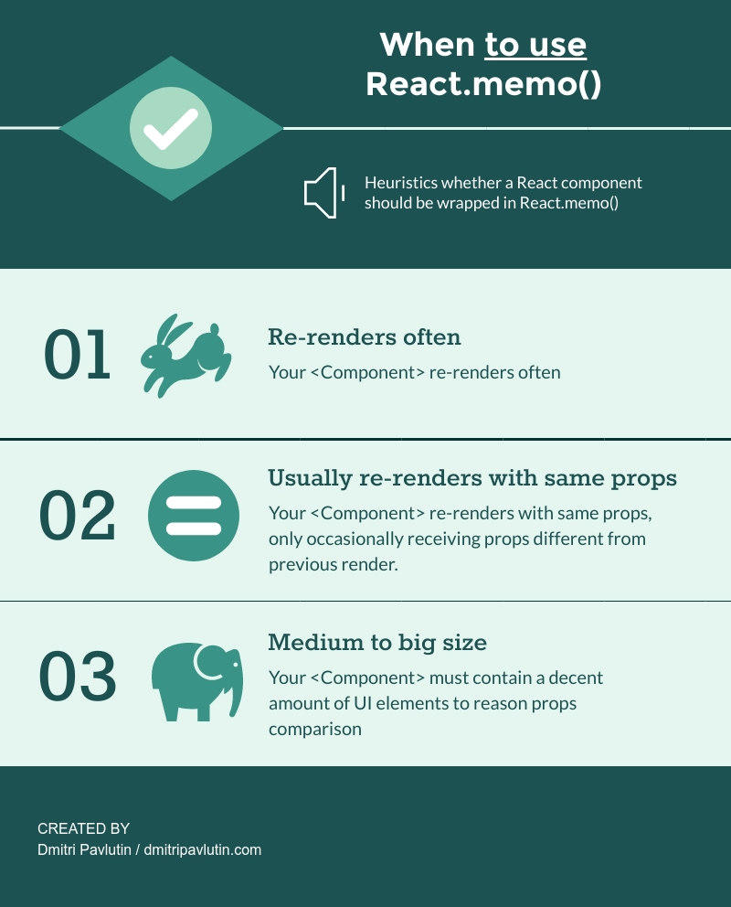

Users enjoy fast and responsive user interfaces (UI). When [directly manipulating](https://www.nngroup.com/articles/direct-manipulation/) elements of the UI, users expect a feedback of up to 0.1 seconds. Otherwise the application feels "laggy".

To improve user interface performance, React offers a higher order component `React.memo()`. By memoizing the render output, it helps avoiding unnecessary re-renders.  

While it might be tempting to apply `React.memo()` on many components, that's not always correct.  

This post helps you distinguish the situations when `React.memo()` improves the performance, and, which is not less important, understand when its usage is useless.  

Plus I'll describe nice usage tips you should be aware of.  

## 1. React.memo()

When deciding to update DOM, React first renders your component, then compares the result with the previous render. If the render results are different, React decides to update the DOM.  

Current vs previous render results comparison is fast. But you can *speed up* the process by comparing current vs previous props only. This is what [React.memo()](https://reactjs.org/docs/react-api.html#reactmemo) can do for you.  

Let's define a functional component `Movie`, then wrap it in `React.memo()`:

```jsx
function Movie({ title, releaseDate }) {
  return (
    <div>
      <div>Movie title: {title}</div>
      <div>Release date: {releaseDate}</div>
    </div>
  );
}

const MemoizedMovie = React.memo(Movie);
```

`React.memo(Movie)` returns a new memoized component `MemoizedMovie`. It will output the same content as original `Movie` component, but with one difference. 

`MemoizedMovie` re-renders only if `title` or `releaseDate` props change. 

This is where you gain performance benefit: as long as the memoized component receives the same props as in previous render, React skips re-rendering and uses the previous saved render output.  

### 1.1 Custom comparison of props

By default React.memo() does a [shallow](https://github.com/facebook/react/blob/v16.8.6/packages/shared/shallowEqual.js) comparison of props and objects of props. 

But you can use the second argument to indicate a custom equality function:  

```javascript
React.memo(Component, [areEqual(prevProps, nextProps)]);
```

`areEqual(prevProps, nextProps)` function must return `true` if `prevProps` and `nextProps` are equal.

For example, let's manually calculate if `Movie` component props are equal:

```jsx

function moviePropsAreEqual(prevMovie, nextMovie) {
  return prevMovie.title === nextMovie.title
    && prevMovie.releaseDate === nextMovie.releaseDate;
}

const MemoizedMovie2 = React.memo(Movie, moviePropsAreEqual);
```

`moviePropsAreEqual()` function returns `true` if prev and next props are equal.  

## 2. When to use React.memo()



### 2.1 Often re-render with usually the same props

The best case of wrapping a component in `React.memo()` is when you expect the component to re-render often with the same props. 

*Do you know other circumstances when React.memo() improves performance? If so, please write a comment below!*

## 3. When to avoid React.memo()

If your component's rendering situation doesn't fit into the case described above, most likely you don't need `React.memo()`.  

Use the following rule of thumb: if you don't see clearly the gains of memoizing, don't use it.  

Performance-related changes applied incorectly can even damage the performance. Use `React.memo()` wisely. 

### 3.1 Useless props comparison

Suppose a case when the component typically re-renders with different props. In this case memoization doesn't provide benefits. 

Even if you try to use `React.memo()`, React will have to do 2 jobs on every re-render:

1. Invoke the comparison function to determine whether the previous and next props are equal
2. Because the props are different, perform the diff of previous and current render output

Invokation of the comparison function is useless.  

## 4. React.memo() and callback functions

Function objects follow the same principles of comparison like any object. The function object is equal only to itself.  

Let's compare some functions:
```javascript
function sum1(a, b) {
  return a + b;
}
function sum2(a, b) {
  return a + b;
}

console.log(sum1 === sum2); // => false
console.log(sum1 === sum1); // => true
console.log(sum2 === sum2); // => true
```
The functions `sum1` and `sum2` both sum 2 numbers. However, comparing `sum1` and `sum2` shows that these are different function objects.  

## 5. React.memo() is about memoization


## 6. Conclusion

`React.memo()` is a great tool to apply the benefits of memoization for functional components. When applied correctly, it will prevent component re-render when props are the same as previous props.  

Don't forget to use [profiling](https://reactjs.org/docs/optimizing-performance.html#profiling-components-with-the-chrome-performance-tab) to measure the performance gains of memoization.  