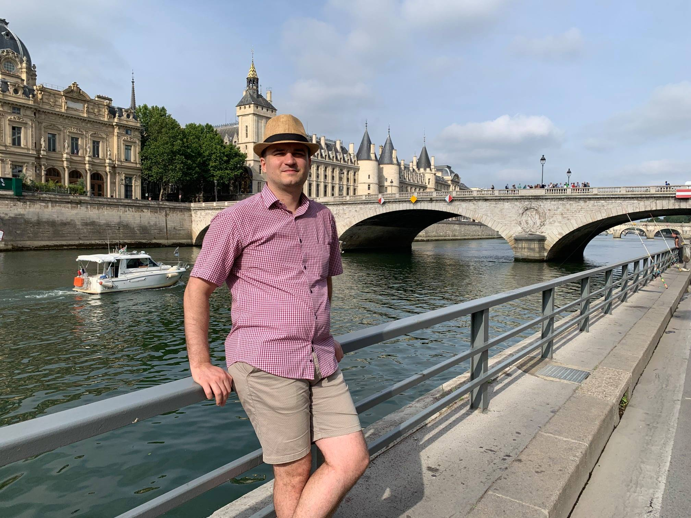

# About me

My name is Dmitri Pavlutin. I'm a Senior Frontend Developer with 10+ years of experience, having a Master's Degree in Computer Science.

My passion is web applications development: programming, design (UI and UX), performance tuning, automated testing, and good application architecture. I am skilled at JavaScript, TypeScript, HTML, CSS, including React.js and Vue.js JavaScript frameworks.

I have good communication skills (being fluent in written and verbal English) and interpersonal skills. I strive to be a humble team player and be approachable to receive and give feedback.

On my blog https://dmitripavlutin.com I publish weekly posts about frontend development, mainly about JavaScript, TypeScript, and React.js. Writing helps me sharpen my written communication skills and stay in touch with software technology progress.

I'm always interested in challenging projects and job opportunities. You're welcome to contact me at [dmitripavlutin@gmail.com](mailto:dmitripavlutin@gmail.com) or [write a message on LinkedIn](https://www.linkedin.com/in/dmitri-pavlutin/).  

