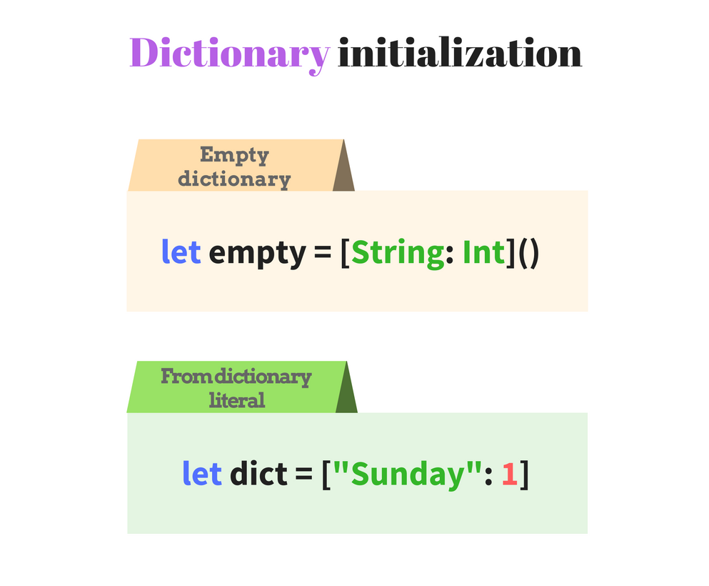
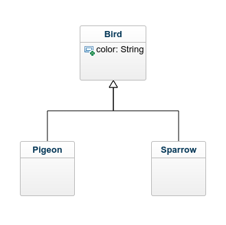

Imagine you have a bunch of delicious candies &#x1f36c;, about 20-30 items. Normally a person can eat about 2 or 3 candies per day.  

To deal easier with a lot of candies, it makes sense to keep them in a single place. And reasonable this place is a plastic bag or a small box, instead of keeping them spread around and messy on the table.  

When you want to take the candies from home to work (to delight tedious working hours &#x1f600;), you definitely need a bag.   


The same happens when dealing with a bunch of similar objects in an application. The comfort of storing and manipulating the objects grouped in a collection makes this structure so advantageous.  

Swift provides 3 fundamental collection types:

* `Array<ElementType>`: an ordered and indexed collection of values
* `Set<ElementType>`: an unordered and unique collection of values
* `Dictionary<KeyType, ValueType>`: an unordered collection of key-value pairs

Before using collection instances you must define and initialize them. Such code almost always is boilerplate. The smaller the boilerplate, the better.  

Let's dive into more details how Swift brings the collection initialization to a new level: a short and convenient form.  

## 1. Array initialization

### 1.1 Creating an empty array

An array is an ordered collection of values which elements usually are indexed by sequential integers `0, 1, 2, ..., array.count - 1`.  


An array type in Swift can be declared using two forms:  

* Full form: `Array<ElementType>`
* Shorthand form: `[ElementType]`

To initialize an empty array, append to type a pair of parenthesis `Array<ElementType>()` or `[ElementType]()`. Let's do that in the following code:  

```swift
let fullFormArray = Array<String>()
let shortFormArray = [String]()
print(fullFormArray)  // => []
print(shortFormArray) // => []
```

Both forms `Array<String>()` and `[String]()` create empty arrays. Swift infers the array type, so the type annotation <code>let fullFormArray<strike>: [String]</strike></code> can be omitted.  

The second form `[String]()` is shorter and easier to read. So the shorthand form is preferred over the longer one `Array<String>()`.  

Alternatively Swift provides an empty array literal `[]`. The literal should be applied when Swift is able to infer the array type from other places. Let's enumerate 3 common scenarios.

**1)** First source of type information may be **the explicit type annotation** `:[String]`. For instance:  

```swift
let literalFormArray: [String] = []
print(literalFormArray) // => []
```

**2)** Another source is **an already initialized array** `var seasons = [String]()`. In such case the literal `[]` can be used to clear the array:  

```swift
var seasons = [String]()
seasons.append("Winter")
print(seasons) // => ["Winter"]
seasons = []
print(seasons) // => []
```
When executing `seasons = []`, Swift knows the array type from the initialization `[String]()`. Assigning the literal `seasons = []` creates an empty array.  

**3)** And providing an empty array as **an argument on function invocation**:  

```swift
func countElements(of collection: [String]) -> Int {
  return collection.count
}
print(countElements(of: [])) // => 0
```
Swift infers the array type as `[String]` based on `collection` parameter declaration `countElements(of collection: [String])`. So the literal `[]` is safely used on function `countElements(of: [])` and denotes an empty array of strings.  

### 1.2 Creating an array with values

#### The array literal
Sometimes the array must include a list of predefined elements. Swift provides an array literal: the initial elements are comma separated and enclosed in square brackets: `[element1, element2, ..., elementN]`. 

Let's see an example:

```swift
let bands: [String] = ["Coldplay", "Nirvana", "The Verve"]
print(bands) // => ["Coldplay", "Nirvana", "The Verve"]
```
`["Coldplay", "Nirvana", "The Verve"]` is an array literal that creates an array of `String` with 3 elements.  

Swift can infer the variable type based on the array literal and the listed elements. So the type annotation `:[String]` can be omitted. Let's simplify the previous example:  

```swift
let bands = ["Coldplay", "Nirvana", "The Verve"]
print(bands) // => ["Coldplay", "Nirvana", "The Verve"]
```
The array initialization `let bands = ["Coldplay", "Nirvana", "The Verve"]` looks short and sweet. The `bands` variable type `[String]` is inferred from the literal.  

#### The array initializer

In some situations you have to initialize an array by repeating the same value a particular number of times. 

Swift provides a special initializer `Array(repeating:count)`. Let's see how it works:  

```swift
let helloEveryone = Array(repeating: "Hi", count: 3)
print(helloEveryone) // => ["Hi", "Hi", "Hi"]
```
Swift is able to infer the array type as `[String]` based on `repeating` argument type.  
The initializer call `Array(repeating: "Hi", count: 3)` returns an array of 3 same elements: `["Hi", "Hi", "Hi"]`.  

`Array(_:)` can be used to extract the items of a `Sequence` into an array. For instance you can get the elements of an interval:  

```swift
let numbers = Array(0...3)
print(numbers) // => [0, 1, 2, 3]
```
`0...3` instantiates an interval of numbers from `0` to `3`. The interval conforms to `Sequence` protocol.  
The call of initializer `Array(0...3)` returns an array of numbers `[0, 1, 2, 3]` generated by the interval.  

## 2. Set initialization

### 2.1 Creating an empty set

A set is an unordered collection of unique elements. A set in Swift is declared using one form: `Set<ElementType>`.  


To create an empty set, simply apply a pair of parenthesis to its type declaration `Set<ElementType>()`. Let's define an empty set:

```swift
let emptySet = Set<String>()
print(emptySet) // => []
```
`Set<String>()` creates an empty set of strings.  
Swift is able to infer the set type, so the type annotation `: Set<String>` is optional.  

The empty literal `[]` can be used to clear the set content when Swift is able to infer the set type (`[]` works for sets the same way as for arrays). Let's see the 2 available scenarios.  

**1)** The **already initialized set** `var colors = Set<String>()` can be cleared:  

```swift
var colors = Set<String>()
colors.insert("Blue")
print(colors) // => ["Blue"]
colors = []
print(colors) // => []
```
The initial declaration `var colors = Set<String>()` indicates a variable type `Set` of `String`. As result, Swift knows the set type when attempting to clear its content `colors = []` using the literal `[]`.

**2)** When providing an empty set as **an argument on function invocation**:  

```swift
func countElements(ofSet collection: Set<String>) -> Int {
  return collection.count
}
print(countElements(ofSet: [])) // => 0
```
The literal `[]` is inferred as an empty set of strings based on the parameter type `collection: Set<String>`.  

### 2.2 Creating a set with values

#### The array literal for sets
To initialize a set with predefined list of unique elements, Swift allows to use the array literal for sets. The initial elements are comma separated and enclosed in square brackets: `[element1, element2, ..., elementN]`. 
It is important that to indicate explicitly the variable type `:Set`, otherwise the literal by default is creating an array.  

Let's see an example:

```swift
let primeNumbers: Set = [2, 3, 5, 7, 11]
print(primeNumbers) // =>  [2, 3, 5, 7, 11]
```
`[2, 3, 5, 7, 11]` is an array literal that creates a set of `Int` with 5 elements. Notice the presence of type annotation `let primeNumbers: Set`, which denotes a set creation, but **not** an array.  

Alternatively, the set literal initialization `let primeNumbers: Set<Int> = ...` can use a longer form of type annotation `:Set<Int>` (`<Int>` explicitly indicates the type of set element). However `<Int>` part can be skipped, since Swift can determine set's element type based on the elements enumerated in the literal (`2`, `3`, ..., `11` are integers).  

The set can contain only unique elements. If you accidentally provide duplicated elements, Swift simply ignores the duplication:

```swift
let duplicatedPrimes: Set = [2, 2, 3, 5, 7, 11, 11]
print(duplicatedPrimes) // =>  [2, 3, 5, 7, 11]
```
`2` and `11` are duplicated in the array literal. Nevertheless the initialized set contains only unique numbers `[2, 3, 5, 7, 11]`.

#### The set initializer

`Set(_:)` initializer can be used to receive elements of a `Sequence`. Let's get the numbers from an interval:  

```swift
let numbers = Set(1..<5)
print(numbers) // => [1, 2, 3, 4]
```
`1..<5` creates an interval, which conforms to `Sequence` protocol.  
The call of initializer `Set(1..<5)` creates a set of numbers `[1, 2, 3, 4]` generated by the interval.  

## 3. Dictionary initialization

### 3.1 Creating an empty dictionary

An dictionary is an unordered collection of key-value pairs. The key must conform to `Hashable` protocol and must be unique in the collection.  



The dictionary type in Swift can be specified in 2 ways:

* Full form: `Dictionary<KeyType, ValueType>`
* Shorthand form: `[<KeyType>: <ValueType>]`

To create an empty dictionary, append to the type a pair of parenthesis `Dictionary<KeyType, ValueType>()` or `[<KeyType>: <ValueType>]()`. Let's see a sample: 

```swift
let fullFormDictionary = Dictionary<String, Int>()
let shortFormDictionary = [String: Int]()
print(fullFormDictionary)  // => [:]
print(shortFormDictionary) // => [:]
```
`Dictionary<String, Int>()` and `[String: Int]()` create empty dictionaries. The key type is a string and the value type is an integer.  
Swift infers the array type, so the explicit type annotation may not be specified.  

The shorthand form `[String: Int]()` is preferred over the longer form `Dictionary<String, Int>()`.  

Notice that `[:]` literal means an empty dictionary (correspondingly `[]` literal for empty array or set).  

The empty dictionary literal `[:]` is applied when Swift is able to infer the dictionary type. Let's see the 3 common cases.

**1)** The type can be inferred from **the explicit type annotation** `:[String: Int]`. For instance:  

```swift
let dictionaryFromLiteral: [String: Int] = [:]
print(dictionaryFromLiteral) // => [:]
```

**2)** The second case is **an already initialized dictionary** `var weekdayNumbers = [String: Int]()`, which after usage should be cleared:  

```swift
var weekdayNumbers = [String: Int]()
weekdayNumbers["Sunday"] = 1
print(weekdayNumbers) // => ["Sunday": 1]
weekdayNumbers = [:]
print(weekdayNumbers) // => [:]
```
When clearing the dictionary `weekdayNumbers = [:]`, the dictionary type is known based on the initialization `[String: Int]()`. Assigning the literal `weekdayNumbers = [:]` clears the dictionary.  

**3)** And providing an empty dictionary as **an argument on function invocation**:  

```swift
func countElements(ofDict collection: [String: Int]) -> Int {
  return collection.count
}
print(countElements(ofDict: [:])) // => 0
```

On invocation `countElements(ofDict: [:])` Swift infers the type of dictionary based on the function parameter declaration `collection: [String: Int]`. So the empty dictionary literal `[:]` can be used freely.    

### 3.2 Creating a dictionary with key-value pairs

To initialize the dictionary with known pre-defined key-value pairs use the dictionary literal: `[key1: value1, key2: value2, ..., keyN: valueN]`.

Let's see an example:

```swift
let seasonFeel:[String:String] = ["winter": "cold", "summer": "hot"]
print(seasonFeel) // => ["winter": "cold", "summer": "hot"]
```
`["winter": "cold", "summer": "hot"]` is a dictionary literal that creates 2 key-value pairs.

Swift can infer the variable type based on the dictionary literal. This way the type annotation `:[String:String]` can be omitted: 

```swift
let seasonFeel = ["winter": "cold", "summer": "hot"]
print(seasonFeel) // => ["winter": "cold", "summer": "hot"]
```
As seen, Swift dictionary literals are concise and simple to write.  

## 4. Literals and type casting

When the literal elements are all of the same type, the collection inference works as expected. For example in the following array of numbers: 

```swift
let numbers = [1, 2, 3]
print(type(of: numbers)) // => "Array<Int>"
```
As expected, the array elements are of type `Int`. 

Interesting that you can enumerate in the array literal different types. But you have to implicitly use `:[Any]` type annotation.  In such case the elements type is `Any`. For example:  

```swift
let mixes: [Any] = ["Hello", 1, 3.14]
print(type(of: mixes)) // => "Array<Any>"
```

`[Any]` type annotation enables to specify elements of different types in the literal.  
The array elements are of type `Any`. So you have to convert an array element to an expected type: `let str = mixes[0] as? String`.  
Of course defining such arrays is not recommended.  

You may want to create an array of instances of derived classes that inherit from the same parent class. In such situation Swift infers that the type of elements is the parent class (but not any of the derived ones).  



Let's define one parent class `Bird` and two derived `Pigeon` and `Sparrow`:

```swift
class Bird {
  let color: String
  init(color: String) {
      self.color = color
  }
}
class Pigeon: Bird {
}
class Sparrow: Bird {
}

let birds = [Pigeon(color: "white"), Sparrow(color: "brown")]
print(type(of: birds)) // => "Array<Bird>"
for bird in birds {
  if let pigeon = bird as? Pigeon {
    print("A pigeon") 
  } else if let sparrow = bird as? Sparrow {
    print("A sparrow") 
  }
}
// => "A pigeon"
// => "A sparrow"
```
The array literal contains instances of `Pigeon` and `Sparrow` that derive from the same parent class `Bird`. As result Swift infers that `birds` is an array of type `Array<Bird>`.  

If you need to access the exact `Pigeon` or `Sparrow` from the array, use the type casting: `let pigeon = bird as? Pigeon` or `let sparrow = bird as? Sparrow`.  

## 5. Conclusion

The collection is one of the most used data structure. The collection declaration and initialization is a common and sometimes tedious task.  

To minimize the boilerplate code, Swift provides short and expressive literals to initialize the 3 collection types: arrays, sets and dictionaries.  

The array literal `[element1, element2, ..., elementN]` can be used to initialize arrays and sets (a set requires explicit type annotation `:Set`).  

The dictionary literal `[key1: value1, ..., keyN: valueN]` initializes dictionaries in a short and comfortable way.  

It worth mentioning that Swift's type inference mechanism brings huge benefits. Often you don't even have to indicate the type of a collection, because Swift can infer that information based on the context.  

Always rely on the type inference whenever possible to simplify your code. Simpler means easier to follow. Easier to follow means less headache!  

You should take precaution when adding to collection elements of different types. In such case Swift determines the base class or structure of the elements (for example `Any`, `AnyObject` or a parent class) and use it to infer the collection type.

Indeed collection initialization in Swift is short and sweet! *(Still doubting? [Then check this out](http://stackoverflow.com/questions/6802483/how-to-directly-initialize-a-hashmap-in-a-literal-way))*.  

*What is your opinion on Swift collection literals? Feel free to write a comment below!*