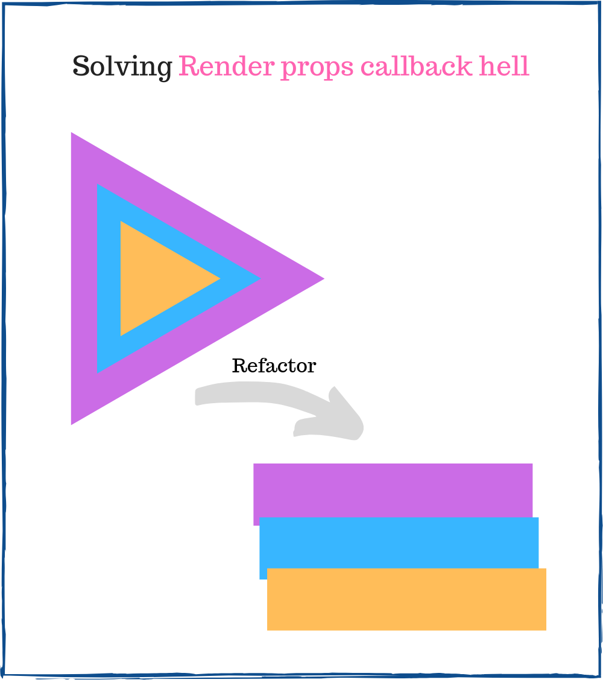

A good design of React components is the key to a maintainable and easy to change codebase.  

In this sense, React offers a lot of design techniques like [composition](https://www.robinwieruch.de/react-component-composition), [hooks](https://reactjs.org/docs/hooks-intro.html), [higher-order components](https://reactjs.org/docs/higher-order-components.html), [render props](https://reactjs.org/docs/render-props.html), and more.  

Render props is efficient to design components in a [loosely coupled](https://en.wikipedia.org/wiki/Loose_coupling) manner. Its essence consists in using a special prop (usually named `render`) that delegates the rendering logic to the parent component:

```jsx
import Mouse from 'Mouse';

function ShowMousePosition() {
  return (
    <Mouse
      render={({ x, y }) => <div>Position: {x}px, {y}px</div> } 
    />
  );
}
```

When using this pattern, sooner or later you'll face a problem of nesting components within multiple render prop callbacks: *render props callback hell*.  

In this post, I will describe 3 simple and efficient approaches on how to solve this problem: using class component, function composition or `react-adopt` tool.  

<Affiliate type="traversyReact" />

## 1. Render props callback hell

Let's say you need to detect and display the city of the website visitor.

First, you'll need the component that determines the user's geographical coordinates. A component like `<AsyncCoords render={coords => ... } />` makes an async operation, for example using [Geolocation API](https://developer.mozilla.org/en-US/docs/Web/API/Geolocation_API), then calls `render` prop callback with the coordinates.  

Then these coordinates are used to determine approximately the user's city: `<AsyncCity lat={lat} long={long} render={city => ...} />`. This component also calls `render` prop as soon as the city is known.   

The implementation details of `<AsyncCoords>` and `<AsynCity>` are unimportant for now. What's important is that the component calls `render` prop callback as soon as the result is ready.  

Let's combine these async components into `<DetectCity>`:

```jsx
function DetectCity() {
  return (
    <AsyncCoords 
      render={({ lat, long }) => {
        return (
          <AsyncCity 
            lat={lat} 
            long={long} 
            render={city => {
              if (city == null) {
                return <div>Unable to detect city.</div>;
              }
              return <div>You might be in {city}.</div>;
            }}
          />
        );
      }}
    />
  );
}

// Somewhere
<DetectCity />
```

You might already spot the issue: the nesting of the `render` prop callback functions. The more callbacks are nested, the harder it is going to understand the code. This is the render props callback hell problem.  

Let's find better component designs to exclude the nesting of the callbacks.    



## 2. Class approach

To transform the nesting of callbacks into something more readable, let's refactor the callbacks into methods of a class. 

The refactored `<DetectCity>` to a class component might look like this:

```jsx
class DetectCity extends React.Component {
  render() {
    return <AsyncCoords render={this.renderCoords} />;
  }

  renderCoords = ({ lat, long }) => {
    return <AsyncCity lat={lat} long={long} render={this.renderCity}/>;
  }

  renderCity = city => {
    if (city == null) {
      return <div>Unable to detect city.</div>;
    }
    return <div>You might be in {city}.</div>;
  }
}

// Somewhere
<DetectCity />
```

The callbacks were extracted into separated methods `renderCoords()` and `renderCity()`. Such component design is easier to understand because the rendering logic is encapsulated into a separated method.  

If you need even more nesting, the class will grow vertically (by adding new methods) rather than horizontally (by nesting functions into each other). The callback hell problem vanishes.  

### 2.1 Access component props inside render methods

The new render methods `renderCoors()` and `renderCity()` are defined using a [fat arrow method](/fix-this-in-javascript/#5-fat-arrow-method) syntax. It allows to bind `this` value to the component instance, even if these methods are invoked somewhere inside `<AsyncCoords>` and `<AsyncCity>`.  

Having `this` as the component instance is useful if you want to access the props of the main component inside the render methods:

```jsx
class DetectCityMessage extends React.Component {
  render() {
    return <AsyncCoords render={this.renderCoords} />;
  }

  renderCoords = ({ lat, long }) => {
    return <AsyncCity lat={lat} long={long} render={this.renderCity}/>;
  }

  renderCity = city => {
    const { noCityMessage } = this.props;
    if (city == null) {
      return <div>{noCityMessage}</div>;
    }
    return <div>You might be in {city}.</div>;
  }
}

// Somewhere
<DetectCityMessage noCityMessage="Unable to detect city." />
```

Inside `renderCity()` the `this` value points to the `<DetectCityMessage>` component instance. Now it's easy to access `noCityMessage` prop from `this.props`.  

## 3. Function composition approach

If you want a lighter approach that doesn't involve creating classes, you can simply use function composition. 

In such case the refactored `<DetectCity>` might look like this:

```jsx
function DetectCity() {
  return <AsyncCoords render={renderCoords} />;
}

function renderCoords({ lat, long }) {
  return <AsyncCity lat={lat} long={long} render={renderCity}/>;
}

function renderCity(city) {
  if (city == null) {
    return <div>Unable to detect city.</div>;
  }
  return <div>You might be in {city}.</div>;
}

// Somewhere
<DetectCity />
```

Now, instead of creating a class with methods, regular functions `renderCoors()` and `renderCity()` encapsulate the rendering logic.  

If you need more nesting, you can simply add new functions. The code will grow vertically (by adding new functions) rather than horizontally (by nesting), solving this way the callback hell problem.  

One more benefit of this approach is that you can test in isolation the render functions: `renderCoords()` and `renderCity()`. It would help achieve easier higher code coverage. Plus, you can always create a module for each render function and reuse it.  

### 3.1 Access component props inside render functions

If you need to access the props inside the render functions, you could insert the render functions directly inside the component:

```jsx
function DetectCityMessage(props) {
  return (
    <AsyncCoords 
      render={renderCoords} 
    />
  );

  function renderCoords({ lat, long }) {
    return (
      <AsyncCity 
        lat={lat} 
        long={long} 
        render={renderCity}
      />
    );
  }

  function renderCity(city) {
    const { noCityMessage } = props;
    if (city == null) {
      return <div>{noCityMessage}</div>;
    }
    return <div>You might be in {city}.</div>;
  }
}

// Somewhere
<DetectCityMessage noCityMessage="Unknown city." />
```

While this structuring works, I don't like it much because every time `<DetectCityMessage>` re-renders, new function instances of `renderCoords()` and `renderCity()` are created. 

The already mentioned [class approach](#21-access-component-props-inside-render-methods) might be better to use. Render methods are always bound to the component instance, so you can access `this.props` without hassle. At the same time the methods are not recreated on every re-render.  

## 4. Utility approach

[React-adopt](https://github.com/pedronauck/react-adopt) utility is a decent alternative if you want more flexibility on how to handle the render props callbacks.  

The refactored `<DetectCity>` component by using `react-adopt` is as follows:

```jsx
import { adopt } from 'react-adopt';

const Composed = adopt({
  coords: ({ render }) => <AsyncCoords render={render} />,
  city: ({ coords: { lat, long }, render }) => (
    <AsyncCity lat={lat} long={long} render={render} />
  )
});

function DetectCity() {
  return (
    <Composed>
      { city => {
        if (city == null) {
          return <div>Unable to detect city.</div>;
        }
        return <div>You might be in {city}.</div>;
      }}
    </Composed>
  );
}

// Somewhere
<DetectCity />
```

`react-adopt` requires a special mapper `Composed` that describes the order of async operations. At the same time, the library takes care of creating the customized `render` callbacks to ensure the correct async execution order.  

As you might notice, the above example using `react-adopt` requires more code than the approaches using a class component or function composition. So why bother using `react-adopt`?  

Unfortunately, the class component and function composition approaches are not suitable if you need to aggregate the results of multiple render props.  

Let's detail this limitation.  

### 4.1 Aggregate multiple render props results

Imagine a situation when you want to render the result of 3 render prop callbacks (`AsyncFetch1`, `AsyncFetch2`, `AsyncFetch3`):

```jsx
function MultipleFetchResult() {
  return (
    <AsyncFetch1 render={result1 => (
      <AsyncFetch2 render={result2 => (
        <AsyncFetch3 render={result3 => (
          <span>
            Fetch result 1: {result1}
            Fetch result 2: {result2}
            Fetch result 3: {result3}
          </span>
        )} />
      )} />
    )} />
  );
}

// Somewhere
<MultipleFetchResult />
```

`<MultipleFetchResult>` component renders the result of all 3 async fetch actions. That's a nasty callback hell situation.  

If you try to use the class component or function composition approach, it's going to be troublesome. The callback hell transforms into arguments binding hell:

```jsx
class MultipleFetchResult extends React.Component {
  render() {
    return <AsyncFetch1 render={this.renderResult1} />;
  }

  renderResult1(result1) {
    return (
      <AsyncFetch2 
        render={this.renderResult2.bind(this, result1)} 
      />
    );
  }

  renderResult2(result1, result2) {
    return (
      <AsyncFetch2 
        render={this.renderResult3.bind(this, result1, result2)}
      />
    );
  }

  renderResult3(result1, result2, result3) {
    return (
      <span>
        Fetch result 1: {result1}
        Fetch result 2: {result2}
        Fetch result 3: {result3}
      </span>
    );
  }
}

// Somewhere
<MultipleFetchResult />
```

You have to manually bind the result of render prop callbacks until they finally reach `renderResult3()` method. 

If you don't like manual binding, `react-adopt` could work better. Let's see a refactored version using this utility:

```jsx
import { adopt } from 'react-adopt';

const Composed = adopt({
  result1: ({ render }) => <AsyncFetch1 render={render} />,
  result2: ({ render }) => <AsyncFetch2 render={render} />,
  result3: ({ render }) => <AsyncFetch3 render={render} />
});

function MultipleFetchResult() {
  return (
    <Composed>
      {({ result1, result2, result3 }) => (
        <span>
          Fetch result 1: {result1}
          Fetch result 2: {result2}
          Fetch result 3: {result3}
        </span>
      )}
    </Composed>
  );
}

// Somewhere
<MultipleFetchResult />
```

The render props results are ready inside the function `({ result1, result2, result3 }) => {...}` supplied to `<Composed>`. Thus you don't have to manually bind arguments or nest callbacks.  

Of course `react-adopt` comes with the price of additional abstractions to learn and a slight app size increase. 

## 5. Conclusion

Render prop is an efficient technique to design React components. However, one problem that affects its usability is the render props callback hell.  

For simple situations when the render props results are used in a chain, the function composition or class component approaches work well.  

But if you have a more complex case, with multiple render props callbacks using the result of each other, `react-adopt` will make your code lighter and easier to understand.  

*Do you know other effective ways to solve render props callback hell? Please write a comment below!*