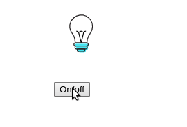
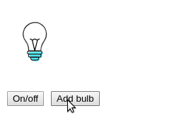

The state is information hidden inside a component. The component can modify its state, without parents knowing about it.  

I prefer functional components because they are simple. To enable state management for functional components, you need `useState()` hook.  

The guide step by step explains how to work with `useState()` hook. Moreover, I will present the common `useState()` pitfalls you must be aware of.  

<Affiliate type="traversyReact" />

<TableOfContents maxLevel={3} />

## 1. State management using useState()

A *stateless functional component* doesn't have a state. Here's an example:  

```jsx
import React from 'react';

function Bulbs() {
  return <div className="bulb-off" />;
}
```

You can [try out the demo](https://codesandbox.io/s/react-usestate-stateless-component-mg2yr).

What about adding a button to switch on/off the bulb? To do so, you need a functional component with state, aka *stateful functional component*.  

`useState()` is the right hook to implement the bulb switch state. Adding state to a functional component requires 4 steps: *enabling* the state, *initializing*, *reading* and *updating*.  

### 1.1 Enabling state

To transform `<Bulbs>` into a stateful component, you would need to tell React about it.

Import the `useState` hook from the `'react'` package, then make a call of `useState()` at the top of the component's function.  

Let's make these change to `<Bulbs>` component:

```jsx mark=2,5
import React, { useState } from 'react';

function Bulbs() {
  ... = useState(...);
  return <div className="bulb-off" />;
}
```

`useState()` is called at the first line of `Bulbs` function (don't think about hook's parameters and returned value for now). It's important that calling the hook inside the component makes it a *stateful functional component*.  

Having the state enabled, the next step is to initialize it.  

### 1.2 Initializing state

The first argument of `useState(initialState)` is the initial state. Simple as is.  

In the beginning, the bulb is switched off. Reflected into state it should be initialized with `false`:  

```jsx mark=5
import React, { useState } from 'react';

function Bulbs() {
  ... = useState(false);
  return <div className="bulb-off" />;
}
```

`useState(false)` initializes the state with `false`.  

Having the state enabled and initialized, how do you read it? Let's see what `useState(false)` returns.  

### 1.3 Reading state

When the hook `useState(initialState)` is invoked, it returns an array. The first item of this array is the *state value*:

```javascript
const stateArray = useState(false);
stateArray[0]; // => the state value
```

Let's read state of `<Bulbs>` component:

```jsx mark=5,8
import React, { useState } from 'react';

function Bulbs() {
  const stateArray = useState(false);
  return <div className={stateArray[0] ? 'bulb-on' : 'bulb-off'} />;
}
```

`<Bulbs>` component state is initialized with `false`, [as demo shows](https://codesandbox.io/s/react-usestate-initialized-state-wl3ov).  

`useState(false)` returns an array. The first item contains the state value, which currently is `false` (because the state's been initialized with `false`).  

Let's use array destructuring to extract the state value into a variable `on`:

```jsx mark=4
import React, { useState } from 'react';

function Bulbs() {
  const [on] = useState(false);
  return <div className={on ? 'bulb-on' : 'bulb-off'} />;
}
```

`on` state variable holds the state value.

Ok, the state's been enabled and initialized, and now you can read it. But how do you update it? Let's look again at what `useState(initialState)` returns.  

### 1.4 Updating state

#### Updating the state with a value

As you know already, `useState(initialState)` returns an array where the first item is the state value. Luckily, the second item is a function that updates the state!

```javascript
const [state, setState] = useState(initialState);

// changes state to `newState` and triggers re-rendering
setState(newState);

// after re-render `state` has the value of `newState`
```

To update the component's state invoke the updater function `setState(newState)` with the new state. The component re-renders and `state` receives the new value `newState`.  

Let's update bulb switch state to `true` when the button *On* is clicked, and respectively `false` when *Off* is:  

```jsx mark=7:8,18:19
import React, { useState } from 'react';

function Bulbs() {
  const [on, setOn] = useState(false);

  const lightOn = () => setOn(true);
  const lightOff = () => setOn(false);

  return (
    <>
      <div className={on ? 'bulb-on' : 'bulb-off'} />
      <button onClick={lightOn}>On</button>
      <button onClick={lightOff}>Off</button>
    </>
  );
}
```

[Open the demo](https://codesandbox.io/s/react-usestate-state-update-lxj5i), then click *Off* or *On* button. The bulb lights on or off depending on the clicked button.  


When *On* button is clicked, `lightOn()` handler updates the state to `true`: `setOn(true)`. The same happens when *Off* is clicked, except that the state updates to `false`.  

As soon as the state changes, React re-renders the component. `on` variable gets the new state value.  

The state updates as a response to an event that provides some new information. Such events are a button click, an HTTP request completion, etc. Make sure to invoke the state updater function within a callback of an event or a callback of other hooks.  

#### Updating the state with a callback

When the new state is calculated using the previous state, you can update the state with a callback:

```javascript
const [state, setState] = useState(initialState);

// changes state to `newState` and triggers re-rendering
setState(prevState => nextState);

// after re-render `state` becomes `newState`
```

Here are some use cases:

```jsx
// Toggle a boolean
const [toggled, setToggled] = useState(false);
setToggled(toggled => !toggled);

// Increase a counter
const [count, setCount] = useState(0);
setCount(count => count + 1);

// Add an item to array
const [items, setItems] = useState([]);
setItems(items => [...items, 'New Item']);
```

Let's implement the bulb component to switch on/off with a single button:

```jsx mark=6
import React, { useState } from 'react';

function Bulbs() {
  const [on, setOn] = useState(false);

  const lightSwitch = () => setOn(on => !on);

  return (
    <>
      <div className={on ? 'bulb-on' : 'bulb-off'} />
      <button onClick={lightSwitch}>On/off</button>
    </>
  );
}
```

[Open the demo](https://codesandbox.io/s/react-usestate-state-update-functional-dhesq), then click *On/off* button. The bulb light toggles on every click.  



`setOn(on => !on)` updates the state using a function.  

### 1.5 State management key takeaway

Call `useState()` hook to *enable state* in a functional component.  

The first argument of the `useState(initialValue)` is the state's *initial value*.  

`[state, setState] = useState(initialValue)` returns an array of 2 items: the *state value* and a state updater function.  

Invoking the state updater function `setState(newState)` with the new value *updates the state*. Alternatively, you can invoke the state updater with a callback `setState(prev => next)`, which returns the new state based on previous.  

After the state updater is called, React makes sure to *re-render* the component so that the new state becomes actual.  

That's the essence of how `useState()` hook works.  

## 2. Multiple states

A functional component can have as many states as necessary by doing multiple calls of `useState()`.  

```jsx
function MyComponent() {
  const [state1, setState1] = useState(initial1);
  const [state2, setState2] = useState(initial2);
  const [state3, setState3] = useState(initial3);
  // ...
}
```

Make sure that multiple calls of `useState()` are always in the same order between renderings (more on that in [4.1 Where to call useState()](#41-where-to-call-usestate)).  

Let's add a button *Add bulb* and a new state holding the count of bulbs. When the button is clicked, a new bulb is added.  

The new state `count` holds the number of bulbs, and is initialized with `1`:

```jsx mark=6,9,18
import React, { useState } from 'react';

function Bulbs() {
  const [on, setOn] = useState(false);
  const [count, setCount] = useState(1);

  const lightSwitch = () => setOn(on => !on);
  const addBulbs = () => setCount(count => count + 1);

  const bulb = <div className={on ? 'bulb-on' : 'bulb-off'} />;
  const bulbs = Array(count).fill(bulb);

  return (
    <>
      <div className="bulbs">{bulbs}</div>
      <button onClick={lightSwitch}>On/off</button>
      <button onClick={addBulbs}>Add bulb</button>
    </>
  );
}
```

[Open the demo](https://codesandbox.io/s/react-usestate-multiple-states-j8o78), then click *Add bulb* button: the number of bulbs increases. Clicking *On/off* button switches on/off the bulbs.  



* `[on, setOn] = useState(false)` manages the on/off state
* `[count, setCount] = useState(1)` manages the number of bulbs.  

Multiple states work correctly within one component.  

## 3. Lazy initialization of state

Every time React re-renders the component, `useState(initialState)` is executed. If the initial state is a primitive value (number, boolean, etc) there are no performance issues.  

When the initial state requires expensive performance-wise operation, use the *lazy initialization of state* by supplying a function as an argument to `useState(computeInitialState)`.  

Here's an example:

```javascript mark=4
function MyComponent({ bigJsonData }) {
  const [value, setValue] = useState(function getInitialState() {
    const object = JSON.parse(bigJsonData); // expensive operation
    return object.initialValue;
  });

  // ...
}
```

`getInitialState()` is executed just once, at the initial render, to get the initial state.  

On later renderings of the component, `getInitialState()` is not invoked, skipping the expensive operation.  

## 4. Pitfalls

Now you have the first grasp of how to use `useState()`.  

Still, you have to be aware of common issues that you might encounter when using `useState()`. Let's continue with them.  

### 4.1 Where to call useState()

When using `useState()` hook you have to follow [the rules of hooks](https://reactjs.org/docs/hooks-rules.html):  

1. **Only Call Hooks at the Top Level**: you cannot call `useState()` in loops, conditions, nested functions, etc. On multiple `useState()` calls, the invocation order must be the same between renderings.  
2. **Only Call Hooks from React Functions**: you must call `useState()` only inside the functional component or a [custom hook](https://reactjs.org/docs/hooks-custom.html).  

Let's follow examples of correct and incorrect usage of `useState()`.  

#### Valid call of useState()

`useState()` is *correctly* called at the top level of functional component:

```jsx mark=3
function Bulbs() {
  // Good
  const [on, setOn] = useState(false);
  // ...
}
```

Multiple `useState()` calls are *correctly* invoked in the same order:

```jsx mark=3:4
function Bulbs() {
  // Good
  const [on, setOn] = useState(false);
  const [count, setCount] = useState(1);
  // ...
```

`useState()` is *correctly* called at the top level of a custom hook:

```jsx mark=3
function toggleHook(initial) {
  // Good
  const [on, setOn] = useState(initial);
  return [on, () => setOn(!on)];
}

function Bulbs() {
  const [on, toggle] = toggleHook(false);
  // ...
}
```

#### Invalid call of useState()

`useState()` is *incorrectly* called within a condition:

```jsx mark=4
function Switch({ isSwitchEnabled }) {
  if (isSwitchEnabled) {
    // Bad
    const [on, setOn] = useState(false);
  }
  // ...
}
```

`useState()` is *incorrectly* called within a nested function:

```jsx mark=7
function Switch() {
  let on = false;
  let setOn = () => {};

  function enableSwitch() {
    // Bad
    [on, setOn] = useState(false);
  }

  return (
    <button onClick={enableSwitch}>
      Enable light switch state
    </button>
  );
}
```

### 4.2 Stale state

[A closure](/javascript-closure/) is a function that captures variables from the outer scopes.  

Closures (e.g. event handlers, callbacks) might capture state variables from the functional component scope. Because state variables change between renderings, closures should capture variables with the latest state value.  

Otherwise, if the closure captures outdated state values, you might encounter *stale state* problem.  

Let's see how a stale state manifests itself. A component `<DelayedCount>` should count the number of button clicks, but with a delay of 3 seconds.  

Here's the first naive implementation:  

```jsx mark=6
function DelayedCount() {
  const [count, setCount] = useState(0);

  const handleClickAsync = () => {
    setTimeout(function delay() {
      setCount(count + 1);
    }, 3000);
  }

  return (
    <div>
      {count}
      <button onClick={handleClickAsync}>Increase async</button>
    </div>
  );
}
```

[Open the demo](https://codesandbox.io/s/react-usestate-async-broken-uzzvg). Click *Increase async* quickly a few times. `count` doesn't reflect the actual number of clicks, some clicks are "eaten".


`delay()` is a stale closure that captures an outdated `count` variable from the initial render (when it was initialized with `0`).  

To fix the problem, let's use a functional way to update `count` state:

```jsx mark=7
function DelayedCount() {
  const [count, setCount] = useState(0);

  const handleClickAsync = () => {
    setTimeout(function delay() {
      setCount(count => count + 1);
    }, 3000);
  }

  return (
    <div>
      {count}
      <button onClick={handleClickAsync}>Increase async</button>
    </div>
  );
}
```

Now `setCount(count => count + 1)` updates the count state correctly inside `delay()`. React makes sure the latest state value is supplied as an argument to the update state function. The stale closure is solved.  

[Open the demo](https://codesandbox.io/s/react-usestate-async-fixed-5y2o8). Click "Increase async" quickly a few times. When delay passes, the `counter` correctly reflects the number of clicks.  


### 4.3 Complex state management

`useState()` is intended to manage simple state.  

For complex state management, it's reasonable to stick to [useReducer()](https://reactjs.org/docs/hooks-reference.html#usereducer) hook. It provides better support for a state that requires multiple state operations.  

Let's say you need to program a list of favorite movies. The user can add a movie, or delete an existing one.  

A possible implementation of favorite movies list:

```jsx mark=7,9:14
import React, { useState } from 'react';

function FavoriteMovies() {
  const [movies, setMovies] = useState([{ name: 'Heat' }]);

  const add = movie => setMovies([...movies, movie]);

  const remove = index => {
    setMovies([
      ...movies.slice(0, index),
      ...movies.slice(index + 1)
    ]);
  }

  return (
    // Use add(movie) and remove(index)...
  );
}
```

[Open the demo.](https://codesandbox.io/s/react-usestate-complex-state-5dplv): add and remove your favorite movies.  


The state list requires several operations: adding and removing movies. The state management details clutter the component.  

A better solution is to extract the complex state management into a reducer:

```jsx mark=4,19
import React, { useReducer } from 'react';

function reducer(state, action) {
  switch (action.type) {
    case 'add':
      return [...state, action.item];
    case 'remove':
      return [
        ...state.slice(0, action.index),
        ...state.slice(action.index + 1)
      ];
    default:
      throw new Error();
  }
}

function FavoriteMovies() {
  const [state, dispatch] = useReducer(reducer, [{ name: 'Heat' }]);

  return (
    // Use dispatch({ type: 'add', item: movie })
    // and dispatch({ type: 'remove', index })...
  );
}
```

`reducer` manages the state of movies. There are 2 action types:

* `"add"` inserts a new movie into the list
* `"remove"` removes a movie by index from the list

[Open the demo.](https://codesandbox.io/s/react-usestate-complex-state-usereducer-gpw87) and notice that component functionality hasn't changed. But this version of `<FavoriteMovies>` is easier to understand, because the state management's been extracted into the reducer.  

A nice bonus: you can extract the reducer into a separated module and re-use it in other components. Plus, you can unit test the reducer even without a component!

That's the power of *separation of concerns*: the component renders UI and responses to events, while the reducer performs state operations.  

### 4.4 State vs reference

Consider a scenario when you'd like to count how many times a component renders.  

A naive implemenation would be to initialize `countRender` state, and update it on each render (with the help of [useEffect()](https://reactjs.org/docs/hooks-reference.html#useeffect) hook):

```jsx mark=8
import React, { useState, useEffect } from 'react';

function CountMyRenders() {
  const [countRender, setCountRender] = useState(0);
  
  useEffect(function afterRender() {
    setCountRender(countRender => countRender + 1);
  });

  return (
    <div>I've rendered {countRender} times</div>
  );
}
```

`useEffect()` calls `afterRender()` callback after every render. But as soon as `countRender` state updates, the component re-renders. This triggers another state update, and another re-render, and so on *indefinitely*.  

Mutable reference [useRef()](https://reactjs.org/docs/hooks-reference.html#useref) holds mutable data that, when changed, doesn't trigger re-rendering.  

Let's fix `<CountMyRenders>` to use a mutable reference:

```jsx mark=8
import React, { useRef, useEffect } from 'react';

function CountMyRenders() {
  const countRenderRef = useRef(1);
  
  useEffect(function afterRender() {
    countRenderRef.current++;
  });

  return (
    <div>I've rendered {countRenderRef.current} times</div>
  );
}
```

[Open the demo](https://codesandbox.io/s/react-usestate-vs-useref-6d8k7) and click a few times the button to trigger re-render.  


The value of `countRenderRef` mutable reference increments `countRenderRef.current++` every time the component renders. What's important, changing the reference doesn't trigger component re-rendering.  

## 5. Conclusion

To make functional components *stateful*, invoke `useState()` inside the body of the component's function.

The first argument of `useState(initialState)` is the initial state. The returned array has 2 items: the current state and state updater function.  

```javascript
const [state, setState] = useState(initialState);
```

To update the state, call the state updater function with the new state `setState(newState)`. Alternatively, if you need to update the state based on the previous state, supply a callback function `setState(prevState => newState)`.  

You can have multiple states inside of a single component: call multiple times `useState()`.  

Lazy initialization is handy when the initial state calculation is expensive. Invoke `useState(computeInitialState)` with a callback that calculates the initial state, and this callback will execute only once, at initial render.  

You have to make sure to follow [the rules of hooks](https://reactjs.org/docs/hooks-rules.html) with `useState()`.  

Stale state happens when a closure captures outdated state variables. You can fix this by updating the state using a callback that calculates the new state based on the previous one.  

Finally, you would use `useState()` to manages a simple state. To deal with the more complex state a wiser alternative is `useReducer()` hook.
