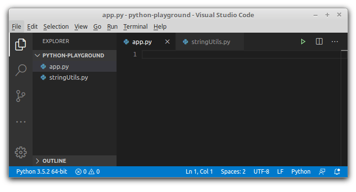

## 1. Named imports and autocomplete

Let's say you write a simple JavaScript module:

```javascript
// stringUtils.js
export function equalsIgnoreCase(string1, string2) {
  return string1.toLowerCase() === string2.toLowerCase();
}
```

This is a module `stringUtils`. The module has a named export `equalsIgnoreCase`, which is a function that compares 2 strings ignoring the case.  

Everything looks good so far.  

<Affiliate type="traversyJavaScript" />

Now, let's try to import `equalsIgnoreCase` function from `stringUtils` module inside of another JavaScript module `app`:

```javascript
// app.js
import { equalsIgnoreCase } from './stringUtils';

equalsIgnoreCase('Hello', 'hello'); // => true
```

 Most likely you would write the code the following way:


First, you have to write the import names `import { }`. At this step, the IDE cannot give any suggestions about the available names to import.  

Then you continue writing `from './stringUtils'`. Then *move back to curly brackets* and expand autocomplete to select the names to import.  

Despite all the good things about ES2015 modules, the import module syntax makes difficult to use autocomplete.  

## 2. Modules in Python

Now let's try to import named components in Python. Does it have the same problem?  

Here's the same module `stringUtils` and function `equalsIgnoreCase` implemented in Python:

```python
# stringUtils.py
def equalsIgnoreCase(string1, string2):
  return string1.lower() == string2.lower()
```

In Python, you don't have to explicitly indicate the functions to export.  

Now, inside of another Python module `app`, let's try to import the function `equalsIgnoreCase` from `stringUtils`:

```python
# app.py
from stringUtils import equalsIgnoreCase

equalsIgnoreCase('Hello', 'hello') # => true
```

Most likely, you would write `app` module the following way:



In Python, first, indicate the module you're importing from: `from stringUtils`. Then you write what to import `import ...`.  

If you'd like to know the functions available for import, the editor already knows the module name and gives the necessary suggestions. Way better!

## 3. The solution

The only solution I could find to enable autocomplete on named imports in JavaScript is to call IDEs for help.

For example, in [Visual Studio Code](https://code.visualstudio.com/), you could install the [JavaScript (ES6) code snippets](https://marketplace.visualstudio.com/items?itemName=xabikos.JavaScriptSnippets) plugin.  

Having the plugin enabled, by using the `imd` snippet and hitting `tab` key, the cursor first jumps into the position where you write the module path. Then, after pressing the `tab` key, the cursor jumps back to the import position inside the curly brackets. Here's how it works:


## 4. Conclusion

In JavaScript, the import syntax forces you to indicate first the items (functions, classes, variables) you'd like to import, then the path to module. This approach is not autocomplete friendly.  

In Python, on the opposite, you indicate first the module name, then the components you'd like to import: `from stringUtils import equalsIgnoreCase`. This syntax enables easy autocomplete of the imported items.  

With the use of IDEs possibilities, like the ES6 code snippet plugin, you could mitigate the problem of named import autocomplete in JavaScript. Still better than nothing.  

*Do you find difficult to use autocomplete with ES modules? If so, what solution do you know?*