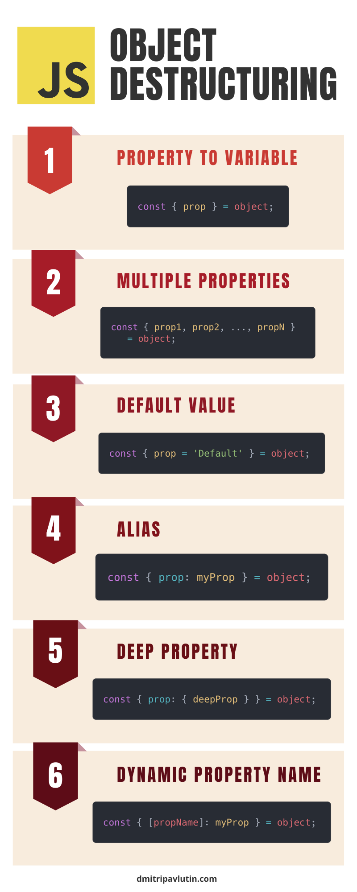

Object destructuring is a useful JavaScript feature to extract properties from objects and bind them to variables.    

Even better, object destructuring can extract multiple properties in a single statement, can access properties from nested objects, and can set a default value if the property doesn't exist.  

This post will help you understand how to use object destructuring in JavaScript.  

<Affiliate type="traversyJavaScript" />

<TableOfContents maxLevel={2} />

## 1. The need for object destructuring

Imagine you'd like to extract some properties of an object. In a pre-ES2015 environment, you'd need to write the following code:

```javascript{5-6}
var hero = {
  name: 'Batman',
  realName: 'Bruce Wayne'
};

var name     = hero.name;
var realName = hero.realName;

console.log(name);     // => 'Batman',
console.log(realName); // => 'Bruce Wayne'
```

[Try the demo.](https://jsfiddle.net/dmitri_pavlutin/pr9o2fgx/)

The property `hero.name` value is assigned to the variable `name`. Same way `hero.realName` value is assigned to `realName`.  

By writing `var name = hero.name`, you have to mention the `name` binding 2 times, and the same for `realName`. This way of accessing properties and assigning them to variables requires boilerplate code.  

That's where the object destructuring syntax is useful: you can read a property and assign its value to a variable without duplicating the property name.  What is more, you can read multiple properties from the same object in just one statement!  

Let's refactor the above script and apply the object destructuring to access the properties `name` and `realName`:

```javascript{5}
const hero = {
  name: 'Batman',
  realName: 'Bruce Wayne'
};

const { name, realName } = hero;

console.log(name);     // => 'Batman',
console.log(realName); // => 'Bruce Wayne'
```

[Try the demo.](https://jsfiddle.net/dmitri_pavlutin/6jbehpf4/)

`const { name, realName } = hero` is an object destructuring assignment. This statement defines the variables `name` and `realName`, then assigns to them the values of properties `hero.name` and `hero.realName` correspondingly. 

Compare two approaches to accessing the object properties:

```javascript
const name     = hero.name;
const realName = hero.realName;

// is equivalent to:

const { name, realName } = hero;
```

it's visible that object destructuring is handier because neither the property names nor the object variable is duplicated.  



## 2. Extracting a property

The syntax of object destructuring is pretty simple:

```javascript
const { identifier } = expression;
```

Where `identifier` is the name of the property to access and `expression` should evaluate to an object. After the destructuring, the variable `identifier` contains the property value.  

Here's the equivalent code using a [property accessor](/access-object-properties-javascript/#1-dot-property-accessor):

```javascript
const identifier = expression.identifier;
```

Let's try object destructuring in practice:

```javascript{5}
const hero = {
  name: 'Batman',
  realName: 'Bruce Wayne'
};

const { name } = hero;

console.log(name); // => 'Batman'
```

[Try the demo.](https://jsfiddle.net/dmitri_pavlutin/Lxs8jk3t/)

The statement `const { name } = hero` defines the variable `name` and initializes it with the value of `hero.name` property.  

## 3. Extracting multiple properties

To destructure the object into multiple properties, enumerate as many properties as you like adding commas `,` in-between:

```javascript
const { identifier1, identifier2, ..., identifierN } = expression;
```

Where `identifier1`, ..., `identifierN` are names of properties to access, and `expression` should evaluate to an object. After the destructuring, the variables `identifier1`, ..., `identifierN` contain corresponding properties values.  

Here's the equivalent code:

```javascript
const identifier1 = expression.identifier1;
const identifier2 = expression.identifier2;
// ...
const identifierN = expression.identifierN;
```

Let's take a look again at the example from the first section, where 2 properties are extracted:

```javascript{5}
const hero = {
  name: 'Batman',
  realName: 'Bruce Wayne'
};

const { name, realName } = hero;

console.log(name);     // => 'Batman',
console.log(realName); // => 'Bruce Wayne'
```

[Try the demo.](https://jsfiddle.net/dmitri_pavlutin/6jbehpf4/)

`const { name, realName } = hero` creates 2 variables `name` and `realName` assigned with values of corresponding properties `hero.name` and `hero.realName`.   

## 4. Default values

If the destructured object doesn't have the property specified in the destructuring assignment, then the variable is assigned with `undefined`. Let's see how it happens:

```javascript{5}
const hero = {
  name: 'Batman',
  realName: 'Bruce Wayne'
};

const { enemies } = hero;

console.log(enemies);     // => undefined
```

[Try the demo.](https://jsfiddle.net/dmitri_pavlutin/8spL1mkc/)

After destructuring the variable `enemies` is `undefined` because the property `enemies` doesn't exist in the object `hero`.  

Fortunately, you can set a default value if the property doesn't exist in the destructured object:

```javascript
const { identifier = defaultValue } = expression;
```

Where `identifier` is the name of the property to access and `expression` should evaluate to an object. After destructuring, the variable `identifier` contains the property value or is assigned with `defaultValue` if the property `identifier` doesn't exist.  

Here's the equivalent code:

```javascript
const identifier = expression.identifier === undefined ? 
        defaultValue : expression.identifier;
```

Let's change the previous code sample, and use the default value feature:

```javascript{5}
const hero = {
  name: 'Batman',
  realName: 'Bruce Wayne'
};

const { enemies = ['Joker'] } = hero;

console.log(enemies);     // => ['Joker']
```

[Try the demo.](https://jsfiddle.net/dmitri_pavlutin/vt8gcL2d/)

Now, instead of being `undefined`, the variable `enemies` defaults to `['Joker']`.  

## 5. Aliases

To create variables of different names than the properties you can use the aliasing feature of object destructuring.  

```javascript
const { identifier: aliasIdentifier } = expression;
```

`identifier` is the name of the property to access, `aliasIdentifier` is the variable name, and `expression` should evaluate to an object. After destructuring, the variable `aliasIdentifier` contains the property value.  

The equivalent code:

```javascript
const aliasIdentifier = expression.identifier;
```

Here's an example of an object destructuring alias feature:

```javascript{5}
const hero = {
  name: 'Batman',
  realName: 'Bruce Wayne'
};

const { realName: secretName } = hero;

console.log(secretName); // => 'Bruce Wayne'
```
[Try the demo.](https://jsfiddle.net/dmitri_pavlutin/pbuehm5t/)

Looking at `const { realName: secretName } = hero`, the destructuring defines a new variable `secretName` (alias variable) and assigns to it the value of `hero.realName`.  

## 6. Extracting properties from nested objects

In the previous examples, the objects were plain: the properties have primitive data types (e.g. strings).  

But objects can be nested in other objects. In other words, some properties can contain objects.  

In such a case, you still can use the object destructuring and access properties from deep. Here's the basic syntax:

```javascript
const { nestedObjectProp: { identifier } } = expression;
```

`nestedObjectProp` is the name of the property that holds a nested object. `identifier` is the property name to access from the nested object. `expression` should evaluate to the destructured object.  

After destructuring, the variable `identifier` contains the property value of the nested object.  

The above syntax is equivalent to:

```javascript
const identifier = expression.nestedObjectProp.identifier;
```

The level of nesting to extract properties from is unlimited. If you want to extract properties from deep, just add more nested curly braces:

```javascript
const { propA: { propB: { propC: { .... } } } } = object;
```

For example, the object `hero` contains a nested object `{ city: 'Gotham'}`. 

```javascript{9}
const hero = {
  name: 'Batman',
  realName: 'Bruce Wayne',
  address: {
    city: 'Gotham'
  }
};

// Object destructuring:
const { address: { city } } = hero;

console.log(city); // => 'Gotham'
```
[Try the demo.](https://jsfiddle.net/dmitri_pavlutin/2hpvoazL/)

The object destructuring `const { address: { city } } = hero` accesses the property `city` from the nested object and creates a variable `city` having the property value.  

## 7. Extracting a dynamic name property

You can extract into variables properties with a dynamic name (the property name is known at runtime):

```javascript
const { [propName]: identifier } = expression;
```

`propName` expression should evaluate to a property name (usually a string), and the `identifier` should indicate the variable name created after destructuring. `expression` should evaluate to the object you'd like to destructure.  

An equivalent code without object destructuring:

```javascript
const identifier = expression[propName];
```

Let's look at an example where `prop` holds the property name:

```javascript{6}
const hero = {
  name: 'Batman',
  realName: 'Bruce Wayne'
};

const prop = 'name';
const { [prop]: name } = hero;

console.log(name); // => 'Batman'
```
[Try the demo.](https://jsfiddle.net/dmitri_pavlutin/31w04z6p/)

`const { [prop]: name } = hero` is an object destructuring that assigns to variable `name` the value `hero[prop]`, where `prop` is a variable holding the property name.  

## 8. Rest object after destructuring

The rest syntax is useful to collect the remaining properties after destructuring:

```javascript
const { identifier, ...rest } = expression;
```

Where `identifier` is the name of the property to access and `expression` should evaluate to an object. After destructuring, the variable `identifier` contains the property value. `rest` variable is a plain object with the remaining properties.  

For example, let's extract the property `name`, but collect the rest of the properties into a variable `rest`:

```javascript{5}
const hero = {
  name: 'Batman',
  realName: 'Bruce Wayne',
  company: 'WayneCorp'
};

const { name, ...rest } = hero;

console.log(rest); // => { realName: 'Bruce Wayne', company: 'WayneCorp' }
```
[Try the demo.](https://jsfiddle.net/dmitri_pavlutin/yuab78Lr/2/)

The destructuring `const { name, ...realHero } = hero` extracts the property `name`. Also, the remaining properties (`realName` and `company`) are collected into `rest`.  

## 9. Common use cases

### 9.1 Bind properties to variables

As seen in many examples before, the object destructuring binds property values to variables.  

The object destructuring can assign values to variables declared using `const`, `let`, and `var`. Or even assign to an already existing variable.  

For example, here's how to destructure using `let` statement:

```javascript{5}
// let
const hero = {
  name: 'Batman',
};

let { name } = hero;

console.log(name); // => 'Batman'
```
[Try the demo.](https://jsfiddle.net/dmitri_pavlutin/3pv740e9/)

How to destructure using `var` statement:

```javascript{5}
// var
const hero = {
  name: 'Batman',
};

var { name } = hero;

console.log(name); // => 'Batman'
```
[Try the demo.](https://jsfiddle.net/dmitri_pavlutin/pkoqud4x/)

And how to destructure to an already declared variable:

```javascript{7}
// existing variable
let name;

const hero = {
  name: 'Batman',
};

({ name } = hero);

console.log(name); // => 'Batman'
```
[Try the demo.](https://jsfiddle.net/dmitri_pavlutin/6bc4oL0a/)

I find it satisfying to combine `for..of` cycle with object destructuring to extract the property right away:

```javascript{5}
const heroes = [
  { name: 'Batman' },
  { name: 'Joker' }
];

for (const { name } of heroes) {
  console.log(name); // logs 'Batman', 'Joker'
}
```
[Try the demo.](https://jsfiddle.net/dmitri_pavlutin/vb9z6qhu/)

### 9.2 Function parameter destructuring

Object destructuring can be placed anywhere where an assignment happens. 

For example, you could destruct an object right inside the parameter of a function:

```javascript{6}
const heroes = [
  { name: 'Batman' },
  { name: 'Joker' }
];

const names = heroes.map(
  function({ name }) {
    return name;
  }
);

console.log(names); // => ['Batman', 'Joker']
```
[Try the demo.](https://jsfiddle.net/dmitri_pavlutin/gmtbs5ny/)

`function({ name })` destructures the function parameter and creates a variable `name` holding the value of `name` property.  

## 10. Summary

Object destructuring is a powerful feature to extract properties from an object and bind these values to variables.   

I like object destructuring due to the concise syntax and the ability to extract multiple variables in one statement.  

*Have questions regarding object destructuring? Ask in a comment below!*