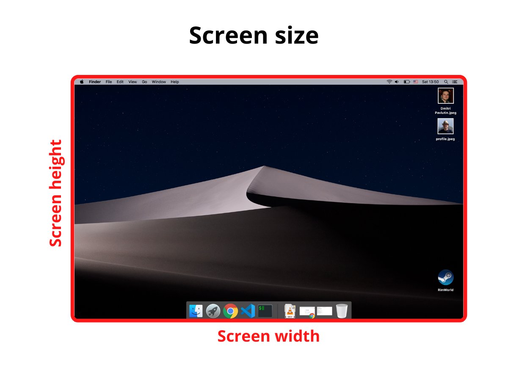

To detect whether the browser window is in landscape or portrait mode, you can compare the browser window's width and height.  

But from my experience it's easy to get confused in the bunch of sizes: screen, window, web page sizes. 

How are these sizes defined, and, importantly, how to access them is what I'm going to discuss in this post. 

<TableOfContents />

## 1. The screen

### 1.1 The screen size

> *The screen size* is the width and height of the screen: a monitor or a mobile screen.  



`window.screen` is the object that holds the screen size information. Here's how to access the screen width and height:

```javascript
const screenWidth  = window.screen.width;
const screenHeight = window.screen.height;
```

### 1.2 The available screen size

> *The available screen size* consists of the width and height of the active screen without the Operating System toolbars.  

 

To access the available screen size you can use again the `window.screen` object:

```javascript
const availScreenWidth  = window.screen.availWidth;
const availScreenHeight = window.screen.availHeight;
```

## 2. The window

### 2.1 The window outer size

> *The window outer size* consists of the width and height of the entire browser window, including the address bar, tabs bar, and other browser panels.  


To access the outer window size, you can use the properties `outerWidth` and `outerHeight` that are available directly on the `window` object:  

```javascript
const windowOuterWidth  = window.outerWidth;
const windowOuterHeight = window.outerHeight;
```

### 2.2 The window inner size

> *The window inner size* (aka *viewport size*) consists of the width and height of the viewport that displays the web page.  


`window` object provides the necessary properties `innerWidth` and `innerHeight`:

```javascript
const windowInnerWidth  = window.innerWidth;
const windowInnerHeight = window.innerHeight;
```

If you'd like to access the window inner size *without the scrollbars*, you can use the following:

```javascript
const windowInnerWidth  = document.documentElement.clientWidth;
const windowInnerHeight = document.documentElement.clientHeigh;
```

## 3. The web page size

> *The web page size* consists of the width and height of the page content rendered.  


Use the following to access the size of the web page content (includes the page's padding, but not border, margin or scrollbars):

```javascript
const pageWidth  = document.documentElement.scrollWidth;
const pageHeight = document.documentElement.scrollHeight;
```

If `pageHeight` is bigger than the window inner height, then a vertical scrollbar is displayed.  

## 4. Summary

Hopefully, now you have a better idea of how to determine different kinds of sizes.  

*The screen size* is the size of your entire screen (or monitor), while *the available screen size* is the size of the monitor excluding the OS taskbars or toolbars.  

*The window outer size* measures the entire browser window (including the address bar, tabs bar, side panels if opened), while *the window inner size* is the size of viewport where the web page renders.  

Finally, the web page size is the size of the web page with its content.  