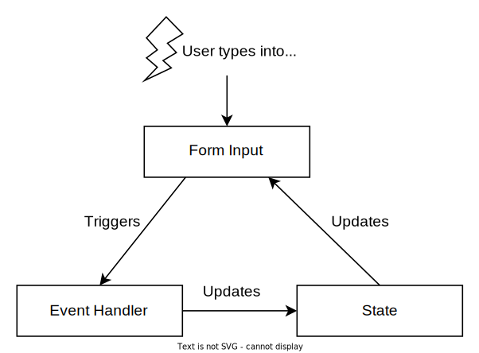

React offers 2 approaches to access the value of an input field: using a controlled or uncontrolled inputs techniques. I prefer the controlled because you read and set the input value through the component's state.  

In this post, you'll read how to implement controlled inputs using React hooks.  

<Affiliate />

<TableOfContents />

## 1. The controlled input

Let's say you have a simple text input field, and you'd like to access its value:

```jsx
import { useState } from 'react';

function MyControlledInput() {
  const [value, setValue] = useState('');

  const onChange = (event) => {
    setValue(event.target.value);
  };

  return (
    <>
      <div>Input value: {value}</div>
      <input value={value} onChange={onChange} />
    </>
  );
}
```
[Open the demo.](https://codesandbox.io/s/controlled-component-uwf8n)

Open the demo and type into the input field. `value` state variable contains the value entered into the input field that is updated each time you type into the input field.  

The input field is *controlled* because React sets its value from the state `<input value={value} ... />`. When the user types into the input field, the `onChange` handler updates the state with the input’s value accessed from the event object: `event.target.value`.  



`value` state variable is the source of truth. Each time you need to access the input value &mdash; just read `value` state variable.  

To resume, the controlled input technique requires 3 steps:

1) Define the state to hold the input value: 

```javascript
const [value, setValue] = useState('')
```

2) Create the event handler that updates the state when the input value changes:

```javascript
const onChange = event => setValue(event.target.value)
```

3) Assign the input field with the state value and attach the event handler: 

```jsx
<input type="text" value={value} onChange={onChange} />
```

The controlled components approach can help you access the value of any input type: textual inputs, textareas, select fields.  

In case of a checkbox, however, you have to use `checked` prop instead of `value`:

```jsx
<input checked={value} onChange={onChange} type="checkbox" />
```

## 2. Controlling multiple inputs

Often you have to deal with forms that contain multiple input fields. In such a case, instead of creating many state variables for each input field, I find it useful to use a single object to keep the state of the input fields.  

Each input field has a corresponding property in the state object.  

For example, let's use an object `values` having the properties `first` and `last` to hold the information of first and last name input fields.  

```jsx codesandbox=react?entry=/src/App.js
import { useState } from 'react';

export default function MyControlledInputs() {
  const [values, setValues] = useState({ first: '', last: '' });

  const getHandler = (name) => {
    return (event) => {
      setValues({ ...values, [name]: event.target.value });
    };
  };

  return (
    <>
      <div>Name: {values.first} {values.last}</div>
      <input value={values.first} onChange={getHandler('first')} />
      <input value={values.last} onChange={getHandler('last')} />
    </>
  );
}
```

The state of the component is now an object `values`. That's usually shorter than creating state variables for each input field.  

`getHandler` is a factory function that returns event handlers to update the property supplied as an argument. The returned event handler is assigned to `onChange` prop of the input field.  

The benefit of such a design is that you can handle a lot of input fields without adding too much boilerplate code.  

## 3. The state as the source of truth

Let's see a more complex example. A web page consists of a list of employees' names. You need to add an input field, and when the user types into this field, the employees' list is filtered by name.  

That's a good scenario to use a controlled input. Here's a possible implementation:

```jsx
function FilteredEmployeesList({ employees }) {
  const [query, setQuery] = useState('');
  
  const onChange = event => setQuery(event.target.value);

  const filteredEmployees = employees.filter(name => {
    return name.toLowerCase().includes(query.toLowerCase());
  });

  return (
    <div>
      <h2>Employees List</h2>
      <input 
        type="text" 
        value={query} 
        onChange={onChange}
      />
      <div className="list">
        {filteredEmployees.map(name => <div>{name}</div>)}
      </div>
    </div>
  );
}
```

[Open the demo.](https://codesandbox.io/s/gracious-dawn-29qi6?file=/src/App.js)

Open the demo and enter a query into the input field. The list of employees is filtered.  

What's important is that `query` state variable is the source of truth for the value entered in the input field. You use it inside `employees.filter()` to filter the list of employees: `name.toLowerCase().includes(query)`.  

## 4. Debouncing the controlled input

In the previous implementation, as soon as you type a character into the input field, the list gets filtered instantly. That's not always convenient because it distracts the user when typing the query. 

Let's improve the user experience with [debouncing](https://css-tricks.com/debouncing-throttling-explained-examples/): filter the list with a delay of 400 ms after the last input change.  

Let's see a possible implementation of a debounced controlled input:

```jsx
import { useDebouncedValue } from './useDebouncedValue';

function FilteredEmployeesList({ employees }) {
  const [query, setQuery] = useState('');
  const debouncedQuery = useDebouncedValue(query, 400);
  
  const onChange = event => setQuery(event.target.value);

  const filteredEmployees = employees.filter(name => {
    return name.toLowerCase().includes(debouncedQuery.toLowerCase());
  });

  return (
    <div>
      <h2>Employees List</h2>
      <input 
        type="text" 
        value={query} 
        onChange={onChange}
      />
      <div className="list">
        {filteredEmployees.map(name => <div>{name}</div>)}
      </div>
    </div>
  );
}
```
[Open the demo.](https://codesandbox.io/s/affectionate-swartz-9yk2u?file=/src/App.js)

Open the demo and enter a query into the input field. The employees' list doesn't filter while you type, but after passing 400ms after the latest keypress.  

The new state value `debouncedQuery` value is managed by a specialized hook that implements debouncing: `useDebouncedValue(query, 400) `. `debouncedQuery` state value is used to filter the employees' list and is derived from the input value state.  

Here's the implementation of `useDebouncedValue()`:

```javascript
export function useDebouncedValue(value, wait) {
  const [debouncedValue, setDebouncedValue] = useState(value);

  useEffect(() => {
    const id = setTimeout(() => setDebouncedValue(value), wait);
    return () => clearTimeout(id);
  }, [value]);

  return debouncedValue;
}
```

In a few words, here's how it works.  

First, the `useDebouncedValue()` hook creates a new state derived from the main state.  

Then, `useEffect()` updates after `wait` delay the `debouncedValue` state when the main `value` state changes.  

## 5. Summary

The controlled input is a convenient technique to access values of input fields in React.  

Setting up a controlled input requires 3 steps:  

1. Create the state to hold the input value: `const [val, setVal] = useState('')`
* Define the event handler to update the state when the user types into the input: `onChange = event => setVal(event.target.value)`
* Attach the event handler and set `value` attribute on the input field: `<input onChange={onChange} value={val} />`.  

Debouncing of the input value state requires creating a new derived state using the specialized hook `debouncedQuery = useDebouncedValue(value, wait)`.  

*Do you have any question regrading controlled inputs?*