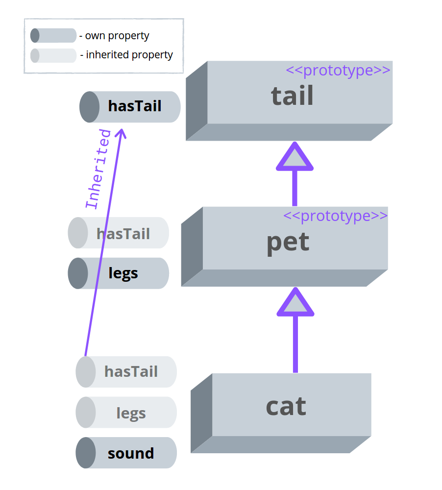

Understanding prototypal inheritance is the key to understanding how objects inherit properties in JavaScript.  

This concept is also asked often during JavaScript interviews.  

In this post, I'll help you understand prototypal inheritance.  

<Affiliate />

## 1. Introduction

JavaScript has only primitives types, `null`, `undefined`, and objects. A big world of objects. In JavaScript, contrary to languages like Java or PHP, there’s no concept of class that serves as a template to create objects.  

Let's also recall that an object is a composable structure having properties: key and value pairs. For example, the following object `cat` contains 2 properties:

```javascript
const cat = { sound: 'Meow!', legs: 4 };
```

Since I'd like to reuse `legs` property in other objects (on dogs, for example), let's extract `legs` property into a specialized object `pet`:

```javascript mark=1
const pet = { legs: 4 };

const cat = { sound: 'Meow!' };
```

That looks better.  

But how can I connect `cat` with `pet`? I can make `pet` a prototype object for `cat`!  

## 2. The prototype object

In JavaScript, an object can *inherit* properties of another object. The object from where the properties are inherited is named *prototype*.  

Following the example, you can make `pet` a *prototype* of `cat` which will then *inherit* `legs` property.  

When creating an object using the object literal, you can use the special property `__proto__` to set the prototype of the created object.  

Let's use `__proto__` and make `pet` the prototype of `cat`:

```javascript
const pet = { legs: 4 };

const cat = { sound: 'Meow!', __proto__: pet };

cat.legs; // => 4
```

`cat` object now *inherits* `legs` from the prototype `pet`. Now you can use the property accessor `cat.legs` that evaluates to `4`.  

`sound` property, on the other side, is an *own property* because it's defined directly on the object.  


> The essence of prototypal inheritance in JavaScript: objects can inherit properties from other objects &mdash; the prototypes.  

You're probably wondering: why the need for inheritance in the first place?  

Inheritance solves the problem of data and logic duplication. By inheriting, objects can share properties and methods.  

For example, you could easily reuse `legs` property to create more pets:

```javascript
const pet = { legs: 4 };

const cat = { sound: 'Meow!', __proto__: pet };
const dog = { sound: 'Bark!', __proto__: pet };
const pig = { sound: 'Grunt!', __proto__: pet };

cat.legs; // => 4
dog.legs; // => 4
pig.legs; // => 4
```

`cat`, `dog`, and `pig` all reuse the property `legs`.  

*Note: `__proto__` is deprecated, but I'm using it for simplicity. In production code [Object.create()](https://developer.mozilla.org/en-US/docs/Web/JavaScript/Reference/Global_Objects/Object/create) is recommended.*

### 2.1 Own vs inherited property

If an object has an own property and an inherited property with the same name, then JavaScript *always picks the own property*.  

In the following example `chicken` object has an own property `legs`, but also inherits a property with the same name `legs`:
```javascript
const pet = { legs: 4 };

const chicken = { sound: 'Cluck!', legs: 2, __proto__: pet };

chicken.legs; // => 2
```

`chicken.legs` evaluates to `2`. JavaScript picks the own property `legs` (which is `2`) over the inherited `legs` (which is `4`).  


If you delete the own property, then JavaScript picks the inherited one!

```javascript
const pet = { legs: 4 };

const chicken = { sound: 'Cluck!', legs: 2, __proto__: pet };

chicken.legs; // => 2
delete chicken.legs;
chicken.legs; // => 4
```

## 3. The implicit prototype

When you create an object, and no prototype is explicitly set, JavaScript assigns an implicit prototype specific to the type of object you've created.   

Let's look again at the `pet` object:

```javascript
const pet = { legs: 4 };

pet.toString(); // => `[object Object]`
```

`pet` has just one property `legs`, however, you can invoke the method `pet.toString()`. Where did `toString()` come from?  

When you've created the `pet` object, JavaScript has assigned to it an implicit prototype object. From this implicit prototype `pet` inherits `toString()` method:  

```javascript
const pet = { legs: 4 };

const petPrototype = Object.getPrototypeOf(pet);

pet.toString === petPrototype.toString; // => true
```

`petPrototype` is the implement (aka default) prototype of the created object.  

[Object.getPrototypeOf(object)]() is an utility function that returns the prototype of an object.  

## 4. The prototype chain

What's interesting about prototypes is that they can be connected in a chain. An object can have a prototype, and that prototype by itself can have another prototype... and so on in *chain*.

Let's go deeper and create an object `tail`, making it also a prototype of `pet`:

```javascript
const tail = { hasTail: true };

const pet = { legs: 4, __proto__: tail };

const cat = { sound: 'Meow!', __proto__: pet };

cat.hasTail; // => true
```

`cat` inherits the property `legs` from its direct prototype `pet`. But `cat` also inherits `hasTail` from the prototype of its prototype &mdash; `tail`!  



When accessing a property `myObject.myProp`, JavaScript looks for `myProp` inside the own properties of `myObject`, then in the prototype of the object, then in the prototype's prototype, and so on until it encounters `null` as the prototype.  

In other words, JavaScript looks for inherited properties in the *chain of prototypes*.  

## 5. But JavaScript has classes!

You may be confused regarding the statement that JavaScript has only objects. You've probably already used the `class` keyword in JavaScript!

For example, you can write a class `Pet`:

```javascript
class Pet {
  legs = 4;

  constructor(sound) {
    this.sound = sound;
  }
}

const cat = new Pet('Moew!');

cat.legs;           // => 4
cat instanceof Pet; // => true
```

and create a `cat` when instantiating the class. 

The secret is that `class` syntax in JavaScript is [syntactic sugar](https://en.wikipedia.org/wiki/Syntactic_sugar) on top of prototypal inheritance. 

The above `class`-based code snippet is equivalent to the following:

```javascript
const pet = { };

function CreatePet(sound) {
  return { sound, __proto__: pet, legs: 4 };
}
CreatePet.prototype = pet;

const cat = CreatePet('Moew!');

cat.legs;                 // => 4
cat instanceof CreatePet; // => true
```

`CreatePet.prototype = pet` assignment is necessary to make `cat instanceof CreatePet` evaluate to `true`.  

When working with `class`-es you can completely forget about prototypes.  

## 6. Summary

In JavaScript, objects inherit properties from other objects &mdash; the prototypes. That's the idea of prototypal inheritance.  

JavaScript looks for inherited properties in the prototype of the object, but also in the prototype of the prototype, and so on in the chain of prototypes.  

While prototypal inheritance seems clumsy at first, when understanding it you could enjoy its simplicity and possibilities. *Objects inherit properties from objects* &mdash; what could be simpler?  

*Have questions about prototypal inheritance? Ask in a comment below!*