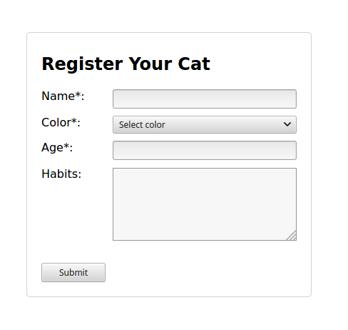
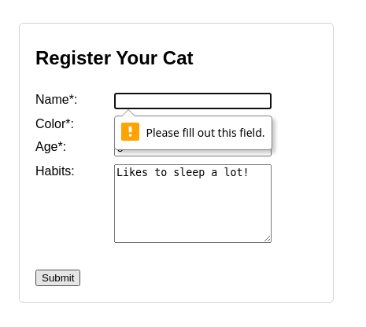

HTML elements like headings `<h1>`, `<h2>`, paragraphs `<p>`, or simple textual output `<span>` are meant to display information.  

On the other side, the forms `<form>` and input elements like `<input>`, `<select>`, `<textarea>` collect information from the user. Working with forms and input fields requires more effort: you have to access input values, validate the form, submit form data, and handle submission result.  

In this tutorial, I'm going to show you how to access the form input values, how to validate and submit forms in React.  

Let's get started!

*Before I go on, let me recommend something to you.* 

*If you want to significantly improve your React knowledge, take the  fantastic ["React Front To Back Course"](https://www.traversymedia.com/a/2147528895/FqXWyazh) by Brad Traversy. Use the coupon code "DMITRI" and get up to 20% discount!*

```toc
```

## 1. "Register Your Cat" form

A 🐱 cat show event is going to happen in your city. Your task, as a web developer, is to implement a form to register cats for the show.  

Let's name the form "Register Your Cat", having the fields:

* *Name*: textual input field (required)
* *Color*: select field. Available options are white, red, blue, black, cream (required)
* *Age*: numeric input field (required)
* *Habits*: textual field (optional)

Let's code the first version of "Register Your Cat" form, as a functional React component:

```jsx
const COLORS = ['white', 'red', 'blue', 'black', 'cream'];

function RegisterYourCatForm() {
  return (
    <form>
      <h2>Register Your Cat</h2>

      <label>Name*:</label>
      <input />

      <label>Color*:</label>
      <select>
        <option value="">Select color</option>
        {COLORS.map(c => <option key={c}>{c}</option>)}
      </select>

      <label>Age*:</label>
      <input />

      <label>Habits:</label>
      <textarea />

      <button type="submit">Submit</button>
    </form>
  );
}
```

`<RegisterYourCatForm />` component contains a `<form>` &mdash; the HTML element that defines a form.  

The form contains input fields: `<input />` element is used to introduce *Name* and *Age*, `<select>` element to choose a *Color*, and `<textarea>` element to enter longer text of the cat's *Habits*.  

`<label>` elements display the name of the corresponding field: "Name", "Color", "Age", and "Habits".  

The last element of the form is a `<button>` named *Submit*. When the user had introduced the pet's info into the input fields, by clicking the *Submit* button the data in the form should be validated and submitted.  



Open the [demo](https://codesandbox.io/s/initial-form-uqdut?file=/src/App.js) to see how the form is rendered. The form doesn't do anything: just displays the input fields.  

The next step is to access the input fields values. Let's see how to do that.  

## 2. Form state

The user has introduced data into the input fields: but how do you access these values inside of the React component?

React offers 2 approaches to access the value of an input field: using [controlled](https://dmitripavlutin.com/controlled-inputs-using-react-hooks/) or [uncontrolled](https://reactjs.org/docs/uncontrolled-components.html) components. I prefer controlled components because you read and set the input value through the component's state.  

Let's see an example of a controlled component in React:

```jsx
import { useState } from 'react';

function MyControlledInput({ }) {
  const [value, setValue] = useState('');

  const onChange = (event) => {
    setValue(event.target.value);
  };

  return (
    <>
      <div>Input value: {value}</div>
      <input value={value} onChange={onChange} />
    </>
  );
}
```

Open the [demo](https://codesandbox.io/s/controlled-component-uwf8n) and type into the input field. You can see that `value` state variable updates as soon as you type.  

The input field is *controlled* because React sets its value from the state `<input value={value} ... />`. When the user types into the input field, the `onChange` handler updates the state with the input’s value accessed from the event object: `event.target.value`.  

The controlled components approach can help you access the value of any input field: being regular textual inputs, textareas, select fields.  

Let's control "Register Your Cat" form data by a state variable `values`:

```jsx{20,23,29,32}
import { useState } from 'react';

const COLORS = ['white', 'red', 'blue', 'black', 'cream'];

function RegisterYourCatForm() {
  const [values, setValues] = useState({
    name: '', color: '', age: '', habits: '' 
  });

  const set = name => {
    return ({ target: { value } }) => {
      setValues(oldValues => ({...oldValues, [name]: value }));
    }
  };

  return (
    <form>
      <h2>Register Your Cat</h2>

      <label>Name*:</label>
      <input value={values.name} onChange={set('name')} />

      <label>Color*:</label>
      <select value={values.color} onChange={set('color')}>
        <option value="">Select color</option>
        {COLORS.map(c => <option key={c}>{c}</option>)}
      </select>

      <label>Age*:</label>
      <input value={values.age} onChange={set('age')} />

      <label>Habits:</label>
      <textarea value={values.habits} onChange={set('habits')} />

      <button type="submit">Submit</button>
    </form>
  );
}
```

`values` is the state variable that holds the data of the entire form. This is a plain JavaScript object with properties `name`, `color`, `age`, and `habits` corresponding to each input field in the form.  

`set(key)` is a [higher-order function](/javascript-higher-order-functions/) that returns on change handlers. Its purpose is to avoid writing manually on change handlers for each field in the form. 

For example, `set('name')` returns a handler that updates `values.name` property when a change in the *Name* field happens.  

Open the [demo](https://codesandbox.io/s/form-state-es25p?file=/src/App.js), then type some values into the input fields. `values` object updates accordingly.  

Now you have the form's data stored in the component's state. You can send the form values to the server... but before doing that, how to be sure that the user has introduced all the required information? 

You need to perform the form validation.  

## 3. Form validation

I like to use the built-in HTML5 form validation &mdash; it is declarative and easy to use.  

Using HTML form validation involves marking the input fields with special attributes: for example `required` marks the input field as required, `minlength` restricts the minimum length of the text in the field.  

Let's mark as `required` the inputs that are required for completion: *Name*, *Color*, and *Age*.  

Then mark the *Age* field with `type="number"` and `min="0"`, to be sure that the user introduces here a positive number bigger than `0`.

No validation attributes are added to *Habits* textarea because the field is optional and has no restrictions over the introduced text.

The actual validation happens when the user clicks *Submit* button. If there are validation errors, they are displayed on the form, and the user can make corrections and click *Submit* again.  

```jsx{12,18,27}
// ...

function RegisterYourCatForm() {

  // ...

  return (
    <form>
      <h2>Register Your Cat</h2>

      <label>Name*:</label>
      <input 
        type="text" required
        value={values.name} onChange={set('name')} 
      />

      <label>Color*:</label>
      <select 
        required
        value={values.color} onChange={set('color')}
      >
        <option value="">Select color</option>
        {COLORS.map(c => <option key={c}>{c}</option>)}
      </select>

      <label>Age*:</label>
      <input
        type="number" required min="1"
        value={values.age} onChange={set('age')} 
      />

      <label>Habits:</label>
      <textarea value={values.habits} onChange={set('habits')} />

      <button type="submit">Submit</button>
    </form>
  );
}
```

Now, if you open the [demo](https://codesandbox.io/s/form-validation-sosi5?file=/src/App.js) and click the *Submit* button, the form is going to be validated.  

If, for example, you haven't introduced anything into the *Name* field and clicked *Submit*, then the *Name* field is highlighted with an error message nearby.  



## 4. Form submission

When *Submit* button is clicked, the browser performs a default form submission by making a full-page POST request to the URL specified in the `action` attribute of the `<form>`. If not specified, the `action` attribute equals the current URL.  

But, since the form is controlled by React, you don't want this to happen.  

To prevent the browser from performing the default action on submit, simply attach `onSubmit` event handler to the form, then call `event.preventDefault()`. 

Moreover, inside the `onSubmit` event handler you can perform a POST request by yourself to save the user form:

```jsx{18,20,33}
// ...

function RegisterYourCatForm() {
  const [values, setValues] = useState({ 
    name: '', color: '', age: '', habits: '' 
  });

  const saveFormData = async () => {
    const response = await fetch('/api/registration', {
      method: 'POST',
      body: JSON.stringify(values)
    });
    if (response.status !== 200) {
      throw new Error(`Request failed: ${response.status}`); 
    }
  }

  const onSubmit = async (event) => {
    event.preventDefault(); // Prevent default submission
    try {
      await saveFormData();
      alert('Your registration was successfully submitted!');
      setValues({
        name: '', color: '', age: '', habits: '' 
      });
    } catch (e) {
      alert(`Registration failed! ${e.message}`);
    }
  }

  // ...

  return (
    <form onSubmit={onSubmit}>
      {/* ... */}
    </form>
  );
}
```

`onSubmit()` is an event handler attached to the form submission event `<form onSubmit={onSubmit}>`. React invokes `onSubmit()` handler when the form is submitted, i.e. the user clicks *Submit* button.  

If the form validation fails, then `onSubmit()` event handler is *not invoked*.  

Inside `onSubmit()`, the async function `saveFormData()` makes a `fetch()` `POST` request to `/api/registration`. The body of the request contains the serialized form's state variable: `JSON.stringify(values)`.  

Open the [demo](https://codesandbox.io/s/form-submission-k5f3l?file=/pages/index.js), fill the registration form, and click *Submit*. The form's values are sent as a `POST` request to `/api/registration` URL.  

Note that while a client-side validation is performed, you always need to validate the data on the server-side too.  

## 5. Form's initial data

To edit an existing registration, you would need to fill the form with initial data.  

Because the input fields values are controlled by `values` state variable, just initialize the form's state using the initial data:

```jsx{3}
// ...

function EditRegistrationForm({ registrationId, initialValues }) {
  const [values, setValues] = useState(initialValues);

  // ...

  return (
    <form onSubmit={onSubmit}>
      {/* ... */}
    </form>
  );
}
```

## 6. Summary

When working with forms in React make the form controlled by a state variable holding the input fields values. 

Use the HTML5 built-in form validation. That requires configuring your inputs with corresponding validation attributes, e.g. `required` to make the input required.  

By default, when clicking the form's *Submit* button, the browser performs a full-page POST request to the URL specified in the `action` attribute of the `<form>`. But having the form controlled by React, you can prevent browser's default behavior by attaching an event handler to `onSubmit` event and calling `event.preventDefault()`.  

Also, inside the same `onSubmit` event handler you can access the form data from the corresponding state variable, and save it manually using your preferred way: by making an async fetch POST request.  

Finally, when you'd like to edit an entity using the form, you can load the initial data into your component's form state variable.  

*What is your preffered approach or library to work with forms in React?*