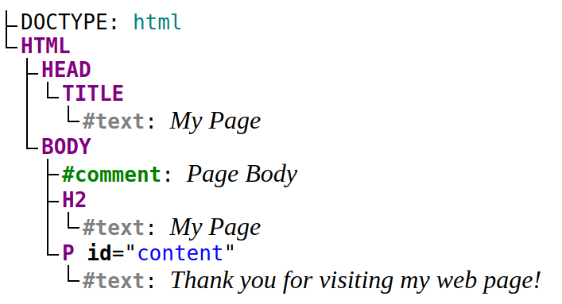

The Document Object Model (DOM) is an interface that treats HTML or XML document as a tree structure, where each node is an object of the document. DOM also provides a set of methods to query the tree, alter the structure, style.  

DOM also uses the term *element*: which is quite similar to a node. So, what's the difference between a DOM node and an element? Let's find out!  

## 1. DOM Node

The key to understanding the difference between a node and an element is to understand what a node is.  

From a higher viewpoint, a DOM document consists of a hierarchy of nodes. Each node can have a parent and/or children.  

Let's look at the following HTML document:

```html
<!DOCTYPE html>
<html>
  <head>
    <title>My Page</title>
  </head>
  <body>
    <!-- Page Body -->
    <h2>My Page</h2>
    <p id="content">Thank you for visiting my web page!</p>
  </body>
</html>
```

The document contains the following hierarchy of nodes:



`<html>` is a node in the document tree. It has 2 children: `<head>` and `<body>` nodes.  

`<body>` is also a node having 3 children: a comment `<!-- Page Body -->`, heading `<h2>`, and paragraph `<p>`. The parent of the `<body>` node is `<html>` node.  

The tags in the HTML document represent a node, what's interesting is that regular text is also a node. The paragraph node `<p>` has 1 child: the text node `"Thank you for visiting my web page!"`.  

### 1.2 Node Types

How can you distinguish these different types of nodes? The answer lays in the DOM [Node](https://developer.mozilla.org/en-US/docs/Web/API/Node) interface, particularly in the `Node.nodeType` property.  

`Node.nodeType` can have one of the following values that represents the type of the node:

* `Node.ELEMENT_NODE`
* `Node.ATTRIBUTE_NODE`
* `Node.TEXT_NODE`
* `Node.CDATA_SECTION_NODE`
* `Node.PROCESSING_INSTRUCTION_NODE`
* `Node.COMMENT_NODE`
* `Node.DOCUMENT_NODE`
* `Node.DOCUMENT_TYPE_NODE`
* `Node.DOCUMENT_FRAGMENT_NODE`
* `Node.NOTATION_NODE`

The constants meaningfully indicate the node type: for example `Node.ELEMENT_NODE` represents an element node, ``Node.TEXT_NODE`` represents a text node, `Node.DOCUMENT_NODE` the document node, and so on.  

For example, let's select the paragraph node, and look at its `nodeType` property:

```javascript
const paragraph = document.querySelector('p');

paragraph.nodeType === Node.ELEMENT_NODE; // => true
```

As expected `paragraph.nodeType` has the value `Node.ELEMENT_NODE`, indicating that the paragraph is an element.  

The paragraph also contains a text node:

```javascript
const paragraph = document.querySelector('p');
const firstChild = paragraph.childNodes[0];

firstChild.nodeType === Node.TEXT_NODE; // => true
```

There's a node type that represents the entire document tree of nodes &mdash; `Node.DOCUMENT_NODE`:

```javascript
document.nodeType === Node.DOCUMENT_NODE; // => true
```

## 2. DOM Element

After getting a good grasp of what a DOM node is, now is the time to differentiate the DOM node and element. 

If you get well the *node* term, then the answer is obvious: an element is a node of a specific type &mdash; element (`Node.ELEMENT_NODE`). Along with types like document, comment, text, etc.    

In simple words, an element is a node that's written using a tag in the HTML document. `<html>`, `<head>`, `<title>`, `<body>`, `<h2>`, `<p>` are all elements because they are represented by tags.  

The document type, the comment, the text nodes aren't elements because they are not written with tags:

```html{0,3,5}
 <!DOCTYPE html>
<html>
  <body>
    <!-- Page Body -->
    <p>
      Thank you for visiting my web page!
    </p>
  </body>
</html>
```

`Node` is constructor of a node, and `HTMLElement` is a constructor of an element in JavaScript DOM. A paragraph, being a node and also an element, is an instance of both `Node` and `HTMLElement`:

```javascript
const paragraph = document.querySelector('p');

paragraph instanceof Node;        // => true
paragraph instanceof HTMLElement; // => true
```

Saying it simpler, an element is a subtype of a node the same way a cat is a subtype of an animal.  

## 3. DOM properties: nodes and elements

Aside from differentiating nodes from elements, you need also to distinguish the DOM properties that contain specifically only nodes, or only elements.  

The following properties of `Node` type evaluate to a node or a collection of nodes (`NodeList`):

```javascript
node.parentNode; // Node or null

node.firstChild; // Node or null
node.lastChild;  // Node or null

node.childNodes; // NodeList
```

However, the following properties are elements or collection of elements (`HTMLCollection`):

```javascript
node.parentElement; // HTMLElement or null

node.children;      // HTMLCollection
```

Since both `node.childNodes` and `node.children` return a list of children, why have both of these properties? Good question!

Consider the following paragraph element containing some text:

```html
<p>
  <b>Thank you</b> for visiting my web page!
</p>
```

Open the [demo](https://jsitor.com/3mPwoSVbYh), then look at `childNodes` and `children` properties of the parapgraph node:

```javascript
const paragraph = document.querySelector('p');

paragraph.childNodes; // NodeList:       [HTMLElement, Text]
paragraph.children;   // HTMLCollection: [HTMLElement]
```

`paragraph.childNodes` collection contains 2 nodes: the bold element `<b>Thank you</b>`, as well as the text node ` for visiting my web page!`.  

However, `paragraph.children` collection contains only 1 item: the bold element `<b>Thank you</b>`. 

Because `paragraph.children` contains only elements, the text node wasn't included here because its type is text (`Node.TEXT_NODE`), and not an element (`Node.ELEMENT_NODE`).  

Having both `node.childNodes` and `node.children` lets you choose the collection of children you'd like to access: all children nodes or only children being elements.  

## 4. Summary

A DOM document is a hierarchical collection of nodes. Each node can have a parent and/or children.  

Understanding the difference between a DOM node and an element is easy if you understand what a node is.  

Nodes have types, the element type being one of them. The element is represented by a tag in the HTML document.  

*Quiz: What type of node never has a parent node?*