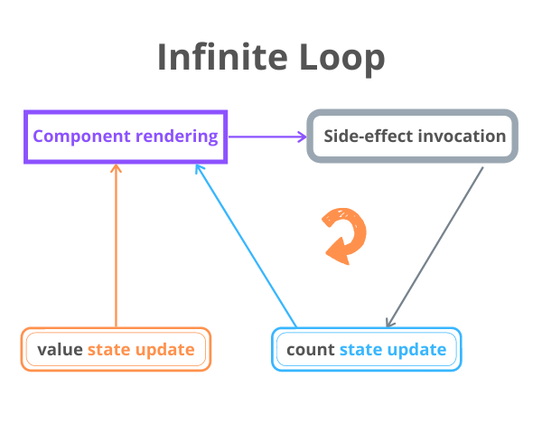
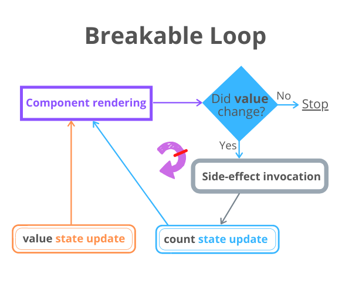

`useEffect()` hook manages the side-effects like fetching over the network, manipulating DOM directly, and starting/ending timers.  

Although the [useEffect()](/react-useeffect-explanation/) is one of the most used hooks along with `useState()`, it requires time to familiarize and use correctly.  

A pitfall you might experience when working with `useEffect()` is the infinite loop of component renderings. In this post, I'll describe the common scenarios that generate infinite loops and how to avoid them.  

<Affiliate type="traversyReact" />

## 1. The infinite loop and side-effect updating state

Let's say you want to create a component having an input field, and also display how many times the user changed that input.  

Here's a possible implementation of `<CountInputChanges>` component:

```jsx mark=7
import { useEffect, useState } from 'react';

function CountInputChanges() {
  const [value, setValue] = useState('');
  const [count, setCount] = useState(-1);

  useEffect(() => setCount(count + 1));

  const onChange = ({ target }) => setValue(target.value);

  return (
    <div>
      <input type="text" value={value} onChange={onChange} />
      <div>Number of changes: {count}</div>
    </div>
  )
}
```

`<input type="text" value={value} onChange={onChange} />` is a [controlled component](/controlled-inputs-using-react-hooks/). 

`value` state variable holds the input value, and the `onChange` event handler updates the `value` state when the user types into the input.  

I decided to update the `count` variable using `useEffect()` hook. Every time the component re-renders due to the user typing into the input, the `useEffect(() => setCount(count + 1))` updates the counter.  

Because `useEffect(() => setCount(count + 1))` is used without the dependencies argument, `() => setCount(count + 1)` callback is [executed](/react-useeffect-explanation/#2-the-dependencies-of-useeffect) after every rendering of the component.  

Do you expect any problems with this component? Open the [demo](https://codesandbox.io/s/infinite-loop-9rb8c?file=/src/App.js). 

The demo shows that `count` state variable increases uncontrollably, even if you haven't typed anything into the input. That's an infinite loop.  

The problem is in the way `useEffect()` is used:

```jsx mark=3
useEffect(() => setCount(count + 1));
```

which generates an infinite loop of component re-renderings.  

After initial rendering, `useEffect()` executes the side-effect callback and updates the state. The state update triggers re-rendering. After re-rendering `useEffect()` executes the side-effect callback and again updates the state, which triggers again a re-rendering. ...and so on indefinitely.  



### 1.1 Fixing dependencies

The infinite loop is fixed with correct management of the `useEffect(callback, dependencies)` dependencies argument.  

Because you want `count` to increment when `value` changes, you can simply add `value` as a dependency of the side-effect:

```jsx mark=7
import { useEffect, useState } from 'react';

function CountInputChanges() {
  const [value, setValue] = useState('');
  const [count, setCount] = useState(-1);

  useEffect(() => setCount(count + 1), [value]);

  const onChange = ({ target }) => setValue(target.value);

  return (
    <div>
      <input type="text" value={value} onChange={onChange} />
      <div>Number of changes: {count}</div>
    </div>
  );
}
```

By adding `[value]` as a dependency of `useEffect(..., [value])`, the `count` state variable will only be updated when `[value]` changes. This solves the infinite loop.  



Open the fixed [demo](https://codesandbox.io/s/infinite-loop-fixed-4sgfr?file=/src/App.js). Now, as soon as you type into the input field, the `count` state correctly displays the number of input value changes.  

### 1.2 Using a reference

An alternative solution is to use a reference (created by [useRef()](/react-useref-guide/) hook) to store the number of changes of the input. 

The idea is that updating a reference doesn't trigger re-rendering of the component.  

Here's a possible implementation:

```jsx mark=9
import { useState, useRef } from 'react';

function CountInputChanges() {
  const [value, setValue] = useState('');
  const countRef = useRef(0);

  const onChange = ({ target }) => {
    setValue(target.value);
    countRef.current++;
  };

  return (
    <div>
      <input type="text" value={value} onChange={onChange} />
      <div>Number of changes: {countRef.current}</div>
    </div>
  );
}
```

Inside the event handler `onChange` the `countRef.current++` is executed each time the `value` state changes. The reference change doesn't trigger re-rendering.  

Check out the [demo](https://codesandbox.io/s/infinite-loop-reference-lcmq7). Now, as soon as you type into the input field, the `countRef` reference is updated without triggering a re-rendering &mdash; efficiently solving the infinite loop problem.  

## 2. The infinite loop and new objects references

Even if you set up correctly the `useEffect()` dependencies, still, you have to be careful when using objects as dependencies.  

For example, the following `CountSecrets` component monitors the words that the user types into the input, and as soon as the user types the special word `'secret'`, a counter of secrets is increased and displayed.  

Here's a possible implementation of the component:

```jsx mark=8,10
import { useEffect, useState } from "react";

function CountSecrets() {
  const [secret, setSecret] = useState({ value: "", countSecrets: 0 });

  useEffect(() => {
    if (secret.value === 'secret') {
      setSecret(s => ({...s, countSecrets: s.countSecrets + 1}));
    }
  }, [secret]);

  const onChange = ({ target }) => {
    setSecret(s => ({ ...s, value: target.value }));
  };

  return (
    <div>
      <input type="text" value={secret.value} onChange={onChange} />
      <div>Number of secrets: {secret.countSecrets}</div>
    </div>
  );
}
```

Open the [demo](https://codesandbox.io/s/infinite-loop-obj-dependency-7t26v?file=/src/App.js) and type some words, one of which should be `'secret'`. As soon as you type the word `'secret'`, the `secret.countSecrets` state variable starts to grow uncontrollably.  

That's an infinite loop problem.  

Why is this happening?

The `secret` object is used as a dependency of `useEffect(..., [secret])`. Inside the side-effect callback, as soon as the input value equals `'secret'`, the state updater function is called:

```javascript
setSecret(s => ({...s, countSecrets: s.countSecrets + 1}));
```

which increments the secrets counter `countSecrets`, but also creates *a new object*.  

`secret` now is a new object and the dependency has changed. So `useEffect(..., [secret])` invokes again the side-effect that updates the state and a new `secret` object is created again, and so on.  

2 objects in JavaScript are [equal](how-to-compare-objects-in-javascript/#1-referential-equality) only if they reference exactly the same object.  

### 2.1 Avoid objects as dependencies

Because of the objects creation and referential equality problem, it's wise to avoid objects as deps in `useEffect()`. Stick to primitives when possible:

```javascript mark=5
let count = 0;

useEffect(() => {
  // some logic
}, [count]); // Good!
```

```javascript mark=7,11
let myObject = {
  prop: 'Value'
};

useEffect(() => {
  // some logic
}, [myObject]); // Not good!

useEffect(() => {
  // some logic
}, [myObject.prop]); // Good!
```

Fixing the infinite loop of `<CountSecrets>` component requires changing the dependency from `useEffect(..., [secret])` to `useEffect(..., [secret.value])`. 

Calling the side-effect callback when only `secret.value` changes is sufficient. Here's the fixed version of the component:

```jsx mark=10
import { useEffect, useState } from "react";

function CountSecrets() {
  const [secret, setSecret] = useState({ value: "", countSecrets: 0 });

  useEffect(() => {
    if (secret.value === 'secret') {
      setSecret(s => ({...s, countSecrets: s.countSecrets + 1}));
    }
  }, [secret.value]);

  const onChange = ({ target }) => {
    setSecret(s => ({ ...s, value: target.value }));
  };

  return (
    <div>
      <input type="text" value={secret.value} onChange={onChange} />
      <div>Number of secrets: {secret.countSecrets}</div>
    </div>
  );
}
```

Open the fixed [demo](https://codesandbox.io/s/infinite-loop-obj-dependency-fixed-hyv66?file=/src/App.js). Type some words into the input... and as soon as you enter the special word `'secret'` the secrets counter increments.  No infinite loop is created. That's a win!

## 3. Summary

`useEffect(callback, deps)` is the hook that executes `callback` (the side-effect) after deps changes. If you aren't careful with what the side-effect does, you might trigger an infinite loop of component renderings.  

A common case that generates an infinite loop is updating the state in the side-effect without having any dependency argument at all:

```javascript
useEffect(() => {
  // Infinite loop!
  setState(count + 1);
});
```

An efficient way to avoid the infinite loop is to properly manage the hook dependencies &mdash; control when exactly the side-effect should run.  

```javascript
useEffect(() => {
  // No infinite loop
  setState(count + 1);
}, [whenToUpdateValue]);
```

Alternatively, you can also use a reference. Updating a reference doesn't trigger a re-rendering:

```javascript
countRef.current++;
```

Another common recipe for an infinite loop is to use an object as a dependency of `useEffect()`, and within the side-effect, update that object (effectively creating a new object):

```javascript
useEffect(() => {
  // Infinite loop!
  setObject({
    ...object,
    prop: 'newValue'
  })
}, [object]);
```

Avoid using objects as dependencies, but use the object property values directly as dependencies:

```javascript
useEffect(() => {
  // No infinite loop
  setObject({
    ...object,
    prop: 'newValue'
  })
}, [object.whenToUpdateProp]);
```

I recommend checking also my post [5 Mistakes to Avoid When Using React Hooks](/react-hooks-mistakes-to-avoid/).  

*What other infinite loop pitfalls when using `useEffect()` do you know?*
